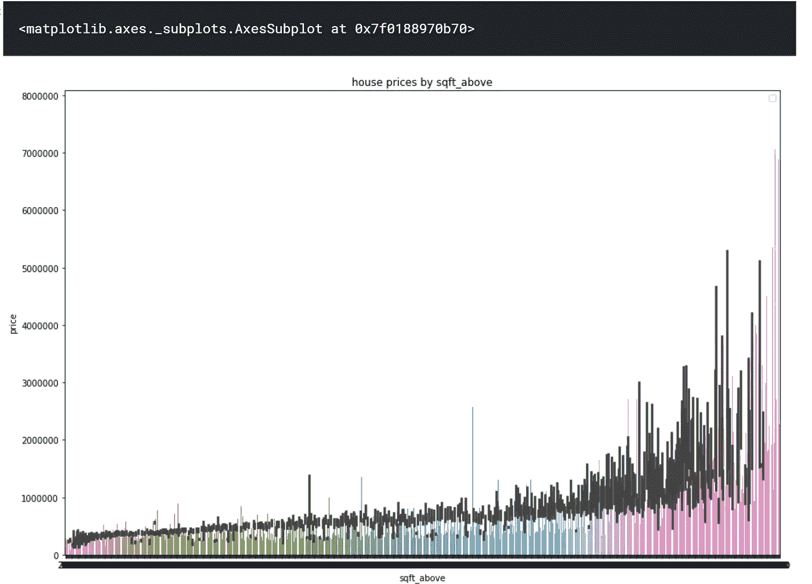
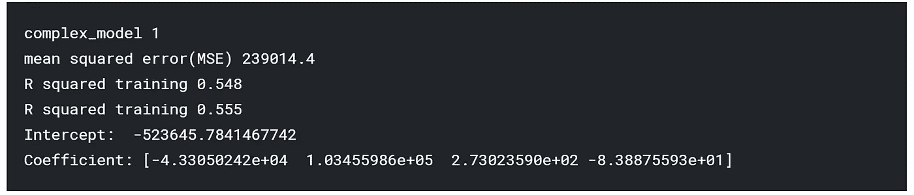

# 在 KC 住房数据集上使用 sklearn 进行回归

> 原文：<https://towardsdatascience.com/regression-using-sklearn-on-kc-housing-dataset-1ac80ca3d6d4?source=collection_archive---------4----------------------->


# 动机

为了预测 King County 的房价，我选择了来自 Kaggle 的房价数据集。该数据集包含 King 县(包括西雅图)的房屋销售价格。它包括 2014 年 5 月至 2015 年 5 月期间出售的房屋。它有很多学习的特点，数据集可以从[这里](https://www.kaggle.com/harlfoxem/housesalesprediction)下载。

# 介绍

回归的总体思路是考察两件事:(1)一组预测变量在预测一个结果(因变量)时是否做得很好？(2)哪些变量是结果变量的重要预测因子，它们是如何影响结果变量的——由β估计值的大小和符号表示？这些回归估计用于解释一个因变量和一个或多个自变量之间的关系。

# 执行的回归

**简单线性回归**

1.  卧室与价格
2.  “等级”与“价格”

**多元回归**

1.  卧室'，'等级'，'居住面积'，'以上面积'
2.  '卧室'，'浴室'，' sqft_living '，' sqft_lot '，'楼层'，'海滨'，'景观'，'等级'，' sqft_above '，' sqft _ baseball '，' lat '，' sqft_living15 '

**多项式回归**

1.  度数=2
2.  度数=3

# 描述

在该数据集中，显示了西雅图金县**房屋的销售价格**。它包括 2014 年 5 月至 2015 年 5 月期间出售的房屋。在做任何事情之前，我们应该首先了解数据集，它包含什么，它的特征是什么，以及数据的结构是什么。

通过观察数据，我们可以知道**价格取决于各种功能**，如卧室(最依赖的功能)、浴室、sqft_living(第二重要的功能)、sqft_lot、地板等。价格也取决于房子所在的位置。像滨水景观这样的其他特色对价格的依赖性较小。在所有记录中，没有**缺失值，这有助于我们创建更好的模型。**

# 数据预处理

导入所需的库。

```
*#importing numpy and pandas, seaborn*

import numpy as np *#linear algebra*
import pandas as pd *#datapreprocessing, CSV file I/O*
import seaborn as sns *#for plotting graphs*
import matplotlib.pyplot as plt
```

阅读 CSV 文件。

```
df = pd.read_csv("../input/housesalesprediction/kc_house_data.csv")
```

pandas***data frame . info()***函数用于获取数据帧的简明摘要。在对数据进行探索性分析时，这非常方便。为了快速浏览数据集，我们使用了***data frame . info()***函数。

```
df.info()
```


Pandas **head** ()方法用于返回一个数据帧或系列的前 n(默认为 5)行。

```
df.head()
```


熊猫形状函数用于返回大小、**形状**以及数据帧和系列的尺寸。

```
*#finding no of rows and columns*
df.shape
```


调用 isnull()返回的 DataFrame 的 sum()将给出一个包含每列中 NaN 计数的数据的序列。

```
df.isnull().sum()
```


找出卧室的数量。

```
df['bedrooms'].value_counts()
```


寻找海滨的伯爵。


寻找分数。

```
df['grade'].value_counts()
```


寻找条件计数。

```
df['condition'].value_counts()
```


为卧室绘制了一个计数图。

```
sns.countplot(df.bedrooms,order=df['bedrooms'].value_counts().index)
```


sqft living 和价格之间绘制了一个柱状图，以了解价格随 sqft 的变化情况。


在上面的平方英尺和价格之间绘制一个柱状图，以观察价格如何随着上面的平方英尺而变化。

```
fig,axes=plt.subplots(nrows=1,ncols=1,figsize=(15,10))
plt.title("house prices by sqft_above")
plt.xlabel('sqft_above')
plt.ylabel('house prices')
plt.legend()
sns.barplot(x='sqft_above',y='price',data=df)
```



绘制了生活平方英尺的直方图。

```
plt.hist('sqft_living',data=df,bins=5)
```


为 sqft living 绘制了 distplot，以查看数据是否有偏差

```
fig,axes=plt.subplots(nrows=1,ncols=1,figsize=(15,10))
sns.distplot(df['sqft_living'],hist=True,kde=True,rug=False,label='sqft_living',norm_hist=True)
```


为上面的 sqft 绘制了 distplot，以查看数据是否有偏差

```
fig,axes=plt.subplots(nrows=1,ncols=1,figsize=(15,10))
sns.distplot(df['sqft_above'],hist=True,kde=True,rug=False,label='sqft_above',norm_hist=True)
```


寻找平方英尺生活的均值、众数和中位数。

```
print('Mean',round(df['sqft_living'].mean(),2))
print('Median',df['sqft_living'].median())
print('Mode',df['sqft_living'].mode()[0])
```


通过图表我们观察到 sqft living=1300 有更多的值。

```
len(df[df['sqft_living']==1300])
```


为了确保我们涵盖了所有的关系，我们使用热图绘制了所有特征之间的关联。

**热图**是数据的二维图形表示，矩阵中包含的各个值用颜色表示。

```
def correlation_heatmap(df1):
    _,ax=plt.subplots(figsize=(15,10))
    colormap=sns.diverging_palette(220,10,as_cmap=True)
    sns.heatmap(df.corr(),annot=True,cmap=colormap)

correlation_heatmap(df)
```


既然我们已经获得了足够的数据信息，我们就开始线性回归。

# 简单线性回归


对于线性回归，我们使用来自 **sklearn** 函数的 linear_model。

**Scikit-learn** 通过 Python 中的一致接口提供了一系列监督和非监督学习算法。该库建立在 SciPy(科学 Python)之上，在使用 scikit-learn 之前必须安装该库。用于 SciPy care 的扩展或模块通常称为 [SciKits](http://scikits.appspot.com/scikits) 。因此，该模块提供了学习算法，并被命名为 scikit-learn。

我们导入***train _ test _ split****。*这将数据分割成所需的比率(例如:80–20)，其中一个比率用于训练数据，其余比率用于测试数据。训练数据以预测一条线，然后使用测试数据来查看这条线是否完全符合。

***多项式特征*** 生成一个新的特征矩阵，由次数小于或等于指定次数的特征的所有多项式组合组成。

引入 ***度量*** 是因为度量模块实现了针对特定目的评估预测误差的功能。

在***KNeighborsRegressor***中，通过对训练集中最近邻相关的目标进行局部插值来预测目标。

```
from sklearn.model_selection import train_test_split
from sklearn import linear_model
from sklearn.neighbors import KNeighborsRegressor
from sklearn.preprocessing import PolynomialFeatures
from sklearn import metrics
from mpl_toolkits.mplot3d import Axes3D
%matplotlib inline
```

在这里，我们将数据分成 80:20 的比例，其中 train_size 为 80%，test_size 为 20%。 **train_test_split** 将数组或矩阵分割成**随机**训练和测试子集。这意味着每次在没有指定 random_state 的情况下运行它，都会得到不同的结果，这是意料之中的行为。为了得到相同的训练和测试子集，我们声明一个**随机状态**。这里的 x 是‘sqft _ living’，y 是‘price’。我们正在重塑 x_train 和 y_train，数据是拟合的。x 检验和 y 检验用于预测模型的准确性。这里我们首先计算 y_test 的均方误差。找出训练和测试的均方误差。找到直线的**截距和系数**。

```
train_data,test_data=train_test_split(df,train_size=0.8,random_state=3)
reg=linear_model.LinearRegression()
x_train=np.array(train_data['sqft_living']).reshape(-1,1)
y_train=np.array(train_data['price']).reshape(-1,1)
reg.fit(x_train,y_train)

x_test=np.array(test_data['sqft_living']).reshape(-1,1)
y_test=np.array(test_data['price']).reshape(-1,1)
pred=reg.predict(x_test)
print('linear model')
mean_squared_error=metrics.mean_squared_error(y_test,pred)
print('Sqaured mean error', round(np.sqrt(mean_squared_error),2))
print('R squared training',round(reg.score(x_train,y_train),3))
print('R sqaured testing',round(reg.score(x_test,y_test),3) )
print('intercept',reg.intercept_)
print('coefficient',reg.coef_)
```


**R 平方检验:0.496**

为 x_test，y_test 绘制了散点图。数据分布在图表上。现在绘制从上面获得的线，看看它如何适合数据。

```
_, ax = plt.subplots(figsize= (12, 10))
plt.scatter(x_test, y_test, color= 'darkgreen', label = 'data')
plt.plot(x_test, reg.predict(x_test), color='red', label= ' Predicted Regression line')
plt.xlabel('Living Space (sqft)')
plt.ylabel('price')
plt.legend()
plt.gca().spines['right'].set_visible(False)
plt.gca().spines['right'].set_visible(False)
```


这里我们以 80:20 的比例分割数据，其中 train_size 为 80%，test_size 为 20%。这里 x 是‘等级’，y 是‘价格’。我们正在重塑 x_train 和 y_train，数据是拟合的。x 检验和 y 检验用于预测模型的准确性。这里我们首先计算 y_test 的均方误差。找出训练和测试的均方误差。找到直线的**截距和系数**。

```
train_data,test_data=train_test_split(df,train_size=0.8,random_state=3)
reg=linear_model.LinearRegression()
x_train=np.array(train_data['grade']).reshape(-1,1)
y_train=np.array(train_data['price']).reshape(-1,1)
reg.fit(x_train,y_train)

x_test=np.array(test_data['grade']).reshape(-1,1)
y_test=np.array(test_data['price']).reshape(-1,1)
pred=reg.predict(x_test)
print('linear model')
mean_squared_error=metrics.mean_squared_error(y_test,pred)
print('squared mean error',round(np.sqrt(mean_squared_error),2))
print('R squared training',round(reg.score(x_train,y_train),3))
print('R squared testing',round(reg.score(x_test,y_test),3))
print('intercept',reg.intercept_)
print('coeeficient',reg.coef_)
```


**R 平方检验:0.46**

# 多元线性回归


箱线图是根据“价格”绘制的“等级”、“卧室”和“浴室”。

```
fig,ax=plt.subplots(2,1,figsize=(15,10))
sns.boxplot(x=train_data['grade'],y=train_data['price'],ax=ax[0])
sns.boxplot(x=train_data['bedrooms'],y=train_data['price'],ax=ax[1])
_ , axes = plt.subplots(1, 1, figsize=(15,10))
sns.boxplot(x=train_data['bathrooms'],y=train_data['price'])
```


我们正在考虑的功能是'卧室'，'品位'，'平方英尺 _ 生活'和'平方英尺 _ 以上'。这些被认为是一个特征，即**特征 1** 。现在数据被拟合到模型中，并且**特征 1** 的测试数据被用于预测。计算 y_test 的均方误差。均方误差四舍五入到小数点后两位。计算训练和测试的 r 平方误差。计算直线的截距和单个特征的系数。

```
features1=['bedrooms','grade','sqft_living','sqft_above']
reg=linear_model.LinearRegression()
reg.fit(train_data[features1],train_data['price'])
pred=reg.predict(test_data[features1])
print('complex_model 1')
mean_squared_error=metrics.mean_squared_error(y_test,pred)
print('mean squared error(MSE)', round(np.sqrt(mean_squared_error),2))
print('R squared training',round(reg.score(train_data[features1],train_data['price']),3))
print('R squared training', round(reg.score(test_data[features1],test_data['price']),3))
print('Intercept: ', reg.intercept_)
print('Coefficient:', reg.coef_)
```



**R 平方检验:0.555**

我们正在考虑的功能是'卧室'，'浴室'，' sqft_living '，' sqft_lot '，'楼层'，'海滨'，' view '，' grade '，' sqft_above '，' sqft _ baseball '，' lat '，' sqft_living15 '。这些被认为是一个特征，即**特征 2** 。现在数据被拟合到模型中，并且**特征 2** 的测试数据被用于预测。计算 y_test 的均方误差。均方误差四舍五入到小数点后两位。计算训练和测试的 r 平方误差。计算直线的截距和单个特征的系数。

```
features2 = ['bedrooms','bathrooms','sqft_living','sqft_lot','floors','waterfront','view','grade','sqft_above','sqft_basement','lat','sqft_living15']
reg= linear_model.LinearRegression()
reg.fit(train_data[features1],train_data['price'])
pred = reg.predict(test_data[features1])
print('Complex Model_2')
mean_squared_error = metrics.mean_squared_error(y_test, pred)
print('Mean Squared Error (MSE) ', round(np.sqrt(mean_squared_error), 2))
print('R-squared (training) ', round(reg.score(train_data[features1], train_data['price']), 3))
print('R-squared (testing) ', round(reg.score(test_data[features1], test_data['price']), 3))
print('Intercept: ', reg.intercept_)
print('Coefficient:', reg.coef_)
```


**R 平方检验:0.672**

# 多项式回归


**多项式回归**是线性**回归**的一种形式，其中自变量 x 和因变量 y 之间的关系被建模为 n 次**多项式**。**多项式回归**拟合 x 的值和 y 的相应条件均值之间的非线性关系，表示为 E(y |x)。

对于度=2，建立线性模型。计算均方误差，并为训练和测试找到 r 的平方。

```
polyfeat=PolynomialFeatures(degree=2)
xtrain_poly=polyfeat.fit_transform(train_data[features1])
xtest_poly=polyfeat.fit_transform(test_data[features1])

poly=linear_model.LinearRegression()
poly.fit(xtrain_poly,train_data['price'])
polypred=poly.predict(xtest_poly)

print('Complex Model_3')
mean_squared_error = metrics.mean_squared_error(test_data['price'], polypred)
print('Mean Squared Error (MSE) ', round(np.sqrt(mean_squared_error), 2))
print('R-squared (training) ', round(poly.score(xtrain_poly, train_data['price']), 3))
print('R-squared (testing) ', round(poly.score(xtest_poly, test_data['price']), 3))
```


**R 平方检验:0.759**

对于度数=3，建立线性模型。计算均方误差，并为训练和测试找到 r 的平方。

```
polyfeat=PolynomialFeatures(degree=3)
xtrain_poly=polyfeat.fit_transform(train_data[features1])
xtest_poly=polyfeat.fit_transform(test_data[features1])

poly=linear_model.LinearRegression()
poly.fit(xtrain_poly,train_data['price'])
polypred=poly.predict(xtest_poly)

print('complex model_4')
mean_squared_error=metrics.mean_squared_error(test_data['price'],polypred)
print('Mean Squared Error (MSE) ', round(np.sqrt(mean_squared_error), 2))
print('R-squared (training) ', round(poly.score(xtrain_poly, train_data['price']), 3))
print('R-squared (testing) ', round(poly.score(xtest_poly, test_data['price']), 3))
```


**R 平方检验:0.664**

# 观察

复杂模型 3 给我们的 R 平方(测试)分数为 0.759。从上述报告中，我们可以得出结论，次数=2 的多项式回归是最佳解决方案。

对于笔记本，请参见此处的。我将很高兴收到关于上述任何反馈或问题。