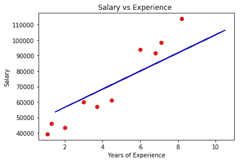
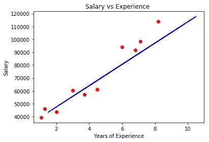
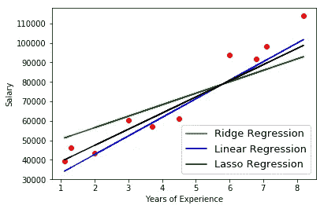

# 用正则化技术回归。

> 原文：<https://towardsdatascience.com/regression-with-regularization-techniques-7bbc1a26d9ba?source=collection_archive---------8----------------------->

本文假设您对回归技术有一些简单的了解，这种技术可以从由统计方法实现的数据集中记录的分层和公平分布来预测所需的变量。开个玩笑！你所需要的是足够的数学知识来理解基本的图表。

进入正题之前，稍微温习一下…

**回归:**回归模型是一种统计程序，允许我们估计两个或更多变量之间的线性或多项式关系。它主要基于预测变量的显著变化对输出变量的改变量，基本上是变量之间的相关性。

回归可以分为:

1.  线性回归
2.  多项式回归
3.  逻辑回归
4.  里脊回归
5.  套索回归
6.  弹性网络回归

从这些回归技术中也有一些其他的衍生模型服务于一个特殊的需求。

本文主要关注*正则化*过度回归方法，以获得更准确的预测。

**正则化:**正则化是一个非常重要的概念，用于避免数据的过度拟合，尤其是当训练和测试数据变化很大时。

通过将“惩罚”项添加到从训练数据得出的最佳拟合中来实现正则化，以实现测试数据的*较小方差*，并通过压缩预测变量的系数来限制预测变量对输出变量的影响。

# 里脊回归

岭回归是一种通过向多线性回归模型添加偏差来实现的技术，以损失训练数据的准确性为代价，期望用测试数据进行更准确的回归。

多线性回归的最佳拟合线的一般方程为

**y = β0 + β1x1 + β2x2 + βkxk**

其中 y 是输出变量，x1，x2…xk 是预测变量。

岭回归的惩罚项是λ(斜率)，其中λ表示通过限制预测变量的系数而偏离原始曲线的程度，但不会使它们为零。

因此，岭回归方程为

**y = β0 + β1x1 + β2x2 + βkxk + λ(斜率)**

Let us take consider an example by taking the salary_data dataset, the ridge regression-scatter plot using a lambda value of 100 is:

# 套索回归

套索回归与岭回归非常相似，但区别仅在于惩罚项。

lasso 回归的惩罚是λ|slope|。

Lesso 回归甚至可以通过使变量的系数为零来消除变量，从而消除与其他预测变量具有高协方差的变量。

套索回归的方程式是

**y =β0+β1x1+β2 x2+βkxk+λ| slope |**

Taking the same example for the lasso regression, the lasso regression-scatter plot using a lambda value of 10000 is:

用线性回归模型比较 lasso 和 ridge，我们得到:

注意:所有三个图必须通过一个点，即(x̄，ȳ)，其中 x̄是预测变量的平均值，ȳ是输出变量的平均值。

**Elasticnet 回归**是岭回归和套索回归的一个更好的组合，能够在更大程度上消除过度拟合模型。

*选择合适的λ值，模型可以正则化，精度可以达到。*