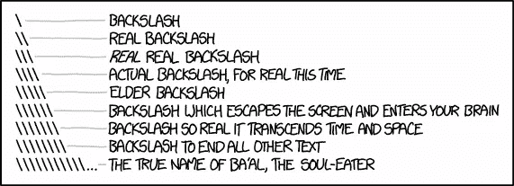

# 第二部分:关于正则表达式您需要知道的一切

> 原文：<https://towardsdatascience.com/regular-expressions-in-python-92d09c419cce?source=collection_archive---------19----------------------->

## Python 和反斜杠瘟疫的简短教程。

假设你知道什么是正则表达式([如果你不知道，请查看本教程的第 1 部分以获得快速概述](https://medium.com/@ria.kulshrestha16/regular-expressions-in-python-a212b1c73d7f))我们现在将学习如何在 Python 中使用它们。:)

“re”模块为正则表达式引擎提供了一个接口，并允许我们将 re 编译成对象，然后对它们执行匹配。

我们将从导入模块开始。然后，我们将通过将正则表达式作为字符串传递来组合它，并将其转换为模式对象。

```
>>> import re
>>> pat_obj = re.compile('[a-z]+')
>>> print(pat_obj)
re.compile('[a-z]+')
```

## 如何处理模式对象？


*   **match():** 判断 RE 是否匹配字符串的开头。

```
>>> m = pat_obj.match('helloworld')
>>> print(m)
*<_sre.SRE_Match object; span=(0, 10), match='helloworld'>***#Note how it doesn't take into account white spaces.**
>>> m = pat_obj.match('hello world')
>>> print(m)
*<_sre.SRE_Match object; span=(0, 5), match='hello'>***# Note that it is case-sensitive.**
>>> m = pat_obj.match('Helloworld')
>>> print(m)
*None***#To ignore case** >>> pat_obj = re.compile('[a-z]+', re.IGNORECASE)
>>> m = pat_obj.match('Helloworld')
>>> print(m)
*<_sre.SRE_Match object; span=(0, 10), match='Helloworld'>*
```

*   **search():** 扫描一个字符串，寻找这个 re 匹配的任何位置。

```
**#Note how it only prints the first match**
>>> s = pat_obj.search('Hello World!')
>>> print(s)
*<_sre.SRE_Match object; span=(1, 5), match='ello'>*
```

*   要打印所有匹配项，
    **findall():** 查找 re 匹配的所有子字符串，并将它们作为一个列表返回。

```
>>> s = pat_obj.findall('Hello World!')
>>> print(s)
*<_sre.SRE_Match object; span=(1, 5), match='ello'>
['ello', 'orld']***#To find all the numbers in a string**
>>>pat_obj_num = re.compile(r'\d+')
>>> pat_obj_num.findall('12 drummers drumming, 11 pipers piping, 10 lords a-leaping')
*['12', '11', '10']*
```

*   **group():** 返回 RE 匹配的字符串。因为说实话，这才是你感兴趣的。没人有时间听这些信息。

```
**#Using group with search**
>>> s = pat_obj.search('Hello World!')
>>> print(s)
*<_sre.SRE_Match object; span=(1, 5), match='ello'>* >>> print(s.group())
*ello***#Using group with match**
>>> m =  pat_obj.match("hello world")
>>> print(m)
*<_sre.SRE_Match object; span=(0, 5), match='hello'>* >>> print(m.group()) *hello***#Using group with findall** >>> m =  pat_obj.findall("hello world")
>>> print(m)
*['hello', 'world']* >>> print(m.group()) *Error!*
```

*   **span():** 返回一个包含匹配(开始，结束)位置的元组。
    **start()，end():** 分别返回匹配的开始和结束位置。

```
>>> pat_obj = re.compile('[a-z]+', re.IGNORECASE)
>>> m = pat_obj.match('Helloworld')
>>> print(m)
*<_sre.SRE_Match object; span=(0, 10), match='Helloworld'>*
>>> print(m.start())
*0* >>> print(m.end())
*10*
>>> print(m.span())
*(0, 10)*
```

## 分组


Photo by [Jeffrey F Lin](https://unsplash.com/@jeffreyflin?utm_source=medium&utm_medium=referral) on [Unsplash](https://unsplash.com?utm_source=medium&utm_medium=referral)

组由()元字符标记。它们将包含在其中的表达式组合在一起，您可以使用重复限定符重复组的内容，例如*、+、？或者{m，n}。
组从 0 开始编号。组 0 始终存在；这是整个 RE，所以 match 对象方法都将 group 0 作为它们的默认参数。

子组从左到右，从 1 向上编号。组可以嵌套；要确定数字，只需从左到右计算左括号中的字符。

```
>>> pat_obj_group = re.compile('(a(b)c(d))e')
>>> m = pat_obj_group.match('abcde')
>>> print(m)
*<_sre.SRE_Match object; span=(0, 5), match='abcde'>* ***#Note m.group(0) matches the same regex as m.match()*** >>> print(m.group(0))
*abcde*
>>> print(m.group(1))
*abcd* ***#Note the number is determined left to right*** >>> print(m.group(2))
*b**>>> print(m.group(3))
d* ***# Note that multiple arguments can be passes to group()*** >>> print(m.group(2,1,3))
*('b', 'abcd', 'd')*
```

*   **groups():** 返回一个包含所有子组字符串的元组，从 1 到所有子组。

```
>>> print(m.groups())
*('abcd', 'b', 'd')*
```

## 代替


**sub():** 返回用替换 *repl* 替换*字符串*中*模式*最左边不重叠出现的字符串。如果没有找到该模式，则返回不变的*字符串*。
*repl* 可以是字符串，也可以是函数；如果它是一个字符串，其中的任何反斜杠转义都会被处理。也就是说，\n 被转换为单个换行符，\r 被转换为回车符，依此类推。

模式的空匹配只有在不与先前的空匹配相邻时才被替换。

```
>>> print(re.sub('x','-','abxd'))
*ab-d*
>>> print(re.sub('ab*','-','abxd'))
*-xd*
>>> print(re.sub('x*','-','abxd'))
*-a-b-d-*
```

可选参数 *count* 是要替换的模式出现的最大数量；*计数*必须为非负整数。如果省略或为零，将替换所有出现的内容。

## 反斜杠瘟疫


Photo by [Aarón Blanco Tejedor](https://unsplash.com/@blancotejedor?utm_source=medium&utm_medium=referral) on [Unsplash](https://unsplash.com?utm_source=medium&utm_medium=referral)

尽管传递正则表达式有助于保持简单，但它有一个缺点。反斜杠字符(“\”)用于允许使用特殊字符而不调用它们的特殊含义，这与 Python 在字符串文字中使用相同字符的用法相冲突，在字符串文字中使用反斜杠字符以不同方式解释后面的字符。
例如，“n”本身只是一个字母，但是当你在它前面加一个反斜杠时，它就变成了\n，这是换行符。啊哦！

假设您想要编写一个匹配字符串'*\ section【T6]'的 RE，这个字符串可能在 LaTeX 文件中找到。
我们将从想要匹配的字符串开始。接下来，我们必须通过在反斜杠前面加上反斜杠来转义任何反斜杠和其他元字符，从而得到字符串' *\\section* '。必须传递给 re.compil()的结果字符串必须是' *\\section* '。然而，要将其表示为 Python 字符串文字，必须再次对两个反斜杠*进行转义，*导致字符串“ *\\\\section* ”。*

简而言之，要匹配一个文字反斜杠，必须将' \\\\ '写成 RE 字符串，因为正则表达式必须是\\，并且每个反斜杠必须在一个常规 Python 字符串文字中表示为\\。



Source: [XKCD](https://xkcd.com/1638/)

解决方案是对正则表达式使用 Python 的原始字符串表示法；在以' r '为前缀的字符串文字中，不会以任何特殊方式处理反斜杠，因此 r'\n '是包含' \ '和' n '的双字符字符串，而' \n '是包含换行符的单字符字符串。

常规字符串和相应的原始字符串

```
"ab*" -> r"ab*""\\\\section" -> r"\\section""\\w+\\s+\\1" -> r"\w+\s+\1"
```

## 学习正则表达式的有趣工具和资源

*   [Regexone](https://regexone.com/)
*   [可视化工具](https://regexr.com/)

## 我写的其他文章，我认为你可能会喜欢:D

*   8 分钟内学会 Git！

> 我很高兴你坚持到了这篇文章的结尾。*🎉我希望你的阅读体验和我写这篇文章时一样丰富。*💖**
> 
> 请点击查看我的其他文章[。](https://medium.com/@ria.kulshrestha16)
> 
> 如果你想联系我，我会选择推特。