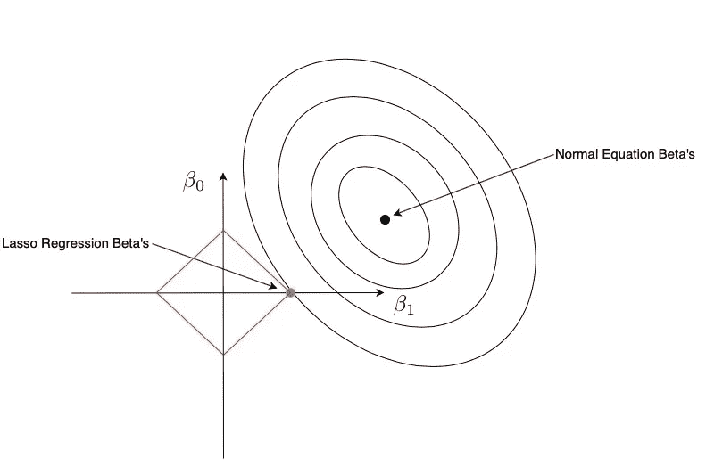

# 正则化和几何

> 原文：<https://towardsdatascience.com/regularization-and-geometry-c69a2365de19?source=collection_archive---------21----------------------->

# **一、偏倚-方差权衡**

当我们执行统计建模时，目标不是选择适合所有训练数据点的模型并获得训练数据的最小误差。目标是让模型能够很好地概括新的和看不见的数据。

Bias and variance contributing to generalization error [1]

随着越来越多的参数被添加到模型中，模型的复杂性增加，即，它可以拟合训练数据中的更多噪声，并导致过度拟合。这意味着我们在增加模型的方差，减少模型的偏差。从上图可以看出，如果我们不断提高模型的复杂度，泛化误差最终会超过最优点并继续增加。

总之，如果我们的模型复杂性超过了最佳点，我们就有陷入过度拟合区域的风险；而如果复杂度没有达到最佳点，我们就处于不适合区域。

正则化是一种有助于防止统计模型陷入过度拟合区域的技术。它通过阻碍模型的复杂性来做到这一点。

# 二。正规化

**线性回归**

这是一个简单的线性回归方程。

Linear Regression

我们的目标是找到最小化残差平方和(RSS)的β集。

Residual Sum of Squares

**L2 正规化**

利用 L2 正则化的回归模型也称为岭回归。就线性回归而言，不仅仅是最小化 RSS。我们通过对测试版的约束为游戏增加了另一个元素。

L1 Regularization

“s”可以理解为 betas 版的预算。如果你想让第一个测试变大，第二个测试必须变小，反之亦然。这变成了一场竞争，因为我们有更多的测试版，不重要的将被迫变小。

由于平方项，RSS 方程实际上给出了椭圆的几何形状。黑点是使用正规方程的贝塔集，即没有正则化。红圈包含了我们“买得起”的所有测试集。红点是岭回归的最终 betas，在我们的预算内最接近黑点。红点将总是在约束的边界上。只有当法线方程的解，即没有正则化的线性回归的解，已经满足约束时，才能在约束内获得红点。

**L1 正规化**

利用 L1 正则化的回归模型也被称为 Lasso ( *最小绝对收缩和选择算子*)回归。套索的目标类似于山脊，只是约束变为:

L2 Regularization

套索还为我们提供了一个美丽的几何图形，它具有独特的性质。

通过 L2 正则化，我们可以“承受”的贝塔集位于一个菱形内。红点在菱形的角上，将其中一个 betas 设置为 0。

如果红点在菱形的边缘，即椭圆接触到菱形的边缘，会怎么样呢？因此，两个 betas 都不会是 0。然而，二维空间中的菱形是一种特殊情况，如果红点在边缘上，则两个β都不为 0。

让我们考虑一下我们有 3 个 betas 的情况。约束的几何图形变为:

Lasso with 3 betas

上图由 6 个顶点和 8 条边组成。如果红点位于边缘，一个β将被设置为 0。如果它位于一个顶点上，两个β将被设置为 0。随着尺寸的增加，顶点和边的数量也增加，使得椭圆更有可能在这些位置之一与菱形接触。也就是说，套索往往在更高的维度上工作得更好。

**L1 和 L2 正规化的差异**

岭回归是线性回归的一种扩展，它将贝塔系数设置得很小，从而减少了不相关特征的影响。这样，统计模型将不适合训练数据中的所有噪声，并且落入过拟合区域。

套索回归带来了一些独特的属性表，因为它的美丽的几何图形。一些测试将被设置为 0，给我们一个稀疏的输出。我们也可以使用套索进行特征选择。虽然诸如[最佳子集](https://www.statisticssolutions.com/best-subsets-regression/)、[向前逐步](https://gerardnico.com/data_mining/stepwise_regression)或[向后逐步](https://gerardnico.com/data_mining/stepwise_regression)的特征选择技术可能是时间低效的，但是 Lasso 将更快地收敛到最终解。

# **三世。结论**

具有高复杂性的统计模型可能易于过度拟合。在本文中，我介绍了两种正则化技术来阻止模型拟合训练数据中的所有噪声。而且，我借助几何解释了它们的性质和区别。

我的文章到此结束！祝大家有美好的一天:)

## **图像:**

[1]丹尼尔·桑德斯，[偏差-方差权衡](https://djsaunde.wordpress.com/2017/07/17/the-bias-variance-tradeoff/) (2017)