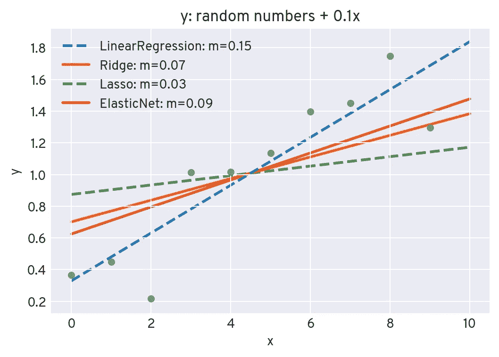

# 机器学习模型的正则化

> 原文：<https://towardsdatascience.com/regularization-for-machine-learning-models-9173c2e90449?source=collection_archive---------25----------------------->

## L1·拉索、L2·海岭和 L1+L2 弹性网正规化解释

机器学习中的一个常见问题是**过拟合**，其中模型错误地概括了训练数据中的噪声:

[https://towardsdatascience.com/over-fitting-and-regularization-64d16100f45c](/over-fitting-and-regularization-64d16100f45c)

补救这个问题并使模型更健壮的一个流行方法是**正则化**:一个**惩罚项**被添加到算法的损失函数中。这改变了最小化损失函数所产生的模型权重。

最流行的正则化技术是**套索、脊**(又名吉洪诺夫)和**弹性网**。对于只有一个**权重参数 *w*** (线性拟合的斜率)的简单线性回归的示例情况，它们的罚项看起来像这样(包括一个**比例参数 *λ*** ):

*   **拉索(L1)** : *λ |w|*
*   **山脊(L2)** : *λ w*
*   **弹性网(L1+L2)**:*λ*₁*| w |+λ*₂*w*

不同的项具有不同的效果:**与 L1 相比，二次 L2 正则化在小权重(接近零)时变得可以忽略，但是在大权重时变得更强。这导致了以下行为，随便说说:**

*   **无正则化的线性回归**:“我附和一切。”
*   拉索:“一开始我持怀疑态度，但是要顺应重大趋势。”
*   **岭**:“我很容易被说服，但有点迟钝。”
*   **弹力网:**“我感觉在山脊和套索之间的某个地方。”

让我们看看**在实践**中是什么样子。对于十个随机数，我们将使用上述四种方法中的每一种方法进行线性拟合(出于演示目的，对岭使用增加的λ参数):

当然，你会在数据中得到一个微小的随机趋势，这无疑是由线性回归得到的。岭回归也显示了这一趋势，但更弱。对于套索和弹性网，当最小化损失函数时，线性 L1 罚项足够高以迫使权重(即斜率)为零。

现在，我们向数据点添加一个小的线性分量，并重新运行拟合程序:

这已经足够让 Lasso 不再完全“忽略”坡度系数了。

如果我们进一步增加增加的线性分量，我们得到这个:

套索和弹性网现在几乎完全“接受”显著趋势，而对于山脊，二次惩罚项导致较低的斜率。

你错过什么了吗？在评论中分享你的观点或问题吧！