# 基于 Framingham 案例研究的神经网络正则化

> 原文：<https://towardsdatascience.com/regularization-for-neural-networks-with-framingham-case-study-2c51cca72f7c?source=collection_archive---------16----------------------->

## L1，L2，弹性网，和组套索正规化


在这篇文章中，我将讨论 L1、L2、弹性网和神经网络上的套索正则化。我描述了正则化如何帮助您构建更有用和更易解释的模型，并且我包括了每种正则化类型的 Tensorflow 代码。最后，我提供了一个详细的案例研究，展示了正则化对神经网络模型的影响，这些神经网络模型应用于来自 Framingham 研究的真实临床和遗传数据。

# **正规化的好处**

## **正则化可以通过减少过度拟合使模型更加有用**

正则化可以通过[减少过度拟合来提高你的神经网络对未知数据的性能。](https://en.wikipedia.org/wiki/Regularization_(mathematics))

[过拟合](https://en.wikipedia.org/wiki/Overfitting)是一种神经网络开始记忆训练数据的独特怪癖(如训练数据噪音)而不是学习普遍适用的原则的现象。“过度拟合”的模型将在训练数据上获得高性能，但在保留的测试数据上表现不佳，这意味着该模型在现实世界中不会有用，因为它不会在从未见过的数据上表现良好。由于神经网络模型的全部目的是解决新数据的实际问题，我们希望避免过度拟合，以便获得实际有用的模型。

下面是[分类问题](https://en.wikipedia.org/wiki/Overfitting#/media/File:Overfitting.svg)中过拟合的一个例子:

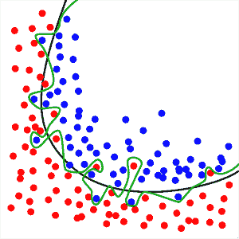

在这个分类任务中，我们要学习一条区分红点和蓝点的线。黑线代表一个很好的分类器，它似乎捕捉到了蓝点和红点在空间中的位置的一般原理。绿线代表一个过度拟合的分类器，因为它对于这个红点和蓝点的精确训练集来说太具体了。

观察绿色分类器线如何在一个看不见的测试集上表现更差，即使这个看不见的测试集遵循相同的蓝点和红点的一般布局。还要注意，没有过度拟合的黑色分类器行在测试集上仍然工作得很好:

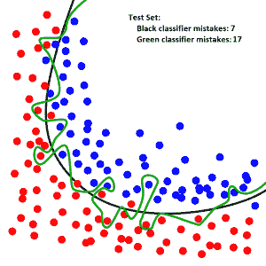

当神经网络[记住训练集中的所有例子](https://en.wikipedia.org/wiki/Overfitting)时，过度拟合的最极端版本发生。当神经网络具有许多参数并且训练时间过长时，会发生这种情况。

## **正则化可以让模型更容易理解**

具体来说，“套索”正则化试图强制模型中的一些权重为零。

*   在回归中，一个权重对应一个变量，因此套索正则化(使用 L1 罚函数)可以通过“清零”相应的权重来直接“清零”某个输入变量。
*   在神经网络中，我们需要使用“套索组”正则化，以便将整个输入变量归零，并获得更易解释的模型。这是因为神经网络将许多权重应用于单个输入变量，因此我们必须将所有这些权重视为一个“组”(详见后面章节。)

愚蠢的例子:

*   我们想建立一个模型来预测糖尿病的风险，这个模型是基于一个包含这些变量的临床数据集:[身高，年龄，过去的诊断，过去的药物，最喜欢的颜色，最喜欢的动物]
*   我们构建了包含 lasso 正则化的模型，并发现该模型选择了“清零”与“最喜欢的颜色”和“最喜欢的动物”相对应的权重，这告诉我们这些变量在预测未来的糖尿病诊断中没有用。

# **如何正则化神经网络模型**

## **通用设置**

以下是神经网络模型正则化的一般设置，其中 W 表示神经网络模型的权重:

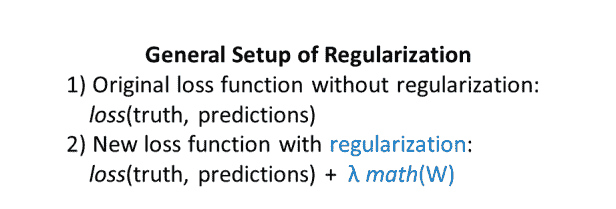

每个神经网络都有一个损失函数，用于在训练中调整神经网络的权重。损失函数衡量神经网络的预测与事实有多大的不同(见[这篇文章](https://glassboxmedicine.com/2019/01/17/introduction-to-neural-networks/)的评论)。)

正则化只是在损失函数中增加了一个“正则项”(上面用蓝色表示)。

*   λ (lambda)决定正则化对网络训练的影响程度。如果设置λ=0，则根本没有正则化，因为您已经将整个正则化项置零。如果您设置λ= 1，000，000，000，那么这将是非常强的正则化，这将使您的模型很难学习任何东西。正则化强度λ的合理选择可以是 0.001、0.01、0.1、1.0 等。最后，要使用的最佳λ值取决于您的数据集和您正在解决的问题。您可以在验证集上用不同的λ强度检查模型的性能，然后选择给出最佳结果的λ。因此，正则化强度λ成为您的模型的超参数，您可以在验证集上对其进行调整。
*   *数学* (W)表示实际的正则化运算。我们称神经网络的权重为 W，因此正则化只是对权重的数学运算。不同种类的正则化对应不同的数学运算。

## **L1 正规化**

以下是 L1 正则化的公式(首先是简单的简写，然后更加精确):

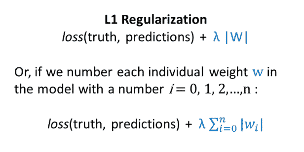

因此，L1 正则化增加了具有大绝对值的权重的惩罚。L1 正则化鼓励您的模型使尽可能多的权重为零。

以下是如何在只有一层的微型神经网络上计算 L1 正则化惩罚的示例，由 2 x 2 权重矩阵描述:

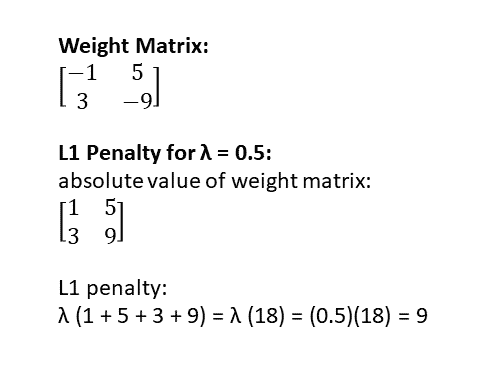

当将 L1 正则化应用于回归时，它被称为“套索回归”

下面是张量流代码，用于计算名为 *weights* 的权重矩阵的 L1 正则化惩罚:

```
l1_penalty = tf.reduce_sum(tf.abs(weights))
```

## **L2 正规化**

以下是 L2 正则化的公式(首先是粗略的简化，然后更加精确):

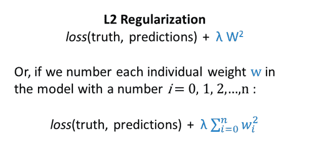

因此，L2 正则化增加了拥有许多大权重的惩罚。L2 正则化鼓励模型选择小数量级的权重。

下面是一个如何在只有一层的微型神经网络上计算 L2 正则化罚值的示例，由 2 x 2 权重矩阵描述:

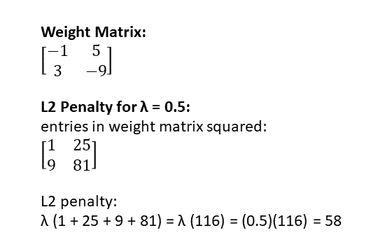

如果你将 L2 正则化应用于回归，它被称为[“岭回归”](https://en.wikipedia.org/wiki/Tikhonov_regularization)

下面是用于计算权重矩阵*权重*的 L2 正则化惩罚的张量流代码:

```
l2_penalty = tf.reduce_sum(tf.nn.l2_loss(weights))
```

张量流函数“l2_loss”计算 l2 范数的平方。平方 L2 范数是 L2 正则化的另一种写法:

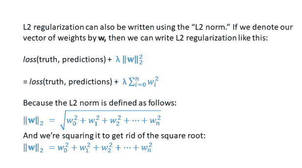

## **L1 和 L2 正规化的比较**

请注意，在 L1 正则化中，权重为-9 会得到 9 的惩罚，但在 L2 正则化中，权重为-9 会得到 81 的惩罚-因此，在 L2 正则化中，较大的权重受到的惩罚要严重得多。

另请注意，在 L1 正则化中，权重为 0.5 会得到 0.5 的罚分，但在 L2 正则化中，权重为 0.5 会得到(0.5)(0.5) = 0.25 的罚分-因此，在 L1 正则化中，仍然有将甚至很小的权重向零挤压的趋势，比在 L2 正则化中更是如此。

这就是为什么 L1 正则化鼓励模型使尽可能多的权重为零，而 L2 正则化鼓励模型使所有的权重尽可能小(但不一定为零)。

## **弹性网正规化**

“弹性网络正则化”听起来很奇特，但它简单地意味着[同时使用 L1 和 L2 正则化](https://en.wikipedia.org/wiki/Elastic_net_regularization):

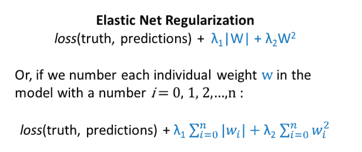

这里，我们有两个λ:一个控制 L1 正则项的强度，另一个控制 L2 正则项的强度。如前所述，这两个 lambda 值都可以使用验证集进行调整。

## **群组套索正规化**

套索集团是由袁和林在 2006 年推出的:

[明元和林逸。"分组变量回归中的模型选择和估计."J. R .统计学家。社会主义者 B (2006)。](http://www.columbia.edu/~my2550/papers/glasso.final.pdf)

(那篇论文后来被引用了 5000 多次。)

什么是套索组？回想一下，L1 正则化有时被称为“套索正则化”，其目的是将一些变量归零。同理，[“群组套索”是一种允许你将整组变量归零的技术](https://en.wikipedia.org/wiki/Lasso_(statistics)#Group_lasso)。特定变量组的所有成员要么一起包含在模型中，要么一起从模型中排除(归零)。

以下是“套索组”特别有用的两种情况:

*对于分类变量:*如果您已经[将分类变量表示为一个热点向量](https://glassboxmedicine.com/2019/06/01/everything-you-need-to-know-about-preparing-tabular-data-for-machine-learning-code-included/)——即，二元协变量的集合——组 lasso 可以确保与单个分类变量相对应的所有二元协变量一起“清零”或“保留”。例如，如果您有一个可能值为“红色”、“蓝色”和“绿色”的分类变量“颜色”，那么您可以用一个长度为三的一键向量来表示该分类变量，这相当于将一个单独的“颜色”列拆分为三个二进制列:“红色是/否”、“蓝色是/否”和“绿色是/否”。“组合套索”可以帮助您将所有三列一起清零，或者保留所有三列，将它们视为一个单元。

*对于神经网络:*如果你正在训练一个神经网络，组套索可以“清零”整个输入变量，并帮助你获得一个更可解释的模型。

*   如前所述，良好的旧 L1 正则化可以很容易地将回归中的整个变量归零，因为它只需将一个权重归零即可将一个变量归零。
*   但在神经网络中，许多权重作用于一个变量，这意味着我们必须同时将所有这些权重归零，以便将该变量归零。套索组让我们将所有对应于一个变量的权重组合在一起，以实现这一目标。

下图显示了“XW”:2 维数据输入矩阵 X 乘以神经网络权重矩阵 W。在这种情况下，W 将 2 维输入映射到 4 维隐藏层。输入 X 由“患者 A”和变量“血压”和“胆固醇”组成(已经按照此处描述的进行了[适当标准化)。)您可以看到权重矩阵的第一行以红色突出显示，这对应于将乘以血压变量的权重。权重矩阵的第二行以蓝色突出显示，这对应于将乘以胆固醇变量的权重。因此，如果我们想要“归零”可变血压，我们需要“归零”权重矩阵顶行中的所有四个权重。](https://glassboxmedicine.com/2019/06/01/everything-you-need-to-know-about-preparing-tabular-data-for-machine-learning-code-included/)

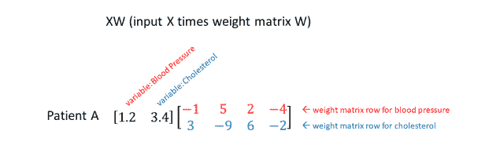

(注:在大多数论文中，神经网络数学都写成 WX+b，其中 W 是权重矩阵，X 是输入，b 是偏置向量。为什么我在这里写 XW？嗯……在 Tensorflow 中，全连接层的实现使用 XW 而不是 WX。参见[这篇文章](https://medium.com/@vivek.yadav/wx-b-vs-xw-b-why-different-formulas-for-deep-neural-networks-in-theory-and-implementation-a5ae6995c4ef)，了解更多关于理论与实践中的符号的评论。)

这里有一篇描述群组套索应用于神经网络的论文:

[西蒙·斯卡达潘尼，达尼洛·科米涅罗，阿米尔·侯赛因和奥雷利奥·安西尼。"深度神经网络的组稀疏正则化."*神经计算* (2017)。](https://arxiv.org/abs/1607.00485)

这是论文的位存储库，作者解释说，

> *对于网络中的每个节点，我们包括一个正则化项，将整行输出权重同时推为零。这是通过约束行的 L2 范数来实现的，通过其维数的平方根来加权。*

以下是群组套索正规化的公式:

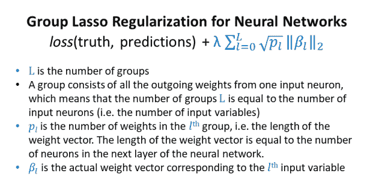

这里有一个组套索惩罚的张量流函数，来自[这个库](https://bitbucket.org/ispamm/group-lasso-deep-networks/src/master/run_simulation.py):

```
# Define the group lasso penalty
returnT.sum(T.sqrt(x.shape[1])*T.sqrt(T.sum(x**2, axis=1)))
```

这是组套索惩罚的另一个 Tensorflow 实现:

```
euclidean_norm =tf.sqrt( tf.reduce_sum(tf.square(weights),axis =1) )
 #Must cast num_outputs to a float in order for tensorflow to take the square root
 account_for_group_size = tf.sqrt( tf.cast(num_outputs, dtype=tf.float32) )
 penalty = tf.reduce_sum( tf.multiply(account_for_group_size, euclidean_norm) )
```

有些令人困惑的是，本文中的群组套索使用了 [L2 范数](http://mathworld.wolfram.com/L2-Norm.html)，就像在 L2 正则化中一样(将元素的平方值相加)。但是传统的“套索”使用 L1 规范！这是怎么回事？

维基百科对“套索”的定义是:

> *Lasso(最小绝对收缩和选择算子)是一种回归分析方法，它执行变量选择和正则化，以提高其产生的统计模型的预测精度和可解释性。*

“套索组”执行变量选择(通过将对应于特定输入变量的权重组归零)和正则化。此外，即使套索组包含 L2 规范，它也不同于 L2 正则化:

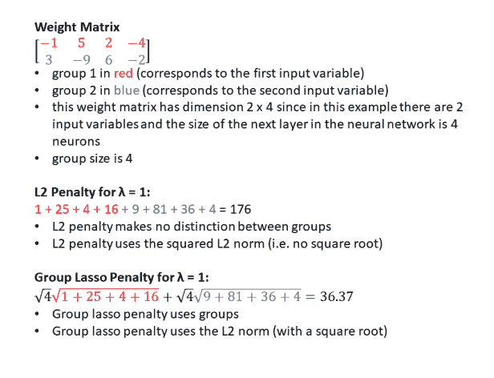

# **弗雷明汉案例研究**

## **背景**

弗雷明汉心脏研究始于 1948 年，一直延续至今。弗雷明汉研究为许多关于心脏病的现代知识做出了贡献，包括健康饮食、保持健康体重、不吸烟和定期锻炼可以降低患心脏病的风险。弗雷明汉心脏研究数据集包括临床变量(如年龄、吸烟状况)、遗传变量和心脏病结果(如患者是否有心脏病发作)。)

2018 年夏天，我花了几个月时间分析弗雷明汉心脏研究的部分数据，以确定同时包含临床和遗传数据的预测模型是否会比仅使用临床数据建立的预测模型表现更好。我怀疑在临床数据的基础上增加基因数据很难在预测性能上看到任何好处，因为:

*   许多临床变量(如胆固醇水平、甘油三酯水平、血压)总结了生活方式选择(如饮食、锻炼、物质使用)*和*遗传。因此，临床数据已经包括遗传学，尽管是隐含的。
*   人类基因组中有成千上万个影响心脏病的位点。这些点分布在整个基因组中。每一个斑点本身对心脏病风险的贡献都很小。然而，[大约 50%的心脏病风险是遗传的](https://www.ncbi.nlm.nih.gov/pmc/articles/PMC3679547/)——这意味着，总体而言，所有这些点一起对心脏病风险有显著影响。因为有这么多不同的贡献点，每一个都有很小的影响，我们需要一个巨大的样本量来挑选对预测有用的模式。不幸的是，在我的弗雷明汉数据子集中，我有 500，000 个遗传变量，但只有 3000 名患者，这意味着问题是[欠定](https://en.wikipedia.org/wiki/Underdetermined_system)(变量多于训练样本。)

## **模型结果**

我根据弗雷明汉数据集的临床和遗传数据训练了各种前馈神经网络，以预测心脏病风险。我对第一层权重矩阵应用了不同类型的正则化。下表显示了不同模型的性能(Acc = [精度](https://glassboxmedicine.com/2019/02/16/measuring-performance-accuracy/)，AUC = [面积在接收器工作特性](https://glassboxmedicine.com/2019/02/23/measuring-performance-auc-auroc/)，AP = [平均精度](https://glassboxmedicine.com/2019/03/02/measuring-performance-auprc/)):

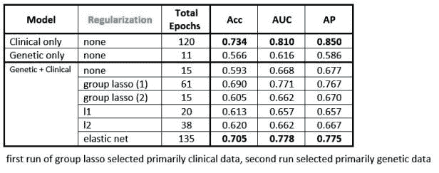

关于结果的要点:

*   表现最好的模型仅使用临床数据(第一行。)
*   仅使用遗传数据的模型(第二行)比仅使用临床数据的模型具有低得多的性能。
*   结合遗传和临床数据的模型都比单独使用临床数据的模型性能低，可能是因为 3000 名患者的样本量不够大，无法从遗传数据中了解到任何有意义的信息。该模型反而过度适应遗传训练数据中的噪声，然后不能推广到测试集中的遗传数据。这具有“混淆”测试集性能的效果(相对于其中临床变量是唯一输入的模型。)

## **第一层权重矩阵热图**

通过检查不同正则化方法的第一层权重矩阵的热图，我们可以获得更多的见解。热图的每一行对应于一个不同的输入变量。前 20 行(genetic_0 到 genetic_19)对应于应用于 500，000 个遗传输入变量的已学习的 20 维表示的权重。底部行(从 SYSBP1 到 DIAB_1.0)对应于应用于临床变量的权重。

以下是采用(A)无正则化、(B) L1 正则化、L2 正则化和(D)弹性网络正则化的模型的热图:

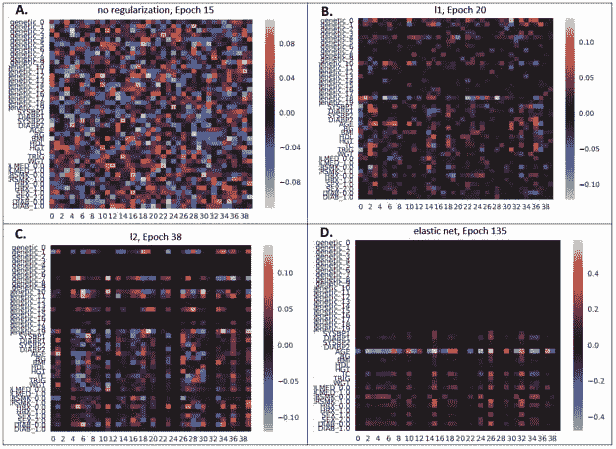

面板 A 示出了没有应用正则化的第一层权重矩阵。我们可以看到大量的正负重量无特定模式地分散在各处。

面板 B 示出了应用了 L1 正则化的第一层权重矩阵。我们可以看到有更多的零值(黑色)权重。然而，在变量(行)级别没有特别强的模式，这是可以预期的，因为 L1 正则化独立地考虑每个权重的绝对值。

画面 C 示出了应用了 L2 正则化的第一层权重矩阵。这比非正则化的情况具有更多数量的较小量值的权重。

画面 D 示出了应用了弹性网正则化的第一层权重矩阵。对于这个数据集，弹性网正则化最终实现了所有考虑的正则化方法的最佳性能。它还产生了一个相当不错的第一层权重矩阵:所有的遗传变量都被“归零”，最亮的临床变量是“年龄”(这有点滑稽，因为我正在研究大约 40 年的心脏病风险，所以如果你在研究期开始时 80 岁开始，你将比 30 岁开始的人有更高的风险。)

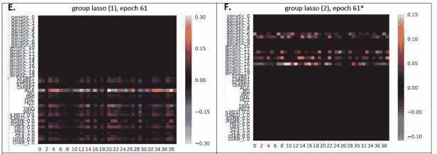

最后，在面板 E 和 F 中，我们可以看到使用群组套索正则化训练的两个不同模型的结果。这些模型用不同的随机初始化进行训练，并最终找到不同的解决方案:

*   图 E 中的模型将所有的遗传变量“清零”,并保留了大部分临床变量(同样，与弹性网情况相似，权重最高的临床变量是“年龄”)。)在上面的结果表中，该模型被列为“套索组(1)”，并达到 0.690 精度、0.771 AUROC 和 0.767 AP。
*   图 F 中的模型最终“归零”了所有的临床变量，并试图使用遗传变量进行预测。最佳验证性能实际上是在第 15 个时期实现的，而不是第 61 个时期，因为在第 15 个时期，模型还没有完成杀死所有临床变量。在 epoch 15 时的性能是 0.605 精度、0.662 AUROC 和 0.670 AP，在模型决定要消除临床变量后，性能变得更差。

因此，这个实验也很好地展示了具有不同随机初始化的神经网络如何在同一数据集上找到不同的解决方案。

注意，在许多情况下，正则化的应用导致更好的测试集性能，这在这个例子中没有明确地示出。如果我在表现最好的“只有临床数据”模型中加入了正则化，也许会产生更高的性能。

## **结论**

*   L1、L2、弹性网和群组套索正则化可通过减少过度拟合来帮助提高模型在不可见数据上的性能。
*   回归中的 L1 正则化和用于神经网络的组套索正则化可以通过“归零”某些输入变量来产生更容易理解的模型。
*   在正则化神经网络模型中可视化带有热图的权重矩阵可以提供对不同正则化方法的效果的洞察。

## **关于特色图片**

特色图片是 C.M. Russell 的一幅名为“牛群逃亡者”的油画，画的是牛仔试图套住一头公牛。牲畜套索[也叫](https://en.wikipedia.org/wiki/Lasso)“套索”、“riata”、“reata”，或简称为“绳子”

*原载于 2019 年 6 月 8 日*[*http://glassboxmedicine.com*](https://glassboxmedicine.com/2019/06/08/regularization-for-neural-networks-with-framingham-case-study/)*。*