# 权重观点中的正则化[张量流中的手动反向传播]

> 原文：<https://towardsdatascience.com/regularization-in-weights-point-of-view-manual-back-propagation-in-tensorflow-4fdc7b389257?source=collection_archive---------16----------------------->

## 不同的正则化如何影响最终的权重值？

GIF from this [website](https://giphy.com/gifs/Reishunger-gnnung-2ZZL7srhu4QtcFNF3L)

我要感谢我的导师布鲁斯博士鼓励我进一步研究这个想法。此外，我想感谢我的实验室成员，在[瑞尔森视觉实验室](https://ryersonvisionlab.github.io/)、[贾森](https://github.com/SenJia)关于正规化的有益讨论。

更多类似的文章，请访问我的网站， [Jaedukseo.me](https://jaedukseo.me/) 。

**简介**

为了防止我们的模型过度拟合，我们可以使用不同种类的正则化技术。其中一种技术是在我们想要优化的损失函数中加入一个正则项。因此，当我们对模型中的权重求导时，我们会对权重添加额外的梯度。

但是不同的正则项如何影响权重呢？更具体地说，它会如何影响价值观的传播？意味着直方图的形状。

**实验设置**

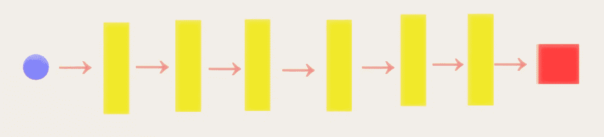

**蓝色球体** →输入图像数据( [STL10](https://cs.stanford.edu/~acoates/stl10/) 或 [CIFAR10](https://www.cs.toronto.edu/~kriz/cifar.html) )
**黄色矩形** →带 ReLU 激活的卷积层
**红色方块** →交叉熵损失项用于分类

网络本身只由六层组成，并不是一个大网络。然而，我们将使用两个不同的数据集，CIFAR 10 和 STL 10。

此外，我们将在有和没有批量标准化的情况下训练网络 10 集，这是为了观察相同的现象是否会反复发生。(现象是，权重收敛到直方图的特定形状。).最后，下面是我们要比较的所有正则项的列表。

***Z:基线(无正则化)
A:ABS(Theta)
B:Theta
C:sqrt(Theta)
D:—log(1+Theta)
E:—tanh(Theta)
F:—tanh(Theta)
G:—tanh(ABS(Theta))
H:—tanh(ABS(Theta)
I:sin(Theta)
J:ABS(sin***

**结果位移**

最左边的 gif 显示了 10 集的重量直方图和粉红色的平均直方图。

如上所述，从红色开始，它代表使用 Adam optimizer 150 个周期后的最终重量。粉色直方图代表平均重量值的直方图。现在放大可视化中最右边的图像。

每个方框显示了每一层的最终直方图，最终图显示了最大/最小/平均训练(红色)/测试(蓝色)性能。

**结果**

> **Z:基线(无调整)**

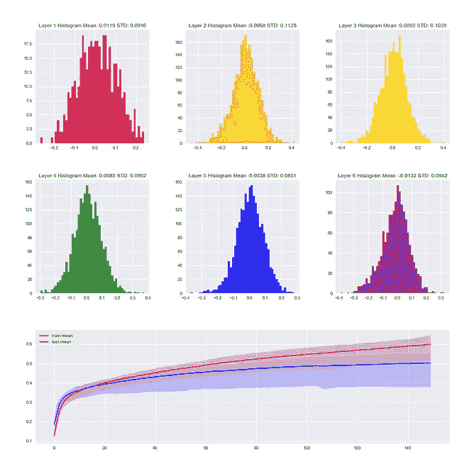

without Batch Normalization (STL)

With Batch Normalization (STL)

without Batch Normalization (CIFAR)

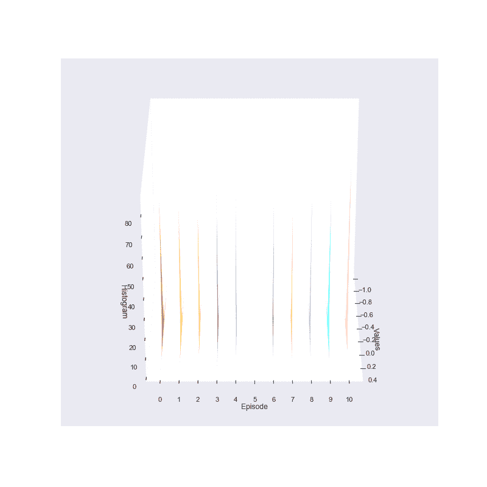

with Batch Normalization (CIFAR)

> **答:ABS(θ)**

without Batch Normalization (STL)

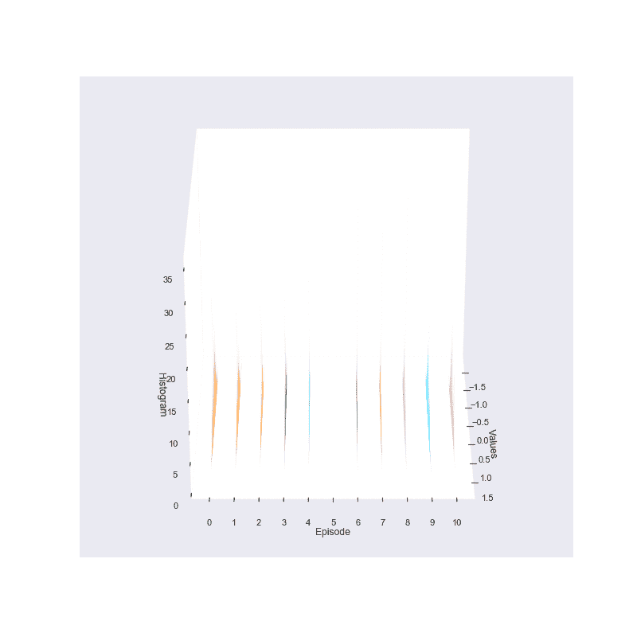

with Batch Normalization (STL)

without Batch Normalization (CIFAR)

with Batch Normalization (CIFAR)

> **B:θ**

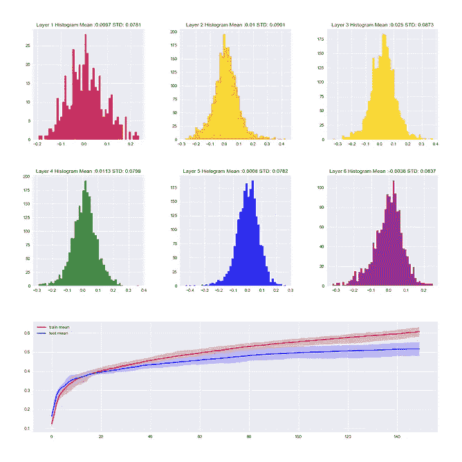

without Batch Normalization (STL)

with Batch Normalization (STL)

without Batch Normalization (CIFAR)

with Batch Normalization (CIFAR)

> **C: sqrt(Theta )**

without Batch Normalization (STL)

with Batch Normalization (STL)

without Batch Normalization (CIFAR)

with Batch Normalization (CIFAR)

> **D:——log(1+Theta)**

without Batch Normalization (STL)

with Batch Normalization (STL)

without Batch Normalization (CIFAR)

with Batch Normalization (CIFAR)

> **E:——tanh(Theta)**

without Batch Normalization (STL)

with Batch Normalization (STL)

without Batch Normalization (CIFAR)

with Batch Normalization (CIFAR)

> **F:--tanh(Theta)**

without Batch Normalization (STL)

with Batch Normalization (STL)

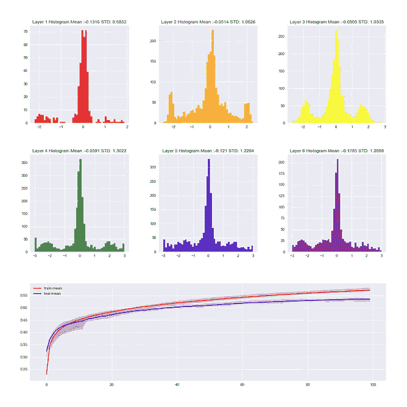

without Batch Normalization (CIFAR)

with Batch Normalization (CIFAR)

> **G:——tanh(ABS(Theta))**

without Batch Normalization (STL)

with Batch Normalization (STL)

without Batch Normalization (CIFAR)

with Batch Normalization (CIFAR)

> **H: -tanh(abs(Theta) )**

without Batch Normalization (STL)

with Batch Normalization (STL)

without Batch Normalization (CIFAR)

with Batch Normalization (CIFAR)

> **I:sin(θ)**

without Batch Normalization (STL)

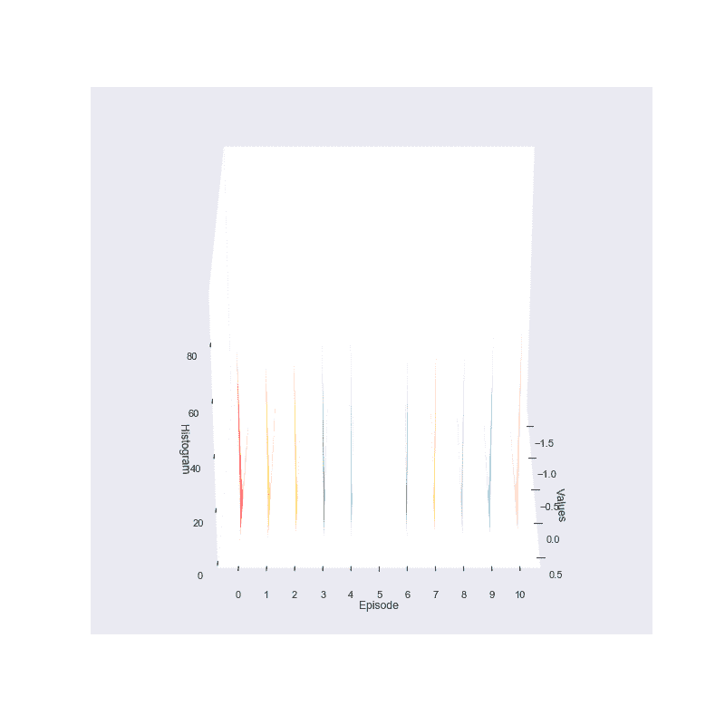

with Batch Normalization (STL)

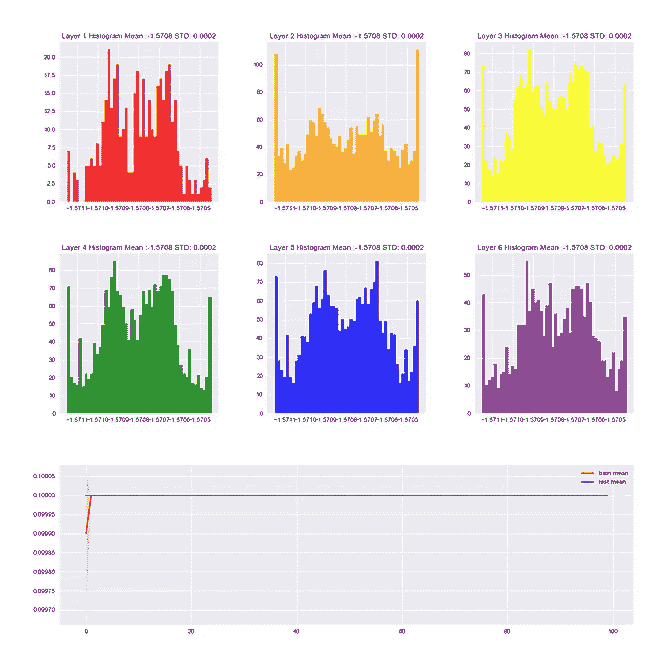

without Batch Normalization (CIFAR)

with Batch Normalization (CIFAR)

> **J: abs(sin(Theta))**

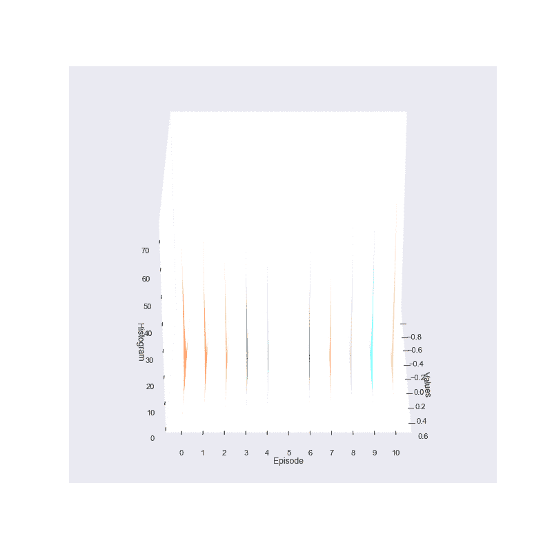

without Batch Normalization (STL)

with Batch Normalization (STL)

without Batch Normalization (CIFAR)

with Batch Normalization (CIFAR)

> **K:对数(θ)**

without Batch Normalization (STL)

with Batch Normalization (STL)

without Batch Normalization (CIFAR)

with Batch Normalization (CIFAR)

> **L: Theta * log(Theta )**

without Batch Normalization (STL)

with Batch Normalization (STL)

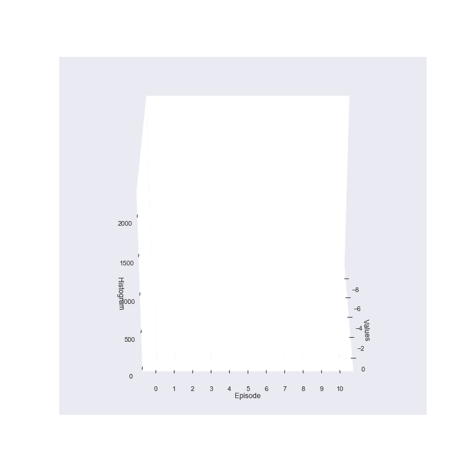

without Batch Normalization (CIFAR)

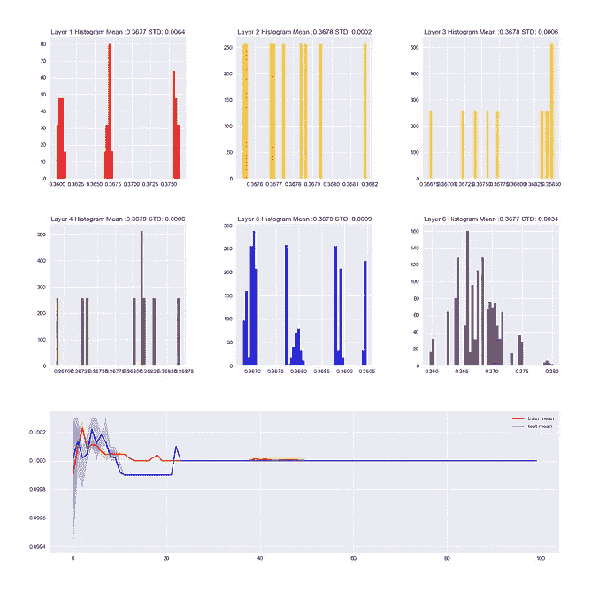

with Batch Normalization (CIFAR)

**讨论/代码**

虽然没有任何明确的证据或定理，我可以从这个实验中证明。我能够做出一些经验性的观察。

1.  批量标准化(没有任何 alpha 或 beta 参数)很可能导致模型过度拟合。
2.  增加批次归一化，使训练更加稳定。此外，它还使权重收敛于类高斯分布。(我们怀疑这可能和中心极限定理有关。)
3.  小批量导致更严重的过度拟合。
4.  在权重的稀疏性和过度拟合程度之间似乎存在微弱的负相关。(如果权重值稀疏，意味着权重中有许多零值，过度拟合程度越低)。

事后看来，最后的观察非常有意义，如果网络权重本身包含大量零值，并且有一些约束将权重保持在那些区域中，那么网络自然很难过度拟合。

我想提出的一些有趣的联系是关于我们的大脑是如何编码视觉输入的。从多个实验中，我们知道 V1 细胞创建了给定视觉输入的稀疏表示，这与具有稀疏权重集非常不同，然而，在稀疏的名义下，它似乎有一些联系。也许，仅仅是也许，对于任何有效的学习模型来说，可能需要一个好的稀疏的权重集。

要访问 CIFAR 10 的代码请[点击这里](https://github.com/JaeDukSeo/Daily-Neural-Network-Practice-2/blob/master/Class%20Stuff/regularization%20in%20deeper%20gradient%20point%20of%20view/blog/a%20FINAL-CIFAR.ipynb)，要访问 STL 10 的代码请[点击这里](https://github.com/JaeDukSeo/Daily-Neural-Network-Practice-2/blob/master/Class%20Stuff/regularization%20in%20deeper%20gradient%20point%20of%20view/blog/a%20FINAL.ipynb)。

最后，如果您希望访问 CIFAR 10 和 STL 10 的每一层的完整结果，无论是否进行批规格化。

请点击此处访问 CIFAR 10 的[完整结果。
请点击此处访问 STL 10](https://medium.com/@SeoJaeDuk/archived-post-cifar-10-full-results-for-regularization-in-weights-point-of-view-manual-back-5df9405c8271) 的[完整结果。](https://medium.com/@SeoJaeDuk/archived-post-stl-10-full-results-for-regularization-in-weights-point-of-view-manual-back-542329164b5e)

**超级有用的数学推理，关于你完全(不应该)信任的每个正则化子在做什么**

在这一节中，我想简单介绍一下每个正则项对权重的影响。但是，请注意，这不是一个数学定义。直线代表调节项的值，而虚线代表梯度大小。

上面显示了正则化项 abs(x)，x，和 sqrt(x)的样子以及它的导数。需要注意的一点是，当导数的幅度结束时，特别是对于 abs(x)，我们注意到，当 x 位于 0 时，梯度的幅度停止。

因此，该模型将不得不平衡它应该具有多少稀疏权重和它将从没有稀疏权重得到多少惩罚。而具有 x 正则项的网络可以承受多个小数量级的权重。

对于涉及 log 的正则化项，我们注意到，由于梯度增加接近无穷大，训练会极不稳定。(对于正无穷大和负无穷大)

对于带有双曲正切的正则化项，我们可以看到只有某些区域的梯度值大于零。

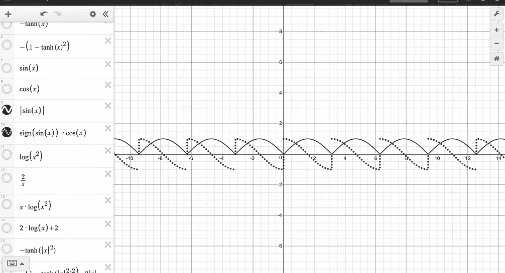

最后，对于 sin 类型的正则项，我们可以看到，网络试图收敛到某些数字，目标并不真正涉及稀疏性。

**最后的话**

在 ICA 中，目标之一是对给定数据进行稀疏表示。虽然使网络的权重稀疏，可以达到类似的结果，我想知道他们的性能会有什么不同。

具有稀疏性约束可以在增加神经网络的泛化能力方面发挥巨大作用。然而，不同风格的稀疏约束可能是一个更重要的问题来解决。

更多类似的文章，请访问我的网站， [Jaedukseo.me](https://jaedukseo.me/) 。

**参考**

1.  笔记本，o .，&达利，S. (2017)。覆盖 jupyter 笔记本中以前的输出。堆栈溢出。检索于 2019 年 1 月 15 日，来自[https://stack overflow . com/questions/38540395/overwrite-previous-output-in-jupyter-notebook](https://stackoverflow.com/questions/38540395/overwrite-previous-output-in-jupyter-notebook)
2.  n .布鲁斯(2016)。尼尔·布鲁斯。尼尔·布鲁斯。检索于 2019 年 1 月 15 日，来自[http://www.scs.ryerson.ca/~bruce/](http://www.scs.ryerson.ca/~bruce/)
3.  在和 Alpha 之间填充— Matplotlib 3.0.2 文档。(2019).Matplotlib.org。检索于 2019 年 1 月 15 日，来自[https://matplotlib . org/gallery/recipes/fill _ between _ alpha . html](https://matplotlib.org/gallery/recipes/fill_between_alpha.html)
4.  Matplotlib . py plot . plot-Matplotlib 3 . 0 . 2 文档。(2019).Matplotlib.org。检索于 2019 年 1 月 15 日，来自[https://matplotlib . org/API/_ as _ gen/matplotlib . py plot . plot . html](https://matplotlib.org/api/_as_gen/matplotlib.pyplot.plot.html)
5.  plots，h .，Raviv，o .，Castro，s .，Isaac，é。，& Twerdochlib，N. (2010 年)。在 matplotlib 图中隐藏轴文本。堆栈溢出。检索于 2019 年 1 月 17 日，来自[https://stack overflow . com/questions/2176424/hiding-axis-text-in-matplotlib-plots](https://stackoverflow.com/questions/2176424/hiding-axis-text-in-matplotlib-plots)
6.  NumPy . histogram—NumPy 1.15 版手册。(2019).Docs.scipy.org。检索于 2019 年 1 月 17 日，来自[https://docs . scipy . org/doc/numpy-1 . 15 . 0/reference/generated/numpy . histogram . html](https://docs.scipy.org/doc/numpy-1.15.0/reference/generated/numpy.histogram.html)
7.  Matplotlib . axes . axes . hist 2d-Matplotlib 3 . 0 . 2 文档。(2019).Matplotlib.org。检索于 2019 年 1 月 17 日，来自[https://matplotlib . org/API/_ as _ gen/matplotlib . axes . axes . hist 2d . html](https://matplotlib.org/api/_as_gen/matplotlib.axes.Axes.hist2d.html)
8.  matplotlib——条形图、散点图和直方图——生物学家的实用计算。(2019).People.duke.edu。检索于 2019 年 1 月 17 日，来自[http://people . duke . edu/~ CCC 14/pcfb/numpympl/matplotlibbarplots . html](http://people.duke.edu/~ccc14/pcfb/numpympl/MatplotlibBarPlots.html)
9.  mplot3d 示例代码:bars3d_demo.py — Matplotlib 1.3.1 文档。(2019).Matplotlib.org。检索于 2019 年 1 月 17 日，来自[https://matplotlib . org/1 . 3 . 1/examples/mplot3d/bars 3d _ demo . html](https://matplotlib.org/1.3.1/examples/mplot3d/bars3d_demo.html)
10.  mplot3d 示例代码:poly 3d _ demo . py—Matplotlib 1 . 3 . 0 文档。(2019).Matplotlib.org。检索于 2019 年 1 月 17 日，来自[https://matplotlib . org/1 . 3 . 0/examples/mplot3d/polys3d _ demo . html](https://matplotlib.org/1.3.0/examples/mplot3d/polys3d_demo.html)
11.  直方图？，P. (2017)。绘制一系列直方图？。Mathematica 堆栈交换。检索于 2019 年 1 月 17 日，来自[https://Mathematica . stack exchange . com/questions/158540/plot-a-sequence-of-histograms](https://mathematica.stackexchange.com/questions/158540/plot-a-sequence-of-histograms)
12.  图形？，W. (2013)。“np.histogram”和“plt.hist”有什么区别？为什么这些命令不绘制相同的图形？。堆栈溢出。检索于 2019 年 1 月 17 日，来自[https://stack overflow . com/questions/20531176/what-is-the-difference-between-NP-histogram-and-PLT-hist-why-dont-these-co](https://stackoverflow.com/questions/20531176/what-is-the-difference-between-np-histogram-and-plt-hist-why-dont-these-co)
13.  NumPy . Lin space—NumPy 1.15 版手册。(2019).Docs.scipy.org。检索于 2019 年 1 月 17 日，来自[https://docs . scipy . org/doc/numpy-1 . 15 . 0/reference/generated/numpy . linspace . html](https://docs.scipy.org/doc/numpy-1.15.0/reference/generated/numpy.linspace.html)
14.  结果，第(2017)页。PLT . hist()vs NP . histogram()-意外结果。堆栈溢出。检索于 2019 年 1 月 17 日，来自[https://stack overflow . com/questions/46656010/PLT-hist-vs-NP-histogram-unexpected-results](https://stackoverflow.com/questions/46656010/plt-hist-vs-np-histogram-unexpected-results)
15.  plot，c .，& Navarro，P. (2012 年)。更改 matplotlib 3D 绘图的轴平面的背景颜色。堆栈溢出。检索于 2019 年 1 月 17 日，来自[https://stack overflow . com/questions/11448972/changing-the-background-color-of-a-matplotlib-3d-plot-planes/12623360](https://stackoverflow.com/questions/11448972/changing-the-background-color-of-the-axes-planes-of-a-matplotlib-3d-plot/12623360)
16.  NumPy . arange—NumPy 1.11 版手册。(2019).Docs.scipy.org。检索于 2019 年 1 月 17 日，来自[https://docs . scipy . org/doc/numpy-1 . 11 . 0/reference/generated/numpy . arange . html](https://docs.scipy.org/doc/numpy-1.11.0/reference/generated/numpy.arange.html)
17.  LLC，I. (2019)。命令行工具:Convert @ ImageMagickImagemagick.org。检索于 2019 年 1 月 17 日，来自 https://imagemagick.org/script/convert.php
18.  使用 Python 的 Matplotlib 制作 3D 绘图动画。(2012).糖分过高。检索于 2019 年 1 月 17 日，来自[https://zulko . WordPress . com/2012/09/29/animate-your-3d-plots-with-python-matplotlib/](https://zulko.wordpress.com/2012/09/29/animate-your-3d-plots-with-pythons-matplotlib/)
19.  鼠，H. (2017)。如何在 python 中旋转 3d 绘图？(或作为动画)使用鼠标旋转三维视图。堆栈溢出。检索于 2019 年 1 月 17 日，来自[https://stack overflow . com/questions/43180357/how-to-rotate-a-3d-plot-in-python-or-as-a-a-animation-rotate-3d-view-using-mou？noredirect=1 & lq=1](https://stackoverflow.com/questions/43180357/how-to-rotate-a-3d-plot-in-python-or-as-a-animation-rotate-3-d-view-using-mou?noredirect=1&lq=1)
20.  贾，S. (2019)。贾森——概述。GitHub。检索于 2019 年 1 月 28 日，来自[https://github.com/SenJia](https://github.com/SenJia)
21.  瑞尔森视觉实验室。(2018).Ryersonvisionlab.github.io 于 2019 年 1 月 28 日检索，来自[https://ryersonvisionlab.github.io/](https://ryersonvisionlab.github.io/)
22.  STL-10 数据集。(2019).Cs.stanford.edu。检索于 2019 年 1 月 28 日，来自[https://cs.stanford.edu/~acoates/stl10/](https://cs.stanford.edu/~acoates/stl10/)
23.  [https://www.cs.toronto.edu/~kriz/cifar.html](https://www.cs.toronto.edu/~kriz/cifar.html)
24.  德斯莫斯图表。(2019).德斯莫斯图形计算器。检索于 2019 年 1 月 29 日，来自[https://www.desmos.com/calculator](https://www.desmos.com/calculator)