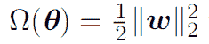

# 神经网络的正则化技术

> 原文：<https://towardsdatascience.com/regularization-techniques-for-neural-networks-e55f295f2866?source=collection_archive---------7----------------------->

在我们的上一篇文章中，我们学习了[前馈神经网络](/feed-forward-neural-networks-c503faa46620)以及如何设计它们。在这篇文章中，我们将学习如何解决机器学习领域中出现的一个最核心的问题，即如何使我们的算法不仅找到训练集的完美匹配，而且找到测试集的完美匹配。当一个算法在训练集上表现很好，但在测试集上表现很差时，该算法被称为在训练数据上过度拟合。毕竟，我们的主要目标是在从未见过的数据上表现良好，即减少过度拟合。为了解决这个问题，我们必须使我们的模型在训练数据上一般化，这是使用各种正则化技术完成的，我们将在本文中学习。

以增加训练误差为代价减少测试集误差的策略或技术统称为正则化。深度学习实践者可以使用许多这样的技术。事实上，开发更有效的正则化策略一直是该领域的主要研究工作之一。

正则化可以定义为我们对学习算法进行的任何修改，其目的是减少其泛化误差，而不是训练误差。这种正则化通常是通过对机器学习模型施加一些额外的约束来完成的，例如对参数值添加限制，或者通过在目标函数中添加额外的项，这些额外的项可以被认为对应于对参数值的软约束。如果选择正确，这些可以减少测试误差。一个有效的规则化者被认为是通过显著减少方差而不过度增加偏差来进行盈利交易的人。

# 参数范数惩罚

这种技术是基于限制模型的容量，通过添加一个参数范数惩罚到目标函数 j。

其中α是一个超参数，它对范数惩罚ω的相对贡献进行加权。将 alpha 设置为 0 意味着没有正则化，alpha 值越大，正则化程度越高。

对于神经网络，我们选择使用参数范数惩罚，该惩罚对仿射变换的权重进行惩罚，并使偏差不被调节。这是因为偏差比权重需要更少的数据来精确拟合。由于权重用于表示两个变量之间的关系，并要求在各种条件下观察两个变量，而偏差仅控制单个变量，因此可以不进行调整。

## L2 参数正则化

这种正则化通常被称为权重衰减。该策略通过添加正则化项ω来驱动权重更接近原点，正则化项ω定义为:

这种技术也称为岭回归或吉洪诺夫正则化。

正则化后的目标函数表示为:

相应的参数梯度:

更新权重的单一梯度步骤:

我们可以看到，在执行通常的梯度更新之前，权重衰减项现在在每一步上以常数因子倍增地收缩权重向量。

## L1 正则化

这里正则项定义为:

这使得我们的目标函数为:

相应的梯度:

通过观察梯度，我们可以注意到梯度是如何通过符号等于符号(wi)的常数因子来缩放的。

# 数据集扩充

使模型一般化的最好和最简单的方法是在大量数据上训练它，但大多数情况下我们只能获得有限的数据。一种方法是创建假数据，并将其添加到我们的训练数据集中，对于某些领域来说，这相当简单明了。

这种方法主要用于分类问题，分类器需要接受复杂的高维输入 x，并用单个类别标识 y 对其进行总结。这意味着分类器面临的主要任务是对各种变换保持不变。我们可以通过转换训练集中的 x 输入来轻松生成新的(x，y)对。这种方法并不总是适合于诸如密度估计任务的任务，除非我们已经解决了密度估计问题，否则很难生成虚假数据。

数据集扩充是用于诸如图像分类或对象识别的计算机视觉任务的非常流行的方法，因为图像是高维的，并且包括大量变化因素，其中许多可以容易地模拟。像在每个方向上将训练图像平移几个像素、旋转图像或缩放图像这样的操作通常可以极大地提高泛化能力，即使已经通过使用卷积和池化技术将模型设计为部分平移不变的。

# 噪声鲁棒性

噪声通常作为数据集扩充策略引入到输入中。在模型的输入端添加具有无穷小方差的噪声相当于对权重的范数施加惩罚。噪声注入比简单地收缩参数要强大得多，尤其是当噪声被添加到隐藏单元时。

噪声被用于正则化模型的另一种方式是将其添加到权重中。这种技术主要用于递归神经网络。这可以解释为贝叶斯推理在权重上的随机实现。

# 半监督学习

在半监督学习中，来自 P (x)的未标记样本和来自 P (x，y)的标记样本都用于估计 P (y | x)或从 x 预测 y。深度学习的上下文中，半监督学习通常指学习一种表示 h = f (x)。目标是学习一种表示法，这样来自同一个类的例子就有相似的表示法。无监督学习提供了关于如何在表示空间中对训练样本进行分组的线索。在应用我们的分类器之前，使用主成分分析作为预处理步骤是这种方法的一个例子。

代替对无监督和有监督组件使用单独的模型，可以构建这样的模型，其中 P (x)或 P(x，y)的生成模型与 P(y | x)的判别模型共享参数。现在，P(x)的结构与 P(y | x)的结构以一种被共享参数化捕获的方式相连接。通过控制在总标准中包含多少生成标准，可以找到比使用纯生成或纯区别训练标准更好的折衷。

# 多任务学习

多任务学习是一种通过汇集几个任务中产生的例子来提高概括能力的方法。同样地，额外的训练示例对模型的参数施加更大的压力，使其趋向于概括得好的值，当模型的一部分在任务之间共享时，模型的该部分更倾向于好的值，通常产生更好的概括。

该模型一般可分为两类部分和相关参数:

> 特定于任务的参数只有从其任务的实例中受益才能实现良好的泛化。
> 
> 所有任务共享的通用参数受益于所有任务的池化数据。

# 提前停止训练

当在足够大的数据集上训练大型模型时，如果训练进行了很长时间而不是增加模型的泛化能力，则会增加过度拟合。在训练过程中，训练误差不断减少，但在某个点之后，验证误差开始增加，因此表明我们的模型已经开始过度拟合。

Loss comparison of training and Validation

考虑提前停止的一种方式是作为一种非常有效的超参数选择算法。提前停止训练的想法是，一旦验证误差开始增加，我们就冻结参数并停止训练过程。或者，我们也可以在每次验证集上的误差改善时存储模型参数的副本，并在训练终止时返回这些参数，而不是最新的参数。

早期停止比权重衰减具有优势，早期停止自动确定正则化的正确量，而权重衰减需要具有不同超参数值的许多训练实验。

# 制袋材料

Bagging 或 bootstrap 聚合是一种通过组合几个模型来减少泛化误差的技术。想法是分别训练几个不同的模型，然后让所有的模型对测试示例的输出进行投票。这是机器学习中一个叫做模型平均的一般策略的例子。采用这种策略的技术是已知的

作为集合方法。这是一种有效的方法，因为不同的模型不会产生相同类型的错误。

打包包括构建 k 个不同的数据集。每个数据集都具有与原始数据集相同数量的示例，但是每个数据集都是通过从原始数据集进行替换采样来构建的。这意味着，每个数据集很可能会丢失原始数据集中的一些示例，并且还包含几个重复的示例。然后，在数据集 I 上训练模型 I。每个数据集中包括的示例之间的差异导致训练模型之间的差异。

# 拒绝传统社会的人

Dropout 是一种计算成本低廉但功能强大的正则化方法，dropout 可以被认为是一种使 bagging 适用于非常多的大型神经网络的方法。bagging 方法不能直接应用于大型神经网络，因为它涉及训练多个模型，并对每个测试示例评估多个模型。因为训练和评估这样的网络在运行时间和存储器方面是昂贵的，所以这种方法对于神经网络是不切实际的。Dropout 为训练和评估指数型神经网络的袋装集合提供了一种廉价的近似方法。Dropout 训练由所有子网络组成的集合，这些子网络可以通过从底层基础网络中移除非输出单元来形成。

在大多数现代神经网络中，基于一系列仿射变换和非线性，我们可以通过将其输出值乘以零来有效地从网络中删除一个单元。这一过程需要对模型(如径向基函数网络)稍加修改，径向基函数网络采用单元状态和某个参考值之间的差值。在这里，我们呈现

为了简单起见，dropout 算法是用零的乘法来表示的，但是它可以被简单地修改以与从网络中移除单元的其他操作一起工作。

辍学训练和打包训练不太一样。在装袋的情况下，模型都是独立的。在丢失的情况下，模型共享参数，每个模型从父神经网络继承不同的参数子集。这种参数共享使得用易处理的存储量来表示指数数量的模型成为可能。dropout 的一个优点是计算量非常小。在训练期间使用丢弃只需要每次更新每个例子 O(n)次计算，以生成 n 个随机二进制数并将它们乘以状态。辍学的另一个显著优势是，它不会显著限制可以使用的模型或培训程序的类型。它几乎适用于任何使用分布式表示的模型，并且可以通过随机梯度下降进行训练。

# **对抗性训练**

在许多情况下，神经网络似乎已经达到了人类水平的理解任务，但为了检查它是否真的能够在人类水平上执行，网络在对立的例子上进行测试。对立例子可以定义为，如果对于数据点 x 附近的输入 a，模型输出在 a 处非常不同，那么 a 被称为对立例子。通过使用优化过程有意地构造对立的例子，并且模型在这些例子上具有接近 100%的错误率。

对抗训练有助于模型的正则化，因为当模型在用对抗例子扩充的训练集上被训练时，它改善了模型的泛化。