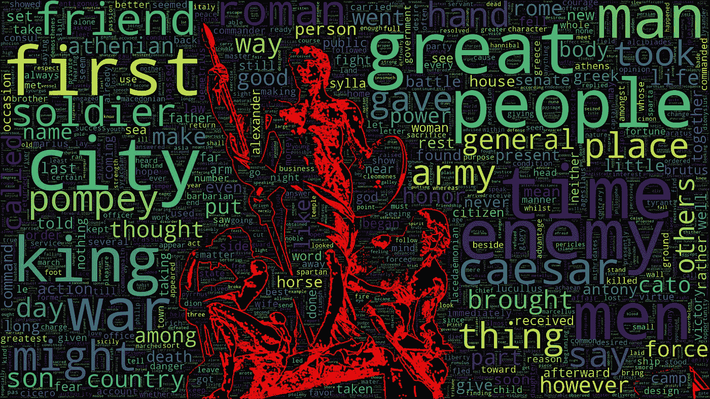
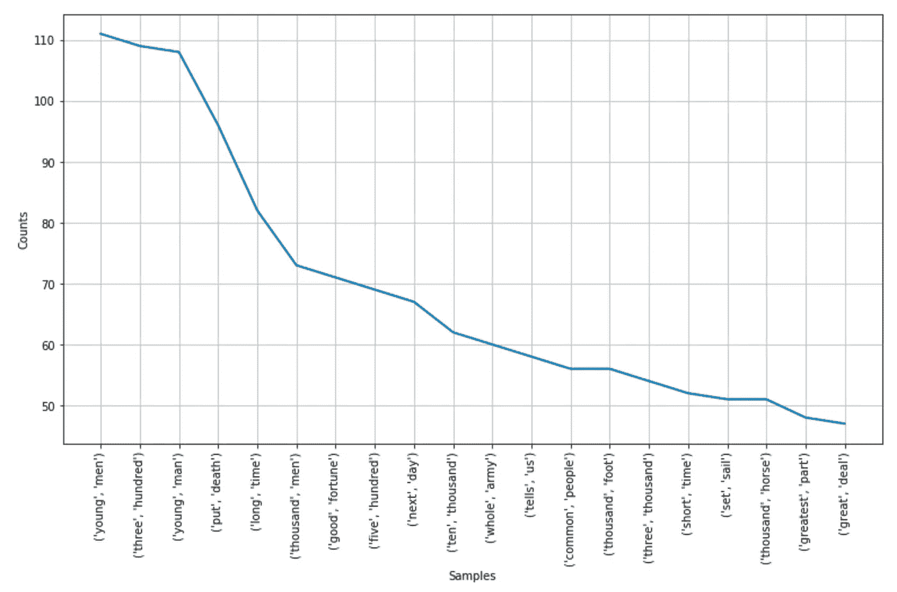
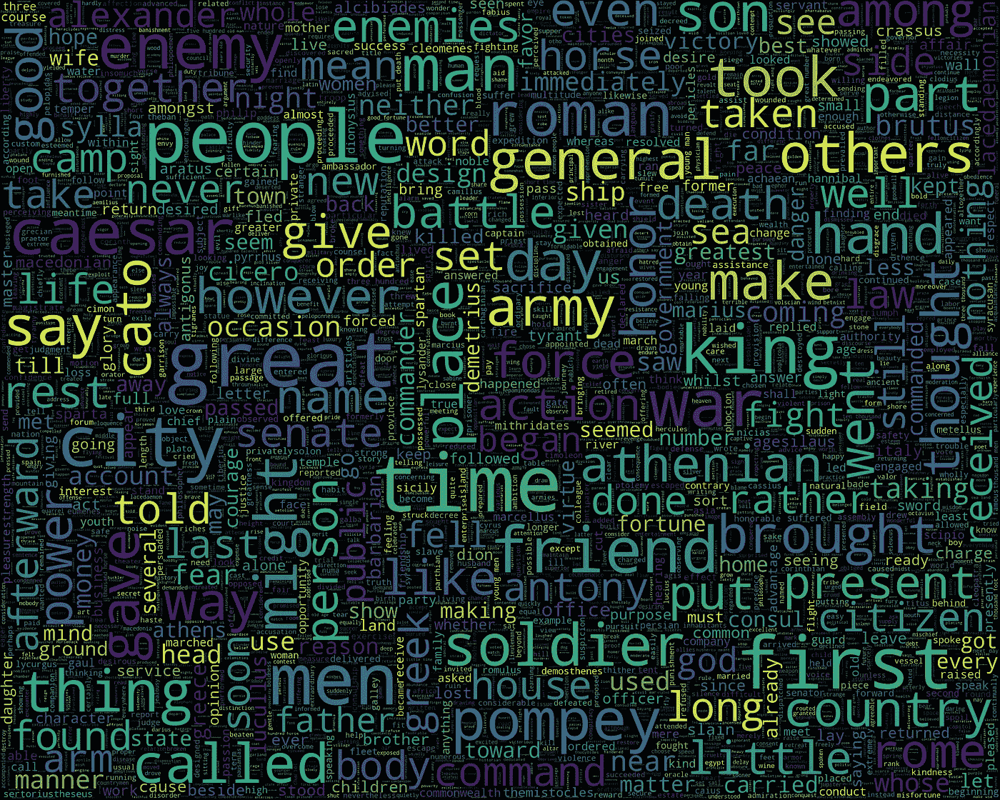
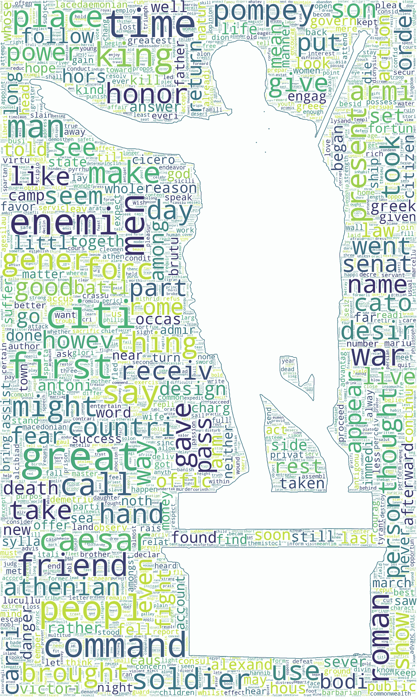

# 用 NLP 重构 Plutarch:第 1 部分

> 原文：<https://towardsdatascience.com/reimagining-plutarch-with-nlp-part-1-24e82fc6556?source=collection_archive---------41----------------------->

## 普鲁塔克的《高贵的希腊人和罗马人的生活》通过自然语言处理；这部分包括 NLTK 和词云

## 序文

[普鲁塔克的《高贵的希腊人和罗马人的生活*，*](http://www.gutenberg.org/ebooks/674)*也叫*平行生活*或简称*普鲁塔克的《生活*，是一系列著名的古希腊人和罗马人的传记，从[忒修斯](https://en.wikipedia.org/wiki/Theseus)和[吕库古](https://en.wikipedia.org/wiki/Lycurgus_of_Sparta)到[阿非利加努斯·戈狄亚努斯二世](https://en.wikipedia.org/wiki/Mark_Antony)。在这篇文章/教程中——继上一篇关于文本生成的文章之后——我将继续这种文本类型，并使用一些自然语言处理技术来探索这本书。*

*为了便于复制，我修改了代码以适应 [Google Colab，](https://colab.research.google.com/notebooks/welcome.ipynb)并强调了平台的独特之处——否则整个代码可以在 Python 3.6+上本地运行。代码在整篇文章中依次出现，Github 文件的链接嵌入在文章的最后，因为我可能会跳过一些次要的细节或代码。*

## *探测*

*首先，让我们设置基础…*

*在 Colab 上，让我们将运行时类型更改为 GPU，然后导入 OS 库并保存+打印文件路径以备将来参考:*

*让我们将文本导入到 Google Colab 驱动器中——我们需要记住，我们在那里的文件是短暂的，我们需要在每次使用该平台较长时间后上传它们:*

*当执行这段代码时，我们将看到 Colab 上传文件，然后我们可以单击左边的 Colab Files 选项卡，以确保该文件与 Google 的默认示例数据目录在一起。*

*在这个阶段，我们将把重点放在单词级分析上，即忽略字符和句子级。因此，我们需要将文本分割成单独的单词——这就是标记化。此外，我们需要删除英语停用词，并可以对词频进行排序——所有这些都是通过使用 NLTK 和 matplotlib 实现的。*

*在下面的代码中，我们读取原始文本文件，对其进行标记化，删除英语停用词(NLTK 标准加上一些额外的词)，绘制一个包含 40 个最常用词的图表，并将标记化的文件保存为“Plutarch_tokens.txt”以供将来使用:*

*整篇文章超过 674，000 字，下面是 40 个最常用单词的图表:*

**

*不出所料，凯撒是最受皇帝们欢迎的，紧随其后的是庞贝——他们是仅有的两个进入前 40 名的人。没有真正读过这本书——向那些非常熟悉文本的人道歉——人们可以很容易地感觉到，由于“战争”、“敌人”、“军队”、“朋友”、“士兵”、“权力”和“战斗”等词的出现频率，这本书在很大程度上专注于战争和冲突；我推测甚至“男人”这个词——第三个最常见的——也经常被用来指士兵。*

*成对的单词怎么样？*

**

*我推测“三百”——第二个最常见的词——在一个或几个例子中指的是传说中的塞莫皮莱战役(其主要历史来源是[希罗多德](https://en.wikipedia.org/wiki/Herodotus))和在那里战斗的三百名斯巴达战士，但经过“低技术”检查(查找文本中的表达)，结果证明情况并非如此。这个数字似乎在各种情况下普遍流行:罗穆卢斯征募所有成年人携带武器进入军事公司(又名军团)，每个公司由三千名步兵和三百名骑兵组成，Numa 重新计算一年的天数，建议饲养蜜蜂时不要把它们放在三百英尺内，Mucius 智胜 Porsenna，威胁(不存在)三百名罗马人等待攻击，三百艘船来支持 Demetrius，Cato 召集三百名罗马人作为他的议会等。所有类型的数字评估在整个作者的文本中都很流行——有几个是最常见的二元模型，有几个是最常见的三元模型。*

## *词干化和词汇化*

*为了更深入的理解，我们可能不需要担心基本相同的单词的时态和其他形式/派生词。这时[词干化和词汇化](https://nlp.stanford.edu/IR-book/html/htmledition/stemming-and-lemmatization-1.html)就来帮忙了。*

*词干化通常通过砍掉单词的一部分(例如，以“-ing”结尾，复数结尾)或改变成可能与实际单词不同的词干形式(例如，“citi”代表“城市”和“city”)来帮助将单词简化为其词根(词干)。*

*词汇化与词干化不同，它关心单词的预期含义(包括词性和使用该单词的上下文)，找到词根只是一部分，因此它是一种更复杂的算法，相对于词干化可能有更大的发展空间。幸运的是，在我们的例子中，词干化和词汇化都很容易应用，这是 NLTK 的优点:*

*我们会注意到，原始标记化文本有 20，214 个唯一单词，平均 6.48 个字母，而词汇化文本有 17，864 个，平均 6.34 个字母，词干化文本有 12，722 个，平均 5.49 个字母；砍真的在后一个里表现出来了。现在，我们有三组标记可供选择，以进行进一步的分析。*

*以上代码如下:*

## *词云*

*单词云是可视化文本的一种很好的方式，但在处理大型书籍时显然有其局限性——很难在一个计算机屏幕上看到 20，000+的单词。此外，可能不属于 NLTK 或 wordcloud 库的无用(用于频率计数)单词可能会脱颖而出，并从其他单词那里夺走不动产——幸运的是，NLTK 和 wordcloud 库都可以轻松增加它们的停用词；前者的调整在前面展示过，后者包含在 [Github 笔记本](https://github.com/mlai-demo/TextExplore/blob/master/RePlutarch_ExplorePub.ipynb)中。*

*让我们在标记化的文本上运行基本的单词云:*

**

*请注意，当我使用预定义的停用词时，没有必要将它包含在代码中，因为文本本身就是停用词。然而，我想保留这一行作为提醒，以防单词 cloud 独立于 NLTK 运行，或者需要应用库自己的停用词。*

*现在让我们运行词干词的词云:*

**

*[wordcloud library](https://amueller.github.io/word_cloud/) 的一个很酷的功能是叠加图片的能力——[示例库](https://amueller.github.io/word_cloud/auto_examples/index.html)给了我们各种可能性的感觉，包括使用图片和自定义颜色。有了上面的代码，我利用机会把 cloud 这个词和罗马皇帝奥古斯都的一张图片结合起来。*

*对于词汇化的单词集，单词云图片在文章的顶部——我不确定这种美学是不是库作者的本意，但它起作用了。代码与上面的非常相似，但如果你需要查找，它在 [Github](https://github.com/mlai-demo/TextExplore) 上。*

## *中断*

*在本文的第 1 部分中，我们着重于利用 NLTK 和 wordcloud 库来探索一个文本示例——本文中显示的全部代码以及更多内容可以在 [Github](https://github.com/mlai-demo/TextExplore) 上找到。在第 2 部分中，我们将深入研究单词嵌入和可视化，*