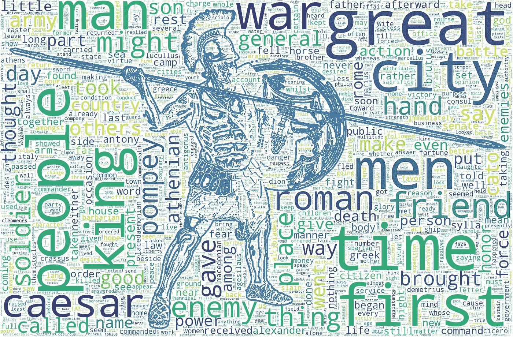
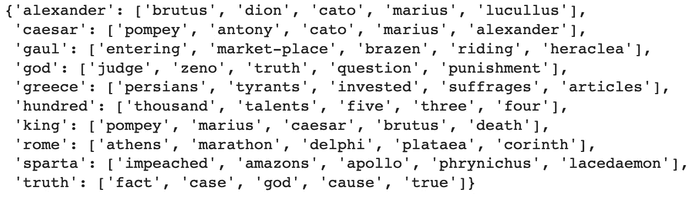
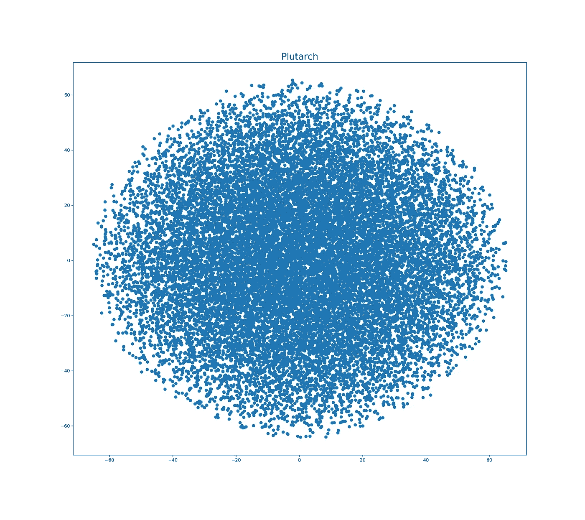
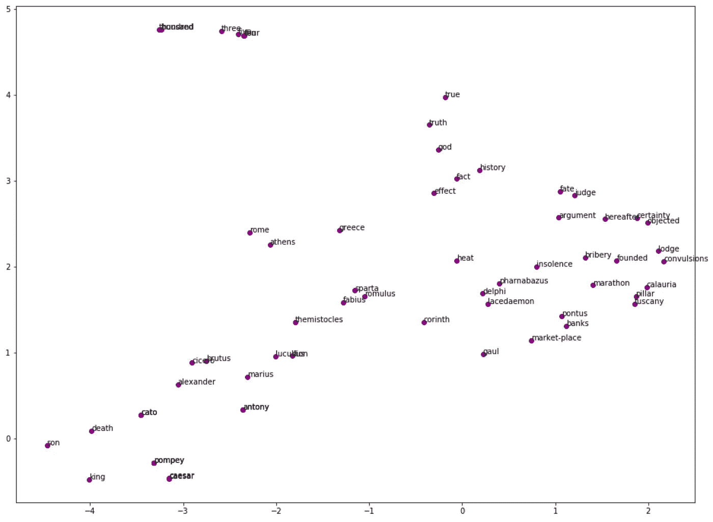
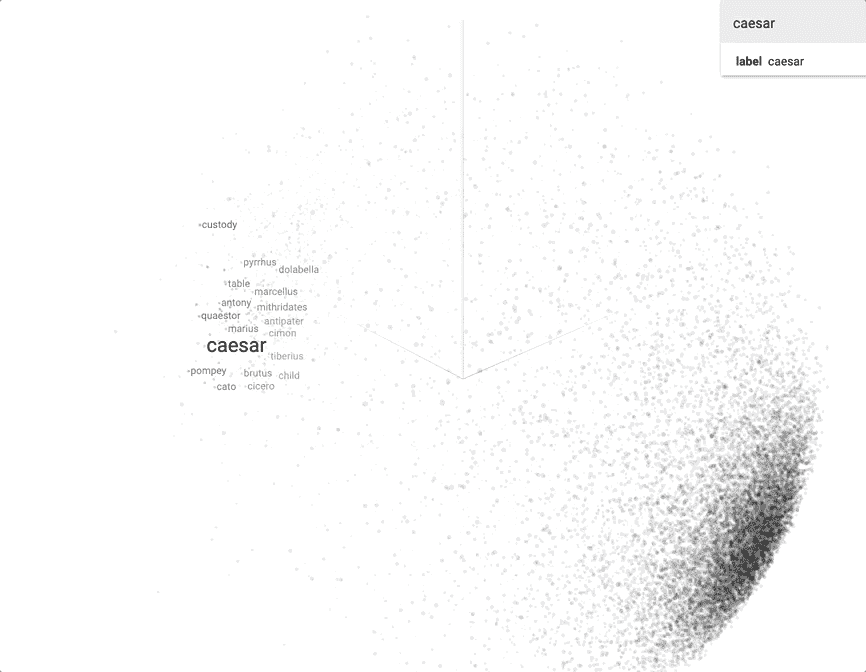

# 用 NLP 重构 Plutarch:第 2 部分

> 原文：<https://towardsdatascience.com/reimagining-plutarch-with-nlp-part-2-dc4e360baa68?source=collection_archive---------17----------------------->



## 普鲁塔克通过自然语言处理研究希腊和罗马贵族的生活:这部分包括 word2vec、降维(PCA 和 t-SNE)和 Tensorflow 投影仪

# 序文

[普鲁塔克的《高贵的希腊人和罗马人的生活](https://en.wikipedia.org/wiki/Parallel_Lives)*，也被称为*平行生活*或者仅仅是*普鲁塔克的生活*，是一系列著名的古希腊人和罗马人的传记，从[忒修斯](https://en.wikipedia.org/wiki/Theseus)和[吕库古](https://en.wikipedia.org/wiki/Lycurgus_of_Sparta)到[阿非利加努斯·戈狄亚努斯二世](https://en.wikipedia.org/wiki/Mark_Antony)。在这篇文章/教程中——继最近出版的第 1 部分之后——我将继续使用一些自然语言处理技术来探索这本书。*

*为了便于复制，我将代码改编为 Google Colab，并强调了该平台的独特之处——否则整个代码都可以在 Python 3.6+上本地运行。代码在整篇文章中依次出现，Github 文件的链接嵌入在文章的最后，因为我可能会跳过一些次要的细节或补充代码。*

*古登堡计划已经提供了本分析中使用的文本[。](https://www.gutenberg.org/ebooks/674)*

# *设置事物*

*在 Colab 上，我们先把运行时类型改成 GPU，然后导入 OS 和[正则表达式](https://en.wikipedia.org/wiki/Regular_expression)库，保存+打印文件路径备查:*

```
*import os
import re
fpath = os.getcwd(); fpath*
```

*让我们将文本(Plutarch.txt)导入到 Google Colab 驱动器中——我们需要记住，我们在那里的文件是短暂的，我们需要在每次使用该平台较长时间后上传它们:*

*上面的代码也可以在 Colab 的 Code Snippets 选项卡下找到——还有许多其他非常有用的代码。当执行这段代码时，我们将看到 Colab 上传文件，然后我们可以单击左边的 Colab Files 选项卡，以确保该文件与 Google 的默认示例数据目录在一起。*

*接下来，我们需要对文本进行标记—但是，与上一篇文章不同，我们希望保持类似句子的结构，并且不希望删除停用词:*

*通常在 NLP 任务中，停用词不经思考就消失了，而且在许多情况下是有意义的。然而，由于我们将处理单词嵌入，其中单词的训练和它的上下文是相互依赖的，我们希望确保这样的上下文(停用词是其中的一部分)得到保留。*

# *单词嵌入和相似性*

*让我们继续训练文本，以便我们可以例如计算彼此之间的单词相似度(被算法理解为几何邻近度)。如果你更喜欢从更理论化的方法开始，我认为这个斯坦福大学 word2vec 讲座非常棒——可能最好是喝一杯你最喜欢的饮料。我获得的信息金块之一是每个单词都有两个向量:作为中心单词和上下文单词(视频中的 41:37)，因此当我在一个散点图的两个地方看到同一个单词时，我最初的困惑得到了解决。*

*接下来，让我们使用 [word2vec 模型](https://en.wikipedia.org/wiki/Word2vec)的四个变体:连续单词包(CBOW，基于上下文单词预测当前单词)和 skip-gram(CBOW 的逆-基于当前单词预测上下文单词)，每个都具有[负采样和分层 softmax](/hierarchical-softmax-and-negative-sampling-short-notes-worth-telling-2672010dbe08) 选项:*

*在上面的代码中， *min_count* 允许根据单词的频率忽略它们，所以在这种情况下，我们希望每个单词都被计算在内；*尺寸*表示尺寸的数量；*窗口*是当前字和预测字之间的最大距离； *iter* 是文本上的历元/迭代次数； *sg=1* 表示我们正在使用 skip-gram，否则为 CBOW *hs=1* 表示我们在使用分层 softmax，否则就是负采样(分层 softmax 对于不常用的词更好[)。如果你想更深入了解，还有更多选择](https://code.google.com/archive/p/word2vec/)。*

*四个选项的结果差异很大，但为了时空的利益，让我们更深入地研究第一个选项，负采样的 CBOW:*

*我们会注意到“凯撒”和“国王”之间的相似度非常高，考虑到这两个词是统治者的同义词，这是有道理的——尽管当时[罗马人厌恶“国王”](https://www.thoughtco.com/early-rome-and-issue-of-kings-118344)的称号。下面是上面代码中的类似单词:*

**

*正如我们将看到的，皇帝的名字与其他皇帝和政治家的名字非常相似。“百”是接近其他数字和货币名称。“国王”与皇帝的名字和“死亡”联系在一起——可能部分是因为那时政治中的暗箭伤人更加字面化。真理接近上帝，反之亦然。*

*您的结果可能与我的不同，因为哈希随机化和模型不局限于单个工作线程(这里的[解决方案](https://stackoverflow.com/questions/34831551/ensure-the-gensim-generate-the-same-word2vec-model-for-different-runs-on-the-sam))。*

# *降维*

*除非你是《星际迷航》中的 [Q，为了可视化你的单词嵌入，你需要大幅减少维数，理想情况下最多两到三个。现在，我们有 100 个。有两种流行的方法，我们将在本文中提到:主成分分析和 t-SNE。](https://en.wikipedia.org/wiki/Q_(Star_Trek))*

*PCA ( [主成分分析](https://en.wikipedia.org/wiki/Principal_component_analysis))是一种线性和无监督的方法，允许提取数据的低维表示，从说明数据中大部分可变性的主成分开始:*

*该片段将产生一个数据帧，每个单词有两个坐标。*

*t-SNE([t-分布式随机邻居嵌入](https://en.wikipedia.org/wiki/T-distributed_stochastic_neighbor_embedding))是一种非线性且无监督的降低数据维数的方法。它主要集中在可视化上，所以——不像 PCA——我们不能在超过三个维度上运行它。有一篇关于如何有效使用 t-SNE 的优秀文章。*

*运行下面的代码需要一段时间，所以请确保您有时间:*

*如果你想试验各种超参数的变化，代码很容易操作；这对于 SNE 霸王龙来说尤其重要，因为它可以更好地了解自己的行为。t-SNE 的另一个棘手之处是它的非确定性(概率性)本质，这意味着每次运行时，我们可能会对相同的数据得到不同的结果——这是因为用于最小化目标函数的梯度下降优化是随机启动的。然而，尽管它比 PCA 年轻 75 岁(SNE 霸王龙是在 2008 年发明的，而 PCA 是在 1933 年发明的)，SNE 霸王龙还是很管用。*

# *形象化*

*现在我们已经控制了尺寸，我们可以开始画一些图了。然而，如果我们试图绘制整个唯一单词集，我们将得到这个(PCA 版本):*

**

*即使在扩大图片后，也很难提取东西——我甚至没有贴标签，因为这样散点图看起来简直糟透了。我们稍后将使用 Tensorflow 投影仪解决这个问题，但现在让我们只关注相似词子集，从 PCA 二维图开始:*

```
*from matplotlib.pyplot import figure
import matplotlib
import matplotlib.pyplot as plt
import numpy as np
from sklearn.decomposition import PCAfig = matplotlib.pyplot.gcf()
fig.set_size_inches(18, 14)simwords = sum([[k] + v for k, v in similar_words.items()], [])
wvs = model_cbow.wv[simwords]pca_wvs = PCA(n_components=2, random_state=0)
np.set_printoptions(suppress=True)
Tpca = pca_wvs.fit_transform(wvs)
labels = simwordsplt.figure(figsize=(16, 12))
plt.scatter(Tpca[:, 0], Tpca[:, 1], c='purple', edgecolors='purple')
for label, x, y in zip(labels, Tpca[:, 0], Tpca[:, 1]):
    plt.annotate(label, xy=(x, y), xytext=(0, 0), textcoords='offset points')*
```

**

*我们看到数词聚集在图的右侧。在左上角，我们看到许多皇帝，随着我们沿着 Y 轴往下走，皇帝的名字越来越与地理名称混在一起。t-SNE 当量看起来不同，但相似的距离逻辑是显而易见的:*

**

# *使用张量流投影仪进行可视化*

*如果不提到谷歌的一个令人惊叹的可视化工具——[tensor flow Projector](http://projector.tensorflow.org/)，我们会觉得很不妥；它允许动态地与单词嵌入进行交互，并通过点击按钮进行更深入的挖掘。*

*在左上角，我们选择 Word2Vec All，在右边的搜索栏中，我们键入并单击“caesar”。原始空间中最近的点显示在下面，我们可以在平台上进行切换，在 PCA 和 t-SNE 之间切换，增加邻居的数量，选择球形化数据，选择余弦或欧几里德距离等。让我们根据我们的普鲁塔克分析将这些结果与“ceasar”进行比较。*

*但首先我们应该为投影仪准备数据，即两个 csv / tsv 文件，其中一个包含向量，另一个包含这些向量表示的单词(投影仪称之为元数据):*

```
*import pandas as pd
project_wvs = [(term, voc.index, voc.count) for term, voc in model_cbow.wv.vocab.items()]
project_wvs = sorted(project_wvs, key=lambda k: k[2])
ordered_terms, term_indices, term_counts = zip(*project_wvs)
df_cbow100 = pd.DataFrame(model_cbow.wv.vectors[term_indices, :], index=ordered_terms)df_cbow100['word'] = df_cbow100.index
df_cbow100['word'].to_csv('df_cbow100word.tsv', sep='\t', encoding='utf-8', index=False, header=False)df_cbow100vector = df_cbow100.iloc[:,0:100].copy()
df_cbow100vector.to_csv('df_cbow100vector.tsv', sep='\t', encoding='utf-8', index=False, header=False)*
```

*上面，我们从之前生成的 word2vec 输出中创建了一个 dataframe (df_cbow100)。然后，我们将数据帧分成所需的仅标签(df_cbow100word.tsv)和仅矢量(df_cbow100vector.tsv)文件。要将文件下载到我们的本地机器上，我们只需双击 Colab 中相应的文件名。*

*然后，让我们回到[投影仪](http://projector.tensorflow.org/)，点击左上角的“加载”按钮，上传两个文件。瞧——现在我们自己的单词嵌入被反映出来了，我们可以使用投影仪工具来操纵我们认为合适的可视化。正如所料，与“caesar”最近的点相对于 Word2Vec All 有很大不同，word 2 vec All 是在更大的数据集上训练的。*

**

# *结论*

*Github 上的[提供了完整的代码和更多内容，而《重新想象普鲁塔克》的](https://github.com/mlai-demo/TextExplore/blob/master/RePlutarch_EmbedPub.ipynb)[第 1 部分可以在这里阅读](/reimagining-plutarch-with-nlp-part-1-24e82fc6556)。在 Reimagining Plutarch 的两个部分中，我们谈到了使用 NLTK、Wordcloud、Word2Vec 嵌入和可视化来分析文本的方法，并为那些有兴趣深入研究的人提供了额外的资源。NLP 相关知识和编程诀窍的可访问性，以及像 Google 的 Colab 这样的工具，使得实现高级概念和跟踪该领域的进展比以往任何时候都更容易。*