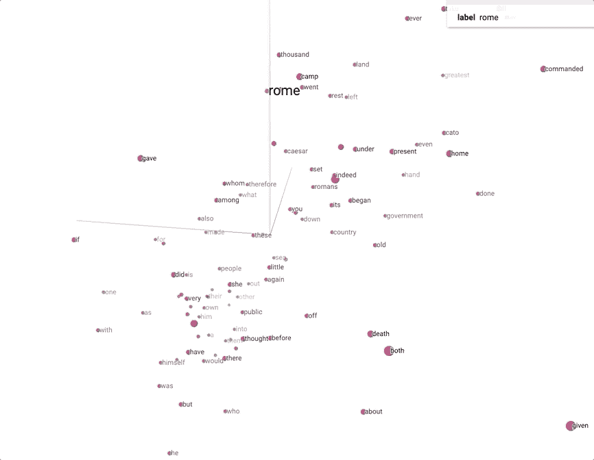

# 用 Tensorflow 2.0 重新想象 Plutarch

> 原文：<https://towardsdatascience.com/reimagining-plutarch-with-tensorflow-2-0-45998bc16feb?source=collection_archive---------34----------------------->


Original photo by Sandra Povilaitis; Vincent van Gogh style transferred using VGG19

## 通过 TensorFlow 2.0 中的单词嵌入看普鲁塔克的希腊和罗马贵族生活

# 序文

[普鲁塔克的《高贵的希腊人和罗马人的生活](https://en.wikipedia.org/wiki/Parallel_Lives)*，也被称为*平行生活*或者仅仅是*普鲁塔克的生活*，是一系列著名的古希腊人和罗马人的传记，从[忒修斯](https://en.wikipedia.org/wiki/Theseus)和[吕库古](https://en.wikipedia.org/wiki/Lycurgus_of_Sparta)到[阿非利加努斯·戈狄亚努斯二世](https://en.wikipedia.org/wiki/Mark_Antony)。*

*[在最近发表的文章](/reimagining-plutarch-with-nlp-part-2-dc4e360baa68)中，我们研究了使用 gensim 库训练我们自己的单词嵌入。这里，我们将主要关注利用 TensorFlow 2.0 平台的单词嵌入层；目的是更好地理解该层是如何工作的，以及它如何有助于大型 NLP 模型的成功。*

*[](/reimagining-plutarch-with-nlp-part-2-dc4e360baa68) [## 用 NLP 重构 Plutarch:第 2 部分

### 普鲁塔克通过自然语言处理研究希腊和罗马贵族的生活:这部分包括 word2vec…

towardsdatascience.com](/reimagining-plutarch-with-nlp-part-2-dc4e360baa68) [](/reimagining-plutarch-with-nlp-part-1-24e82fc6556) [## 用 NLP 重构 Plutarch:第 1 部分

### 普鲁塔克通过自然语言处理研究希腊和罗马贵族的生活:这部分包括 NLTK 和 word…

towardsdatascience.com](/reimagining-plutarch-with-nlp-part-1-24e82fc6556) 

为了便于复制，我将代码改编成了适用于 [Google Colab](https://colab.research.google.com/notebooks/welcome.ipynb) 的代码，并强调了该平台的独特之处——否则，整个代码可以使用 Python 3.6+和相关包在您的本地机器上运行。整篇文章中都有代码，但我会跳过一些补充或次要的代码——完整的代码可以在我的 [Github 库中找到。](https://github.com/mlai-demo/TextExplore)

古登堡计划已经提供了本分析中使用的文本[。](https://www.gutenberg.org/ebooks/674)

# 设置事物

在 Colab 上，让我们将运行时类型更改为 GPU，然后导入最新的 TensorFlow 版本——下面的代码片段仅适用于 Colab，否则只需使用 pip 或 conda install 命令[在您的机器上上传最新的 TensorFlow](https://www.tensorflow.org/install/) 。

我们还需要 OS 和[正则表达式](https://en.wikipedia.org/wiki/Regular_expression)库，然后保存&打印文件路径以备将来参考:

```
import os
import re
fpath = os.getcwd(); fpath
```

让我们将文本(Plutarch.txt)导入到 Google Colab 驱动器中——我们需要记住，我们在那里的文件是短暂的，我们需要在每次使用该平台较长时间后上传它们:

上面的代码也可以在 Colab 的 Code Snippets 选项卡下找到——还有许多其他非常有用的代码。当执行这段代码时，我们将看到 Colab 上传文件，然后我们可以单击左边的 Colab Files 选项卡，以确保该文件与 Google 的默认示例数据目录在一起。

让我们阅读文本并做一些基本的正则表达式操作:

```
import recorpus = open(fpath + '/Plutarch.txt',  'rb').read().lower().decode(encoding='utf-8')corpus = re.sub('\n', ' ', corpus) #remove new line
corpus = re.sub('\r', ' ', corpus) #remove "return"
```

因为我们将把文本分成句子，所以新行对我们的分析没有意义。此外，在使用文本标记器时，我注意到“\r”(表示回车)会产生错误的唯一单词，比如“we”和“we \ r”——同样，这在我们的例子中并不重要。因此“\n”和“\r”都需要删除。

# 建立字典

随着我们逐渐接近实际的单词嵌入，让我们将文本标记成句子:

```
import nltk
from nltk.tokenize import sent_tokenize
nltk.download('punkt') #need in Colab upon resetting the runtime

# tokenize at sentence level
sentences = nltk.sent_tokenize(corpus)
print("The number of sentences is {}".format(len(sentences)))
```

我们会看到这篇课文总共有 16989 个句子。接下来，我们需要计算最长句子中的单词数——原因将在本教程的后面变得显而易见:

```
from nltk.tokenize import word_tokenizeword_count = lambda sentence: len(word_tokenize(sentence))
longest_sentence = max(sentences, key=word_count)
length_longest_sentence = len(word_tokenize(longest_sentence))print("The longest sentence has {} words".format(length_longest_sentence))
```

原来最长的句子有 370 个单词长。接下来，让我们将整个文本转换为正数，以便我们可以开始使用 TensorFlow 说一种通用语言:

从上面我们还发现，该文本有 20241 个唯一的单词，因为记号赋予器对每个相同的单词只赋予一个数字。为了标准化所有句子的长度(即，将输入数据转换为单个相同形状的张量，以使其可处理/更容易用于模型——我们在这里是为了满足机器的需求)，我们需要将表示单词的数字列表(sent_numeric)转换为实际的字典(word_index)，并添加填充。我们也可以将截断很长的句子和填充短句子结合起来，但是在这种情况下，我们只填充最长句子的长度。

词汇大小(也称为独特单词的数量)将增加 1，达到 20，242，这是添加 0 进行填充的结果。键入“data[0]”(即第一句话)，看看第一句话在填充后会是什么样子。

为了能够在单词和它们的数字表示之间来回转换，我们需要为查找添加反向单词索引:

```
reverse_word_index = dict([(value, key) for (key, value) in word_index.items()])def decode_data(text):
    return ' '.join([reverse_word_index.get(i, '?') for i in text])
```

仔细检查单词 indexing 和 conversion 是有意义的——一个错误就可能使整个数据集混乱不堪，让人无法理解。在[我的 Github 库](https://github.com/mlai-demo/TextExplore/blob/master/RePlutarch_TFembPub.ipynb)中可以找到转换前后的交叉检查的例子。


Photo by Sandra Povilaitis

# 模型

最后，让我们构建并运行模型。TensorFlow 提供了一个[不错的教程，我们正在根据自己的需要进行修改。](https://www.tensorflow.org/beta/tutorials/text/word_embeddings)

但是首先，我们可以简单地只运行嵌入层，这将产生一个嵌入的数组。我读到过这样一个数组可以被保存并在另一个模型中使用——是的，它可以，但是除了跳过新模型中的嵌入步骤之外，我不太确定它的实用性，因为为每个单词生成的向量对于所解决的问题是不可知的:

我们不会在上面花太多时间，而是将重点放在嵌入只是第一部分的模型上。

在导入相关库之后，让我们继续构建新的、非常基本的模型架构:

嵌入层(通常可用作模型中的第一层)会将数字编码的唯一单词序列(提醒一下，其中 20，241 个单词加上填充编码为零)转换为向量序列，后者在模型训练时被学习。每个向量将有 100 个维度(embedding_dim=100)，因此我们将得到一个 20242 x 100 的矩阵..输入长度将固定为最长句子的长度，即 370 个单词，因为每个单词由于填充而被模型感知为具有相同的大小。Mask_zero 通知模型输入值 0 是否为应被屏蔽的特殊填充值，这在模型可以处理可变输入长度的重复图层中特别有用。

在对足够多的有意义的数据进行训练之后，具有相似含义的单词将可能具有相似的向量。

下面是模型总结(带有额外密集层的模型在 github 库中):


在模型摘要中，我们将看到嵌入层的参数数量是 2，024，200，这是 20，242 个单词乘以嵌入维度 100。

前面提到的 TensorFlow 教程使用了一个评论数据集，每个评论根据积极或消极的情绪标记为 1 或 0。我们没有奢侈的标签，但仍然希望测试这个模型，所以将简单地创建一个 0 的数组，并附加到每个句子；模型需要这样的结构。这不会是机器智能第一次也不会是最后一次遇到无法解决的任务，但仍然会迫使我们找到解决方案。让我们来训练这个模型:

```
import numpy as npadam = tf.keras.optimizers.Adam(lr=0.001, beta_1=0.9, beta_2=0.999, epsilon=None, decay=0.0, amsgrad=False) 
model.compile(optimizer='adam',
              loss='binary_crossentropy',
              metrics=['accuracy'])batch_size = 16989  #number of sentences
data_labels = np.zeros([batch_size, 1])history = model.fit(
    data,
    data_labels,
    epochs=200,
    batch_size=batch_size,
    verbose = 0)
```

嵌入被训练。在我们转向可视化之前，让我们快速检查一下 gensim 上的单词相似性。首先，我们需要创建 vectors 文件——临时保存在 Colab 中或下载到本地机器:

```
f = open('vectors.tsv' ,'w')
f.write('{} {}\n'.format(vocab_size-1, embedding_dim))
vectors = model.get_weights()[0]
for words, i in tokenizer.word_index.items():
    str_vec = ' '.join(map(str, list(vectors[i, :])))
    f.write('{} {}\n'.format(words, str_vec))
f.close()# download the file to the local machine by double-clicking the Colab file or using this:
try:
  from google.colab import files
except ImportError:
   pass
else:
  files.download('vectors.tsv')
```

第二，让我们

```
import gensimw2v = gensim.models.KeyedVectors.load_word2vec_format('./vectors.tsv', binary=False)w2v.most_similar('rome')
```

最后，让我们检查一下庞贝和凯撒之间的相似性，这在我们之前培训的 [CBOW 模型中显示得很高](/reimagining-plutarch-with-nlp-part-2-dc4e360baa68):

```
round(w2v.similarity('pompey', 'caesar'),4)
```

词与词之间的关系很高。同样，正如人们所料，凯撒表现出与罗马高度相似。

对于那些对更复杂的模型感兴趣的人来说，额外的变体，包括递归神经网络([长短期记忆](https://en.wikipedia.org/wiki/Long_short-term_memory))可以在[我的 Github 文件](https://github.com/mlai-demo/TextExplore/blob/master/RePlutarch_TFembPub.ipynb)中找到，但请记住，它们的训练速度将比上面的简单模型慢得多。

# 形象化

对于嵌入的可视化来说，TensorFlow Projector 无与伦比，因此让我们创建矢量和元(即对应于这些矢量的单词)文件供其使用:

在本地导入文件，然后我们可以前往 [TensorFlow 的投影仪](https://projector.tensorflow.org/)，上传文件以替换默认数据，并尝试网站上可用的各种选项。这里是文本的整个向量空间的主成分分析视图:


这是 100 个单词的向量空间，这些单词和“罗马”最相似。



# 结论

在本文中，我们简要地看了一下单词嵌入层在深度学习模型中的作用。在这种模型的上下文中，该层支持解决特定的 NLP 任务，例如文本分类，并通过迭代训练单词向量，使其最有助于最小化模型损失。一旦模型被训练，我们可以通过相似性计算和可视化来检查嵌入层输出。

嵌入层还可以用于加载预训练的单词嵌入(例如 GloVe、BERT、FastText、ELMo)，我认为这通常是利用需要这种嵌入的模型的更有效的方式，部分原因是生成它们所需的“工业级”工作和数据量。然而，在专门文本的情况下，尤其是如果可以训练单词嵌入的语料库相当大，训练自己的嵌入仍然会更有效。*