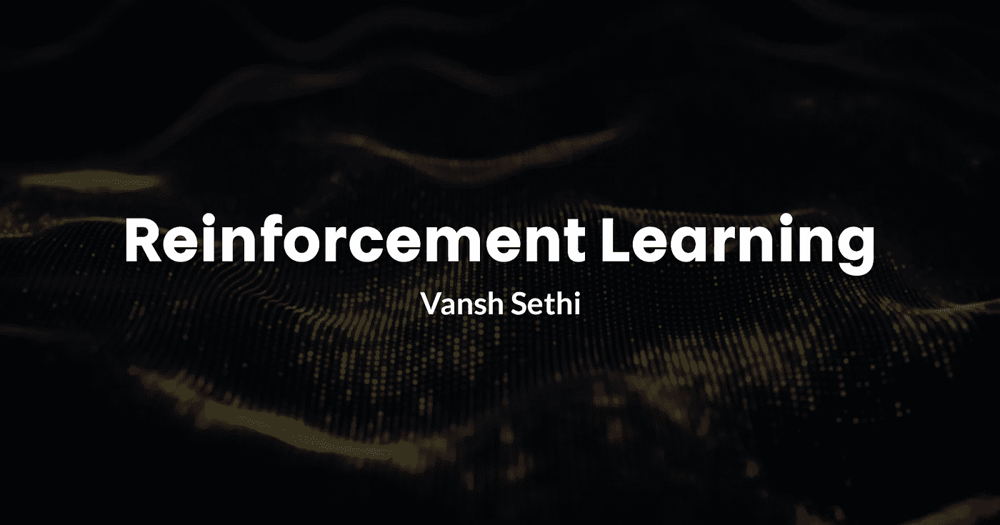
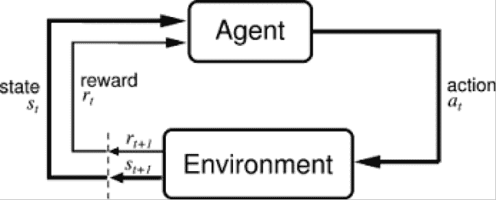
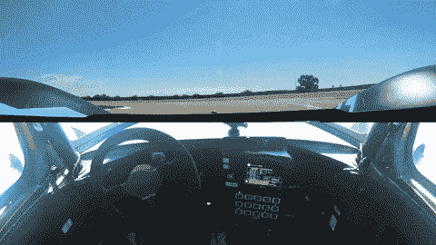
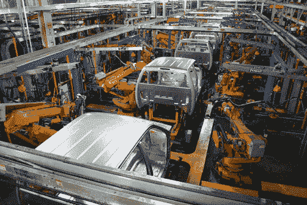

# 强化学习:微妙的介绍

> 原文：<https://towardsdatascience.com/reinforcement-learning-a-subtle-introduction-7a150e37960e?source=collection_archive---------26----------------------->

> 1996 年 2 月 10 日，IBM 的深蓝人工智能在一场国际象棋比赛中击败了世界冠军加里·卡斯帕罗夫。
> 
> 谷歌的阿尔法围棋人工智能是世界上最好的围棋选手，一次又一次地击败了世界冠军。

但是这怎么可能呢？计算机怎么可能比人类聪明？答案… **强化学习**。

## **什么是强化学习？**

强化学习是机器学习和 AI 的一个分支。创建模型来做某些事情需要一种非常特殊的方法。强化学习的目标是教会计算机/机器以高度成功的方式执行某项任务。(例如。赢得一场国际象棋比赛，玩马里奥赛车并获胜，等等。)

注意什么是强化学习也很重要。这些模型是人工特定智能(ASIs)，这意味着它们只能执行非常特定的任务。这些不是普通的人工智能机器(AGIs)，**不能**执行任何任务。这是人工智能的下一个目标，然而在本文中不会讨论。

A reinforcement learning model playing Mario

# 强化学习是如何工作的？

为了理解强化学习的本质，让我们用这个简单的类比来分解它:

> 想象一个孩子第一次看到壁炉。孩子对壁炉充满了好奇和好奇…所以他很自然地靠近了壁炉。当孩子靠近时，它感觉到壁炉的温暖，因此孩子感到温暖和快乐。
> 
> 此外，孩子想感受更多的快乐和温暖，所以孩子靠近壁炉，直到它能碰到壁炉。* ***🔥**** 孩子受伤了，从壁炉边退了回来。
> 
> 下一次孩子遇到壁炉时，它已经学会了不要靠得太近，而是保持一个合理的距离，这样孩子就会得到温暖的奖励，而不会受到被烫伤的惩罚。这个*动作*是取悦孩子的。

感受温暖的回报是这个场景中孩子的目标。如果我们从人工智能的角度来看，人工智能或*代理*希望通过执行一些*动作*序列来最大化一些*奖励*值。

人工智能就像孩子一样，受到奖励的激励。他们都想获得尽可能多的奖励，这可以通过*试错*来实现，在试错过程中，他们学习寻找奖励时的模式。在儿童场景中，儿童很快了解到靠得太近会牺牲奖励，不值得。一台计算机也可能做同样的事情，尝试不同的事情，直到它找到一种给予持续高回报的模式。它强化了给予高回报的模式，并持续完成特定的任务。

**环境**是行动发生或任务执行的地方。例如，在我们上面的场景中，环境是有壁炉的房间。该环境还可以是视频游戏环境、诸如保龄球馆或厨房的某些场景房间以及其他一切。特定任务的环境范围。

**代理**是控制某个实体的计算机或机器。例如，在我们的场景中，代理是孩子。另一个例子是计算机控制超级马里奥兄弟中的马里奥。代理对实体可以执行的控制是有限制的。它只能使用一组预定义的规则。

**动作**是由代理执行的一个移动或一组连续移动。例如，在我们的场景中，它靠近或远离壁炉。简单地说，这是我们试图解决的问题的实际部分。我们如何创造适合任务的最佳行动。

**奖励**是对它在一个环境中完成一项任务的表现以及如何激励代理变得更好的衡量。在我们的场景中，奖励是壁炉的温暖，这也是代理做了好事的一个指标。

最后，**状态**是提供给代理的数据的计算，基本上告诉它在环境中的位置。在我们的场景中，是让孩子在完成一个动作后知道它在哪里。它是用来计算更多的行动，并达到一个总体目标。

它们都通过一个简单的程序连接起来。首先，我们的代理做一个*动作*。该动作通过*环境*进行处理，然后将*奖励*和*状态*反馈给代理。奖励告诉它*动作*做得有多好，以及代理在环境中的位置，所以它知道将来要做什么。

代理人不断尝试，直到有人奖励高价值。它将开始更多地实现这些模式，直到为环境创建一个系统。在这一点上，它将知道如何在环境中的任何状态下执行任务，从根本上解决我们的问题！

然而，仍然有一个问题需要回答……我们如何创造有效的奖励，使代理能够完成任务？

# **奖励——强化学习的原则。**

奖励是智能体/计算机在特定任务中变得更好的动机，例如，在国际象棋中，奖励可以是获胜。因为奖励的必要性是强化学习的基础，所以了解如何通过一个叫做**奖励形成**的过程来创建有效的奖励系统是很重要的

对于机器来说，收敛于某些行为，重要的是学会知道什么是想要的，什么不是。比如玩单人纸牌或者跳棋的时候想要的目标是什么？这对我们来说似乎是显而易见的，但对计算机来说就不那么清楚了。在这些情况下，目标就是简单地获胜，这意味着达到某些参数。所以在给机器塑造奖励模型的时候，你可以告诉它，当它赢的时候，给它+1 奖励，输的时候，-1。这迫使机器想办法总是达到+1，这是我们的预期目标。

但是，我们如何为不像游戏那样明确的东西制定奖励，比如自动驾驶汽车？诀窍是始终考虑更大的目标。在这种情况下，它是在不坠毁或造成伤害的情况下到达 a 点到 b 点。这本身就是对机器的奖励，不管它能走多远而不崩溃。因此，无论何时你试图创建一个奖励函数，只要简单地问自己机器的目标是什么，并为这些参数编写一个程序。理论上计算机应该会变得更好。

因此，我们具备了创建这些代理/机器来执行特定任务的知识…所以，让我们开始吧！

嗯…还有一件事要弄清楚…

# **模拟和如何训练强化学习模型**

很容易看出很多游戏都经过了强化学习。经典的视频游戏，如国际象棋、乒乓球、马里奥、跳棋、围棋……(你明白了)都是电脑**碾压**人类的游戏。

为什么？因为很简单。

在一个游戏中，有规则可循，有许多迭代。一次模拟许多游戏很容易，计算机可以以指数速度学习。电脑不会累，饿，困等。不像人类那样只有有限的时间来学习，计算机可以连续学习几个小时。更不用说，他们能够每秒钟玩多个游戏。这就是为什么计算机可以轻易胜过我们的根本原因。难怪一个 40 天的国际象棋程序能够击败国际象棋冠军加里·卡斯帕罗夫。

但是那些没有具体规则，可以应用到现实世界的任务呢？我们如何应用强化学习？

以开车为例。如果让一台机器在现实生活中“试错”一辆汽车，那就太傻了。你只能想象它会带来的恐惧。那么我们如何应用强化学习呢？同样的方法，用模拟。

“trial and error” approach in real life 😬

我们可以在一个游戏引擎中模拟我们世界的物理，比如 Unity。我们可以给计算机特定的规则，比如前进和后退。我们可以把机器放入一个类似真实世界的*环境*，比如道路。我们用我们的奖励系统在环境中训练机器，直到它变得足够好，几乎不犯错误。

然后我们把我们的模型放入真实世界的机器中，在那里它做完全相同的事情。不需要真实世界的混乱！

嗯…有一点不好的地方…

这样做的缺点是模拟只是…模拟。没有什么能完全模拟我们的世界。如果环境和现实世界之间有一点点差异，这个模型可能在现实世界中不起作用(看看 gif 就知道了)。在为现实世界中的应用程序训练模型时，如果你能克服这个障碍，你就能成功。但是为了确保它能正常工作，你必须仔细观察环境，以确保它是正确的。

这就引出了一个问题…有了创建真实世界钢筋模型和机器的能力…在真实世界中有哪些应用？

# 真实世界的应用

## **自动驾驶汽车**

通过模拟训练，自动驾驶汽车成为强化学习的对象已经有一段时间了。从自动驾驶汽车到自动驾驶飞机，自动驾驶汽车的领域是无限的。

## 卫生保健

强化学习已经被用来通过在模拟中反复试验来找出哪种诊断对某些药物最有效。随着 AI 接管医疗行业，试错将变得更加有用。

## **制造业**

在传统制造中，机器会执行定时程序移动。强化学习的加入，让这些机器更能适应做某项任务，随心所欲地改变任务。这模仿了许多行业的快速变化。

# 关键要点

*   强化学习是通过在一个环境中使用奖励系统来训练一个智能体执行某个任务。
*   奖励是强化学习的原则，我们使用奖励成形来创建强化学习模型的奖励模型。
*   模拟可以用来训练代理
*   强化学习如今在很多行业都有应用。