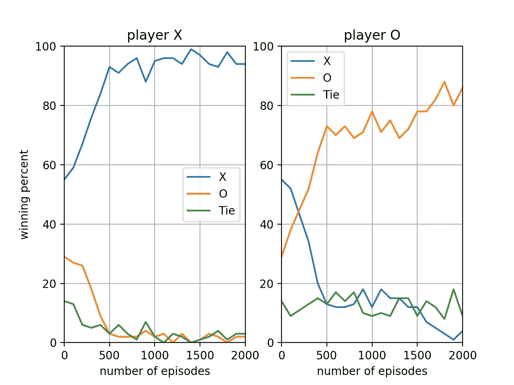

# 用井字游戏进行强化学习和深度强化学习

> 原文：<https://towardsdatascience.com/reinforcement-learning-and-deep-reinforcement-learning-with-tic-tac-toe-588d09c41dda?source=collection_archive---------9----------------------->

在这篇文章中，我想分享我在井字游戏中实现强化学习和深度强化学习方法的项目。

该文章包含:

1.将博弈严格定义为马尔可夫决策过程。

2.如何实现称为 TD(0)的强化学习方法，以创建一个在游戏的每个状态下都发挥最佳行动的代理。

3.如何实现深度强化学习，这与第 2 节非常相似，但这里我使用了神经网络来学习价值函数(什么是价值函数将在后面定义)。

所以让我们开始…

# **井字游戏的马尔可夫决策过程**

为了简单起见，让我们将第一个玩家定义为玩 X 符号的玩家，将第二个玩家定义为玩 O 符号的玩家，让我们将注意力集中在 X 玩家上。

首先要注意这不是一个对称博弈，X 有优势，因为他先玩，他最多有 5 次机会，而 O 最多有 4 次机会。

MDP(马尔可夫决策过程)是一个 4 元组，它包含:

1.  **状态设置**

当轮到玩家 X 出牌时，他的状态集包含所有的棋盘，所以在我们的例子中，状态集包含所有具有相同数量的 X 和 O 的棋盘。例如，空板处于 set 状态。此外，当游戏结束时，所有的棋盘也在状态集中，它们被称为结束状态。

我们将把一个状态写成一个 9 字符串，其中包含数字 1-9，从左上到右下代表棋盘上的空白点，用 X 和 O 代替玩家所在位置的数字。例如，字符串 X234O6789 表示 X 在左上角播放，O 在中间播放的状态。

**2。** **动作设定(一)**

动作集包含了玩家 X 可以玩的所有选项，也就是特定状态下的所有数字。

这里要注意的是，玩家 X 出牌后的棋盘不是玩家 X 的状态集中的状态，因为 X 不能在这个棋盘上执行某个动作(轮到 O 了)。该动作将导致的新状态将是玩家 O 完成其回合后的棋盘。

**3。概率函数(P)**

概率函数，定义通过采取行动从 *S* 到 *S* 的转移概率*a-**p:s✕s✕a→【0，1】。在我们的例子中，S 取决于 O 的话轮。我们可以把它想成:X 采取一个动作，环境做出反应，在 O 的回合后返回一个新的状态。每个可能的状态都有自己的概率，而概率取决于 O 的玩家。*

这里需要注意的是，我们的目标是找到一个函数，将一个状态映射到 X 可以采取的最佳动作。这个动作显然取决于 O 怎么玩(因为它改变了概率函数)。举例来说，如果我们和一个人类玩家或者一个同样随机的玩家进行游戏，那么这个动作可能会有所不同。

例如，假设我们开始了一个新游戏(新一集)，状态是空板，我们需要执行一个动作。我们有 9 个选择。假设现在，我们选择在棋盘中间玩。现在参与人 O 有 8 个选择。如果 O 是一个同样随机的玩家，他将以同样的概率从 8 个选择中挑选一个。对于那些熟悉条件概率的人，我们可以这样写:

*P(S =O234X6789|S =0123456789，a = 5)= P(S = 1 o 34 x 6789 | S = 0123456789，a=5) = …=1/8*

对于人类玩家来说，在角落玩比在边缘中间玩更有可能，所以概率函数会不同。

**4。奖励(R)**

奖励:我们将它定义为 1 如果 X 赢了，-1 如果 O 赢了，0.5 如果是平局，否则 0。

## 政策和价值功能

策略是从状态集映射到动作集的功能。最优策略是使每个州的未来回报最大化的策略。

当从状态 *S* 开始并遵循策略π时，策略π的价值函数是将状态 *S* 映射到期望回报(未来回报的平均值)的函数。最优价值函数是最优策略的价值函数。

我们的目标是学习这个最优值函数，然后根据这个函数作用于每个状态。但首先，让我们假设我们已经知道这个函数，我们如何从一个给定的状态中选择我们的最优行动？

我们假设对手，O 玩家是一个理性的玩家，在 X 的回合之后，他会采取使下一个状态的价值最小化(从而使他的价值最大化)的行动。我们将选择使所有可能的下一个状态的最小值最大化的动作。

比如在空板，X 有 9 个选项可以玩。每个选项可以导致 8 种不同的状态(O 有 8 个选项可以玩)。对于每个 X 移动，我们将从下一个状态计算 8 个可能的值，并记住这些值的最小值。我们将有 9 个价值，我们将决定采取最大化这 9 个价值的行动。

# 强化学习代理

我们现在的目标是学习最优值函数，并创建一个根据该函数进行最优移动的代理。为了学习价值函数，我们将使用 TD(0)方法:

首先，我们将每个状态的值函数初始化为 0。对于游戏访问的每一个状态，我们都会按照更新后的规则更新前一个状态的值函数:*v(s)= v(s)+α(v(s ')+R-v(s))*

其中 *s* 是要更新的状态(前一状态)*s’*是当前状态， *R* 是奖励， *α* 是学习率。我们将选择我们的下一步棋作为概率为 0.8 的最优棋和概率为 0.2 的随机棋，以鼓励探索。

每学习 100 集，我们将随机播放 100 集最佳动作，以检查我们的学习。

在下图中，我们可以看到学习过程。左图对应 X 玩家，右图对应 O 玩家。开始时，我们有两个随机的玩家，由于游戏的性质，X 赢的多一点。在学习过程之后，我们可以看到每个玩家几乎总是在学习和获胜。

# 深度强化学习代理

现在我们可以尝试用不同的方法来学习价值函数。我们不需要学习一个将每个状态映射到一个值的值函数，而是可以尝试将这个函数学习为一个神经网络，它接受一个状态并返回一个值。

馈送给网络的状态是长度为 9 的向量。x 标记为 1，空点标记为 0，O 标记为-1。

该网络包含两个隐藏的密集层，第一层包含 27 个具有 Relu 激活功能的神经元，第二层包含 18 个具有 Relu 激活功能的神经元。网络的最后一层是具有 1 个输出神经元的密集层，该输出神经元具有线性激活函数。

为了训练网络，我们为每个状态计算一个目标值:*target = v(s)+α(v(s ')+R-v(s))*其中 *v(s)* 和 *v(s')* 是从神经网络本身计算的。每次目标计算后，执行一次随机梯度下降迭代。这就是为什么在这个井字游戏的特殊例子中，与以前的方法相比，需要更多的片段来训练网络以执行良好的结果。

这种方法被称为深度强化学习，因为我们在这里使用的是深度学习方法。

为了实现神经网络，我使用了 Keras 框架。

下图显示了深度学习方法的学习过程:

# 摘要

在这篇文章中，我们看到了两种创建完美井字游戏玩家的方法。第一种方法使用直接的方法——在每个状态学习状态的值。这种方式需要多次访问每个状态，以便了解完整的值函数。在这种情况下是可能的，因为游戏没有很多状态。

第二种方式是一种更通用的方式:训练一个将状态映射到值的神经网络。神经网络学习闭合状态(如旋转、镜像等。)有相同的价值观。这意味着我们不需要访问所有国家。然而，因为我们使用随机梯度下降，我们需要播放更多的剧集，以便学习一个完美的神经网络。

原代码可以在:[https://github.com/giladariel/TicTacToe_RL.git](https://github.com/giladariel/TicTacToe_RL.git)找到

你现在可以自己和代理人比赛，看看你是否能赢。