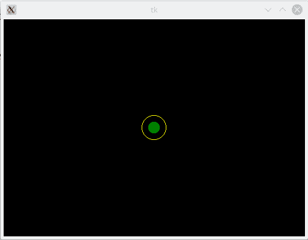

# 用一个简单的游戏强化学习和可视化

> 原文：<https://towardsdatascience.com/reinforcement-learning-and-visualisation-with-a-simple-game-a1fe725f0509?source=collection_archive---------23----------------------->


Photo by [Chris Ried](https://unsplash.com/@cdr6934?utm_source=unsplash&utm_medium=referral&utm_content=creditCopyText) on [Unsplash](https://unsplash.com/s/photos/machine-learning?utm_source=unsplash&utm_medium=referral&utm_content=creditCopyText)

游戏是学习强化学习(RL)概念的最佳方式。但是选择极其琐碎的游戏作为例子并不能反映这种技术的真正力量。另一方面，选择一个有很多图形组件的复杂游戏是一个很酷的演示，但是对于新手来说很难跟上。

本文将通过一个简单的游戏来指导你，这个游戏使用基于 Q 表的强化学习，并且很容易使用 Tkinter 来可视化。游戏的目标是让一个随机移动的绿色球学会如何到达一个小圆圈的中心。如果球没有在 200 步内到达现场，它就输了，游戏重新开始。

运行 RL 训练及其可视化的所有代码都可以在[这里](https://github.com/bhattacharyya/reach_circle)获得



Basic Gameplay

要进行任何 RL 培训，需要明确 3 件事情。

1.  **代理**:它是游戏的组件，会学习一个策略并做出决定。对于我们的游戏来说，代理就是绿球。
2.  **状态**:把状态想象成代理在游戏中特定点的“描述”。状态需要捕捉决定代理的最终目标(或中间目标)是否实现所需的所有信息。这些信息应该是必要和充分的。在我们的游戏中，州被绿球的 2D 坐标捕获。它们足以告诉我们球是否到达了期望的最终位置。
3.  **动作**:动作是改变代理状态的任何事情。通常一个代理在任何给定的状态下都有一个有限的可能动作集。最佳行动的选择最初是随机的(探索阶段),代理人试图找出采取所选行动的后果。一旦代理开始通过多轮游戏获得经验，它就开始制定一个**政策**来指导它的行动选择，而不是随机探索。这就是我们所说的剥削阶段。对于我们的游戏，代理只有 8 个可能的方向可以选择。但是我们给它一个选择，让它每边移动 10 个像素或者 20 个像素。因此，动作集的大小为 16。

让我们检查一下为我们的游戏设置状态空间(所有可能状态的集合)和动作空间(所有可能动作的集合)的代码。

```
mov_list = [-20,-10,10,20]
#Set up Q table
state_space = {}
temp_list = []
for n in range(0,500,10):
 for m in range(0,360,10):
  temp_list.append((n,m))
for k in range(1800):
 state_space[k] = temp_list[k]action_space = {}
temp_list = []
for n in mov_list:
 for m in mov_list:
  temp_list.append((m,n))
for k in range(16):
 action_space[k] = temp_list[k]
```

这段代码假设游戏窗口为 500 像素 x 360px 像素。所以，我们的状态空间应该有 18000 的大小(代理可以到达的每个 x，y 像素)。但是我们已经定义了可能的移动(mov_list)仅仅是 10 的倍数。所以，这将我们的状态空间缩小了 10 倍到 1800。动作空间类似地由所有可能的运动(x 和 y 的组合)组成，给出一组 16 个。

好了，现在我们已经为游戏定义了代理、状态和动作。但问题是代理人如何知道它所采取的行动是有益的还是无益的？这就是**奖励功能**发挥作用的地方。奖励(或惩罚)可以在每次行动后或游戏结束时提供。一般来说，保持奖励系统简单是个好主意。例如，在我们的游戏中，球最多有 200 步才能到达圆圈。每一步都没有奖励。如果球在 200 步之前找到圆圈，则奖励 100。

那么，这种奖励是如何用来制定政策的呢？有多种方法可以做到这一点，但我们使用了 Q 表，这是最简单的策略更新工具之一。Q 表只是状态空间 x 动作空间的矩阵。

```
q_table = np.zeros([len(state_space),len(action_space)])
```

对于我们的游戏，它是一个 1800 x 16 的矩阵，每个单元初始化为 0。如果任何动作导致奖励，我们更新对应状态的 Q 表，动作对。

```
old_q_value = q_table[state, action]
  next_state = list(state_space.keys())[list(state_space.values()).index((pos_x1, pos_y1))]
  next_max = np.max(q_table[next_state])
  q_target = reward + gamma * next_max
  q_delta = q_target - old_q_value
  q_table[state, action] = old_q_value + alpha * q_delta
```

我在这里引入了两个新术语。“alpha”设置算法的学习率，“gamma”是未来奖励的折扣因子。gamma 值越高，可能的未来回报就越重要。我们使用了 0.9 的 alpha 和 1 的 gamma。

这留给我们最后一件事。设定勘探与开发比率。这是由项ε设定的。如果随机数(0 到 1)低于ε，那么代理可以根据 Q 表自由探索和忽略当前策略。

```
if random.random() < epsilon:
    x1 = random.choice(mov_list)
    y1 = random.choice(mov_list)
    action = list(action_space.keys())[list(action_space.values()).index((x1, y1))]
   else:
    action = np.argmax(q_table[state])
    x1, y1 = action_space[action]
```

整个脚本可在[这里](https://github.com/bhattacharyya/reach_circle/blob/master/reach_circle_commandline.py)获得

可视化强化学习如何进行的最好方法是通过一些 GUI 跟踪球的运动。我将 RL 代码与[可视化代码](https://github.com/bhattacharyya/reach_circle/blob/master/reach_circle_commandline_test.py)分开，这样 RL 运行起来非常快。你可以在一定数量的游戏中运行 RL(代码中的剧集参数)，然后运行 GUI 来观察球的行为。GUI 是基于 Tkinter 的，应该可以在任何平台上轻松工作。需要记住的主要事情是，对于 RL 运行，epsilon 设置为 0。因此，它在 RL 训练期间全面探索所有游戏(并建立策略)。请随意将它设置得更高，并在 GUI 上观察结果。

如果你想想象探索之后的渐进开发，在同一个报告中查看这个脚本。注意不要设置太少的探索集，否则小球学不到多少东西，开始钻政策的空子。

就是这样！摆弄参数，一旦你适应了，就开始创建更复杂的游戏。你很快就会意识到，一旦状态空间变得太大，Q 表的更新就会变得非常慢。这就是深度 Q 网络的用武之地。改天再讨论的话题。