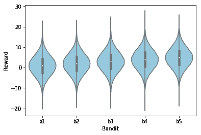

# 强化学习基础:平稳和非平稳多臂土匪问题

> 原文：<https://towardsdatascience.com/reinforcement-learning-basics-stationary-and-non-stationary-multi-armed-bandit-problem-cfe06d33b815?source=collection_archive---------14----------------------->


Photo by [Benoit Dare](https://unsplash.com/@_themoi?utm_source=medium&utm_medium=referral) on [Unsplash](https://unsplash.com?utm_source=medium&utm_medium=referral)

多臂(也称为 k 臂)bandit 是一个介绍性的强化学习问题，其中代理必须在 k 个不同的选项中做出 n 个选择。每个选项都提供了(可能)不同于**未知分布**的回报，该分布通常不随时间变化(即它是固定的)。如果分布随时间变化(即，它不是静态的)，问题会变得更难，因为先前的观察(即，先前的游戏)几乎没有用处。无论哪种情况，目标都是获得最大的总回报。

这篇文章回顾了一个简单的解决方案，包括 1000 个游戏中的固定和非固定的 5 臂强盗。注意这里只展示了部分完整代码的备注，完整功能的笔记本请看[这个 github 库](https://github.com/luisds95/Playground/blob/master/Reinforcement%20Learning/multi-armed%20bandit/Multi-armed%20bandit.ipynb)。

# 5 个固定的强盗

首先，让我们来定义下图中显示的 5 个固定土匪，这将成为代理的选项。

```
class Bandit:
  def __init__(self, mean, std):
    self.mean = mean
    self.std = std

  def sample(self, n=None):
    return np.random.normal(self.mean, self.std, n)
```



Distribution of each bandit (unknown for the algorithm)

为了简单起见，它们中的每一个分别遵循均值为 1、2、3、4 和 5 的正态分布，并且它们都具有 5 的标准偏差。这意味着，比如说，在一次拉动中，所有的强盗都很有可能获得 3 英镑的奖励，但是 1000 场游戏的预期奖励在不同的强盗之间会有很大的差异。事实上，如果一个人总是选择强盗 b1，预期奖励是 1000，而如果一个人选择强盗 b5，那么预期奖励上升到 5000(5 倍增长)。记住，在这个例子中，最好的强盗是 5 号。

当然，如果一个人事先知道这些分布，那么问题将是微不足道的:只需选择期望值最高的土匪并坚持下去。这就是探索和利用之间的权衡所在:假设一个人对环境的信息不完善，那么就有必要继续探索(即尝试不同的强盗)，以便获得关于最佳选择的知识，或者很可能陷入局部最优(纯粹的利用，贪婪的算法)，但如果一个人只探索，那么所获得的信息就没有被使用，也不会获得最优(纯粹的探索)。

为了确保上述概念得到理解，假设在尝试每个土匪一次后，他们的结果是:


那么一个纯粹的利用算法会拉真正的最差土匪(b1)很长一段时间(直到 b1 的平均值低于 0，可能永远不会)，只是因为它在初始化步骤中随机地碰巧是最好的。相反，纯探索算法将对五个盗匪进行均匀采样，并且其期望值将为:


这是次优的结果。

一个简单的解决方案是结合这两种方法，只是贪婪，但探索的时间比例为ε。在下图中，可以看到ε = 0(纯剥削)、ε = 0.01 和ε = 0.10 的实现。贪婪算法在搜索的早期阶段占主导地位，但那些探索的人很快意识到有更好的强盗，并胜过贪婪算法。

```
# Plays the bandits n times during t time steps
datas = {}
n = 20
t = 1000
es = [0, 0.01, 0.10]for e in es:
  # Play n times
  for i in range(n):
    # Get t time-steps of each bandit
    if i == 0:
      data = sample_bandits(bandits, e, t)
    else:
      data = data.append(sample_bandits(bandits, e, t))

 datas[e] = data
```


Average score for ε = 0, ε = 0.01 and ε = 0.10

由于问题是固定的，一旦一个人有信心成为最好的强盗，就不再需要探索；因此，在极限情况下(即有∞步)，ε = 0.01 算法将是最好的算法。然而，如果对问题的平稳性有信心，那么最佳策略将是进行初始搜索(ε = 0.10)，然后切换到利用模式(ε = 0)！

下图显示，通过玩这个游戏 20 次，混合算法在更高的时间百分比内一致地采样到最好的强盗。请注意，ε = 0.10 看起来停滞在 90%附近，这很自然，因为它被编码为在 10%的时间里选择一个非最优的 bandit。相反，ε = 0.01 不断增加，随着时间的推移，它将达到 99%。


Percentage of optimal action for each ε policy across 20 games.

另一种方式是检查 20 个游戏中每个土匪的样本数，如下所示，贪婪算法通常会混淆土匪 4 和土匪 5，而ε = 0.10 很容易找到最好的土匪。


Number of samples per bandit per policy.

# 5 个不稳定的强盗

在现实生活中，发现随时间变化的分布是很常见的。在这种情况下，问题变得更难解决，只是因为以前的观察不太有用:它们可能没有反映出土匪当前状态的真相。处理这个问题的一个简单(但非常严格)的方法是只考虑 m 个先前的观察，这就是这里使用的方法。请注意，这引发了许多问题，例如:

*   变化可能与 m 非常不同，在这种情况下，信息要么被混淆，要么被浪费。
*   这种方法假设 bandit 的新发行版与以前的发行版无关，但事实往往并非如此。

考虑到问题的性质，使用指数加权平均法、加权块平均法或甚至拟合时间序列模型来寻找分布何时改变的指标并相应调整勘探率等替代方法可能更准确。

为了将这些土匪调整为非平稳的，使用了对分布的平均值和标准偏差的简单概率突变(具有 1%的突变概率)，但是变化也可以每 X 步发生一次，或者具有不均匀的概率，或者它们甚至可以改变分布的形状。

```
def mutate_bandit(bandits, proba):
  for bandit in bandits:
    if np.random.random() < proba:
      bandit.mean += np.random.randint(-100,200)/100
      bandit.std += np.random.randint(-50,75)/100
```

在这种情况下，人们会认为纯粹的利用算法性能很差。这个直觉用下图证实了，图中显示ε = 0 算法只在 30%左右的时候选择了最好的 bandit，比纯粹的随机选择(20%)好不了多少。ε = 0.10 设法发现最佳 bandit 何时更频繁地改变，并保持为最佳执行算法。另一方面，ε = 0.01 不再提高，因为它的低探测率不允许它快速找到变化的最佳 bandit。


Percentage of optimal action for each ε policy across 20 games on a non-stationary bandit problem.

# 外卖

最后，如果你需要记住这篇文章的一些东西，那应该是:就像 k-bandit 问题一样，真实世界的问题，其中的真实性质是未知的，需要探索和利用的混合才能有效地解决。