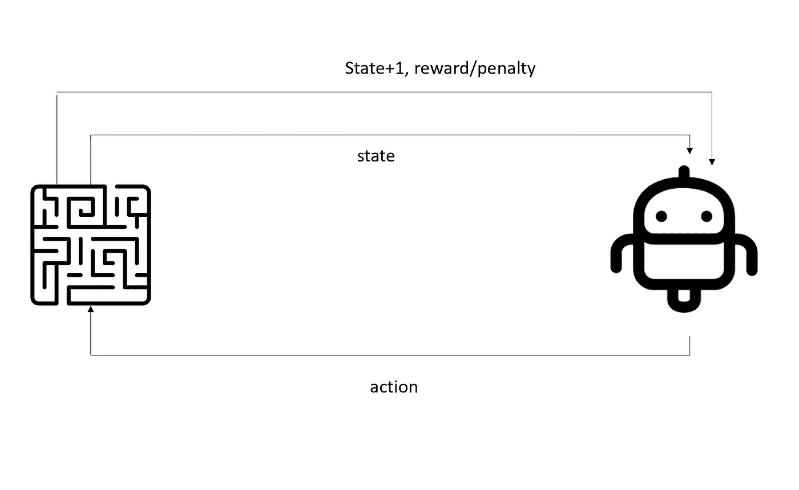

# 强化学习:超越监督和非监督方式

> 原文：<https://towardsdatascience.com/reinforcement-learning-beyond-the-supervised-and-unsupervised-ways-b3cae32eef65?source=collection_archive---------14----------------------->

在机器学习中，根据提供给你的数据类型，有两种主要的方法来训练你的模型:

*   **监督学习**:你被提供了一组输入和输出，因此你的数据已经被标记，你知道它们背后的“基本事实”。这意味着，一旦你的算法在训练集上得到训练，并在测试集上做出预测，你就可以立即得到它的性能反馈:事实上，你已经知道了真实的输出。让我们用一个简单的例子来形象化它，其中我们的数据被标记为“三角形”和“正方形”，因此我们的算法将被要求为新数据分配一个现有的类:

*   **无监督学习**:在这个场景中，你被提供的数据既没有被标记也没有被分类。基本上，你事先不知道你的数据点是正方形还是三角形*。因此，无监督算法的目标是推断这些数据的内部结构，找到共同的模式，并试图将它们归类(记住，没有目标！).也就是说，我们的无监督算法可能能够从三角形中分离出正方形，但实际上并不称它们为“正方形”和“三角形”。*

**

*到目前为止一切顺利。但是如果根本没有给你提供数据，而你又想让你的算法从周围环境中学习，那会怎么样呢？如果你想一想许多自动化系统，像自动驾驶汽车和机器人，你可以看到那些机器(汽车、机器人)没有提供历史数据:它们必须在工作时收集这些数据。因此，这个想法是，这些机器必须通过几次尝试来完成任务，从它们的错误中学习(即撞向墙壁)，并在下一次尝试中避免它们。*

*让我们通过考虑下图(指的是马尔可夫决策过程)来稍微解释一下这个概念:*

**

*想法是我们有一个*代理*(机器人)和一个*环境*(迷宫)。那个代理有一个环境的个人表示，称为*状态*。然后，它需要与环境互动，其方式是通过*动作*。在每一个行动之后，代理将会有一个新的环境状态，以及对其行动的反馈，以*奖励*或*惩罚*的形式。*

*为了简单起见，想象你第一次参观一个公寓，突然，环境变暗了，你什么也看不见。你想到达门口，但你不知道路。你会怎么做？你可能会从非常缓慢和随意地行走开始(第一组动作)，记住公寓的某种表现(状态)。然后，你撞上了右边的一堵墙:现在你可以在精神上更新环境的状态，同时，你正在接收对你的行动的负面反馈(惩罚)。现在，你知道你所做的动作是不正确的，因此你将朝着另一个方向前进，令人惊讶的是，你到达了门口！现在你将会收到积极的反馈(奖励),因为你已经达到了目标。*

*这个小机器人(代理人)试图穿过迷宫(环境)并到达奖品(任务的目标)时也会发生同样的情况。*

**

*所以，强化算法的思想是这样的:找到一套行动(所谓的政策)，使奖励的现值(或贴现值)最大化。*

*正如预期的那样，RL 有各种各样的应用，但在我看来，最具革命性的元素是它不同于任何其他 ML 方法的方式。事实上，如果你考虑分类或聚类方法(分别是有监督的和无监督的)，你基本上是在试图让模型“模仿”你完成任务的方式。然而，在 RL，故事是不同的。在这里，代理将自己探索环境，并且根据响应，它将更新它的策略，这不是对该过程背后的某些人的策略的模仿。*