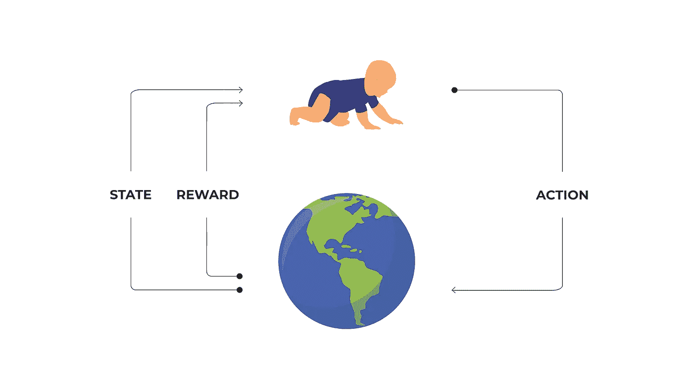

# 强化学习、大脑和心理学:导论

> 原文：<https://towardsdatascience.com/reinforcement-learning-brain-and-psychology-part-1-introduction-b5f79a0475ab?source=collection_archive---------21----------------------->

## 强化学习、人工智能和人类

## 强化学习与人类联系系列介绍。

> "甚至在天气预报中也能找到灵感。"

人脑可能是世界上最复杂的系统之一，因此它是任何人工智能研究人员的灵感源泉。几十年来，强化学习不仅从自然中，也从我们自己的心理学中借鉴思想，在技术和人类之间架起了一座桥梁。

在这些系列中，我们将深入探究是什么激发了 RL 领域的发展，以及是什么在未来引发了它的发展。

本主题分为 9 个部分:

1.  第一部分:引言。
2.  第 2 部分:古典和仪器条件反射。
3.  第 3 部分:延迟强化、认知地图和行为。
4.  第 4 部分:神经科学基础 1。
5.  第 5 部分:神经科学基础 2。
6.  第六部分:多巴胺。
7.  第七部分:演员-评论家。
8.  第八部分:上瘾。
9.  第九部分:边境。

在本系列中，我们不打算研究 RL 本身，假设您已经对它有所了解。希望会有另一个系列，这将是 RL 的重点，将涵盖一切从动态编程开始，并以复杂的事情结束，如 AlphaZero。

这里所有的想法都来自不同的来源，包括我自己的经历和对这个话题的思考。但我必须强调我最推崇的来源，也是我获取最多知识的来源——理查德·萨顿和安德鲁·巴尔托的“强化学习:简介”。这是少数几本关于 RL 的书之一，也是唯一一本涵盖了 RL 基础和起源的书。

在这篇文章中，我们将使用一些真实世界的例子来介绍 RL 的基础知识，因为这个系列不是关于数学、神经网络或编程的。它更多的是关于理解我们自己的思想和我们可以应用于人工智能的事物。

> "在我们了解我们的大脑如何工作之前，我们很可能会建造 AGI . "

# 强化学习

RL 关键概念对我们来说非常简单，因为我们看到它并将其应用于我们生活的几乎每个方面。一个初学走路的小孩就是一个例子。

你可能在每个 RL 课程中都看到过类似的图片，这里没有什么新的东西，但它给了我们一个想法。

一个蹒跚学步的小孩坐在地板上(这是他目前的*状态*做出一个*动作*，a 试图站起来，在这个*之后得到一个*奖励*。*三个字就是强化学习。

蹒跚学步的孩子不知道如何走路，但他通过反复试验来学习。当他跌倒时，环境会给予他疼痛的反馈，当他迈出一步时，环境会给予他一个充满爱心的母亲的拥抱。这听起来熟悉吗？是的，这就是许多人所知的正负强化，或者更一般的说法**操作性条件反射**。例如，当我们教狗叫或打滚时，我们也会用到它。

# RL 的关键词

***代理*** 是许多人所说的人工智能，但它基本上是在*环境中运行的算法的化身。一个人、一只狗或一个蹒跚学步的孩子都可能是一个代理人。
***环境*** 是围绕*代理*的东西，也是*代理*从*那里拿*奖励的东西。比如我们周围的世界或者你玩的一个游戏。
***政策*** 是逻辑、道德和大脑的*代理*。它给了代理人一个洞察力，告诉他为了成功应该做什么。更专业地说，它试图预测在某种给定情况下代理人行动的结果。
***奖励*** 是*代理*做某事时得到的。这可能是积极的，也可能是消极的，取决于*代理*的表现。给打滚的狗一块饼干是积极*奖励*的一个例子，而你的教练的一声怒吼是消极*奖励*的一个例子。
***状态*** 是*代理*进入的一种情况。它是你所拥有的信息的某种表现，比如你有多少钱，你住的离工作的地方有多远，你有多懒。*代理*根据*状态*决定做什么。*

因此，基本上 RL 研究人员所做的是试图创建这样一个*智能体*(就 RL 而言，我们的幼儿是一个*智能体*)，它将在*环境*(例如幼儿的世界)中运行，并能够理解在给定情况下什么是最佳举措。回到蹒跚学步的例子，他应该如何摆放他的身体以保持平衡并迈步。

# 是什么让我们这些人与众不同

我们这些人和 RL *特工*不同的是，我们*环境*给的*奖励*并不是那么清晰易懂。事实上，我们在这个问题上有很多说法:*“每个人都有自己版本的真相”*，*“真相到底意味着什么？”*、*“善恶只在一个角度不同”*等。

简而言之，我们不知道哪些行为是好的，哪些是坏的。我们总是用一种经验主义的方式来解决这个问题，没有人能告诉你你做得有多好。很明显，我们有老师和父母帮助我们学习，但总的来说，我们在这个黑暗可怕的世界里是孤独的。没有人能告诉你我们的哪些行为会导致成功，哪些会导致失败。

# 外在和内在奖励

所以，就像我说的，与强化学习*代理*不同，我们无法从我们的*环境*中获得可解释的*奖励*，也称为 ***外在奖励*** ，但是我们有所谓的 ***内在奖励*** 。
从人类的角度来看， ***内在奖励*** 是自我激励、好奇心、完成目标的欲望，只是因为而没有任何理由。它就在我们内心的某个地方，它是一个火花，我们中的一些人会把它变成火。

当然，我们想出了给 RL *代理商*这种*奖励的办法。*例如，在 OpenAI 的这篇漂亮的论文中——[好奇心驱动学习的大规模研究](https://arxiv.org/pdf/1808.04355.pdf)——研究人员制作了一个对世界好奇的*智能体*。长话短说，当*代理*到达之前未被发现的位置时，它会得到*一份内在奖励*。结果是惊人的，*智能体*设法解决了 ***蒙特祖马的复仇*** ，这对于强化学习算法来说是极其复杂的，因为它的分层遍历(去拿钥匙，然后找到门，打开它等等。).

当然，有更多的技术解释为什么 ***蒙特祖马的复仇*** 如此难以解决，但它在本系列之外，需要更多关于强化学习算法的知识。

# **结论**

强化学习可能是通往 AGI 的道路，也可能不是。老实说，我不知道，可能也没人知道。我相信这是我们拥有的机器学习技术中最接近 AGI 的技术，但是我有什么资格去评判呢？

我可以肯定的是，RL 不断受到我们自身本性的影响，在这个系列中，我们将揭示我们大脑和思想中发生的事情，并发现人工智能领域从我们人类那里借鉴了什么。

*跟我连线上* [*推特*](https://twitter.com/poddiachyi) *，* [*领英*](https://www.linkedin.com/in/poddiachyi/) *，* [*脸书*](https://www.facebook.com/poddiachyi) *并关注上*[*GitHub*](https://github.com/Poddiachyi)*！*