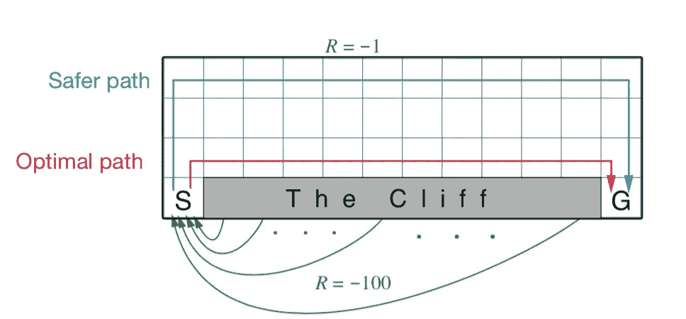

# 强化学习—悬崖行走实现

> 原文：<https://towardsdatascience.com/reinforcement-learning-cliff-walking-implementation-e40ce98418d4?source=collection_archive---------4----------------------->

## 开和关策略比较

强化学习的本质是代理通过试验迭代更新其状态估计、动作对的方式(如果您不熟悉值迭代，请查看我之前的[示例](/reinforcement-learning-implement-grid-world-from-scratch-c5963765ebff))。在以前的帖子中，我一直在重复谈论 Q-learning 以及代理如何基于这种方法更新其 Q 值。事实上，除了在 Q-learning 中定义的更新方法之外，还有更多其他方法来更新状态、动作对的估计。在这篇文章中，我们将一起探索另一种叫做 SARSA 的方法，将这种方法与 Q-learning 进行比较，看看更新方法的不同如何影响代理的行为。


先说**时差**，这是一个更新方法的核心。我们知道，在每次迭代或事件中，代理通过遵循策略(比如ϵ-greedy)采取行动来探索环境，并基于其最新观察(概括为状态-行动的值)，它通过将当前估计向最新观察调整一点来更新其当前估计，最新观察值和上次观察值之间的差异称为时间差异。正是从这个时间差中，我们的代理学习和更新自己。

时间差异的定义将各种方法区分开来。为了给你一个更具体的感觉，让我们直接进入算法定义，并检查不同之处。

## SARSA & Q-学习


SARSA(from Sutton’s book)


Q-learning(from Sutton’s book)

很明显，唯一的区别在于更新 Q 函数。在 SARSA 中(顺便说一下，SARSA 这个名字明确来自于代理的过程，即状态、动作、奖励、状态、动作…)，时间差异被定义为:

```
[R + Q(S', A') - Q(S, A)]
```

其中下一状态、动作对的观察 Q 值直接有助于当前状态的更新。 **SARSA 也称为 on-policy，因为更新过程与当前策略**一致。

然而，Q-learning 中定义的时间差异是:

```
[R + max_a(Q(S', a)) - Q(S, A)]
```

其中观察到的下一状态、动作对的 Q 值可能不会直接有助于当前状态的更新。**Q-learning 总是使用下一个状态的最大值，在这种情况下，更新 Q 值所采取的状态、动作可能与当前策略不一致，因此被称为非策略方法**。

*事实上，这种差异会导致代理的不同行为。直觉认为，Q-learning(非策略)在价值评估方面更乐观，它总是假设在过程中采取最佳行动，这可能导致代理人更大胆的行动。而 SARSA(非策略)在值估计上更保守，这导致代理的储蓄器动作。*

# 悬崖漫步

为了清楚地证明这一点，让我们来看一个例子，悬崖行走，它摘自 [*强化学习入门*](https://web.stanford.edu/class/psych209/Readings/SuttonBartoIPRLBook2ndEd.pdf) 。



Cliff Walking

这是一个标准的不打折扣的、偶发的任务，有开始和目标状态，以及引起向上、向下、向右和向左运动的常见动作。除了进入标有悬崖的区域外，所有转换的奖励都是-1。进入该区域将获得最佳路径 100 的奖励，并使代理立即返回起点。

# 履行

这是一个典型的二维棋盘游戏，所以棋盘设置与我在这里描述的例子基本相同。在接下来的章节中，我将主要强调 SARSA 和 Q-learning 的实现，以及这两种方法所产生的 agent 行为的比较。

## 悬崖背景

在坚果壳中，我们将有一个 Cliff 类，它代表能够:

1.  跟踪代理的当前位置
2.  给定一个动作，决定代理的下一个位置，并判断是否游戏结束
3.  给予反馈作为奖励

这些是课件中的主要功能。`nxtPosition`函数接受一个动作，并返回代理在棋盘上的下一个位置，如果代理将其头部撞到墙上(到达边界)，它将保持在同一位置。`giveReward`函数将奖励-1 赋予除悬崖区域之外的所有状态，悬崖区域的结果是奖励-100。

让我们看看我们实现的板。


Cliff Walk Board

代理人从棋盘左端的符号 **S** 开始，结束游戏的唯一方法是到达棋盘右端的符号 **G** 。而 ***** 代表悬崖区域。

## 博弈

就玩游戏而言，我们将有一个代理类来代表我们的代理，在代理类中，有一个函数决定代理的动作，这也是ϵ-greedy 策略。(点击查看完整实施

关键区别在于`play`功能:

在每一集(游戏的每一轮)中，我们在列表`self.states`中记录我们的代理的行动、状态和奖励。在游戏结束时，我们以相反的方式更新 Q 函数(T1)，如果方法是 SARSA(on-policy)，新更新的 `reward` **(本质上是** `Q(S', A')` **)将直接应用于下一次更新，如果方法是 Q-learning，还有一个步骤**

```
reward = np.max(list(self.state_actions[pos].values()))
```

**取该位置所有动作的最大值到下一轮更新**。最大化操作塑造了代理的行为，并使其能够采取更冒险的行动。

## 开/关策略比较

我用探索率为 0.1 的两种方法运行了 500 轮，并采用了他们学习的最后一个`(state, action)`。


Result of SARSA


Result of Q-learning

我学到的结果与书中的最优结果略有不同，但这足以清楚地看出两者之间的差异。

# 结论

结论第一部分将引用 Sutton 的书，该书完美地总结了两种方法之间的差异:

*Q-learning 学习沿着悬崖边缘行进的最优策略的值。不幸的是，这导致它偶尔会因为“ε-贪婪”的行动选择而掉下悬崖。另一方面，SARSA 将动作选择考虑在内，并通过网格的上部学习更长但更安全的路径。虽然 Q-learning 实际上是学习最优策略的值，但是它的在线性能比学习迂回策略的 SARSA 差。当然，如果ϵ逐渐减小，那么这两种方法都将渐近收敛于最优策略。*

最后，请点击查看完整代码[。欢迎您投稿，如果您有任何问题或建议，请在下面发表评论！](https://github.com/MJeremy2017/RL/blob/master/CliffWalking/cliffWalking.py)

**参考**

[1][http://incompleteideas.net/book/the-book-2nd.html](http://incompleteideas.net/book/the-book-2nd.html)