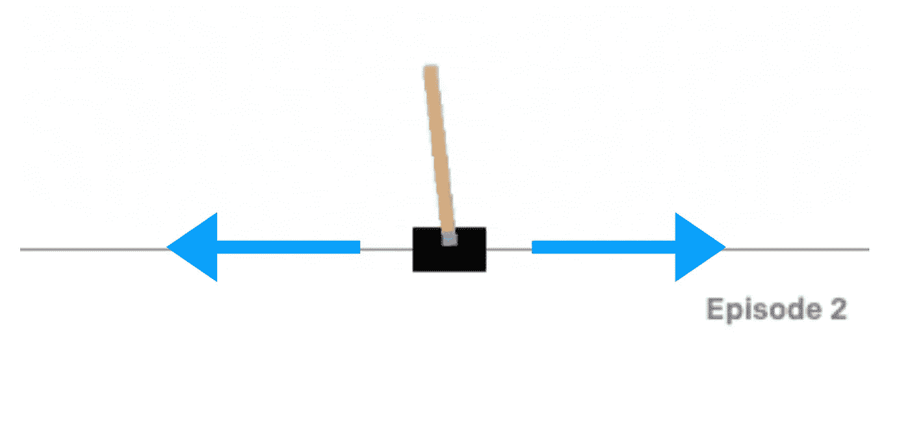
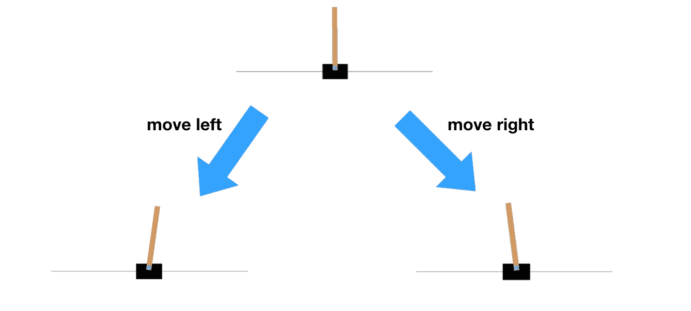
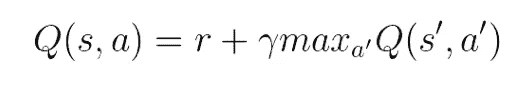
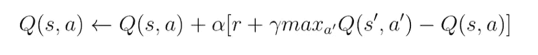
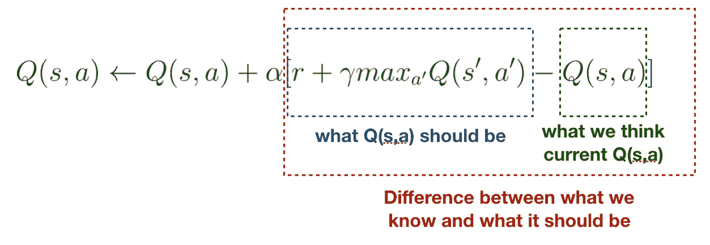
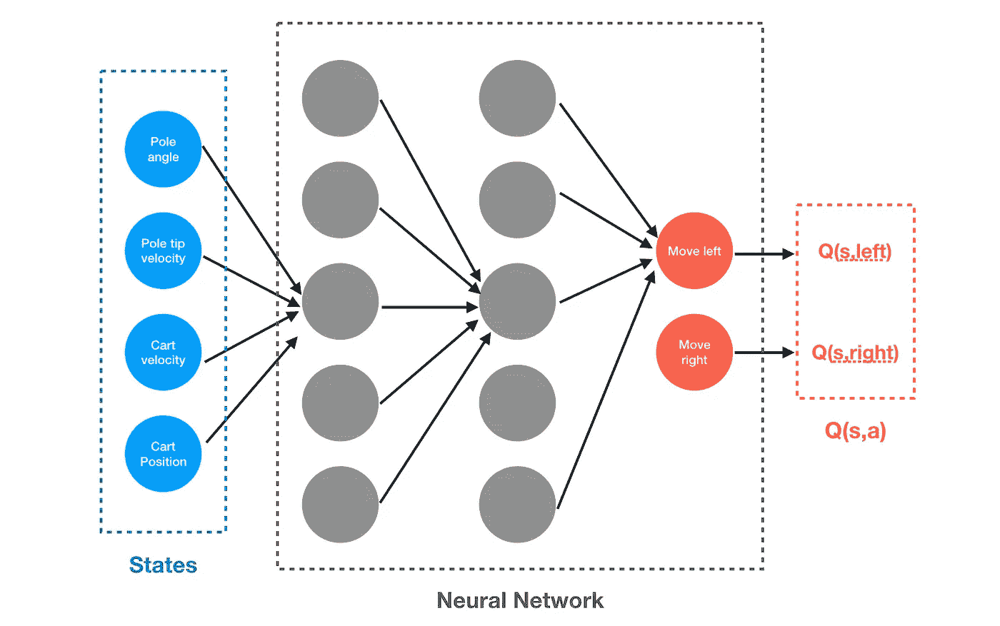
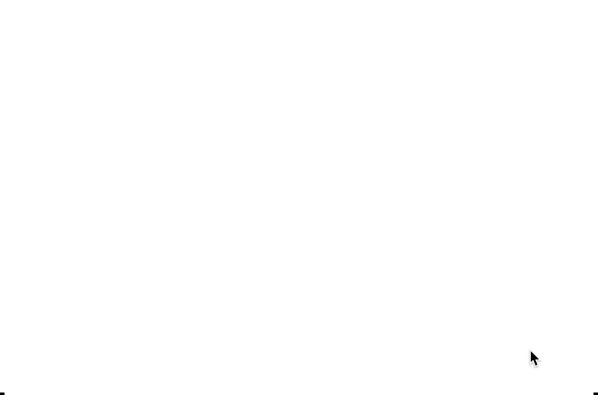

# 基于 DQN 的车杆强化学习概念

> 原文：<https://towardsdatascience.com/reinforcement-learning-concept-on-cart-pole-with-dqn-799105ca670?source=collection_archive---------6----------------------->

## 深度 Q-网络简介

CartPole，也称为[倒立摆](https://en.wikipedia.org/wiki/Inverted_pendulum)，是一种游戏，你要尽可能长时间地平衡杆子。据推测，在杆子的顶端，有一个物体使它不稳定，很可能摔倒。此任务的目标是左右移动手推车，以便杆子可以尽可能长时间站立(在某个角度内)。

Figure 1: We can move the cart ONLY to the left and right.

在这篇文章中，我们将看看强化学习，这是人工智能中的一个领域，人工智能通过多次玩游戏来探索环境，直到它学会正确的游戏方式。

(Figure 2) **Left**: start of the training. **Center:** After a few episode of training. **Right:** Agent fully trained

正如您在此处看到的，在培训开始时，代理不知道将推车移动到哪里。过了一会儿，代理向一个方向移动，但是，当然，不可能以这样的速度把杆子带到另一边。对于最后一个问题，代理知道平衡杆子的正确方法，即反复左右移动。

## 奖励

让我们试着多理解一下这个游戏。同样，目标是尽可能长时间地活着。你撑竿的时间越长，你得到的分数就越多。这个分数，也叫**奖励**，是我们给代理人的，用来知道它的动作好不好。基于此，代理将尝试优化并选择正确的操作。请注意，当杆子超过 12 度角或手推车飞出屏幕时，游戏结束。

但是代理如何知道杆子的当前状态呢？数据应该是什么样的？

## 州

车杆的当前状态(向左或向右倾斜)被称为**状态**。一个状态可以是当前帧(以像素为单位),也可以是能够表示推车杆的一些其他信息，例如，推车的速度和位置、杆的角度和尖端的杆速度。对于这篇文章，让我们假设购物车的状态是上面提到的 4 个属性。

根据我们采取的行动，它可以导致不同的其他状态。假设极点开始是直的，如果我们向左走，极点多半是向右走，这是一个新的状态。因此，在每个时间步中，我们所做的任何动作都会导致不同的状态。

Figure 3: When we move the cart to the left, the pole tends to fall to the right side, and vice versa for the other direction.

## q 学习

从上面的状态图可以看出，如果我们做了正确的决定，杆子不会倒，我们会得到奖励。换句话说，对于那些**状态和动作对**导致越来越进一步的状态也是**期望**得到一大笔奖励。因此，让我们称每个状态-动作对的期望回报为 Q 值，记为 *Q(s，a)* 。

在一个状态 *(s)* 期间，代理人采取了一个动作 *(a)* ，他们将立即获得该动作的奖励(如果游戏仍在进行，则为 1，否则为 0)。然而，早些时候我们提到我们想要考虑国家行动对的**潜在未来回报。让我们用下面的等式来正式考虑这种情况。**

Equation 1 : Idea behind Q-Learning

直觉上，我们想知道 *Q(s，a)* 如果我们处于 *(s)* 状态，做出 *(a)* 动作，我们能得到的预期回报是什么。通过做一个动作 *(a)* 得到一个奖励 *(r)* 后，我们会到达另一个状态*(s)*。然后，我们只需在 Q 表中查找，找到在状态*(s’)*下采取的最佳行动。所以，这里的想法是我们不需要考虑整个未来的行动，而只需要考虑下一个时间步的行动。伽马符号 *(γ)* 表示我们应该把多少注意力放在国家 s’的未来回报上。

在训练开始时，我们不知道任何状态-动作对的 Q 值。基于上面的等式，我们可以朝着最佳值的方向一点一点地改变 Q 值。

Equation 2 : Updating Q(s,a)

这个等式可能看起来有点可怕。别担心。我们将通过下图对其进行分解，看看这里发生了什么。

Figure 4: Breaking down equation 2

这里， *Q(s，a)* 会根据我们认为我们对 *Q(s，a)* 的了解和当前剧集告诉我们的 *Q(s，a)* (应该是什么)之间的差异进行更新。如果我们的 *Q(s，a)* 被高估，红色虚线框中的值将为负，我们将稍微降低 *Q(s，a)* 的值。否则，我们将增加 *Q(s，a)* 的值。我们对 *Q(s，a)* 的改变量取决于差值(红框)和学习速率(α)。

目前的 Q-Learning 有一个问题。那就是状态空间是巨大的。杆子角度或小车速度的每一个微小变化都代表一种新的状态。我们需要一个非常大的内存来存储所有可能的状态。对于这种手推车来说，处理这么多状态也许是可能的，但对于更复杂的游戏，如星际争霸 2 或 Dota 2，Q-Learning 本身不足以完成任务。

## 深度 Q 学习

为了解决这个问题，我们需要一些东西来近似一个函数，该函数接受一个状态-动作对 *(s，a)* ，并返回该对的预期回报。这就是深度学习的用武之地。它以仅根据训练数据逼近函数而闻名。请记住，我们不会在这篇文章中详细讨论神经网络。这将只是一个关于我们如何将深度学习与强化学习相结合的简介。

Figure 5: Incorporating network network in Q-Learning

假设我们想知道 *Q(s，a=right)* ，我们将环境的状态 *(s)* 输入到模型中。让神经网络进行计算，它将返回 2 个值。一个是向左移动时的预期回报，另一个是向右移动时的预期回报。由于我们对 *a=right* 感兴趣，我们将只从该输出的较低节点获取值。现在我们通过使用网络得到了 *Q(s，a)* 。

为了充分训练网络，损失函数是必不可少的。直观地说，在网络输出一个近似值 *Q(s，a)* 之前，我们已经知道这个值应该是什么(基于等式 2)。因此，我们可以惩罚网络所犯的错误，并让它通过反向传播来学习这个错误。

## 把它放在一起

现在我们已经讨论了状态、奖励、行动、Q-learning 和 DQN，特别是在这个车杆环境中。让我们看看 DQN 在杆位环境下的结果。

Figure 6: Playing cart-pole with DQN after fully trained

## 结论

这就是了。我们刚刚在一个推车杆子游戏中经历了 DQN 的概念。DQN 成功地应用于更多的游戏，尤其是雅达利游戏。它非常通用和健壮。所以，下次你心中有了一个环境，你可以直接插入 DQN，让它自己学习玩游戏。请记住，最近有许多其他深度强化学习技术可以更好更快地学习更复杂的游戏，如围棋或 Dota 2，但这是另一个时间的主题。

## 参考

1.  [https://arxiv.org/pdf/1312.5602.pdf](https://arxiv.org/pdf/1312.5602.pdf)
2.  [https://www . analyticsvidhya . com/blog/2019/04/introduction-deep-q-learning-python/](https://www.analyticsvidhya.com/blog/2019/04/introduction-deep-q-learning-python/)
3.  [https://web . Stanford . edu/class/psych 209/Readings/suttonbartoiprlbook 2 nded . pdf](https://web.stanford.edu/class/psych209/Readings/SuttonBartoIPRLBook2ndEd.pdf)
4.  [https://gym.openai.com/envs/CartPole-v1/](https://gym.openai.com/envs/CartPole-v1/)