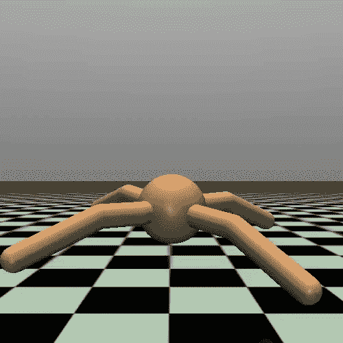
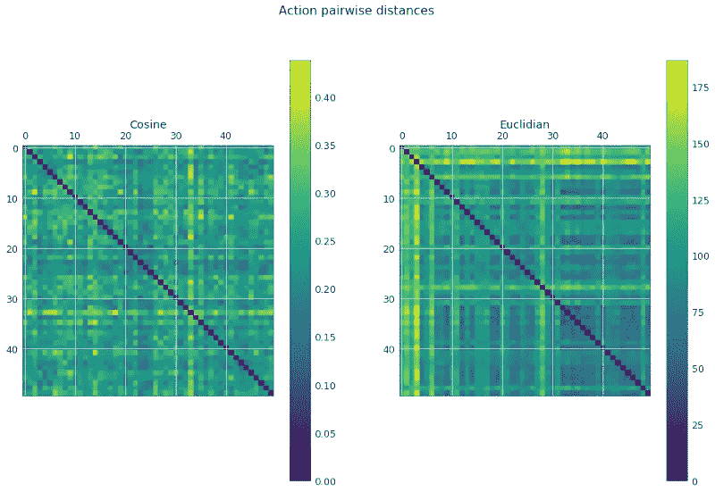
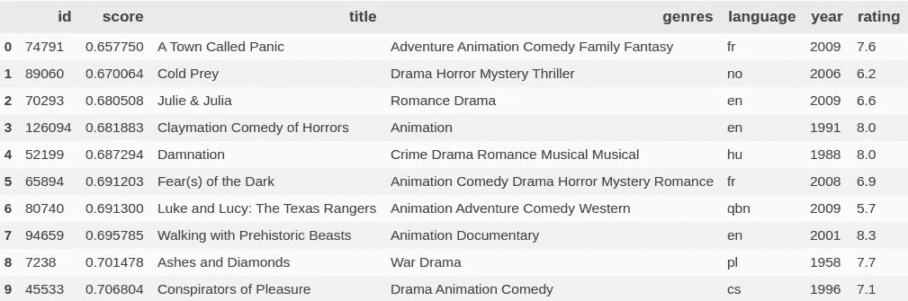

# 新闻推荐强化学习介绍(DDPG 和 TD3)

> 原文：<https://towardsdatascience.com/reinforcement-learning-ddpg-and-td3-for-news-recommendation-d3cddec26011?source=collection_archive---------2----------------------->

## 推荐系统暴露的深度学习方法


Photo by [Juliana Malta](https://unsplash.com/@julianamalta?utm_source=medium&utm_medium=referral) on [Unsplash](https://unsplash.com?utm_source=medium&utm_medium=referral)

> TL；DR:强化学习是推荐系统的理想框架，因为它具有马尔可夫性。状态是由用户分级的电影。动作是下一部要看的电影，奖励是它的评级。我用 DDPG/TD3 实现了这个想法。本文的主要部分涵盖了实现细节，讨论了 RL 的参数选择，介绍了动作评估的新概念，提出了优化器的选择(生命的拉达姆)，并分析了结果。
> 
> 我还发布了一个 ml20m 数据集版本，专门用于马尔可夫决策过程和 RL。

强化学习是一个相当难的话题。当我开始深入调查时，我意识到需要一个好的解释。**这篇文章，加上代码*是我的学校项目。*** 我目前是一名高二学生，我以一种更“社会研究”的方式理解难懂的数学概念。我希望这篇文章能对我这样的新人有所帮助。

我创建了一个 GitHub 项目，您可以克隆并跟随它！一定要去[看看。你可以在下载部分下载我在电脑上处理过的所有东西。以及常见问题解答、数据集描述、一些文档、操作指南等。它经常更新。因为在写这篇文章，一周没推了。希望你喜欢！](https://github.com/awarebayes/RecNN)[https://github.com/awarebayes/RecNN](https://github.com/awarebayes/RecNN)

本文提供了最流行的推荐方法的比较，以及对各种强化学习算法的深入研究，概述了每个可调整的参数以及更改它的后果。我还提出了评估深度学习推荐器的替代方法，并讨论了该应用程序的不同优化器。这也是我的遗产，因为我高中的最后一年就要到了，所以我没有足够的时间来完成它。如果你有兴趣支持这个项目，欢迎你的贡献！


# 内容

## 介绍

## 一个伟大的优化故事

*   静态与动态时间序列数据集
*   为什么您应该选择 HDF5
*   编码时间序列

## 新闻推荐方法

*   相似性搜索
*   矩阵分解
*   受限玻尔兹曼机器
*   因式分解机器
*   强化学习
*   方法比较

## 嵌入概述

*   深度学习中的信息论
*   信息平面定理
*   为什么嵌入=“瓶颈特性”有意义

## 马尔可夫材料概述

*   马尔可夫性质、链、游戏和决策
*   回报与价值
*   连续状态马尔可夫过程

# 非政策方法:

## DDPG:深度确定性政策梯度

*   简单的解释
*   高级解释
*   用代码实现
*   为什么它不起作用
*   优化器选择
*   结果

## TD3:双延迟 DDPG

*   说明
*   履行
*   结果

## 结论

## 政策上的方法:(下一篇文章……)

*   PPO:最接近的策略优化
*   盖尔:生成性对抗模仿学习

## 无探索的非策略深度强化学习。)

# 介绍

## 这篇文章花了这么长时间来写有几个原因。

首先，因为数据集是动态的令人沮丧。当我开始构建原型时，仅仅一次迭代就要花费 40 多个小时。随着基本熊猫和优化的完成，它缩小到 1.5。当我实现动态数据集时，需要 10 分钟。如果你用状态表示法对状态进行编码，结果是 3。此外，我不能让 DDPG 工作，它增加了相当多的影响。因此，我最终使用了一个静态时间序列数据集+ TD3。不过，以后再说吧。

然而，最重要的是，大多数关于 TDS 的文章都是付费的。因此，没有优质的文章，没有 Patreon，没有钱乞讨。你可以多次点击这篇文章(请点击左上角的按钮)，然后进入 [GitHub 页面](https://github.com/awarebayes/RecNN)开始回购。

**这是我的学校项目，主演，对我来说是必不可少的。这也会给我赢得项目竞赛的更好机会，甚至可能减少大学的付款。**

# 时间序列的提示和技巧

## 完全避开熊猫！

正如你所看到的，pandas 是可以优化的，但最终，它的运行成本仍然很高，因为即使是我最好的优化也不能很好地扩展。x 轴代表 10 的幂。y 轴是花费的时间(秒)。此外，深度学习的问题是，我们经常在同一个数据集上反复运行模型。因此，让我们的数据集完全静态，消除所有熊猫的互动是完全有意义的。让我们运行数据集生成器并保存结果。如果你已经找到了我的回购协议，并继续跟进，笔记本位于 notes/1 下。香草 RL/ [1。生成静态 dataset.ipynb](https://github.com/awarebayes/RecNN/blob/master/notes/1.%20Generating%20the%20static%20dataset.ipynb) 。注意:完全是强制的；你可以下载我生成的数据集。


Scaling for different approaches

## 以 HDF5 格式存储您的数据！

有时时间序列不能完全输入你的内存。此外，HDF5 格式也是专门为此开发的。尽可能使用它，因为它比 PyTorch 快得多，并且自带 numpy 支持。唯一的限制是你的固态硬盘，所以你可能想买一个 PCI Express 的快速读取。

## 编码尺寸！

如果您使用静态大小的时间序列(也称为“滚动”ts)，请确保将数据编码到较低的维度中。对于经典的 ML 方法，我们有主成分分析或简称 PCA。如果这对你来说是一个新单词，这里有一段视频。

您也可以使用 LSTM 自动编码器动态长度时间序列。从我的实验中，我注意到线性 AEs 对于滚动 ts 表现不佳。然而，我使用国家代表作为论文的作者提出。DL 的规则#1337 指出，90%的实际学习发生在前 10 分钟。所以我运行 TD3 模型，并使用它的状态表示模块来编码 ts。

# 新闻推荐方法

当我第一次开始钻研这些东西时，我意识到甚至连基本的推荐技巧都没有全面的指南。我最近发现了受限玻尔兹曼机器。本节旨在解决这个问题。我试图概述一些最流行的，并做一个快速的比较。更多的分析结果，请看下面的迷因。

## 相似性搜索

SS 是最容易理解的概念。只需在用户中寻找喜欢或不喜欢的类似电影。状态(被分级的电影)通常被表示为度量空间。有几种方法可以从原始电影索引中对其进行编码。第一个是使用嵌入层，这是现代 DL 应用程序中的常见情况。然后使用余弦或欧几里德距离等相似性度量对它们进行良好的排序。然而，回头看看更经典的 ML 方法，我们有局部敏感散列法。LSH 是一种算法技术，它以很高的概率将相似的输入项散列到相同的“桶”中。无论哪种方式，我们最终都会得到一堆与我们预测的状态相似的排序状态。然后我们看用户喜欢/不喜欢的电影并推荐它们。如果你想用这个方法，建议你去看看[脸书的 Faiss](https://code.fb.com/data-infrastructure/faiss-a-library-for-efficient-similarity-search/) 库: [GitHub 链接。](https://github.com/facebookresearch/faiss)


## 矩阵分解

分解矩阵的思想，即把一个大矩阵分解成多个小矩阵的乘积，进一步扩展了相似性搜索。这个大矩阵可以表示为一个表格，行是电影，列是用户，值是收视率。我们通过假设大矩阵可以表示为两个较小矩阵的点积来扩展这个想法。它们代表隐藏(嵌入)表示。使用 PyTorch 可以轻松实现该过程:

```
user_matrix = user_embedding(users)
film_matrix = film_embedding(films)
ratings = (user_matrix * film_matrix).sum(1)loss = MeanSquares(ratings, target_ratings)
loss.backward()
```


“Users”是 userId 的整数向量。“Films”是 film_id 的整数向量。用户和电影矩阵是相应索引的 2D 嵌入。我们计算点积，因为我们想知道评级。您可能已经注意到，由于使用了嵌入，这种方法非常有限。你不能添加新的电影/用户到现有的电影/用户中，除非你使用类似增量 SGN 或水库计算的东西。只是上面方法的一篇很好的综述文章:[链接](https://medium.com/explorations-in-language-and-learning/online-learning-of-word-embeddings-7c2889c99704)。另外，如果你想深入了解 MF，我强烈推荐这个由 [Luis Serrano](https://www.youtube.com/channel/UCgBncpylJ1kiVaPyP-PZauQ) 制作的视频。

## 受限玻尔兹曼机器

RBS 是自动编码器的早期变体。它属于基于能量的方法。作为自动编码器，用于降维。命名的受限部分意味着没有层间传播。该架构看起来像一个普通的两层线性网络。正向传球看起来很像前馈网络。

关键的区别在于 RBM 是概率性的。他们用贝叶斯方法工作。每当你试图计算网络的状态，也就是说，从这些权重和偏差分布的样本，你会遇到玻尔兹曼方程。这是粒子物理学中的一个方程。该模型的学习包括两个主要步骤:Gibbs 抽样和对比发散。

我从吴恩达对杰佛瑞·辛顿的采访中发现了这些机器。当被问及他最大的成就时，后者承认了他对 RBMs 训练算法的贡献。提醒一下:G.H .是一个支持反向传播的人。事实上，RBM 在网飞竞赛中取得了最高水平的成绩。如果你想了解更多基于能源的模型:这里有 [Yann LeCun 的笔记](http://yann.lecun.com/exdb/publis/pdf/lecun-06.pdf)。


RBM structure

## 因式分解机(非个性化)

因数分解机器已经被证明对点击率预测非常有用。它们的速度允许它们高度可伸缩，但是它们只适用于具有分类特征的数据。然而，它们值得大声疾呼。我们需要以某种方式将特征数据合并到我们的因子分解过程中。当然，我们可以认为一个特性就足够了:

```
ratings = linear(features.size(1), 1)loss = MeanSquares(ratings, target_ratings)
loss.backward()
```


如您所见，它们不能用于个性化推荐！

然而，考虑特征的标签-标签互相关是很酷的。我们刚刚学习了**订单**的概念。阶数是计算互相关的要素数。假设阶数为 2，我们需要计算两个特性的 CC。然而，这个特征是一个分类变量，那么如何计算两只猫的点积呢？更多的潜变量给了潜变量之神！可以使用向量来描述特征标签，并且可以使用我们用于矩阵分解的相同嵌入思想来回归这些向量。

```
ratings = linear(features.size(1), 1)(features)# factorization machine
latent = latent_embeddings(features)
latent_gram = latent * latent.T
features_gram = features * features.T
ratings += (latent_gram * features_gram).sum(1)loss = MeanSquares(ratings, target_ratings)
loss.backward()
```


这里有一篇文章帮助我更好地理解了这个概念:[链接](https://www.analyticsvidhya.com/blog/2018/01/factorization-machines/)。

## 强化学习

使用 RL 进行新闻推荐的关键优势是马尔可夫性质和状态表示。因为我们不依赖任何嵌入，所以我们可以向任何用户推荐任何电影。为此应用程序生成的电影嵌入不依赖于嵌入层。我使用了简单的统计数据，如平均评级、收入、文本的 TF-IDF、流派等。… + PCA。因此，您可以添加新电影进行推荐，而无需重新训练网络。或者，您可以使用这些新的嵌入来表示状态。马尔可夫性保证了我们可以使用静态长度的时间序列。稍后详细介绍。

# 比较

> 警告:讽刺


Reinforcement Learning


Restricted Boltzmann Machines


Matrix Factorization

> 综上所述:RL 允许在任何规模的迷你批次上学习，静态长度时间序列的输入，不依赖于静态嵌入，在客户端工作，可用于迁移学习，具有可调的对抗率(在 TD3 中)，支持集成，工作速度比 MF 快，并保留马尔可夫属性。最重要的权衡是准确性:像网飞/亚马逊这样的大公司仍然依赖 MF/RBM。

# 解释嵌入

与 Q-Learning 不同，这个特殊的应用旨在解决连续控制问题。在 Q-Learning 状态下往往是连续的，但动作本身是离散的。然而在我们的例子中，动作(=电影)不是离散的，而是一个向量。

但是我们如何得到这个向量，我们以后会尝试回归这个向量？上次我检查 ML20M 数据集时，没有找到任何向量。答案很简单:我自己生成了这些数字索引电影的矢量表示。大多数东西都是琐碎的:我解析了 IMDB/TMDB 数据，并应用了基本的统计数据来制作收集到的数据的向量(通过对类别进行编码，使用 TF-IDF，应用 PCA ),但我使用的最重要的东西之一是用于文本数据嵌入的 Google 的 BERT。我知道，嵌入在技术上是一个不同的东西，这些被称为“瓶颈特性”，但我将坚持这个词。


然而，为什么神经网络的一些中间层有意义呢？为什么可以将这些数据用作上下文信息？这些问题都可以在信息论领域找到答案。这在数字图书馆的背景下并不普遍，但是 Naftali Tishby 关于“保留信息的最大化”和其他关于为什么网络学习的提示的讲座很有意思。我推荐你看看这些！

一些亮点:

*   [00:19:00](https://www.youtube.com/watch?v=XL07WEc2TRI&t=1140s) 信息平面定理——对于一个相当大的典型 X，DNN 的样本复杂度完全由最后一个隐层的互编码器信息 I(X，T)决定；解码器信息确定前一隐藏层的精度(泛化误差)，I(T，Y)。这个现象就是我在这个 app 里用的东西。你可以在 00:23 看到这个现象的可视化。
*   【https://www.youtube.com/watch?v=pFWiauHOFpY 

# 马尔可夫材料概述

既然我们已经让我们的数据集工作了，理解了我如何将电影 id 转换成上下文向量，现在是时候回顾一些关于强化学习和博弈论的事情了。如果你阅读关于 DL/RL 的 Arxiv 论文，很容易看到基础知识被整理出来。

新闻推荐可以被认为是一个我们正在努力赢得的游戏。我们基于状态采取行动，而状态就是我们对用户的了解:收视率和观看的电影。动作是基于状态产生的，并描述空间中的一个点。

## 马尔可夫性质

从现在开始一切都严格遵守马尔可夫性质。引用维基百科:“如果一个随机过程的未来状态的条件概率分布(取决于过去和现在的状态)只取决于现在的状态，而不取决于之前的事件序列，那么这个随机过程就具有马尔可夫性质。”你可能会问，我为什么要在乎？我们假设我们只能基于当前状态采取行动，而忽略之前发生的任何事情。记住这一点，问题就变得更容易解决，因为我们不必担心过去。马尔可夫方法提供了一个框架，让你可以专注于当下发生的事情。

## 马尔可夫链

你也听过这个名字，因为 DeepMind 的 AlphaGo 用的是马尔可夫链蒙特卡罗。蒙特卡洛部分仅用于国际象棋或围棋等有限状态游戏。但是，马尔可夫链无处不在！为了简单起见，让我们考虑一个离散状态。我们还假设推荐是一个随机过程，这意味着我们随机遍历数据集。像任何其他物理链一样，马尔可夫链由称为节点的“循环”组成。每个节点都有一个条件转移概率。想象一下，这是一个随机的图遍历，当前访问的每个节点都有概率决定下一个访问哪个相邻节点。这里有一篇[短文](/introduction-to-markov-chains-50da3645a50d)，有 19k 个赞，详细介绍。酷的事情是，它保留了马尔可夫属性:转移只取决于当前状态，即被访问的节点。


## 马尔可夫决策过程

马尔可夫链的思想可以进一步应用到我们的‘游戏’中。我们希望在我们的应用程序中使用 Markov 框架，因为它非常方便。然而，你如何将一个抽象的链条应用到状态-行动-回报-状态-行动…过程中呢？还记得我介绍的图表示例吗？马尔可夫决策过程也可以解释为一个图。我们假设我们当前的**状态**是图中的某个节点。因为它保留了确切的属性，所以我们不需要知道在到达那个**状态**(节点)之前发生了什么。从那个节点开始，有大量的**动作**可以以指定的概率被采取。这些**动作**可以被解释为将我们带到**新状态**的相邻边。当我们到达新状态时，我们会立即收到一个**奖励。**数据集中还有一件事用于 TD — **Done** 因为我们不想在最后一步之外传播时间差异。虽然，稍后会详细介绍。


States are green, actions are red, and the rewards are yellow

> 我构建的数据集由 State-Action-Reward-Next _ State-Done 值组成。GitHub 上有一个[例子](https://github.com/awarebayes/RecNN/blob/master/readme.md#how-to-use-static-movielens-dataset-in-your-project)

## 连续状态马尔可夫过程

要完全理解正在发生的事情，最后一件事是行动不是离散的。我已经提到过几次，这个动作是一个矢量。我可以理解如何基于一个离散的数字在图形中移动，但是你用一个向量去哪里呢？所以不要把 MDP 想象成图形，而是一个 N 维的平面。为了简单起见，我将使用 2D 飞机作为例子。让我们考虑一个蚂蚁代理在操场上移动。此刻他知道他可能需要带一些树叶到它的房子里。唯一的问题是它的大脑中没有这种离散的“硬编码”动作。因此，它需要在环境中采取连续的步骤:移动它的四肢，咬紧它的下巴，躲避邪恶的蚂蚁。每走一步，奖励就会增加。它可能会意识到树叶就在附近的某个地方，而且方向是正确的。另一个重要的区别是我们假设时间步长是离散的。只有当我们知道一定数量的电影和用户指定的分级时，推荐才是可能的。考虑到 5.6 的电影和 1.3 的收视率，试图提出一些建议是很奇怪的。



如果你看一下上面的“连续行动与离散行动”的例子，就会发现有一个多智能体。它将肢体位置和角速度作为输入来提供环境。事实上，还有很多有趣的代理可以摆弄，如猎豹和波士顿动力公司的机器人模型。

.

.

.

## 价值功能与奖励

这一部分对于理解时间差异损失是必不可少的，这将在稍后讨论。在马尔可夫博弈中，我们有价值函数这种东西。所以价值函数**并不意味着**是一个估计回报的函数。价值只能表示行动对当前状态有多好。尽管，正如你将会看到的，它并不一定意味着对那个行为和状态的“给我奖赏”。它是一种更抽象的‘好’的度量，可以表示为一个连续的实值函数。函数的范围可以是任何实数。因此，该值不是[-5，5]中的整数。

# 第 1 部分:深度学习

现在，让我们暂时忘记我们学过的所有马尔可夫理论，试着从一个基本的 DL 方法开始。所以你决定建立一个基于深度学习的推荐系统，已经了解马尔可夫决策过程和数据集结构，总体上非常渴望直接投入行动。让我们尝试一种更基本的方法，暂时不用强化学习。你所拥有的只是一个简单的线性感知器和数据集:一堆状态、相应的动作和对这些动作的奖励。翻译成更人性化的语言:观看的电影，用户选择的下一部电影及其评级。我希望你继续**思考**你会用这些工具做些什么。

我们想推荐好电影；因此，我们训练网络来生成像动作这样的电影:

```
generated_action = model(state)
if is_good(reward):
 loss = MeanSquares(generated_action, action)
 loss.backward()
```

这种方法被称为“政策学习”，因为我们学习的是政策，是行动。它有它的应用，但是在端点上，PL 是非常有限的。如果你像这样训练一个网络，它会工作得很好，而且有点用。不过，你注意到‘is _ good’功能了吗？我们只学习“好”的行为，而不考虑其他任何事情。


Rewards distribution

## 第二部分:行动和批评

到目前为止，我们一直把奖励作为我们“学习”的标准。然而，分析动作不是更明智吗？这是演员-评论家方法背后的主要思想。为了清楚起见，让我介绍一下网络的命名。我们已经考虑过的网络叫做 Actor，它基于状态来行动。试图根据状态和行动者的行动来预测报酬的网络称为 critical。我们都知道，从看鲍勃·罗斯:每个人都需要一个朋友。所以让我们给我们孤独的演员增加一个人来嘲笑他的行为。

```
#teach the critic
generated_reward = critic(state, action)
reward_loss = MeanSquares(generated_reward, reward)
reward_loss.backward()# teach the actor
generated_action = actor(state)
value = critic(state, generated_action)if value > 0:
 # learn the action
 action_loss = MeanSquares(generated_action, action) # learn action
 action_loss.backward()
```

最终，行动者会采取更好的行动(也许是也许)，损失会收敛到零。然而，从那以后，我们在乍得 Pytorch 工作；我们可以在亏损的情况下做一些奇怪的事情，而不用担心反向传播！如果我们想直接使用评论家对演员产生的行为的奖励作为损失度量呢？Pytorch 让一切变得前所未有的简单！

```
#teach the critic
generated_reward = critic(state, action)
reward_loss = MeanSquares(generated_reward, reward)
reward_loss.backward()# teach the actor
generated_action = actor(state)
action_loss = -critic(state, generated_action)
action_loss.backward()
```

我们在这里做的是，我们用批评家作为我们的损失函数！从一开始就是这么打算的。注意标准前的减号。我们希望回报最大化。尽管如此，在机器学习中没有“最大化”这样的东西。我们经常反其道而行之:将负面因素最小化。

这就是 DDPG 算法。不过，如果你看报纸，评论家培训的代码会有所不同。这就是我们接下来要讨论的内容。

# 第 3 部分:实现时间差异

我们的评论家有问题。我们不需要估计回报。让我们引导动作的值。你为什么会问？答案很简单:未来的回报可能取决于当前的行动。将动作视为单个马尔可夫链步骤，我们希望最大化价值。什么是价值？

> Markov 游戏环境中的 Value 是一个实值函数:V(state，action ),它表示(不是用整数奖励来表示——5 到 5，可以是任何实数)特定的操作对于相应的状态有多合适。

这就是我们需要把马尔可夫链带回来的地方。在这个特定的应用中，我使用 TD(1)版本的算法，这意味着我提前 1 步引导值。可以实现 TD(n)，但是值迭代的次数是线性增加的。

为了学习价值函数，我们引导奖励和下一个状态和文本动作的值。你可以在这里阅读更多关于 TD [的内容。](https://www.analyticsvidhya.com/blog/2019/03/reinforcement-learning-temporal-difference-learning/)

```
# train the actor
next_action = actor(state)
action_loss = -critic(state, next_action)
action_loss.backward()
reward_loss.backward()# train the critic
next_value= critic(next_state, next_action )
expected_value = reward + next_value
value = value_net(state, action)
value_loss = MeanSquares(value, expected_value))
```

# 第四部分:你是在抄袭我吗？

要完全理解 DDPG，你只需要做最后一件事。它使用了目标和学习网络的概念。目标网络比学习网络更稳定，因为它通过软更新使用学习参数来更新。它显示出较少的过度拟合趋势，总体表现更好。此外，TD 损失略有调整。我们不需要为残局动作引导值。伽马参数服务于稳定性，我把它设置为 0.9 左右。

```
# train the actor
action_loss = -critic(state, actor(state))
action_loss.backward()# train the critic
next_action = target_actor(state)
target_value= target_critic(next_state, next_action )
expected_value = reward + (1 — done) * gamma * next_value
value = value_net(state, action)
value_loss = MeanSquares(value, expected_value))
value_loss.backward()# soft update
def soft_update(*networks, soft_tau=1e-2):
 for target, learning in networks.parameters():
 target= target.data * (1.0 — soft_tau) + learning .data * soft_tausoft_update(actor, target_actor)
soft_update(critic, target critic)
```

这是我使用的更新功能的实际截图


> 这就是 DDPG 的基本情况。

# 解释结果

在下一节中，我们将尝试比较并主要评估不同的强化学习算法。但是我们如何判断结果是好是坏呢？批评家网络为我们的行为赋予价值；但是，你确定这个值是否有意义。嗯，他们是基于评论家的损失。如果批评者的损失很小，而政策损失是合理的，我们就教演员。但是这些指标还不够。我也考虑动作的欧几里德距离和余弦距离。矩阵通常代表这一点。你可以看到用不同颜色的单个网格描述的距离。天气越暖和，距离就越大。例如，下面是**真实的**动作(我用统计嵌入产生的那些动作)看起来是什么样子。


Pairwise distances example

稍后，您将看到类似的培训和测试行动矩阵。另一种评估动作“人为性”的方法是使用自动编码器重建误差。我训练自动编码器模型来重构嵌入动作。重建误差被用作人为度量。这种技术被广泛用于异常检测，因为它是无监督的。此外，我对误差分布进行了核密度估计，以便进行漂亮的绘图和视觉比较。也可以暗示 Wasserstein 距离或 KL 散度。


An example of reconstruction error KDE

目标是使生成的测试分布接近真实的分布。生成的列车(或刚刚生成的列车)可以是不同的形式。

# DDPG:深入观察


DDPG Training


GENERATED Actions


REAL actions

> 在这一点上，我所做的只是复制粘贴 Higgsfield 的 RL 冒险代码，并做了一些小的调整，以适应 torch 1.1

看起来我们有发现了！矩阵看起来很酷？一些相关性正在显现…损失在下降…等等，说一下比例尺上是什么？为什么我几乎没有余弦距离？为什么保单亏损会落入幽冥境界？为什么我的宠物人工智能不能正常工作？

> 这才是 RL 真正的快乐！

无数事情都可能出错！也许我应该玩玩**学习率**？诚然，这是熟悉 DL 的人首先想到的。然而，为什么我的错误首先在增长呢？我在 DL 里没遇到过这些事… WTF 正在跟 v 网优化发生关系，PyTorch？当过程开始时，它似乎没有太大的影响，但随后梯度爆炸，一切都被遗忘了…所以，很可能，学习率是非常好的。也许那是因为时差自举？但 TDB 不仅使用通过**软 tau、**TD 软更新的目标值网络，它还利用一个称为 **gamma** 的参数对未来预期进行加权。

```
P_gamma = 0.9
P_min_value=-5
P_max_value=5
P_soft_tau=1e-2
P_policy_lr = 1e-5
P_value_lr = 1e-6
P_actor_init_w = 3e-4
P_critic_init_w = 3e-4
```

我该怎么做？也许我设置了错误的参数来剪裁值:

```
expected_value = torch.clamp(expected_value, min_value, max_value)
```

## 让 DDPG 明白

有一件事让我迷惑不解，那就是“重量限制”的工作原理与人们的预期略有不同。如果我们用较小的数字初始化网络的最后一层的权重，它将生成较小的向量。不对！它的作用正好相反。所以这是余弦距离与实际作用的分布相比如此之短的主要原因。但是，对于欧几里得来说，似乎没有太大的影响。

此外，您是否注意到值裁剪的最小和最大参数分别是最小和最大奖励？这也需要改变，正如我在马尔科夫财产中提到的。我设置为奖励* n_td_steps。这很好，最后，损失很少低于 6-7。

> 你可能没有意识到，但是一个较小的批评家学习率会导致演员过度适应。如果政策损失下降得非常快，改变 LR，因为参与者过度适应了。记住:不是最直观的东西！

始终调试并跟踪以下参数:value、target_value (mean，std)、expected_value (mean，std)、generated_action(余弦距离、Gramian、方差、std、means、samples KL 到原始分布的距离)。总是在测试结束时绘制这些指标。

```
P_critic_init_w=3e-5
P_actor_init_w=3e-1
P_min_value=-10 # or -100
P_max_value=10  # or  100
```

我们解决了一个不工作网络的 RL 部分，现在损耗增长的原因完全是 DL。这里有一些给你的建议:

1.  和优化者一起玩。有这么多是有原因的。从 Adam 开始，试试 Hinton 的 RMS prop，纯 SGD，带温重启的 SGD 和 CosineAnnealingLR。虽然，如果你不在乎，有一个整洁的新算法供你尝试！它叫 RAdam: [GitHub link](https://github.com/LiyuanLucasLiu/RAdam) 。我尽可能使用它，因为它减少了要优化的参数数量。后面会解释。
2.  极其小心地使用 grad_clip。在价值网络上使用它会改变价值函数的符号。我不明白为什么会这样。但是政策似乎运作良好。我花了将近一周的时间才弄明白。不，是真的。
3.  重量衰减对于避免过度拟合至关重要。此外，它很容易与 Pytorch 优化器一起使用。将其设置为较小的值，爆炸渐变会在几秒钟内消失。此外，使用它与 grad 剪辑的演员。

这应该会让您/我的数据中的 DDPG 重现生机。

## DDPG 参数会改变什么:

*   价值网络学习率-影响生成的操作之间的欧氏距离。它还改进了余弦距离，但规模较小。仅适用于 SGD/Adam，对拉达姆无关紧要。



Value LR is too big: Euc is skyrocketing value LR is balanced

*   演员权重初始化-改变动作空间中余弦距离的多样性。如果您发现您的动作距离几乎没有变化，请从更改此参数开始。


Small Cosine distance as the result of lousy weight initialization

*   软 tau —负责目标网络更新。它影响应用于目标网络的损失函数的“过山车”的延迟。你可以看到这两种损失彼此相似。如果您运行代码，您将看到价值损失慢慢转化为策略损失。正如我所说，它影响了这种翻译的通顺性。如果某样东西对你不起作用，这是另一个需要考虑的关键参数，但是不要高估它。
*   γ—是时间差异中预期动作的权重。Imho 不那么重要。较小的值可能会导致梯度爆炸。
*   最小/最大值—我将它们设置为+- 10。你可以用另一个大数字做实验。或者，您可以使用 x*n_td_iterations，其中 x 是最小/最大可能回报。它使学习过程更加严格，但违背了价值函数的性质。或者，如果你根本不在乎过山车的损失，你可以使用 numpy infinity。该参数对值测试损失有积极影响。

> 总是看损失函数的尺度。该值应该在[0，10]之间，而策略在 TD 削波的最小/最大值范围内。如果涨到 10e7，你就是在浪费时间调试！

# 为什么优化器的选择很重要

我已经注意到了这一点，但我怎么强调都不为过。始终使用最先进的优化程序。每天查看 Arxiv，订阅 twitter bot 并保持警惕，因为机器学习社区现在正处于生产力的巅峰。

Adam 通常是优化的默认选择。此外，这种情况应该改变。亚当是你最糟糕的选择之一。为什么？它对学习速度非常敏感。回想一下学习率调度程序:仔细记住将里程碑放在哪个步骤，使用 CosineAnnealingLR 热重启 SGD，CyclicLR。以上所有的技术都已经成为过去——不要再摆弄学习速度了。就用 RAdam！自适应学习率的方差及超越！

RAdam 是 Adam 的意识形态扩展，它使用了一个叫做学习率热身的聪明绝招。不幸的是，拉达姆的作者没有受到足够的欢迎，所以没有详细的解释。你可以阅读他们的 [Axriv 论文](https://arxiv.org/abs/1908.03265)。


As in Figure 8, we assume gradients follow a normal distribution (mean: \mu, variance: 1). The variance of the adaptive learning rate is simulated and plotted in Figure 8 (blue curve). We can see that the adaptive learning rate has a significant variance in the early stage of training.

> 然而，我声称仅仅通过改变优化器，我就能够用 DDPG 算法达到 TD3 那样的性能。并且在两种情况下都有更少的过度拟合

## 让我们继续关注亚当，看看它的表现如何。

这是亚当损失的样子。人们不必是博士也能发现明显的值过度拟合。还有，你注意到保单损失了吗？它看起来出奇的小。最大奖励 5，最大 TD 削波 10。


火车动作似乎过拟合，没有太多的欧几里德距离显示出来，但好吧…


Adam train actions: looking good

损失在 7.5 似乎是合理的。是吗？好吧，让我们看看自动编码器重构误差。


and_that_was_the_moment_he_knew.png

只需查看 ae rec 误差分布和/或比较它们之间的各种指标，就可以发现问题所在。最愚蠢的选择是只计算 KL/w 距离。你也可以看看更有意义的统计指标，比如均值/标准差/峰度/偏斜度。


Adam test actions: oops! All overfit copies!

CosDist < 0.4，Euc < 3。无需言语。还有我的一个观察:余弦矩阵定义了向量方向的角度分布。你可以用基本的数学来形象化它。

哇，那是一些美好的回忆！我希望我能记住那么多。不幸的是，这不是倾斜。你可以直接跳到 inro TD3，这无疑会有助于过拟合，但让我们尝试使用 RAdam 代替。换 optim 就行了。当你定义优化器时，从 Adam 到 RAdam。

## 搬到拉达姆

所以我用 RAdam 运行了同样的代码，这就是事情的经过。


DDPG Radam Error


Radam train actions

首先，没有令人讨厌的价值过度拟合。而且，价值损失较少。与 Adam 相比，收敛要慢得多。在 400 左右，你可以看到一个明显的下降趋势。这里需要两倍的迭代次数才能注意到这个模式。还有，价值损失平滑多了。火车的动作在欧几里德距离上有更大的距离。余弦距离似乎在所有实验中都保持不变。好了，让我们看看测试动作:


RAdam test actions: As you can see, we gained three times as much Euclidian distance and 1.5x cosine

成绩不言自明！使用 RAdam 可以更好地近似测试分布，但是训练分布更加模糊。然而，我们只关心测试。


Radam results for the reconstruction error.

然而，RAdam 有一个缺点。很难用它来微调模型。如果让模型运行 RAdam，训练分布将很快收敛到真实分布。此外，测试发行版将在最右边像一个小松果。需要注意接近-5 的策略损失，或者手动停止学习。如果你不阻止它，就会发生这样的事:


RAdam overfitting

政策网络过度拟合:价值正在迅速下降。亚当的情况并非如此。


Value tends to deteriorate for some reason as we will find out in a moment that is due to overfitting.

## 结合两者

我的最终解决方案是结合这两个优化器。首先，我用 RAdam 学习，通过在过度拟合之前创建检查点，我确保我有一个出色的预热模型。然后我加载这些模型，用 Adam 训练它们，以获得更好的性能。不幸的是，没有自动化的空间:您找到最小的策略损失，并从最近的检查点开始。


它可以更好地表现训练版，但是测试版要差得多。但是这种微调方法对 TD3 算法更有用。我们正在切换到…现在！

> 附注:所有模型都可以在 github 页面上下载(包括原始的拉达姆和经过微调的亚当)

# TD3

TD3 代表双延迟 DDPG。三是论文作者提出的改进数量。正如我已经说过的，它是深层确定性政策梯度的延伸。区别如下:

1.  无剪辑双 Q 学习。在这个算法中，我们有两个价值网络。此外，我们没有裁剪期望值，而是取最小的目标值。这个简单的技巧大大减少了政策代理人利用和愚弄批评家的机会，因为现在它必须愚弄他们两个。

```
#ddpg
target_q_value = target_value_net(next_state, next_action)
expected_value = reward + (1.0 - done) * gamma * target_q_value
expected_value = torch.clamp(expected_value, min_value, max_value)#td3
target_q_value1  = target_value_net1(next_state, next_action)
target_q_value2  = target_value_net2(next_state, next_action)
target_q_value   = torch.min(target_q_value1, target_q_value2)
expected_value   = reward + (1.0 - done) * gamma * target_q_value
```

2.延迟的策略更新。与价值观相比，我们更新政策的频率较低。对于每三个值的更新，我们只更新 actor 一次。这允许更好的价值估计，也防止演员愚弄。附注:这不是一个很难的概念，而且非常容易实现。我对 DDPG 使用了延迟策略更新。

3.动作平滑。TD3 向目标动作添加了噪声，通过平滑 Q 以及动作中的变化，使得策略更难利用 Q 函数错误。在我的例子中，噪声是从~Normal(0，0.1)中提取的，并被剪裁以适合[-.3，.. 3]。

```
next_action = target_policy_net(next_state)
noise = torch.normal(torch.zeros(next_action.size()), noise_std)
noise = torch.clamp(noise, -noise_clip, noise_clip)
next_action += noise
```

# TD3 结果

该算法具有与 DDPG 几乎相同的参数(不包括最小/最大剪辑，添加噪声参数)。所有的代码/数据集/预训练模型都在 GitHub 上。TD3 位于 notes/1 下。香草 RL/2.ddpg


TD3: Value loss is growing if you do not stop it. I stop it at 1000


Final loss


Test distribution is way better approximated


TD3: **Train** action pairwise distances 3x cosine 4x euclidean (compared to ddpg Adam)


TD3: **Test** action pairwise distances 3x cosine 4x euclidean (compared to ddpg Adam)


Real Action Distances. Most of them are somewhat between 10–12

唷！我们成功了！你看到的是我对政策方法的最终结果。现在让我们讨论损失和其他东西。首先:价值损失正在增加。这种现象是合理的，因为如果我们看价值观，他们不是过度拟合。在 ddpg 中，它们先上升，然后又下降。


TD3: value over time

> 真实动作和生成动作中的距离余弦距离不同。它大约产生 0.6，而真实值是 1。可以通过将噪声 std 设置为更高的值来增加噪声。然而，我认为这是欺骗，因为我们增加了更多的噪音。或者，您可以结合策略损失使用另一个损失函数来增加更多余弦多样性

在我以前的一次提交中，我用新的 Pytorch JIT 编译器实现了余弦和欧几里德距离损失惩罚。它返回成对距离矩阵，如上所示。你可以对这个东西做任何你想做的事情(即比较方差、标准差、均值、KL)，使它看起来像一个真实的动作。

```
@torch.jit.script
**def** torch_cdist_euc(x1, x2):
    x1_norm = x1.pow(2).sum(dim=-1, keepdim=**True**)
    x2_norm = x2.pow(2).sum(dim=-1, keepdim=**True**)
    res = torch.addmm(x2_norm.transpose(-2, -1), x1,
          x2.transpose(-2, -1), alpha=-2).add_(x1_norm)
    res = res.clamp_min_(1e-30).sqrt_()
    **return** res@torch.jit.script
**def** torch_cdist_cos(x1, x2):
    x1_norm = x1 / x1.norm(dim=1, p=2).unsqueeze(1)
    x2_norm = x2 / x2.norm(dim=1, p=2).unsqueeze(1)
    res = 1 - torch.mm(x1_norm, x2_norm.transpose(0,1))
    **return** res
```

# 对预测进行排序

是时候测试我们的算法了。你可以下载所有预先训练好的模型，自己测试。该文件在 [notes/results/1 下。排名/](https://github.com/awarebayes/RecNN/blob/master/notes/_%20Results/1.%20Ranking.ipynb) (可点击)。

下面你会看到距离排名的例子。它支持 scipy。空间距离还是你的空间距离。在笔记本里，我收录了以下内容:欧几里德、余弦、相关、堪培拉、闵可夫斯基、切比雪夫、布雷-柯蒂斯、城市街区(曼哈顿)。余弦排名允许更好的语言和流派多样性，看起来非常类似于相关性。

## DDPG


DDPG euclidian ranking


DDPG cosine ranking

## TD3


TD3 euclidian ranking



TD3 Cosine Ranking

> 就是这样！你可以在这里看到两种算法[的所有排名示例。](https://github.com/awarebayes/RecNN/blob/master/notes/5.%20Predictions.ipynb)

# 结论

所以我们在这里。如果你最终成功了，祝贺你。这似乎是一个简单的项目:只是使用现有的 Higgsfield 算法实现新数据，但我在过去的一个月里每天工作 6 个小时，以使它工作，计算出 DDPG 的参数，并了解 PyTorch 的深度，尽管这篇文章是最难的部分。我已经在写这个结论了，但是我还没有写完比较部分的受限玻尔兹曼机。回购未推出。我想知道结果如何…你明白了吗？

TD3 的实施前景看好。此外，排名很好，尽管还有改进的空间。我用的是 O(n)算法。如果你想在生产中使用嵌入，强烈推荐你查看一下 [Milvus 库](https://github.com/milvus-io/milvus)。

我也还没有实现一个网络应用程序。已经得到了我的另一个反应和基本布局回购提交。希望它能很快出版。如果没有，你可以自己做:所有的型号都发布了。

老实说，我没什么可说的了。我已经通过 7131 个单词了。

无论如何，这是我的一些想法:

1.  因为这是一个推荐项目，你可以使用前 k 排名来采取行动。这些排名结果可用于帮助学习过程:

*   您可以添加另一个损失来计算实际排名和生成的操作之间的距离。(评论家的又一次损失)
*   分级行动的价值函数有何不同？它能根据距离进一步调整吗？

2.向生成的动作添加另一个余弦/欧几里德损失。上面公布了脚本。

3.实现一个排名网络。这是政策的延伸。它将动作作为输入，并根据 top k 排名学习生成真实动作。

> 如果你碰巧实现了这些，请随意提交。

# 谢谢您:

中:郭平、/ 기계공학부 ]、杰基·诺亚、沙迪·哈萨布、亚历山大·马凯夫、希瓦姆·阿克豪里、迪克沙·加尔格、西达斯·普拉布、佐哈尔·科马罗夫斯基、哈里·普拉萨德、帕纳吉奥蒂斯·卡普罗斯、维沙尔·施里尼瓦斯、伊维特·李、Lxs Lxs、尼尔斯·施吕特、阿尤什·库马尔、迪安·索、科迪·布什内尔、马库斯·奥、、谢纳维、桑惠恩、西蒙·于、张玉洲、黄、兰杰德·本、阿克塞尔·施万科

GitHub: [海军-谢](https://github.com/navy-xie)、[骑士 ofK9](https://github.com/KnightofK9) 、[托马托](https://github.com/tomatatto)、[利斯塔希](https://github.com/lystahi)、 [jungi21cc](https://github.com/jungi21cc) 、 [nutorbit](https://github.com/nutorbit) 、[大卫江特](https://github.com/davidjiangt)、[金明](https://github.com/kiminh)、 [hb1500](https://github.com/hb1500) 、[耶林敏](https://github.com/YerinMin)、[萨利赫-哈桑](https://github.com/Saleh-Hassan) [陈明霞](https://github.com/chenmingxia)，[阿什图](https://github.com/ashdtu)，[丁达诺维塔萨里](https://github.com/dindanovitasari)，[kk-海恩克](https://github.com/kk-hainq)，[巴兹图](https://github.com/bazitur)，[尤尤安尤](https://github.com/youyiandyou)，[维-斯里](https://github.com/Vi-Sri)，[桑杰门](https://github.com/sanjmen)，[伊维特里](https://github.com/YvetteLi)——在我的项目实施之前，你们就相信了。 由你开始的那些开端激励我继续工作。

如果没有你出色的课程和指导，我不会写这篇文章。希望明年我能去 MIPT。

## 对新来者:

请随意介绍你自己。上了高中就开始深度学习了。尽管那时，我创建了无数其他主题的 GitHub 项目，但这些项目并不逊色。唯一的问题是没有人知道这件事——除了几个朋友，没有一个人知道。如果你正在努力做某件事，一定要告诉你这件事。是别人的欣赏让你不断前进。附言:不要再为学龄前儿童写另一个 Keras 教程；)

# 下一篇文章

最近，我发表了一篇新文章，内容涉及强化推荐系统:

[](/top-k-off-policy-correction-for-a-reinforce-recommender-system-e34381dceef8) [## 用于增强推荐系统的 Top-K 偏离策略校正

### 在我的强烈推荐下，OffKTopPolicy 现在可以开箱即用，没有任何先决条件…

towardsdatascience.com](/top-k-off-policy-correction-for-a-reinforce-recommender-system-e34381dceef8) 

# 还会有什么

下一篇文章将解决一些我们没有探索的问题。这当然需要一些时间，但在我看来，BCQ 很容易融入 DDPG。如果您想了解更多关于使用静态数据集的 RL 应用程序的信息，请访问以下链接:

Arxiv 文章:【https://arxiv.org/abs/1812.02900 

Pytorch 代码:【https://github.com/sfujim/BCQ 

有问题吗？评论是开放的…

GitHub 回购:[https://github.com/awarebayes/RecNN](https://github.com/awarebayes/RecNN)

别忘了鼓掌！

再见！