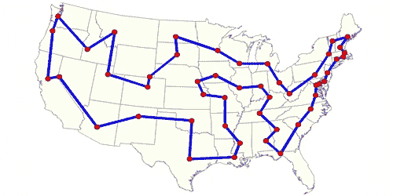
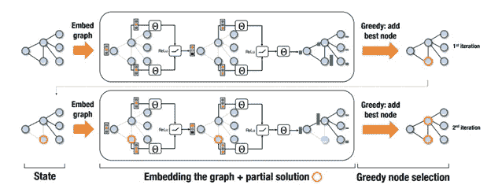
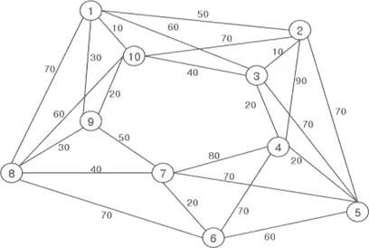
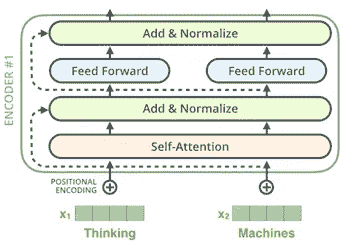
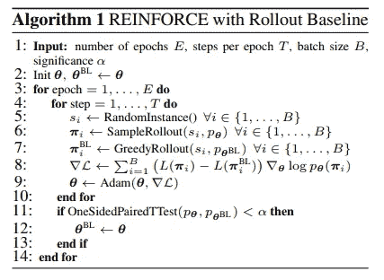
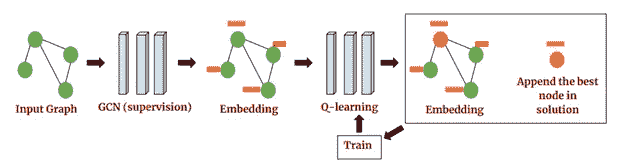

# 组合优化的强化学习

> 原文：<https://towardsdatascience.com/reinforcement-learning-for-combinatorial-optimization-d1402e396e91?source=collection_archive---------4----------------------->

## 使用深度强化学习和图形神经网络解决困难优化问题的学习策略。

[source](http://www.wallpapermaiden.com/image/2018/02/01/communication-molecules-lines-connection-abstract-19701.jpg)

# **为什么优化很重要？**

早在几百万年前人类诞生之初，每一项技术创新和每一项发明都是由聪明人的聪明才智设计出来的，它们改善了我们的生活，提高了我们在地球上生存和发展的能力。从火到轮子，从电学到量子力学，我们对世界的理解和周围事物的复杂性已经增加到我们常常难以直观地把握它们的程度。

今天，飞机、汽车、船舶、卫星、复杂结构的设计者和许多其他努力都严重依赖算法的能力来使它们变得更好，通常是以人类永远无法实现的微妙方式。除了设计，优化在网络路由(互联网和移动)、物流、广告、社交网络甚至医学等日常事务中也起着至关重要的作用。未来，随着我们的技术不断改进和复杂化，解决巨大规模难题的能力可能会有更高的需求，并将需要优化算法的突破。

[source](https://static.pakwheels.com/2016/04/aerodynamic_mercbenz-640x360.jpg)

# **组合优化问题**

广义地说，组合优化问题是涉及从有限的对象集合中找到“最佳”对象的问题。在这种情况下，“最佳”由给定的评估函数来衡量，该评估函数将对象映射到某个分数或成本，目标是找到值得最低成本的对象。大多数实际上感兴趣的组合优化问题(从现在开始称为 COPs)也非常困难，因为即使问题规模很小，集合中的对象数量也会快速增加，使得穷举搜索不切实际。

为了使事情更清楚，我们将把重点放在一个具体的问题上，即众所周知的旅行商问题(TSP)。在这个问题中，我们有 *N* 个城市，我们的销售人员必须访问所有的城市。然而，城市之间的旅行会产生一些费用，我们必须找到一个旅行，使旅行到所有城市并返回起始城市的总累积费用最小化。例如，下图显示了美国所有首都城市的最佳游览:

[source](https://cdn.journals.aps.org/journals/PHYSICS/synopses/images/10.1103/PhysRevA.95.032323)

这个问题自然出现在许多重要的应用中，例如规划、递送服务、制造、DNA 测序和许多其他应用。寻找更好的旅游有时会产生严重的财务影响，促使科学界和企业投入大量精力寻找解决此类问题的更好方法。

在为包含 K 个城市的 TSP 实例构建旅程时，我们在旅程构建过程的每个阶段都要删除一个城市，直到没有城市了。在第一阶段，我们有 K 个城市可以选择开始旅行，在第二阶段，我们有 K-1 个选项，然后 K-2 个选项，等等。我们可以构建的可能旅程的数量是我们在每个阶段拥有的选项数量的乘积，因此这个问题的复杂性表现为 *O(K！)*。对于少数人来说，这似乎还不算太糟。假设我们有一个 5 个城市的问题，可能的旅游次数是 5！=120.但对于 7 个城市，它增加到 5040，对于 10 个城市，它已经是 3628800，对于 100 个城市，它是一个巨大的 9.332622e+157，这比宇宙中的原子数量多很多个数量级。现实世界中出现的 TSP 的实际实例通常有数千个城市，并且需要在大量文献中已经开发了几十年的高度复杂的搜索算法和试探法，以便在合理的时间(可能是几个小时)内解决。不幸的是，现实应用中出现的许多复杂问题都有独特的细微差别和限制，这使得我们无法使用最先进的解决方案来解决已知的问题，例如 TSP，而需要我们开发针对该问题的方法和启发式算法。这个过程可能是漫长而艰巨的，并且可能需要领域专家的工作来检测特定问题的组合搜索空间中的一些结构。

由于近年来深度学习在许多领域取得了巨大成功，让机器学习如何自己解决我们的问题的可能性听起来非常有希望。将为困难的 COP 设计算法的过程自动化可以节省大量的金钱和时间，并且可能产生比人类设计的方法更好的解决方案(正如我们在 AlphaGo 等成就中看到的那样，alpha go 击败了人类数千年的经验)。

# **用图形表示法学习**

对这个问题的早期尝试出现在 2016 年，一篇名为**[**通过图**](https://arxiv.org/pdf/1704.01665.pdf)**学习组合优化算法的论文。在本文中，作者训练了一种称为 **structure2vec** 的图神经网络([我在另一篇文章](/robotic-control-with-graph-networks-f1b8d22b8c86)中讨论了图神经网络)来贪婪地构造几个硬 COP 的解决方案，并获得了非常好的近似比率(生产成本和最优成本之间的比率)。****

****基本思想是这样的:问题的状态可以表示为图形，神经网络在图形上构建解决方案。在解决方案构建过程的每次迭代中，我们的网络观察当前的图，并选择一个节点添加到解决方案中，之后根据该选择更新图，并重复该过程，直到获得完整的解决方案。****

********

****[source](https://arxiv.org/pdf/1704.01665.pdf)****

****作者使用 **DQN** 算法训练他们的神经网络，并展示了学习模型归纳到比训练时大得多的问题实例的能力。他们的模型甚至可以很好地推广到 1200 个节点的实例(同时在大约 100 个节点的实例上进行训练)，并且可以在 12 秒内产生解决方案，有时比商业求解器在 1 小时内找到的解决方案更好。他们方法的一个很大的缺点是他们使用了一个“助手”函数，来帮助神经网络找到更好的解决方案。这个助手功能是人为设计的，并且是特定于问题的，这是我们想要避免的。****

****这种基于图的状态表示的使用很有意义，因为许多 COP 可以非常自然地以这种方式表达，如 TSP 图的这个示例所示:****

********

****[source](https://openi.nlm.nih.gov/imgs/512/288/3270844/PMC3270844_sensors-10-00330f5.png)****

****节点代表城市，边包含城市间的距离。可以在没有边属性的情况下构建一个非常相似的图(如果我们出于某种原因不知道距离)。近年来，对图形进行操作的神经网络模型的流行程度令人难以置信地上升(无论是否假设知道结构)，最显著的是在自然语言处理领域，其中**变压器**风格的模型已经成为许多任务的最先进技术。****

****有很多优秀的文章详细解释了 Transformer 架构，所以我不会过多地钻研它，而是给出一个非常简要的概述。谷歌研究人员在一篇名为“ [**注意力是你所需要的全部**](https://arxiv.org/pdf/1706.03762.pdf) ”的著名论文中介绍了 transformer 架构，并用于处理 NLP 中出现的序列问题。不同之处在于，与 LSTMs 之类的递归神经网络(明确地输入一系列输入向量)不同，变换器将输入作为一组对象输入，并且必须采取特殊手段来帮助它看到“序列”中的顺序。转换器使用几个层，由多头自关注子层和全连接子层组成。****

********

****[source](http://jalammar.github.io/images/t/transformer_resideual_layer_norm.png)****

****与图的关系在关注层中变得很明显，这实际上是输入“节点”之间的一种消息传递机制。每个节点观察其他节点，并关注那些看起来对它更“有意义”的节点。这与 [**图注意力网络**](https://arxiv.org/pdf/1710.10903.pdf) 中发生的过程非常相似，事实上，如果我们使用一个掩码来阻止节点向非相邻节点传递消息，我们会得到一个等效的过程。****

# ******学会在没有人类知识的情况下解决问题******

****[他们在发**注意！学会解决路由问题**](https://arxiv.org/pdf/1803.08475.pdf) ”，作者解决了几个涉及图上路由代理的组合优化问题，包括我们现在熟悉的旅行推销员问题。他们将输入视为一个图，并将其提供给一个修改过的 Transformer 架构，该架构嵌入了图的节点，然后依次选择节点添加到旅程中，直到构建了一个完整的旅程。将输入视为一个图表是比输入一系列节点更“正确”的方法，因为它消除了对输入中给出的城市顺序的依赖性，只要它们的坐标不变。这意味着，无论我们如何排列城市，给定图形神经网络的输出将保持不变，这与序列方法不同。****

****在本文介绍的体系结构中，图是由 transformer 风格的编码器嵌入的，它为所有节点生成嵌入，并为整个图生成单个嵌入向量。为了产生解决方案，每次给定一个单独的解码器网络一个特殊的**上下文**向量，该向量由图嵌入、最后一个和第一个城市的嵌入以及未访问城市的嵌入组成，并且它输出未访问城市的概率分布，该概率分布被采样以产生下一个要访问的城市。解码器按顺序产生城市，直到旅程完成，然后根据旅程的长度给予奖励。****

****作者使用称为增强的增强学习算法来训练他们的模型，这是一种基于策略梯度的算法。他们版本的伪代码可以在这里看到:****

********

****[source](https://arxiv.org/pdf/1803.08475.pdf)****

****它们使用展开网络来确定性地评估实例的难度，并定期用策略网络的参数更新展开网络。使用这种方法，作者在几个问题上取得了很好的结果，超过了我在前面提到的其他方法。然而，他们仍然在多达 100 个节点的小实例上训练和评估他们的方法。虽然这些结果很有希望，但与现实世界相比，这种情况微不足道。****

# ******扩展到非常大的问题******

****最近，论文“ [**通过深度强化学习**](https://arxiv.org/pdf/1903.03332.pdf) 在大型图上学习启发式算法”向现实世界规模的问题迈出了重要的一步。在本文中，作者训练了一个图卷积网络来解决诸如最小顶点覆盖(MVC)和最大覆盖问题(MCP)之类的大规模问题。他们针对这些问题使用了一种流行的贪婪算法来训练神经网络嵌入图并预测每个阶段要选择的下一个节点，然后使用 DQN 算法对其进行进一步训练。****

********

****[source](https://arxiv.org/pdf/1903.03332.pdf)****

****他们在有**百万节点**的图上评估了他们的方法，并取得了比当前标准算法更好更快的结果。虽然他们确实使用了手工制作的启发式方法来帮助训练他们的模型，但未来的工作可能会消除这种限制，并学会从头开始解决巨大的问题。****

****总的来说，我认为在具有巨大搜索空间的问题中寻找结构是强化学习的一个重要而实用的研究方向。许多 RL 的批评者声称，到目前为止，它只被用于解决游戏和简单的控制问题，将它转移到现实世界的问题仍然非常遥远。虽然这些说法可能是真的，但我认为我在这篇文章中概述的方法代表了非常真实的用途，可以在不久的将来使 RL 受益，很遗憾它们没有像视频游戏的方法那样吸引那么多的关注。****

****我实现了一个相对简单的算法，使用图卷积网络来学习解决最小顶点覆盖问题的实例。[随意查看](https://github.com/orrivlin/MinimumVertexCover_DRL)。****