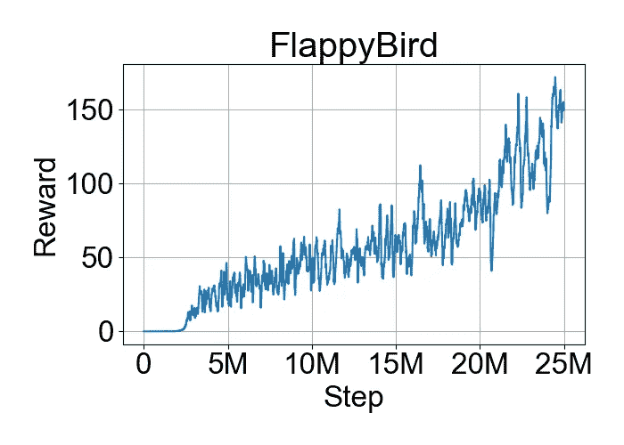
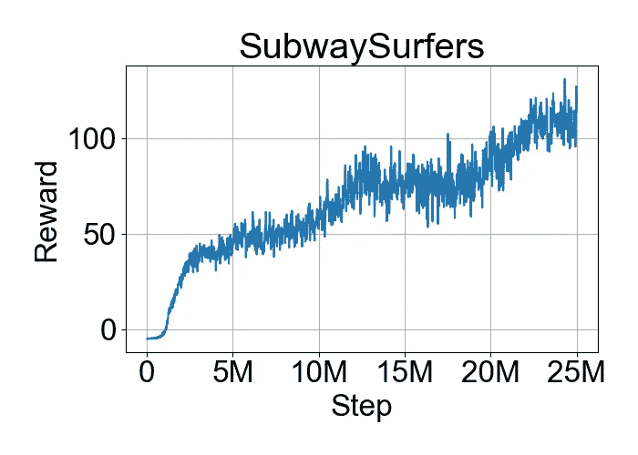
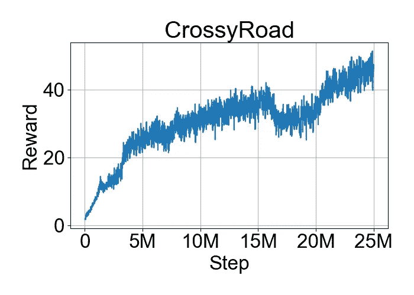

# 手机游戏的强化学习

> 原文：<https://towardsdatascience.com/reinforcement-learning-for-mobile-games-161a62926f7e?source=collection_archive---------14----------------------->

## 使用最先进的强化学习来学习大规模玩 Android 游戏

Image Source: [pixabay.com](https://pixabay.com/illustrations/artificial-intelligence-brain-think-4469138/)

# 介绍

自从 5 年前随着最初的 [DQN](https://www.cs.toronto.edu/~vmnih/docs/dqn.pdf) 论文被引入以来，深度强化学习已经引起了很大的轰动，该论文显示了强化学习如何结合神经网络进行函数逼近，可以用来学习如何从视觉输入中玩雅达利游戏。

从那以后，算法有了许多改进，不断超越以前的基准。研究和测试新算法通常使用快速稳定的 [Atari 基准](https://github.com/mgbellemare/Arcade-Learning-Environment)，以及定制的环境，如在 [OpenAI Gym](https://gym.openai.com/) 和 [DMLab](https://github.com/deepmind/lab) 中发现的那些环境。此外，我们可以使用模拟器运行数百个使用 [Gym Retro](https://github.com/openai/retro) 库的经典主机游戏。

对于现代游戏来说，最近的主要焦点是最难的竞技游戏，特别是 Dota2 和 Starcraft2。两者都从 [OpenAI](https://openai.com/projects/five/) 和 [DeepMind](https://deepmind.com/blog/article/AlphaStar-Grandmaster-level-in-StarCraft-II-using-multi-agent-reinforcement-learning) 中取得了令人印象深刻的成果，在一个巨大的分布式集群中进行训练，达到了数千年游戏经验的总和。在这两种情况下，观察/输入都是数字特征，而不是视觉帧，绕过了 AI 学习如何提取这些特征的需要，就像通常对 Atari 游戏所做的那样。所需的计算资源也不是大多数研究人员或小公司所能提供的。

在这里，我试图将 RL 应用到一些现代的移动 android 游戏中，仅使用视觉输入作为观察，并使用合理的预算量的计算资源，与学习玩 Atari 游戏时通常被认为是“样本高效”的一样。

# Android 环境

我使用可配置数量的 Android 模拟器作为 RL 代理学习游戏的环境。每个仿真器由异步驱动程序控制，该异步驱动程序通过抓取视觉帧、使用 RL 策略选择动作、将该动作发送回仿真器以及将转换数据发送回用于训练来收集训练经验。

## 不是真正的仿真

就其核心而言，android 仿真器是一个“真正的仿真器”，能够仿真 ARM 指令集，并可能能够用作完全仿真的 RL 环境，类似于 ALE 或 gym-retro 环境，其中当需要下一个动作/观察步骤时，可以根据需要暂停/恢复仿真。然而在现实中，Android 模拟器上的模拟速度非常慢，尤其是对于游戏，对于我们的任务来说是不可行的。

唯一的选择是使用 CPU 的硬件加速来运行仿真器(在 windows/linux 上使用 HAXM/KVM)。在这种情况下，使用 x86 android 映像，android 指令使用虚拟化直接在主机 CPU 上实时运行。这让我们达到了我们需要的稳定的 android 性能，但也有一些缺点:

*   这意味着仿真器实时运行。这意味着我们需要一致地抓取帧、选择动作并以最小的延迟发送这些动作。例如，代理不能暂停并等待训练步骤完成，因此每个环境实例必须异步运行
*   这也意味着我们受限于“实际游戏时间”，例如 60FPS，相比之下，模拟环境如 ALE 可以将模拟游戏时间加快几个数量级，从而加快训练速度
*   因为 android 模拟器现在运行的是 CPU 虚拟化，所以在流行的云提供商的 VM 实例上运行模拟器是有问题的。其中一些提供者为此支持“嵌套虚拟化”,但实际上，我无法很好地实现这一点。模拟器要么无法启动，要么成功启动但运行速度比在非 VM 服务器上慢得多。这限制了我们在定制服务器版本或“裸机”云服务器上运行这些环境，而这种情况很少见。

## 帧抓取

环境驱动程序以固定的可配置速率从仿真器获取可视帧，并跟踪由于代理中的延迟而导致的“丢帧”数量。主要目标是确保最少的丢帧，这可能对游戏不利。这需要限制在一台机器上运行的模拟器的数量，特别是当训练也在同一台机器上进行时，以确保有足够的 CPU 带宽用于表演和训练。每个模拟器需要 2 个专用 CPU 内核(4 个 vcpu)才能获得稳定的游戏体验。

我将帧抓取配置为 30FPS，跳帧为 2 或 4(相比之下，Atari 培训中通常使用 60FPS 的跳帧为 4)。

android 模拟器以 320x480(纵向)分辨率运行，以最小化渲染开销。这是游戏仍能正常运行的最低分辨率。这为我们提供了大小为 320x480x3 的原始观察值，然后将其缩小到 80x120x3，用于作为策略输入的最终观察值(与大多数 Atari 研究中使用的 84x84x1 灰度观察值相比)

## 行动延迟

我遇到的另一个问题是，从我发送动作到游戏实际接收/执行动作，Android 模拟器存在固有的延迟。延迟大约为 60-90 毫秒，这似乎可以忽略不计，学习应该能够解释这一点(甚至 DeepMind 最近的星际争霸 2 作品也提到了大约 250 毫秒的延迟)，但实际上，我发现这些会损害最佳学习如何玩的能力。

为了证实这一点，我为 OpenAI gym 的 Atari 环境创建了一个定制的包装器，其中插入了一个人工的可配置的延迟，从代理发送一个动作开始，直到它被发送到实际环境。即使有 60-90 毫秒的延迟，与没有延迟相比，当训练有延迟的调谐 RL 算法时，我看到最终性能有不可忽略的下降。

这并不是说我们不应该学习如何处理这种延迟，因为在将 RL 应用于机器人或无人机等实时任务时，这些延迟可能是常见的情况。但是，在测试和比较 RL 算法时，可能值得考虑将这种延迟插入到常用的基准任务中，以确保算法对它们是健壮的。

## 检测和跳过屏幕

为了提供可用于 RL 的环境，我们需要通过不相关的屏幕处理检测和点击:

*   点击正确的位置开始新游戏
*   检测表示游戏结束的屏幕，点击适当的位置开始新的游戏
*   检测各种弹出屏幕并关闭它们(消息、新角色解锁、新项目等)..)

以上可能会以某种方式自动化，甚至可能使用某种人工智能/学习，但这是一个完全不同的主题，我没有处理。目前，我只是手动配置了每个游戏的相关屏幕以及遇到这样的屏幕时在哪里点击。

## 奖励

我使用了基于“分数变化”的奖励信号。这使得每次分数变化时都有+1 的奖励。我发现，在这种情况下，不需要处理实际得分值的 OCR，只需检测得分值的变化并给出+1 就足够了，而且也更容易。对于大多数游戏，这转化为实际分数(除了一些偶然的错误检测)。此外，由于许多 RL 算法将奖励限制为-1/+1，因此在这种情况下检测实际分数就不那么重要了。

# 示例高效可扩展 RL

由于在 Android 模拟器上训练的缓慢和高资源成本，我去寻找一个样本有效的 RL 算法，它可以很好地扩展到多种环境。

我尝试了各种 RL 算法，但最终专注于 q-learning 变体，特别是由于我试图学习的游戏具有离散的动作空间，对错误的容忍度接近零(即，选择单个错误的动作经常会导致游戏结束)。这使得 q-learning 等基于价值的方法比 actor-critic 变量等随机算法更合适(尽管随机算法仍有可能收敛到一个好的策略，但我最初使用 [PPO](https://arxiv.org/abs/1707.06347) 获得了相当好的结果，但使用 DQN 变量总体上更稳定、更好)。

当前用于离散动作的去样本高效 RL 算法是[彩虹](https://arxiv.org/abs/1710.02298)。Rainbow 采用了原始的 DQN 算法，并将 6 种独立的改进结合到一个代理中，在 Atari 基准测试中达到了 200M 总帧数阈值(约 38 天的“播放时间”)的最先进结果。

[IQN](https://arxiv.org/abs/1806.06923) 是 DQN 的改进分布式版本，超越了之前的 [C51](https://arxiv.org/abs/1707.06887) 和 [QR-DQN](https://arxiv.org/abs/1710.10044) ，能够几乎匹配彩虹的性能，没有彩虹使用的任何其他改进。

不过，彩虹和 IQN 都是“单代理”算法，在单个环境实例上运行，需要 7-10 天的时间来训练。以 60fps 的速度对 200M 帧实时运行一个 android 模拟器代理需要 38 天。

对于多角色/分布式 q 学习，最先进的是 R2D2。R2D2 是一种分布式多角色算法，在之前发布的 [APEX](https://arxiv.org/abs/1803.00933) 的基础上进行改进，增加了额外的改进，特别是使用了 DQN 模型的“递归”版本，在中间添加了 LSTM 层，以帮助代理保持到目前为止发生的事情的“记忆”，并对其行动进行更好的长期规划。

LSTM 被证明是一个很大的帮助，即使在雅达利上，大多数游戏都是完全可见的(即游戏的完整状态可以在屏幕上看到)，这似乎不会受益于 LSTM 记忆。没有太多关于它为什么有帮助的研究，但一个可能的解释是它允许策略“遵循计划”,这允许它更有效地学习和玩耍。

R2D2 在几乎所有的 Atari 游戏上都获得了极高的分数，几乎没有改进的空间，然而，这是以样本效率为代价的，需要看到比样本效率算法多 50 倍的环境帧。尽管如此，由于其高度分布式架构在使用 256 个 CPU 的高速 Atari 模拟器上运行 256 个异步角色，它能够在比 Rainbow/IQN 更短的时间(5 天)内实现这一目标。这对于我的 android 系统来说是不可行的，环境运行速度慢了 10 倍，每个实例需要 2 个 CPU。

为了最大化我的资源利用率和最小化训练时间，我致力于将 IQN/彩虹/R2D2 的特征结合到一个“递归 IQN”训练算法中([完整细节在此](https://opherlieber.github.io/rl/2019/09/22/recurrent_iqn))，该算法在 Atari 基准测试中实现了改进的样本效率结果，并可以选择并行运行多个参与者，使我能够在合理的时间内(最多几天)在缓慢的 android 环境中有效地进行训练。

# 培训设置

为了进行培训，我使用了一个带有 32 个 CPU 和一个 NVIDIA 1080ti GPU 的定制(非 VM)服务器。我在每个培训课程中运行了 12 个 Android 实例，每个实例使用主策略的共享内存副本在不同的进程中异步收集经验，以避免其中一个参与者不得不暂停时的延迟(例如在游戏结束后重新开始)。从训练步骤之间的过程中检索经验，以填充训练重放缓冲器。

我使用了与 Atari 基准测试相同的超参数和'[递归 IQN'](https://opherlieber.github.io/rl/2019/09/22/recurrent_iqn) 算法，并做了一些修改:

*   从 12 ENVs 减少到 12 ENVs
*   env 异步运行，而不是矢量化运行，共享内存策略每 1000 步更新一次，权重来自训练策略
*   固定的衰减探索率，每个演员从 1.0 到 0.001(需要极低的探索率，因为我正在使用的游戏对“错误动作”非常敏感，所以常见的 0.01 率会使训练演员很难达到更长的剧集)
*   视觉游戏帧从 320x480x3 分辨率缩放到 80x120x3 RGB 观察值(与 Atari 中常用的 84x84x1 灰度观察值相比)
*   以 30FPS 的速度从模拟器中抓取帧，根据游戏的不同，跳帧次数为 2 或 4，没有“最大合并”(即代理转换为每秒 15 或 7.5 步，而 Atari learning 通常为每秒 15 步)。在一些游戏中需要较低的速率，否则这些动作会比步进时间更长(例如滑动动作)

# 游戏和结果

我使用以下 3 个游戏来集中测试:

*   对于人类玩家来说，这是一个非常困难和令人沮丧的游戏，需要非常快速和精确的反应时间，但是有非常简单的机制和恒定的视觉效果，所以总体的学习策略应该是相对简单的
*   [地铁冲浪者](https://play.google.com/store/apps/details?id=com.kiloo.subwaysurf&hl=en):流行的无尽街机游戏，通过在 3 条车道之间滑动来躲避火车，跳跃或蹲在障碍物上方和下方，并试图收集沿途的硬币
*   [Crossy Road](https://play.google.com/store/apps/details?id=com.yodo1.crossyroad&hl=en) :臭名昭著的斗鸡游戏要求代理人提前计划，并在正确的时间开始行动，同时考虑迎面而来的交通和汽车轨迹，漂浮的积水和快速通过的火车

所有比赛都使用最终训练政策进行评估，没有随机行动。

## 拍打鸟

A high score for Flappy Bird. Reached the 30-minute time limit without dying

Flappy Bird 以 30FPS 的速度训练，跳帧为 2(每秒 15 步)，总共 25M 步(相当于样本高效 Atari 训练中使用的总“游戏时间”的一半)。使用 12 个模拟器训练大约需要 40 个小时。

动作空间有一个单独的动作(点击)和一个附加的“无操作动作”。每次分数改变时(即每次小鸟通过一个管道时)，奖励为+1

Training chart for Flappy Bird, average reward of last 100 episodes

这个游戏因需要时间开始学习而臭名昭著，因为最初的奖励只有在通过第一个管道后才能收到，这对于使用随机探索的未经训练的代理来说可能是极其困难和随机的。0 奖励的初始步骤有几十万，也就是说代理根本没有反馈，没有办法学习。只有在我们获得了一些通过第一个管道的经验(这完全是随机的)之后，代理才最终开始弄清楚它，从那一点开始，它相当稳定地改进，但是它需要经过 2M 步骤才能到达那一点。

这个游戏对错误的动作非常敏感，例如，用 0.001 的随机动作 epsilon 进行评估会产生 143 的平均奖励，而不是 420，这也可以在训练图表最终结果中看到(训练也使用 0.001 作为最终探索率)

评估分数:平均 420，最高 1363 (10 集评估)

## 地铁冲浪者

2 high scoring Subway Surfer games

对于这个游戏，我使用了硬币收集计数作为奖励，以鼓励代理收集硬币，这本身并不是为了进步所必需的，而是一种重要的学习能力。我还在游戏结束时增加了一个负(-1)奖励，以鼓励代理学会不要输，不管收集了多少硬币。

该游戏以 30FPS 的速度训练，跳帧为 4(每秒 7.5 步，而雅达利通常使用的是 15 步，因为滑动手势需要的时间超过 66 毫秒)，共 25 米步(总游戏时间相当于使用 200 米帧、60FPS 的普通样本高效雅达利训练)。使用 12 个模拟器训练大约需要 90 个小时。

这里的动作空间有 4 个动作(上/下/左/右滑动)和“noop 动作”。

有趣的是，代理人几乎从不选择 noop 动作，而总是喜欢跳或滑下，即使它并不真的需要。这有点道理，因为这样做没有坏处，而且只在某些情况下有帮助(不是所有的训练都是这样，有些有更多的 noop 动作)。我们也许可以通过对每一个行动增加一个小的负奖励(例如-0.1)来减轻这一点。

Training chart for Subway Surfers, average reward of last 100 episodes

评估分数:平均 142，最高 434 (30 集评估)

## 十字路口

3 high scoring Crossy Road games

克罗斯路与地铁冲浪者以相同的帧/步速率进行训练。每一次分数变化的奖励是+1(也就是鸡每向前移动一步)。

代理显然倾向于只向前移动，但它知道向左/向右移动，甚至在需要时向后移动。

Training chart for Crossy Road, average reward of last 100 episodes

评估分数:平均 41，最高 139 (30 集评估)

# 结论

到目前为止，结果看起来很有希望，尽管仍然不是我们认为的“超人”(除了 Flappy Bird)。尽管如此，看到 RL 能够在合理的时间、框架和资源范围内，使用与 Atari 相同的超参数，从视觉输入中实时学习现代休闲游戏，还是很有希望的。

从图表中也可以很清楚地看到，学习并没有停滞不前，看看我们在 50 米甚至 100 米甚至更远的步数上，通过一些超参数调整可以得到什么结果，这将是很有趣的。

 [## 基于递归 IQN 的快速样本高效 Q 学习

### 一篇关于用于这些结果的“递归 IQN”训练算法的文章

opherlieber.github.io](https://opherlieber.github.io/rl/2019/09/22/recurrent_iqn)  [## 奥菲利贝尔/rltime

### RLtime 是一个强化学习库，专注于最先进的 q 学习算法和功能

github.com](https://github.com/opherlieber/rltime)