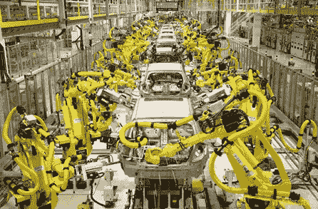
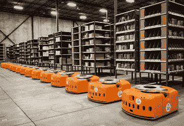
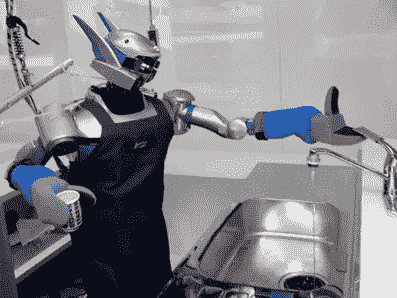
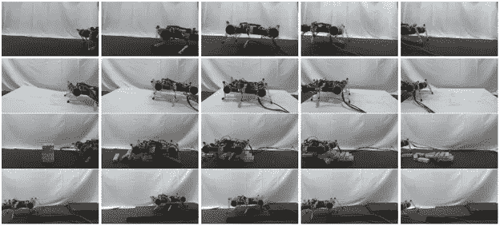
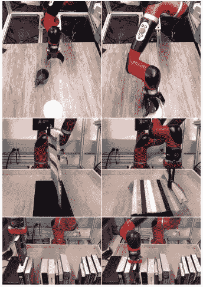

# 现实世界机器人的强化学习

> 原文：<https://towardsdatascience.com/reinforcement-learning-for-real-world-robotics-148c81dbdcff?source=collection_archive---------9----------------------->

## 来自现实世界机器人控制的 RL 文献的想法

[source](https://blueprint-api-production.s3.amazonaws.com/uploads/story/thumbnail/82395/2349ecbb-3fe0-4b48-bf9b-80e188d411cf.jpg)

**机器人——承诺**

机器人在现代工业中无处不在。与上个世纪的大多数科幻作品不同，人形机器人仍然没有洗我们的脏盘子和倒垃圾，也没有施瓦辛格式的终结者在战场上战斗(至少目前如此……)。但是，几乎在每一个制造工厂里，机器人都在做着几十年前人类工人曾经做过的那种单调乏味、要求苛刻的工作。任何需要在可以仔细控制和监控的环境中重复和精确工作的东西都是机器人取代人类的良好候选对象，今天的前沿研究正在快速接近自动化任务的可能性，这些任务非常困难，即使我们可能认为它们很乏味(如驾驶)。

[source](https://www.actemium.com/wp-content/uploads/2016/05/robotics.jpg)

我们迷恋机器人背后的动机显而易见；对许多人来说，一个人类从艰苦无聊的体力劳动中解放出来的未来似乎是非常令人向往的。此外，机器特有的精确性和一致性可以减少由于人为错误而发生的灾难，如车祸和手术中的医疗事故。我们开始在生产线之外看到这场革命的第一个先兆；在亚马逊这样的大型仓库中，机器人正被用来代替人工运输板条箱。

[source](https://www.insidelogistics.ca/wp-content/uploads/2013/01/Kiva-Think-Roger-Yip-2818-crop.jpg)

虽然我们仍然没有在战场上使用杀人的人形机器人，但我们确实有在世界各地执行侦察和战斗任务的半自动无人机。军事高级研究机构正在努力使士兵远离危险，让机器进行实际战斗，我希望在未来的几十年里我们确实会看到这样的发展。

**机器人强化学习**

为什么几十年前的科幻小说几乎总是认为我们不久的将来包括智能人形机器人做一切事情，而我们似乎离它很远？为什么我们的制造工厂到处都是机器人，而我们的街道和家庭却没有？对于一个在给定环境中成功操作的机器人来说，它必须以某种方式理解它，计划它的行动并使用某种驱动手段执行这些计划，同时使用反馈来确保一切按照计划进行。

事实证明，这些组成部分中的每一个都是一个非常困难的问题，而我们人类容易做到的事情(如识别视觉场景中的物体并在某种程度上预测人们的意图)对计算机来说往往具有难以置信的挑战性。近年来，深度学习在计算机视觉的各种任务中占据了突出地位，但理解典型步行街场景所需的广泛技能仍不在当前技术的掌握范围内。

事实证明，在流水线上工作和在街上工作有着天壤之别。在装配线上，环境中的一切通常都可以精确控制，机器人需要执行的任务往往非常具体和狭窄。尽管有这些优势，为制造机器人设计运动规划和控制算法是一个漫长而乏味的过程，需要许多领域专家的共同努力。这使得这一过程非常昂贵和漫长，凸显了我们目前的能力与需要在更广泛的环境中操作并执行一系列任务的机器人所需的能力之间的巨大差距。如果我们在为那些狭窄的任务设计算法时有困难，我们怎么能把机器人扩展到我们的家庭呢？这些机器人将不得不在城市空间通常复杂的景观中导航，处理混乱的现实世界(比较一下洗碗池中随意留下的盘子和油漆汽车外部，在装配线上精确放置和定时)，并在确保安全的情况下与人类互动。

[source](https://amp.businessinsider.com/images/565f3958dd0895e01f8b4692-750-563.jpg)

近年来，深度学习和强化学习的成功使得许多研究人员开发了使用强化学习控制机器人的方法。动机很明显，我们能否通过让机器人自主学习来自动化设计传感、规划和控制算法的过程？如果可以，我们会立刻解决我们的两个问题；节省我们花费在为我们知道如何解决的问题(工业机器人)设计算法上的时间和精力，并为那些我们目前没有解决方案的更困难的问题获得解决方案。

深度强化学习是在各种视频游戏和棋盘游戏，或者相对简单的模拟控制问题中取得惊人成功后才引起公众注意的。在这些任务中，代理学习的环境和它必须操作的环境是相同的，我们可以有效地使用模拟来允许代理在学习解决任务之前进行多次尝试。深度强化学习算法是出了名的数据低效，在学习解决一个任务(如玩 Atari 游戏)之前，通常需要进行数百万次尝试。如果我们试图在现实世界中应用同样的方法来训练我们的机器人，这将花费不切实际的时间，并且很可能在这个过程中摧毁机器人。或者，我们可能天真地试图使用模拟来训练我们的代理，然后在真实的机器人上部署训练好的策略。但是模拟真实世界的复杂性是非常困难的，并且这种策略在物理机器人上通常表现不佳。

将 RL 应用于机器人技术存在许多挑战，在我看来，其中许多挑战可以粗略地分为以下四类:

样本效率(Sample efficiency):如果我们希望使用物理机器人来训练我们的政策，我们必须开发出只需要少量尝试就能学会的算法，这样训练才是可行的，不像我们今天拥有的许多算法。

**Sim2Real** :如果我们希望在模拟环境中训练我们的策略，然后部署它们

**奖励规格**:下象棋或者星际争霸 2 的时候目标非常明确，容易量化；无论输赢。然而，在洗碗这样的事情上，你如何量化成功的程度呢？还是叠衣服？

**安全**:我们的机器人政策必须是安全的(在机器人训练和部署到现实世界期间)，以确保机器人本身的完整性以及环境中人员和财产的安全。

我将主要讨论前两个类别，简单谈一下第三个类别，避开最后一个。

**样品效率**

传统上，当希望 RL 中的样本复杂度极低时，首选方法是基于模型的 RL。在基于模型的 RL 中，代理试图学习环境的模型并使用它来计划和改进它的策略，从而大大减少它需要与环境交互的次数，而不是仅基于通过与环境交互获得的奖励来学习策略。然而，与无模型算法相比，这种方法通常导致较低的渐近性能，并且有时由于学习模型中的误差而遭受灾难性的失败。

基于模型的 RL 在动力学可以由简单模型(例如线性模型)充分表示的问题中表现出巨大的成功，但是在需要非线性模型(例如深度神经网络)的更复杂的环境中还没有取得巨大的成功。2018 年，来自伯克利的研究人员就该主题发表了一篇论文,其中他们确定了不稳定问题的一个可疑原因，并提出了一个解决方案。

在他们的论文中，他们声称，在学习和规划期间，该策略倾向于利用状态空间中学习模型表现不佳的那些区域，这使得代理“偏离路线”，从使用学习模型可以可靠地提前规划的区域转向完全盲目的区域，使其无效。他们的解决方案相对简单；学习几种不同的环境模型，并在规划期间从这些不同的模型中统一取样，有效地规范学习过程。这使得基于模型的 RL 能够应用于比以前更复杂的任务，以更少的数量级尝试实现与无模型算法相当的渐近性能。

有趣的是，最近的一个无模型算法已经展示了出色的样本复杂性，以至于有可能在相对较短的时间内在一个真实的机器人上训练一个策略。2019 年，来自伯克利和谷歌大脑的研究人员发表了一篇[论文](https://arxiv.org/pdf/1812.05905.pdf)，其中他们描述了一种称为软演员评论家(SAC)的非政策演员评论家算法。他们在几个传统的 RL 控制基准上证明了这种算法在低样本复杂度的情况下表现非常好，然后继续训练机器人在仅 4 小时的环境交互中行走。

[source](https://arxiv.org/pdf/1812.05905.pdf)

该机器人被训练在平坦的表面上行走，然后在不同障碍的表面上成功测试，显示了所学策略的鲁棒性。

另一个不错的[论文](https://arxiv.org/pdf/1812.03201.pdf)走了一条不同的道路来采样效率；通过抛弃策略必须从零开始学习的概念，并且应该利用现有的不完善的控制算法来提供一个“框架”,在该框架上发展策略。通过利用现有控制算法对于该问题表现良好的事实，该策略可以学习微调控制系统，而不是像大多数 RL 算法那样从随机行为开始。他们使用这种方法来训练机器人完成涉及复杂动力学的真实积木组装任务。

**模拟现实**

在过去的几年中，许多研究论文已经证明了他们学习的 RL 策略在物理机器人平台上操作的能力，但是这些策略通常局限于狭窄的任务，并且通常需要大量的手动调整才能正常工作。特别是对于使用视觉传感的机器人来说，逼真地模拟机器人可能遇到的图像是极其困难的，这就产生了著名的 Sim2Real gap。

在动力学可以通过模拟充分捕获的问题中，RL 实际上可以很好地工作，正如在这篇[论文](https://arxiv.org/pdf/1901.07517.pdf?fbclid=IwAR21IneQ5Lusw62bCyh0oDzRJYh2nKercXP53vp35dIGtT-edIcITZBeetc)中可以看到的那样，在这篇论文中，一个策略被训练为使用模拟来学习四足机器人的恢复策略，并且它很好地转移到真实的机器人，具有令人印象深刻的 97%的成功率。然而，在这个问题中，状态是相对低维的，不像视觉表现。

为了解决处理视觉输入的问题，OpenAI 和 Berkeley 在 2017 年发表的一篇很好的[论文](https://arxiv.org/pdf/1703.06907.pdf)提供了一个非常简洁的解决方案；将环境提供的视觉输入随机化，并训练策略对这些变化非常稳健，希望真实世界会喜欢模拟的另一种变体。

[source](https://arxiv.org/pdf/1703.06907.pdf)

这非常有效，他们能够在真实的机器人抓取系统中使用仅在模拟中训练过的物体检测器。

这项工作的一个非常酷的延续发表在 2019 年[的一篇论文](https://arxiv.org/pdf/1812.07252.pdf)。在这篇论文中，研究人员使用了类似的随机化模拟来帮助训练策略变得鲁棒，但同时训练了一个条件 GAN (cGAN)来将随机化图像转换回原始模拟的规范形式。在测试期间，cGAN 将真实图像转换为策略熟悉的标准图像形式，从而有助于减少模拟真实图像的差距。使用这种方法，他们在模拟中训练了一个代理，并将其用于一个机器人上，成功率为 70%。在真实的机器人上使用一些微调，他们能够达到 91%甚至 99%的成功率。

[source](https://arxiv.org/pdf/1812.07252.pdf)

**奖励规格**

假设你想让你的机器人学会把书放在书架上，并且你有一个样本复杂度非常低的算法。如何为此设计一个奖励函数呢？在一篇非常酷的 2019 年[论文](https://arxiv.org/pdf/1904.07854.pdf)中，来自伯克利的研究人员正是这么做的。他们没有指定奖励函数，而是为算法提供了一个目标状态的几个图像(排列好的书架)，并允许它询问用户(非常少的次数)当前状态是否是一个目标状态。使用之前提到的 Soft Actor Critic 算法和其他几种算法，他们在几个小时内就在一个真实的机器人上训练了他们的策略。他们针对不同的任务训练不同的策略，比如把书放在书架上，在盒子上盖一块布。

[source](https://arxiv.org/pdf/1904.07854.pdf)

**结论**

将 RL 应用于现实世界机器人问题的挑战还远远没有被宣布解决，但已经取得了很大进展，希望我们将继续看到这一令人兴奋的领域的进一步突破。