# 强化学习框架和工具包(Gym 和 Unity)

> 原文：<https://towardsdatascience.com/reinforcement-learning-framework-and-toolkits-gym-and-unity-1e047889c59a?source=collection_archive---------10----------------------->

## 介绍强化学习框架，以及环境 Cart-pole(健身房)和 Banana collector(Unity)

强化学习为学习策略提供了一个框架，该学习策略将状态映射为行动，目标是最大化累积回报。在这篇文章中，我们提出了这个框架是如何数学公式，以及哪些算法可以用来解决 RL 问题。我们还将讨论(1) Gym 和(2) Unity 的使用，这两个工具包用于开发和比较强化学习算法。

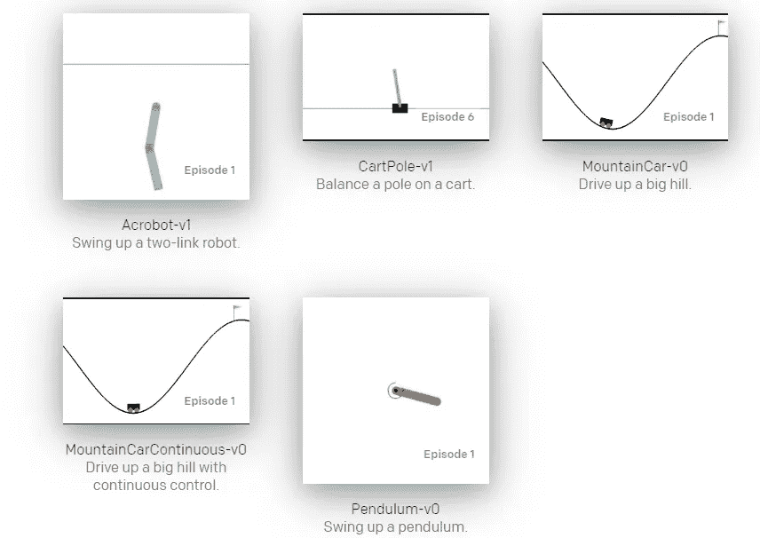

Gym — classic control environments [https://gym.openai.com/envs/#classic_control](https://gym.openai.com/envs/#classic_control)

# 强化学习框架

**强化学习**是基于迭代学习思想的**机器学习**的一个领域。学习者，或者决策者，被称为**代理**，它与**环境**互动，接收被称为**奖励**的反馈。代理的目标是通过与环境的迭代来最大化回报。在强化学习问题中，我们认为时间步长是离散的。在第一时间步，代理观察环境的**状态**，选择**动作**作为响应。随后，环境向代理呈现一个新的状态和一个奖励，显示它的动作是多么恰当。这个过程在下面的时间步骤中继续，获得一系列的状态、动作和奖励。在反复试验之后，代理人学会执行适当的行动，以最大化**预期累积报酬**。

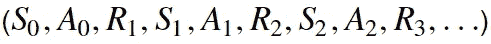

Sequence of states, actions, and rewards

建立**奖励**，以便当代理试图最大化它时，也学习特定的行为(例如，玩视频游戏或驾驶汽车)。智能体的设计不是为了最大化即时报酬，即时报酬是执行一个动作后环境提供的报酬，而是期望的累积报酬。预期累积奖励是从下一个时间步开始的奖励总和，用 Gt 表示；我们使用预期这个术语，因为代理人不能确定地预测未来的回报是什么。

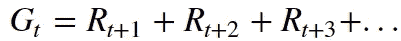

Expected cumulative reward at time step t

为了强调比未来奖励来得更早的奖励，我们计算了**折现奖励，**代表γ**折现率**。折扣率是介于 0 和 1 之间的数字，由开发者在定义强化学习任务时设置。

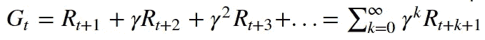

Discounted reward at time step t

折现率γ=1 代表未折现的奖励，而γ=0 代表最直接的奖励，这意味着γ越大，代理人考虑的未来奖励就越多。

使用**马尔可夫决策过程**来描述强化学习的环境。这个过程定义为:(1)一组状态 ***S*** ，(2)一组动作 ***A*** ，(3)一组奖励 ***R*** ，(4)环境的一步动力学***p(S′，r|s，a)*** ，(5)一个贴现率 ***γ*** 。环境在时间步长 t+1 做出响应，仅考虑前一时间步长的状态和动作。单步动态和奖励描述了环境如何工作；因此，代理不知道它们，它通过与环境迭代来学习如何采取适当的行动。

一个**策略**描述了代理的行为，是从一组状态*到一组动作*的映射。该策略可以是(1)确定性的，或者(2)随机的。一个**确定性策略**将状态映射到动作 ***π:S→A*** ，将一个状态作为输入，提供一个动作作为输出。相反，一个**随机策略*****π:SxA→【0，1】***取一个状态和一个动作，输出在那个状态下采取那个动作的概率。**

**代理的目标是学习**最优策略**。如果预期收益大于或等于所有州的所有其他策略的预期收益，则认为策略是最优的。在我们深入了解最优性的概念之前，我们先介绍两个在强化学习中经常会遇到的函数:(1)状态值函数**和(2)动作值函数**。状态值函数是从状态 ***s*** 开始并遵循策略 ***π*** 时所有时间步长的预期收益，用小写的 ***v.*** 表示******

****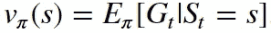****

****State-value function****

****有一个公式可以简化状态值函数的计算，称为**贝尔曼期望公式**。根据这个等式，可以使用下一个状态的期望值和期望的即时报酬来计算任意状态 ***s*** 处的状态值函数。****

****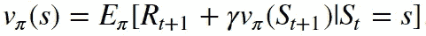****

****Bellman expectation equation****

****另一个有趣的函数是用小写字母 ***q*** 表示的动作值函数。该函数不仅依赖于环境的状态，还依赖于代理的动作，表示期望的回报，如果代理在状态 ***s*** 开始，采取动作 ***a*** ，然后对于所有未来的时间步骤遵循策略***【π***。****

****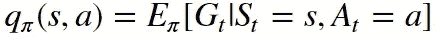****

****Action-value function****

****智能体的目标是通过与环境的迭代获得最优动作值函数***q∫***，然后使用这个动作值函数获得最优策略***π∫***。我们可以通过选择动作 ***a*** 来轻松实现，该动作为每个状态*提供最大***q∫********

****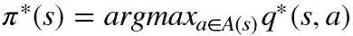****

****Optimal policy****

****强化任务的目标是获得代表最优代理行为的最优策略。为此，我们可以采用多种多样的算法，这些算法通常分为两组:(1) **基于值的方法**，以及(2) **基于策略的方法**。基于价值的方法通过学习最优行动价值函数***Q∫(s，a)*** 间接计算最优策略。然后，我们可以通过为每个状态选择最大化 ***Q*** 的动作来获得最优策略。相反，基于策略的方法直接找到最优策略，而不必计算动作值函数估计。下表显示了最著名的算法。****

****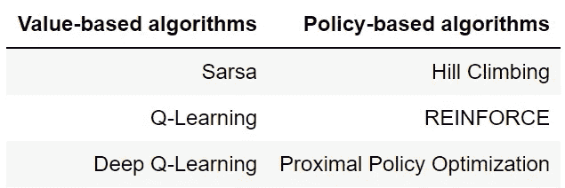****

****Reinforcement learning algorithms****

****所采用的算法取决于状态和动作空间的类型:(1)离散的，或(2)连续的。**离散的**空间呈现有限的一组状态和动作。在离散空间中，我们可以将 Q 表(动作值函数估计)表示为字典或查找表。前述算法 **Q-Learning** 和 **Sarsa** 只能在离散空间中运行。然而，大多数强化学习应用需要**连续的**状态和动作空间。例如，在机器人学中，通常使用速度、位置和扭矩等连续变量。连续空间不呈现有限的可能性集合；它们可以取一系列的值。为了处理连续空间，我们可以采用两种策略:(1) **离散化**，以及(2) **函数逼近**。离散化允许我们使用算法 Q-Learning 和 Sarsa，只需很少或不需要修改。当需要的离散空间数量非常大时，离散化是不可行的，函数逼近成为唯一的选择。深度神经网络成为处理连续空间的最有吸引力的替代方案，可以轻松捕捉状态和动作之间的非线性关系。**深度 Q 学习**算法可以应用于呈现连续状态空间的强化学习问题，但是动作空间仍然必须是离散的。为了与连续状态和动作空间一起工作，必须使用基于策略的算法，例如**增强**或**近似策略优化**。另一种选择是使用**行动者-批评家**方法(基于价值的方法和基于政策的方法的结合)，例如**深度确定性政策梯度**。****

****在以后的文章中，我们将解释如何使用 Pytorch 编写这些算法来训练代理。然而，本文主要关注于理解强化学习框架和工具包(Gym 和 Unity)。这两个库都提供了用于训练的代理，这意味着我们可以将上述算法之一应用于这些代理，以便它们学习特定的任务。****

# ****强化学习工具包——健身房****

****[**Gym**](https://gym.openai.com/) 是开发强化学习算法的开源库。该工具包提供了从 Atari 游戏到机器人的各种环境。用户可以很容易地与代理交互，目的是应用一种算法来教会他们一个特定的任务(例如，在游戏中最大化得分，训练机器人行走，或平衡汽车上的杆子)。****

****第一步是在你的电脑上安装 Gym。要做到这一点，我们可以查阅官方网页，****

 ****[## Gym:开发和比较强化学习算法的工具包

### 健身房图书馆是一个测试问题——环境——的集合，你可以用它来制定你的强化…

gym.openai.com](https://gym.openai.com/docs/#installation)**** 

****或者，我们可以阅读 Genevieve Hayes 在《走向数据科学》上发表的以下文章。****

**** [## 如何在 Windows 环境下安装 OpenAI Gym

### 一步一步的指导如何建立和运行 OpenAI 健身房

towardsdatascience.com](/how-to-install-openai-gym-in-a-windows-environment-338969e24d30) 

为了了解库是如何工作的，我们将解释 Gym 提供的 [CartPole-v1](https://gym.openai.com/envs/CartPole-v1/) 环境。我们开始吧💪！

## CartPole-v1 环境

小车-V1 环境由一根通过非驱动关节连接到小车上的杆组成，小车沿无摩擦轨道运动。代理可以向推车施加-1 到 1 之间的力，目的是尽可能长时间地保持杆的平衡。柱子保持直立的每一步都获得+1 的奖励。当柱子偏离垂直方向超过 15 度，或者手推车偏离中心超过 2.4 个单位时，该集结束。

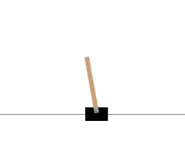

CartPole-v1 Environment

第一步是导入库 **gym** ，使用 **gym.make** 函数加载 CartPole-v1 环境。一旦环境被创建，我们需要一个初步的观察。第一个状态通过调用**复位**函数获得，由一个(4)维 **numpy 数组**组成，包含以下信息:(1)小车位置，(2)小车速度，(3)电极角度，以及(4)尖端的电极速度。

**状态空间**指的是我们的代理可能遇到的所有可能情况的集合。类似地，**动作空间**是我们的代理在特定状态下可以采取的所有可能动作的集合。两个空间的类型和大小可以通过使用**环境观察 _ 空间**和**环境动作 _ 空间**方法来查询。

健身房空间可以是:(1)离散的，(2)多离散的，(3)盒子，和(4)元组。在 CartPole-v1 环境中，动作空间是离散的，这意味着该空间包含从 0 到 n-1 的 n 个离散点。我们可以通过键入 **env.action_space.n** 来获得动作的总数。相反，状态空间是一个多维连续空间(箱式)，其中每个变量都位于区间[low，high]内，通过使用**env . observation _ space . low**和**env . observation _ space . high**获得两个边界。

我们可以通过使用**env . action _ space . sample()**获得一个随机动作。然而，强化学习问题的目标不是随机选择一个动作，而是找到要采取的最佳动作，这意味着我们使用一种算法来输出我们的代理应该采取的动作，以使其报酬最大化。

选择动作后，环境向代理呈现一个新的状态和一个奖励，显示这个动作是多么合适。为了获得下一步和奖励，我们使用了 **env.step()** 方法。此方法使环境步进一个时间步长，并返回:

1.  观察→代表环境的下一个状态。
2.  奖励→采取行动后获得的奖励。
3.  完成→表示剧集是否已经结束。
4.  信息→用于调试目的的诊断信息。

下面可以看到 step 方法返回的对象的值和类型。

现在是时候把所有的放在一起了！:)我们创建一个代理，它采取随机的行动，直到剧集结束，返回该剧集中获得的总分数(奖励的总和)。请注意，当我们训练代理时，操作将通过策略(训练的算法)获得，而不是像这里一样随机获得。

车杆环境具有连续的**状态空间**，但是**动作空间**是离散的。为了训练这个代理，可以采用**基于值的**方法，例如**深度 Q 学习**。该算法为给定状态选择最佳动作；因此，使用该方法获得的策略是确定性的。为了获得**随机策略**，可以应用基于**策略的**方法，例如**近似策略优化**。

# 强化学习工具包— Unity

**Unity Machine Learning Agents(ML-Agents)**是一个开源的 Unity 插件，使游戏和模拟成为训练智能代理的环境。

为了了解图书馆是如何工作的，我们将解释香蕉收集器的环境。在这种环境下，代理可以拿黄色或蓝色的香蕉，目标是收集尽可能多的黄色香蕉，避免蓝色的。

首先，我们克隆存储库，然后导入 **Unity** 并加载**Banana collector**环境。

Unity 使用了大脑的概念。学习环境中的每个代理都与一个大脑相连，这个大脑负责为所有相连的代理做出决策。

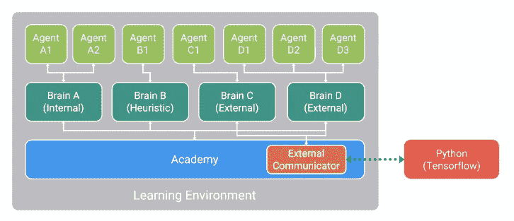

Unity Learning Environment

我们可以检查可用的大脑，并将其中一个设置为我们要用 Python 控制的大脑，如下所示。

在香蕉收集器环境中，状态空间是连续的，有 37 个维度，包含代理的线速度和代理前进方向上基于光线的物体感知。动作空间是离散的，具有 4 个维度:(1)向前移动，(2)向后移动，(3)向左转，以及(4)向右转。收集一个黄色香蕉的奖励为+1，收集一个蓝色香蕉的奖励为-1。

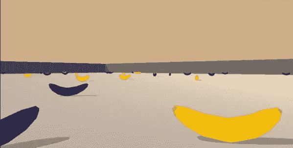

我们可以通过使用以下函数来检查状态和动作空间(大小和类型):

**Unity** 提供了一个类似**健身房的**界面来培训代理。为了得到一个初步的观察结果，我们需要调用 **env.reset()** 函数，就像我们之前对 gym 所做的那样。类似地，为了向环境发送一个动作，我们使用了 **env.step()** 函数。

正如我们之前在健身房推车杆示例中所做的那样，我们创建了一个代理，它采取随机行动，直到该集结束，返回该集的总得分(奖励的总和)。请注意，当我们训练代理时，操作将由策略(训练的算法)获得，而不是像这里一样随机获得。

正如我们所观察到的，获得的奖励是-1，这意味着代理人比黄色的香蕉摘得更多。训练后，代理人区分两者，获得的总回报更高。

与车杆环境一样，状态空间是连续的，但动作空间是离散的。因此，为了训练这个代理，我们可以使用基于值的方法，例如深度 Q 学习，或者基于策略的方法，例如近似策略优化。

在以后的文章中，我们将解释如何训练这两者:推车杆和香蕉收集代理。所以，敬请期待！😊

# 文学

*   Udaciy 课程深度强化学习[https://www . uda city . com/course/Deep-Reinforcement-Learning-nano degree-nd 893](https://www.udacity.com/course/deep-reinforcement-learning-nanodegree--nd893)
*   [https://gym.openai.com/envs/CartPole-v0/](https://gym.openai.com/envs/CartPole-v0/)
*   [https://unity3d.com/machine-learning](https://unity3d.com/machine-learning)

# **有趣的读物**

*   [https://towards data science . com/introduction-to-variable-reinforcement-learning-algorithms-I-q-learning-sarsa-dqn-ddpg-72 a5 E0 CB 6287](/introduction-to-various-reinforcement-learning-algorithms-i-q-learning-sarsa-dqn-ddpg-72a5e0cb6287)
*   [https://towards data science . com/the-complete-reinforcement-learning-dictionary-e 16230 b 7d 24 e](/the-complete-reinforcement-learning-dictionary-e16230b7d24e)

感谢阅读🍀 😃****