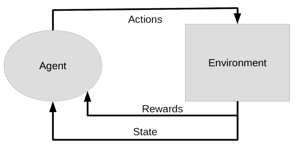
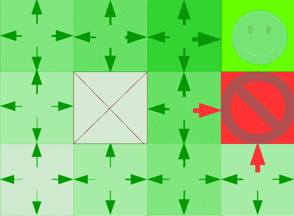
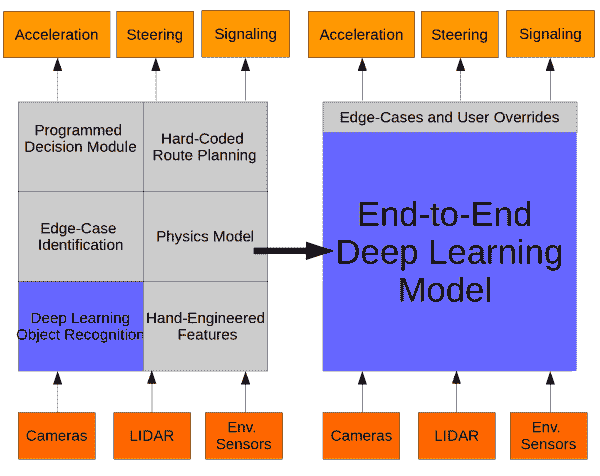

# 强化学习:从网格世界到自动驾驶汽车

> 原文：<https://towardsdatascience.com/reinforcement-learning-from-grid-world-to-self-driving-cars-52bd3e647bc4?source=collection_archive---------14----------------------->

# 0.代理、环境和奖励

在过去几年中，人工智能研究人员的许多重大声明背后是一个被称为强化学习(RL)的学科。最近的突破主要是由经典 RL 想法的微小转变推动的，这是由强大的计算硬件和利用该硬件的软件实现的。

为了了解现代深度 RL 模型对计算的渴望程度，下表收集了最近的 RL 进展和完成每项任务所需的计算资源的估计，但并不详尽。

请注意，上表中的任务都是在模拟中训练的(即使是灵巧的机器人手)，在大多数情况下，这是所需训练时间易于处理的唯一方式。对于像自动驾驶汽车这样的现实世界应用来说，这可能会变得特别棘手——稍后会有更多关于这个主题的内容。

当 RL 代理在日益复杂的环境中解决任务时，他们陷入了[维度诅咒](https://en.wikipedia.org/wiki/Curse_of_dimensionality)。这种复杂性的组合爆炸解释了为什么像 Dota Five 这样的团队游戏机器人需要在非常强大的硬件上每天训练 900 年，以击败顶级人类玩家。即使拥有像 OpenAI 为 Dota Five 所使用的那些可笑的计算资源，deep RL 尤其有许多[棘手的症结](https://www.alexirpan.com/2018/02/14/rl-hard.html)，在最好的情况下，这会使训练非常低效，在最坏的情况下，会使许多问题变得基本上难以解决。

值得注意的是，在[击败 99.5%的前职业选手](https://blog.openai.com/openai-five-benchmark-results/)后，OpenAI 的 Dota Five 在 [2018 国际](https://blog.openai.com/the-international-2018-results/)输了两场与顶级职业选手的比赛。学习曲线只会在接近精通时变得更加陡峭，对于 RL 代理来说，这是双倍的。对于 Dota Five 来说，要从顶级玩家的 99.5%提高到 99.99%，可能需要代理人迄今为止完成的自我游戏训练时间，以及暂时满足移动目标的时间。想要体验一下 RL 特工学习游戏有多难，试试[玩有假面前科的雅达利游戏](https://rach0012.github.io/humanRL_website/)。

现代 RL 产生于最优控制和行为的心理社会研究领域，后者主要包括对动物学习过程的观察。虽然 RL 的动物行为主义起源至少可以追溯到 19 世纪 50 年代亚历山大·贝恩(Alexander Bain)通过“摸索和实验”进行学习的概念，但也许更令人难忘的例子是 J.F .斯金纳(J.F. Skinner)的同名斯金纳盒子，又称操作性条件反射室。这些小室提供了一个 RL 问题的所有主要组成部分:一个具有某种变化状态的环境，一个主体，以及一个主体可以采取的潜在选择的行动空间。在动物行为中，奖励可能是由像按下杠杆以获得食物奖励这样的事情触发的，但对于 RL 问题，奖励通常可以是任何东西，精心设计一个好的奖励函数可能意味着有效代理和行为不端代理之间的差异。

# 1.Gridworld 中的质量和价值函数

到目前为止，我们已经讨论了越来越多的强化学习突破和运行 RL 模型的高性能计算需求的同时增长，以及 RL 在动物行为研究中的根源。

最优控制和动态规划是另一个重要领域，有助于我们对 RL 的现代理解。特别是，这些领域为我们提供了贝尔曼方程，用于理解给定环境状态下的最大回报(价值函数)和从给定状态下获得最高潜在回报的最佳可用行动(质量函数)。

下图是一个常见的例子，你几乎肯定会在任何 RL 课程的第一堂课上看到。

在一个简化的“网格世界”中，代理可以上下移动或左右移动。代理不能离开网格，某些网格可能会被阻止。这个环境中的状态是网格位置，而绿色笑脸表示积极的奖励，红色方框表示消极的奖励。积极和消极的奖励都伴随着退出游戏。在这个例子中，价值函数(对于给定状态的最大潜在回报)由每个方块的绿色饱和度表示，而箭头的大小和颜色对应于质量函数(对于在给定状态中采取的行动的最大潜在回报)。因为代理人对未来的奖励打折扣，而倾向于眼前的奖励，对于需要更多移动来达到目标的状态来说，价值和质量函数被削弱了。

在网格世界这样一个简单的例子中，价值和质量函数可以有效地存储在查找表中，以确保代理在给定的环境中总是做出最佳决策。对于更现实的场景，这些函数事先是未知的，并且必须探索环境以生成质量函数的估计，之后代理可以通过利用其对环境及其回报的理解来贪婪地寻求最大化回报。探索和利用 RL 环境的一种有效方式是使用深度神经网络来估计质量函数。

# 2.深度 Q 学习网络和政策梯度:端到端深度学习者

在 2013 年的一篇开创性论文中，Deepmind 的研究人员发表了一个通用强化学习器，它能够在 49 个经典雅达利视频游戏中的 29 个游戏中达到或超过人类水平。这篇论文的主要成就是，与可能特别访问游戏机制信息的更简单的强化学习问题不同，这篇论文中演示的模型仅使用游戏的像素作为输入，就像人类玩家一样。此外，同一个模型能够学习各种不同类型的游戏，从拳击到海上探险。这种方法被称为端到端深度学习，在这种方法中，输入由一端的神经网络读取，所需的行为直接学习，而无需手动编码模块将代理的不同方面粘合在一起。在 Deepmind 的 DQN 模型中，输入是视频游戏的最后几帧，输出是质量函数，描述了代理对不同行为的预期回报。

几年后，先进的深度强化学习代理变得更加简单。政策梯度代理不是学习预测每个行动的预期回报，而是训练在给定当前环境状态的情况下直接选择一个行动。这实质上是通过将强化学习问题转化为监督学习问题来实现的:

1.  智能体根据一组将智能体定义为神经网络的参数θ执行一些任务(例如，玩游戏、从 A 点开车到 B 点、操纵一个积木)。
2.  多次任务执行构成一个批次，每次任务执行的最终回报形成损失函数。
3.  代理使用梯度下降来最小化损失函数，增加了为正奖励运行做出的每个决策的概率，反之亦然。
4.  重复步骤 1 到 3，直到代理性能收敛和/或达到某个基准。

增加每一次行动(包括错误)最终产生积极回报的概率的功效似乎令人惊讶，但实际上，在许多次运行中平均下来，获胜的表现将包括更多正确的行动，而较低回报的表现将包括更多错误。这是 RL 代理学习[跑酷式运动](https://deepmind.com/blog/producing-flexible-behaviours-simulated-environments/)、[机器人足球技能](http://www.cs.cmu.edu/~mmv/papers/18robocup-SchZhuVel.pdf)，以及[自动驾驶](https://wayve.ai/blog/learning-to-drive-in-a-day-with-reinforcement-learning)的简单基础，使用策略梯度进行端到端深度学习。Wayve 的一个视频演示了一个 RL 代理在大约 20 分钟内学会在一条孤立的乡村道路上驾驶一辆实体汽车，人类操作员干预之间的距离作为奖励信号。

这是一个非常引人注目的演示，尽管非常简单。还记得前面提到的维数灾难吗？现实世界的驾驶比单车道有更多的变数。对于 RL 来说，每一个新的方面都需要指数级的训练要求。鉴于目前的技术水平，完全自动驾驶汽车不可避免地需要在模拟环境中进行 soem 程度的学习，大量的手工编码模块将功能联系在一起并处理边缘情况，或者两者兼而有之。

# 3.像深度学习吃掉自动驾驶一样走向现实世界

机器学习的现代复兴承诺的最明显的应用之一是自动驾驶汽车。汽车可能是最危险的现代技术，因为世界卫生组织估计全球每年有 125 万人死于道路交通事故。确定自动驾驶汽车的经济影响很困难，但保守估计仅在美国每年就有 190 亿美元(T2)到 6420 亿美元(T4)不等。

现代自动驾驶起源于 20 世纪 80 年代和 90 年代的项目，如控制卡内基梅隆自动驾驶试验台的 ALVINN 和德国联邦国防军大学的 Ernst Dickmann 的工作。现代自动驾驶开发人员可能对这些项目的许多组件很熟悉:ALVINN 利用神经网络从 30×32 视频馈送和激光测距仪输入中预测转弯曲率。为了绕过计算瓶颈，Dickmann 的动态视觉系统根据预期重要性将计算集中在图像的预定义区域，这一概念与现代网络中的[神经注意力](https://distill.pub/2016/augmented-rnns/)非常相似。

上世纪 80 年代和 90 年代自动驾驶汽车的许多创新都是克服数据吞吐量或处理瓶颈所必需的。最近，计算能力的可用性不再是瓶颈，克服完全汽车自动驾驶的最后 10%左右的挑战的主要挑战与确保训练数据的可靠性和有效处理不寻常的边缘情况有关。

神经网络在计算机视觉任务中的[成功使这些成为深度学习的明显工作，典型的工程方法可能会将视觉深度学习与其他学习或硬编码模块相结合，以处理驾驶的所有方面。自动驾驶开发人员越来越多地依赖于具有高质量训练数据和精心设计的目标函数的聪明模型，来学习一套更全面的驾驶技能，而不是设计和训练必须由许多才华横溢的工程师强迫一起工作的单独模型。如果我们想象一下自动驾驶技术栈的状态和该领域的发展方向，它可能看起来像下面的框图。](https://blog.exxactcorp.com/atrous-convolutions-u-net-architectures-for-deep-learning-a-brief-history/)

# 4.结论:你什么时候能期待你的车来接你？

几十年前的自动驾驶汽车领先于他们的时代，受到处理时间和数据吞吐量的计算限制的约束。那时和现在的主要区别在于强大计算资源的可用性。许多研究人员指出，2012 年在图形处理单元(GPU)上训练的卷积神经网络在 [ImageNet 大规模视觉识别挑战赛](http://www.image-net.org/challenges/LSVRC/)中的惊人表现点燃了机器学习的现代复兴，其特点是在大数据集上训练大模型，并利用[GPU](https://blog.exxactcorp.com/category/graphics-cards/)的并行处理能力。这已经形成了一个良性循环，吸引了更多的兴趣和资金，导致了进一步的成就和更广泛的实用领域，并最终推动了旧思想的新突破。要实现我们可以信任的完全自动驾驶汽车，仍有大量挑战需要克服，随着计算资源的不断改善，肯定会有更多令人兴奋和未知的机会来解决有趣的问题。

鉴于混乱的现实世界条件的组合爆炸的后果和涉及的高风险，RL 可能需要根本性的突破才能使完全自动驾驶成为现实。学习如何处理看不见的边缘情况，或者训练像“道路的基本规则是在不造成伤害的情况下绕过”这样的高级规则，都不是 RL 擅长的事情。例如，专注于正确识别磨损或涂错的车道标志，远不如教会驾驶代理人预测并避免骑自行车的人避开自行车道以避开坑洞重要。从车道保持和识别明显和已知的障碍到零干预驾驶的学习曲线很陡，正确地爬坡是收获全自动驾驶汽车等技术的回报和推迟未来(也许是无限期地)的灾难性后果之间的区别。