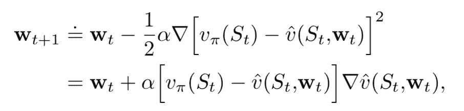
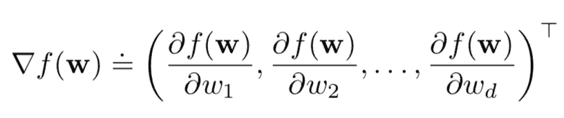
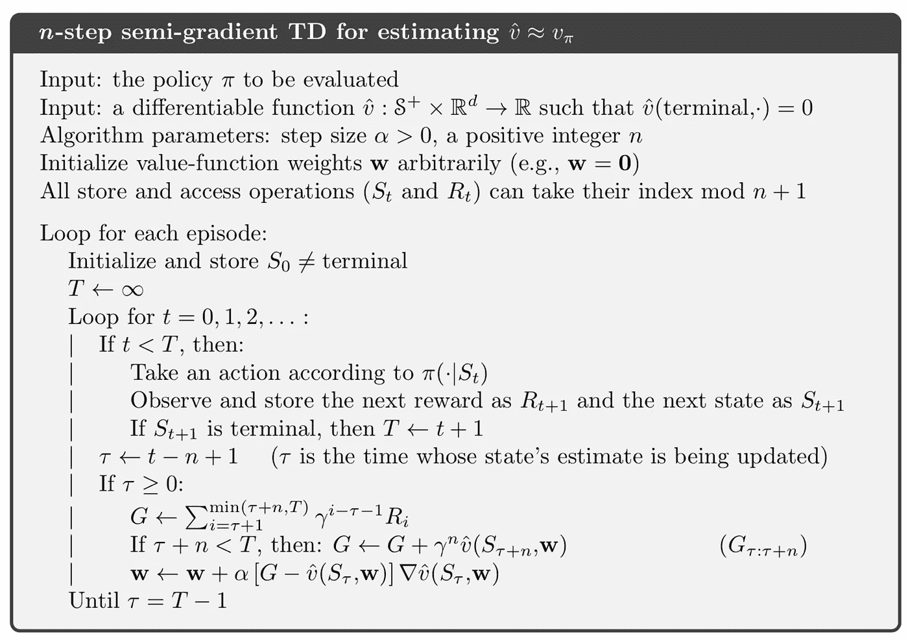
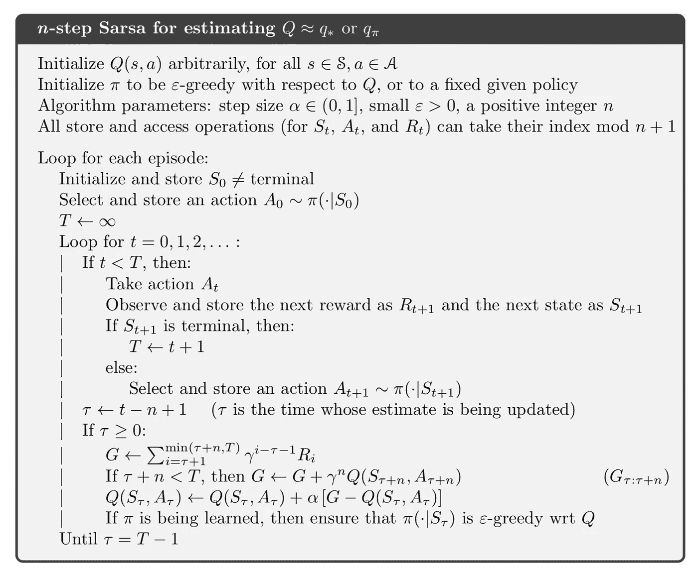
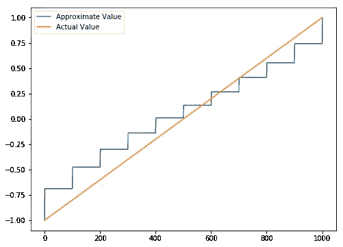
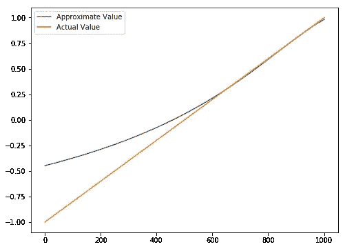
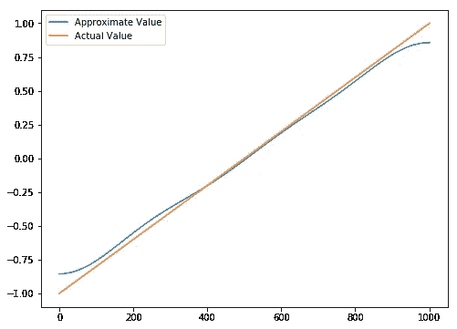

# 强化学习——连续状态空间中的推广

> 原文：<https://towardsdatascience.com/reinforcement-learning-generalisation-in-continuous-state-space-df943b04ebfa?source=collection_archive---------6----------------------->

## 随机游走例子的函数逼近

到目前为止，我已经介绍了离散状态、动作设置的强化学习的最基本的思想和算法。回想一下我们到目前为止已经实现的例子，网格世界，井字游戏，多臂强盗，悬崖漫步，二十一点…等等，其中大多数都有一个棋盘或网格的基本设置，以便使状态空间可数。然而，强化学习的力量并不止于此，在现实世界的情况下，状态空间大多是连续的，有不可计数的状态和动作组合供代理探索。在本文中，我将把我们以前学到的概念扩展到连续空间，并通过应用函数逼近实现一个更一般的随机行走例子。

从这篇文章中，我将介绍:

1.  如何使用参数方法逼近值函数
2.  半梯度 TD 方法(是 n 步 TD 方法的扩展)
3.  用于近似的一些通用函数
4.  在随机漫步例子中应用函数


# 一般化的想法

对于离散的状态空间，理论上一个智能体能够经历每一个状态并探索每一个状态的回报。当情况被扩展到连续状态空间时，**为了概括价值函数，我们将需要状态的表示**。

## 函数逼近

考虑一个监督学习问题，无论应用什么算法，被训练的模型都能够对它从未见过的数据进行预测，神奇的是，它学习了`y = f(x)`的表示，其中`x`是输入特征，`y`是目标。这种近似或概括的思想可以准确地复制到强化学习问题中，(事实上，机器学习中的大多数算法都可以应用于强化学习设置中的函数近似)，其中我们尝试近似值函数`v = v(s, w)`(其中`s`是状态，`w`是模型权重)，并将状态、值作为训练示例。例如，在其最简单的形式中，我们可以定义价值函数`v = w_0*s + w_1`，使用一阶线性近似。

## 更新权重

现在问题来了，我们有了一个价值函数的表示，那么我们如何能够更新参数的权重，以使值接近实际值呢？事实上，权重更新遵循*随机梯度下降(SGD)* 中的规则:



weight update

其中`v(S_t)`表示步骤`t`的实际值，`v(S_t, w_t)`表示带有权重参数`w_t`的近似函数。请注意，实际值和估计值之间的平方差衡量近似函数的误差，通过对`w_t`求导，砝码会稍微向正确的方向调整。

> 随机梯度下降(SGD)方法通过在每个示例之后在最能减少该示例的误差的方向上少量调整权重向量来做到这一点。

对于具有多个权重参数近似函数，应该通过分别求导来更新每个权重:



# n 步半梯度 TD 方法

现在让我们来看看在连续状态空间中应用的算法:



TD Method in Continuous Space

看起来有很多步骤，但是如果你仔细看，你会发现它和我们在这里学的 n 步 TD 方法超级相似。看看离散空间中的 n 步 TD 方法:



TD Method in Discrete Space

这里的 Q 函数可以用价值函数来代替。通过比较连续空间和离散空间的 TD 方法，可以看出**唯一的区别在于价值函数的更新，而在离散空间，价值函数(或 Q 函数)是直接更新的，在连续空间，价值函数是通过权重更新隐式更新的，因为这里的价值函数用权重** `w`表示。你需要注意的另一件事是，在连续空间中，目标值取为`*G*` *，*在 1 步 TD 法中是前一步的累积值，在蒙特卡罗模拟(本质上是我们之前讲过的无限 TD 法)中是直到一集结束的累积值。

# 一般近似函数

正如我们上面提到的，在连续空间设置中，值函数是状态(`V = V(S, w)`)的表示，大多数机器学习算法都可以在这里应用。在这篇文章中，我将介绍一些最基本的近似函数，它们很容易实现，并帮助你了解如何在强化学习问题中应用它们。

## 状态聚合

函数逼近的最简单形式。比如，假设空间中有 10 个状态(1，2，3，…，10)，我们设 1 到 5 有相同的值，6 到 10 有另一个值，那么这就叫状态聚合。数学表示可以是:

```
V(S) = w_0 if 1≤S≤5
V(S) = w_1 if 5<S≤10
```

函数很简单，但非常重要，因为这个想法在 Tile 编码中非常关键，Tile 编码是一种函数泛化技术，在强化学习问题中被大量使用。**状态聚合的优点是每个聚合会话中状态的导数为 1，该状态的值为相应的权重**。

## 多项式

我们将在此应用的多项式函数可以写成:

```
V(S) = w_0*S^0 + w_1*S^1 + ...
```

在这种情况下，权重参数的导数总是其对应于状态的幂的值。

## 傅里叶

与多项式情况类似，这里应用的傅立叶函数为:

```
V(S) = w_0*cos(0*πs) + w_1*cos(1*πs) + ...
```

重量 *w_i* 的导数为 *cos(i*πs)。*

请注意，这里介绍的多项式和傅里叶在权重参数方面都是线性的，因为这保证了收敛性。此外，这里我只介绍了一个国家的情况，更普遍的形式，请参阅萨顿的书。

# 1000 态随机行走

对于定理来说已经足够了，让我们应用我们所学的，并得到一个实际的案例。

## 规则

考虑一个 1000 状态版本的随机行走任务。这些状态从左到右从 1 到 1000 编号，并且所有情节都在状态 500 中的中心附近开始。状态转换是从当前状态到其左侧的 100 个相邻状态之一，或者到其右侧的 100 个相邻状态之一，所有这些都具有相等的概率。当然，如果当前状态接近一个边，那么在它的那一边可能有不到 100 个邻居。在这种情况下，那些丢失的邻居的所有概率都变成了在该侧终止的概率(因此，状态 1 有 0.5 的机会在左侧终止，而状态 950 有 0.25 的机会在右侧终止)。像往常一样，左边的终止产生-1 的回报，右边的终止产生+1 的回报。所有其他转换的奖励为零。

还记得我们在另一篇文章中谈到的 100 态随机漫步吗，这里的规则基本相同。不同之处在于

1.  每一步的范围从 1 到 100
2.  当代理闯入边界时，它在那里结束

## Python 实现

我之前实现了离散状态空间上的随机行走，你可以在这里查看。下面的实现中，我将重点介绍两者的区别。

## 近似函数

连续状态空间中强化学习的灵魂。价值函数应该能够做到

1.  获取给定状态的值
2.  给定状态和时间差异，更新权重

**聚集状态函数**

*对于状态聚合，1000 个状态被分成 10 组，每组 100 个状态(即状态 1-100 为一组，状态 101-200 为另一组，依此类推)*

1000 个状态被分成 10 组，每组都有一个值存储在`self.values`中。`value`函数仅返回存储在相应组中的值，而`update`函数通过添加`delta*dev`来更新该值，如上所述，这里导数为 1，`delta`为`*G-V(S, w)*`。(注意，这里的`value`实际上是权重参数)

**多项式&傅立叶函数**

`LinearValueFunction`包括多项式函数和傅立叶函数。在`value`函数中，`features`是值函数表示的组件列表，在`update`函数中，导数等于组件值，如上所述。

## 采取行动

与之前的随机行走不同，这里代理可以走得更快(从 1 步到 100 步)，当它的位置到达边界外时，该集结束，奖励将为-1 或 1。

## 玩游戏

有了以上所有的准备工作，播放功能就容易实现了。该结构与我们之前的实现非常相似:

如果你一直在跟进我以前的帖子，你一定见过这个结构很多次了。这里唯一的区别是价值函数被`valueFunction`代替了。

## 学习结果

应用了三个不同的值函数，让我们比较一下学习结果。([全面实施](http://localhost:8888/edit/RandomWalk(General)/RandomWalk.py))



Aggregate State

对于具有 1 个步骤的聚集状态函数，1000 个状态被聚集成 10 个组，每个组有 100 个状态，这就是为什么您会看到类似楼梯的图形。



Polynomial Function

这是具有 5 阶和 1 阶多项式函数的学习图，从中我们看到在较低状态的发散和在较高状态的收敛。这是因为对于多项式函数近似，总是存在截距，从而使得状态 0 的值是非零的(通常，多项式函数不被识别)。



Fourier Function

这是目前最好的近似，通常傅里叶函数比多项式函数具有更好的性能。

# 结论

我们在这里学习了连续空间中强化学习的基本理论，并实现了一些基本的近似函数。当然，这个想法不仅仅局限于这些功能。在更高级的设置中，可以利用神经网络功能，这产生了深度强化学习问题。

在下一篇的[中，我将介绍 tile 编码，并将其应用于连续状态空间中的 Q 函数学习，这比随机游走例子更具一般性。](/reinforcement-learning-tile-coding-implementation-7974b600762b)

**参考**:

*   【http://incompleteideas.net/book/the-book-2nd.html 
*   [https://github . com/JaeDukSeo/reinforcement-learning-an-introduction](https://github.com/JaeDukSeo/reinforcement-learning-an-introduction?source=post_page---------------------------)