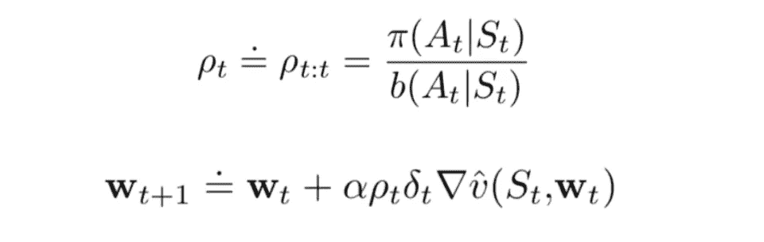
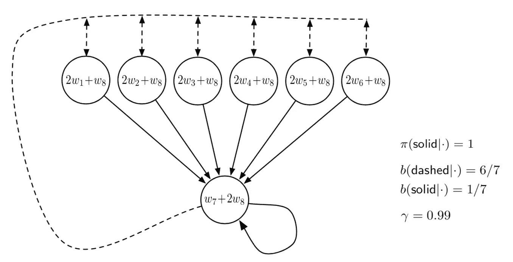
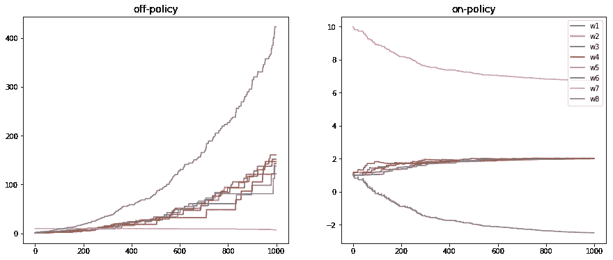
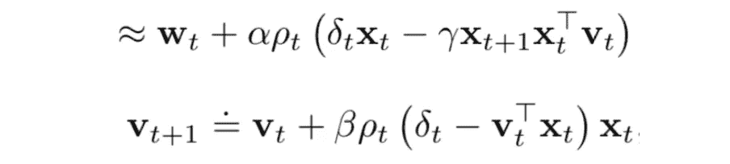
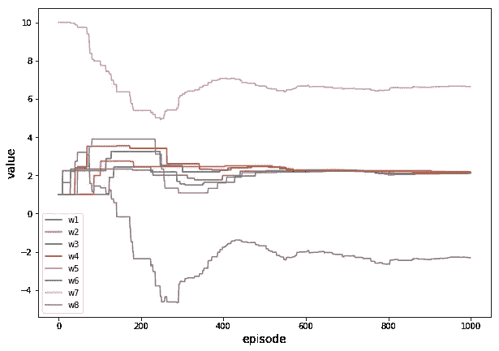

# 强化学习——非策略学习的概括

> 原文：<https://towardsdatascience.com/reinforcement-learning-generalisation-of-off-policy-learning-61468b0bc138?source=collection_archive---------14----------------------->

## 贝尔德反例

到目前为止，我们已经将我们的强化学习主题从离散状态扩展到连续状态，并详细阐述了将瓦片编码应用于基于策略的学习，即学习过程遵循代理所采取的轨迹。现在让我们来谈谈在连续环境下的非政策学习。虽然在离散的设置中，基于策略的学习可以很容易地推广到非策略的学习(比如，从 Sarsa 到 Q-learning)，但在连续的设置中，这种推广可能有点麻烦，在某些情况下可能会导致分歧问题。在本文中，我将:

1.  介绍由政策外学习的延伸所引起的问题
2.  举贝尔德反例来说明这个问题
3.  介绍解决问题的潜在方法

# 政策外学习的问题

偏离政策学习最突出的结果是，它可能不一定在连续的环境中收敛。主要原因是由于*非策略情况下的更新分布不符合策略分布，*即状态，用于更新的动作可能不是代理采取的状态、动作。下面进入更新公式，进一步说问题。在偏离策略学习的连续状态下，1 步更新流程如下:

注意，与政策上的概括相比，多了一个术语`ρ`，称为重要性抽样比率。`ρ`由目标策略`π`除以行为策略`b`，*计算。在控制中，目标策略通常是相对于动作值函数的当前估计的确定性贪婪策略。该策略成为确定性的最优策略，而行为策略保持随机且更具探索性，例如，ϵ-greedy 策略*。回想一下，在 Q 学习的离散状态空间中，时间差异是`max{Q(S', A')} — Q(S, A)`(不考虑奖励)**，因此在每次状态更新时，最大 Q 值(来自贪婪策略)用于更新，而不是实际状态的值，即代理采取的动作(行为策略)**。在连续空间中，使用行为策略利用重要性抽样来接近目标策略值。关于`ρ`的更多解释，可以参考这里的和这里的(关于重要性抽样的更多解释，可以参考这里的)。

公式的其余部分与 on-policy learning 相同，其中`w`是权重向量，`δ`是时间差异(注意，根据问题是否是情节性的，δ略有差异，对于非情节性的情况，请参考此处的)。

根据萨顿在书中的描述，政策外学习的差异是由以下原因造成的:

> 一个转换重复发生，而`w`不会在其他转换中更新。这在非策略训练下是可能的，因为行为策略可能选择目标策略永远不会选择的那些其它转变上的动作。

不要担心，如果你有一点困惑，让我们继续一个例子，看看权重如何发散。

# 贝尔德反例

这是一个著名而简洁的例子，说明了偏离政策学习的发散特征。

## 问题描述

Baird Example

*虚线动作以相等的概率将系统带到六个上状态之一，而实线动作将系统带到第七个状态。* `*behaviour policy b*` *选择概率为*`*6/7*`*`*1/7*`*的虚线和实线动作，使其下的下一状态分布均匀(所有非终结状态相同)，这也是每集的起始分布。目标策略* `*π*` *总是采取稳健的行动，所以策略上的分布(对于* `*π*` *)集中在第七个状态。所有转场的奖励是* `*0*` *。折现率为* `*γ = 0.99*` *。*(仅出于简单和说明的原因，目标策略设置为固定)*

*请注意，每个圆圈内是使用权重向量的每个状态的表示。*

*在下面的实现中，步长`α = 0.01`和初始权重是`w = (1, 1, 1, 1, 1, 1, 10, 1)`。*

# *履行*

*检查完整的[实现](https://github.com/MJeremy2017/Reinforcement-Learning-Implementation/blob/master/BairdExample/BairdCounterExample.py)*

## *初始化*

*尽管有一些常规设置，注意`self.features`是每个状态的表示，而`self.weights`是权重向量(初始值是特意设置的)。权重和特征的乘积是每个状态的值。*

## *行动*

*行动的选择和采取遵循规则。*

## *价值函数*

*如上所述，值函数通过将特征和权重相乘来返回状态的值。*

## *违反政策运行*

*有了上面的准备，我们就可以让代理学习了。在每一轮中，代理重复状态、动作、下一个状态、下一个动作……的过程，因为我们设置目标策略总是选择`solid`行，当代理采取动作`dash`时，重要性抽样比率将为 0，当它采取`solid`动作时，重要性抽样比率为`1/self.prob`。`sarsa`参数用于控制是否使用基于策略的学习(在基于策略的学习中，目标策略总是行为策略，因此`ρ = 1`)，这仅用于结果比较。*

## *学习结果*

**

*看到在偏离策略的学习中，权重发散到无穷大，而在策略上的方法(在这种情况下是 Sarsa)收敛。现在我们再来看一下图像，解释一下原因:*

**

*例如，当代理从最左边的状态(2*w1+w8)到底部的状态(w7+2*w8)采取一个固体动作时，如果 w8 通过上面的公式增加它的值，这将导致两个状态的值增加，因为它们共享权重 w8。然而，从底部状态开始，通过采取 dash 动作不会有助于偏离策略学习，因为在这种情况下`ρ`为 0，这导致 w8 的值总是增加但从不减少。萨顿是这样说的:*

> *一个转换重复发生，而`*w*`不会在其他转换中更新。这在非策略训练下是可能的，因为行为策略可能选择目标策略永远不会选择的那些其它转变上的动作。*

# *解决方法*

*就解决方案而言，第一个是在连续空间设置上不使用偏离策略的学习，而总是使用符合策略的学习。另一种方法是改变目标误差函数。到目前为止，所有的函数逼近更新都是基于`(true_value — current_value)^2`的目标误差，但是为了使训练过程收敛，萨顿在他的书中建议最小化投影贝尔曼误差(PBE)。详细解释请参考他的书[这里](http://incompleteideas.net/book/the-book-2nd.html)，第 11 章。*

*这里我给出了这种方法的一个简单实现，并将其与经典的偏离策略学习进行了比较。通过最小化 PBE，可以得到一个更新公式:*

**

*其中`β`是另一个步长参数，而`vt*xt` (xt 是特征向量)是`ρ*δ`的近似值。这种方法被称为带梯度修正的时延估计(TDC)*

# *贸发局的实施*

*唯一的区别在于`run`功能:*

*这个过程完全遵循上面的公式，使用 TDC，我们得到一个学习过程:*

**

*Learning Process of TDC*

*请注意，权重会慢慢收敛到最佳值。还有其他介绍的解决问题的方法，有兴趣的可以自己了解一下(查看完整[实现](https://github.com/MJeremy2017/Reinforcement-Learning-Implementation/blob/master/BairdExample/BairdCounterExample.py))。*

*最后，提到萨顿的书的结尾部分:*

> *政策外学习的整个领域相对较新且不稳定。哪种方法是最好的，甚至是合适的，现在还不清楚。本章末尾介绍的新方法的复杂性真的有必要吗？其中哪些可以和方差缩减法有效结合？政策外学习的潜力仍然诱人，实现它的最佳方式仍然是个谜。*

***参考**:*

*   *【http://incompleteideas.net/book/the-book-2nd.html *
*   *[https://github . com/Shang tongzhang/reinforcement-learning-an-introduction](https://github.com/ShangtongZhang/reinforcement-learning-an-introduction)*