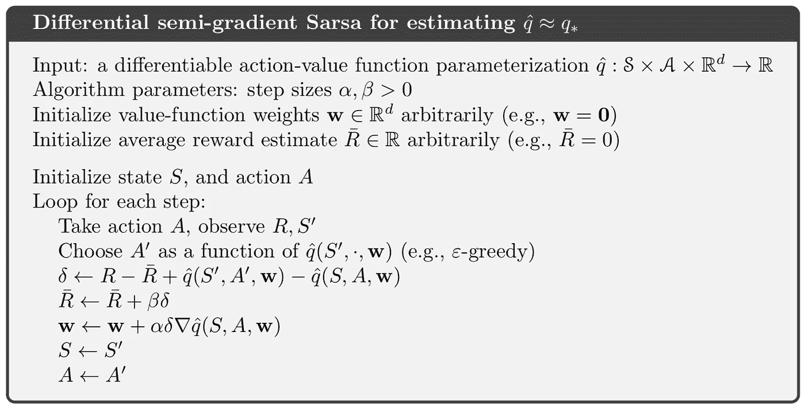
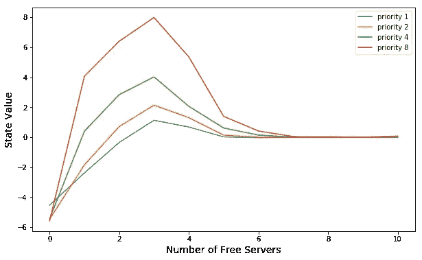
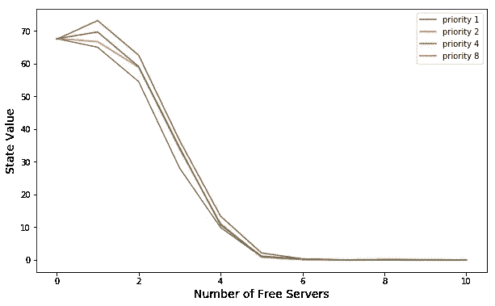

# 强化学习——连续任务的概括

> 原文：<https://towardsdatascience.com/reinforcement-learning-generalisation-on-continuing-tasks-ffb9a89d57d0?source=collection_archive---------16----------------------->

## 服务器访问示例实现

到目前为止，我们已经经历了许多强化学习的例子，从基于策略到不基于策略，从离散状态空间到连续状态空间。所有这些例子在某些方面都有所不同，但你可能已经注意到它们至少有一个共同的特点——情节性，即所有这些都有一个明确的起点和终点，每当代理达到目标时，它就会一次又一次地重新开始，直到达到一定数量的循环。在本文中，我们将把这一思想扩展到非情节任务，即没有明确终点的任务，并且主体在环境设置中永远继续下去。在本文中，我们将

1.  学习应用于非情节任务的思想和算法
2.  实现服务器访问示例([瓦片编码](/reinforcement-learning-tile-coding-implementation-7974b600762b)是必需的)

# 平均报酬

应用于非偶发性任务的主要概念是平均报酬。*平均奖励设置也适用于持续问题，即代理和环境之间的交互永远持续下去而没有终止或开始状态的问题。然而，与这种设置不同，这里没有折扣——代理人对延迟奖励的关心和对即时奖励的关心一样多。*所以关键是

1.  在此设置下没有折扣系数
2.  平均奖励将被引入算法

让我们直接进入算法，我会解释为什么会这样。

## 差分半梯度 Sarsa

首先，该算法适用于连续状态空间，实际上，智能体的探索过程和权重更新过程与我们之前谈到的其他算法是相同的，不同之处在于这里引入的平均奖励项。

关键区别在于δ的定义，在继续任务中，奖励定义为`R(S, A) — R(average)`，即当前状态下收到的奖励与直到当前状态的平均奖励之差。我给大家直观的解释一下为什么这里要引入平均奖励，回想一下`R(S, A) + Q(S', A')`的定义，它是对`Q(S, A)`的价值的估计，等于代理人一路走到游戏结束要收集的奖励。然而，在一个连续的任务中，游戏永远不会结束，因此收集的奖励可能趋于无穷大，它需要一个项来约束估计值，然后得到平均奖励！

随着步骤的进行，平均奖励也需要更新(注意，β是奖励更新专用的学习率)。**对于平均奖励设置，就像为代理设置了一个基线，只有当代理进行一个给出高于平均奖励的行为时，权重才能被正向更新，否则为负向**(不考虑下一个状态的 q 值)。如果你仍然不相信这个解释，并且怀疑如果没有平均奖励项会发生什么，我会在帖子的最后给你看没有平均奖励的服务器访问示例的学习结果。

# 服务器访问实现

现在让我们将该算法应用于一个具体的连续任务示例，该示例引自 Sutton 的书，名为**访问控制排队任务**。

## 问题描述

*这是一个决策任务，涉及到对一组* ***10 台服务器*** *的访问控制。* ***四个不同优先级*** *的客户到达一个队列。如果被给予访问服务器的权限，客户向服务器支付* ***奖励 1、2、4 或 8*** *，这取决于他们的优先级，优先级越高的客户支付的越多。在每个时间步中，队列最前面的客户要么被接受(分配给其中一个服务器)，要么被拒绝(从队列中删除，奖励为零)。在这两种情况下，在下一个时间步，考虑队列中的下一个客户。队列永远不会清空，队列中客户的优先级是平均随机分布的。当然* ***如果没有免费的服务器*** *顾客就无法得到服务；在这种情况下，顾客总是被拒绝。* ***每个繁忙的服务器在每个时间步长上以概率*** `*p = 0.06*` ***空闲。*** ***任务是在每一步决定是否接受或拒绝下一个顾客，依据他的优先级和免费服务员的数量，从而最大化长期报酬而不打折扣。***

概括地说，我们的代理需要根据客户的优先级和当前的免费服务器数量来决定是否接受客户，以便获得最大的长期回报。这个游戏设置肯定是一个持续的任务，因为这个过程永远不会结束，因为等待队列永远不会是空的。状态为`(numberOfFreeServers, customerPriority)`，行动为拒绝或接受，根据客户的优先级，奖励为 1、2、4、8。如果你清楚这些规则，让我们开始执行吧。([全面实现](https://github.com/MJeremy2017/Reinforcement-Learning-Implementation/blob/master/AccessControl/ServerAccess.py))

## 价值函数

这是一个离散状态任务，但是由于我们已经集中讨论了在连续状态上应用瓦片编码，我们将在状态空间的表示中再次应用它，即使它是离散的(我们在这里应用的瓦片编码函数在这里[讨论](/reinforcement-learning-on-policy-function-approximation-2f47576f772d))。

这实际上是一个 Q 值类，我们在里面设置了 8 个 tilings，总共 2048 个网格。动作 1 代表接受，0 代表拒绝。`value`函数根据当前状态(n_server，priority)和动作给出值，`update`函数相应地更新权重。`stateValue`函数返回状态的最大值(这个函数只会用在可视化部分)，注意当空闲服务器数为 0 时，它返回动作 0 的值(总是拒绝)。

现在让我们进入主类:

## 初始化

所有这些初始化都是不言而喻的，并且对于每个服务器，免费概率是 0.06。

## 动作选择

`numFreeServers`函数根据当前状态给出当前空闲服务器的数量。`chooseAction`函数基于当前状态和我们上面讨论的值函数选择动作，动作选择方法也是ϵ-greedy.

## 下一个状态和奖励

在代理采取行动之后，我们需要判断下一个状态，如果行动被接受，空闲服务器的数量将减 1，如果行动被拒绝，空闲服务器的数量保持不变。下一个客户的优先级是随机生成的。

`giveReward`函数只是根据客户的优先级给出奖励。在拒绝动作的情况下，奖励总是 0。

## 滚动游戏

最后的`run`函数，我们会把整个过程组装起来，让代理学习。

该函数非常简单，因为一切都完全按照算法中的步骤进行。([全面实施](https://github.com/MJeremy2017/Reinforcement-Learning-Implementation/blob/master/AccessControl/ServerAccess.py))

# 结果

现在让我们看看我们的代理表现如何:

这是 50，000 轮后的结果，其中α=0.01，β=0.01，exp_rate=0.1。*图表右侧的下降可能是由于数据不足；这些状态中有许多是从未经历过的。*

最后，让我告诉你如果没有平均回报期限会发生什么。

状态值比实际值大得多，事实上，我们运行的轮数越多，状态值就越大，因为δ没有被很好地限制。

**参考**:

*   [http://incompleteideas.net/book/the-book-2nd.html](http://incompleteideas.net/book/the-book-2nd.html?source=post_page---------------------------)
*   [https://github . com/Shang tong Zhang/reinforcement-learning-an-introduction](https://github.com/ShangtongZhang/reinforcement-learning-an-introduction)