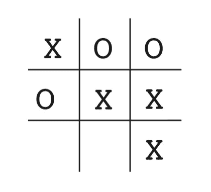
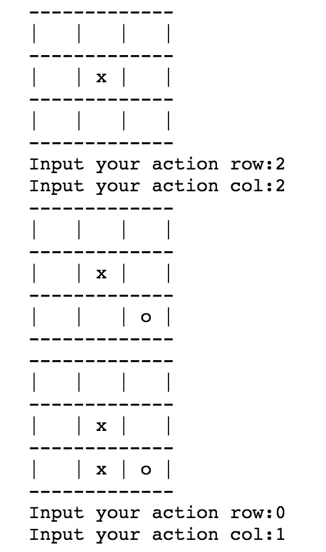

# 强化学习—实施 TicTacToe

> 原文：<https://towardsdatascience.com/reinforcement-learning-implement-tictactoe-189582bea542?source=collection_archive---------3----------------------->

## 两个代理人游戏介绍

我们通过迭代更新 *Q* 值函数，即`(state, action)`对的估计值，实现了网格世界游戏。这一次，我们来看看如何在对抗性游戏中利用强化学习——井字游戏，其中有更多的状态和动作，最重要的是，有一个对手与我们的代理人对抗。(查看[之前的帖子](https://medium.com/@zhangyue9306/implement-grid-world-with-q-learning-51151747b455))

# 强化学习的优势

然而，在一般的博弈论方法中，比如最小-最大算法，算法总是假设一个完美的对手是如此理性，以至于它采取的每一步都是为了最大化它的回报和最小化我们的代理人回报，在强化学习中，它甚至没有假设对手的模型，结果可能会出乎意料地好。

通过将对手视为智能体可以与之交互的环境的一部分，在一定数量的迭代之后，智能体能够在没有智能体或环境的任何模型的情况下提前计划，或者对可能的未来动作或状态进行任何搜索。优点是显而易见的，因为该方法省去了复杂的数学推导或探索大量搜索空间的努力，但是它能够通过简单的尝试和学习来达到最先进的技能。

在接下来的会议中，我们将:

*   首先，训练两个代理相互对战并保存他们的策略
*   第二，加载策略，让代理人扮演人类

# 状态设置

首先，我们需要一个州级机构来充当董事会和法官。它具有记录双方玩家棋盘状态的功能，并在任何一方玩家采取行动时更新状态。同时，它能够判断游戏的结束，并相应地给予玩家奖励。(点击 查看 [*代码)*](https://github.com/MJeremy2017/RL/blob/master/TicTacToe/ticTacToe.py)

tic-tac-toe board

为了阐明这个强化学习问题，最重要的是要清楚 3 个主要组成部分——状态**，行动，和奖励**。这个游戏的状态是代理人和它的对手的棋盘状态，所以我们将**初始化一个 3×3 的棋盘，用 0 表示可用的位置，如果玩家 1 移动，用 1 更新位置，如果玩家 2 移动，用-1 更新位置**。动作是玩家根据当前棋盘状态可以选择的位置。奖励在 0 到 1 之间，只在游戏结束时给出。

## 初始化

在`init`功能中，我们初始化一个空棋盘和两个玩家`p1`和`p2`(我们初始化`p1`以先玩)。每个玩家都有一个`playSymbol`，当玩家采取一个动作时，它的`playerSymbol`会被填入棋盘并更新棋盘状态。

## 董事会状态

`getHash`函数对当前电路板状态进行哈希运算，以便将其存储在状态值字典中。

当玩家采取行动时，其对应的符号将被填入棋盘。并且在状态被更新后，棋盘还会更新当前棋盘上的空位，并依次反馈给下一个玩家。

## 检查赢家

在玩家采取每一个动作后，我们需要一个函数来持续检查游戏是否已经结束，如果结束，判断游戏的赢家，并给予双方玩家奖励。

`winner`函数检查行、列和对角线的总和，如果`p1`赢则返回 1，如果`p2`赢则返回-1，如果平局则返回 0，如果游戏尚未结束则返回`None`。在游戏结束时，1 奖励给赢家，0 奖励给输家。需要注意的一点是，我们认为平局也是一个糟糕的结局，所以我们给我们的代理人`p1` 0.1 的奖励，即使游戏是平局(可以尝试不同的奖励，看看代理人如何行动)。

# 播放器设置

我们需要一个代表我们代理的玩家类，玩家能够:

1.  基于状态的当前估计选择动作
2.  记录游戏的所有状态
3.  每场比赛后更新状态值估计
4.  保存并加载策略

## 初始化

我们将初始化一个`dict`存储状态值对，并在每局游戏结束时更新估计值。

在`init`函数中，我们在列表`self.states`中记录玩家在每场比赛中的所有位置，并在`self.states_value` dict 中更新相应的状态。在行动选择方面，我们使用ϵ-greedy 方法来平衡探索和开发。这里我们设置了`exp_rate=0.3`，意思是`ϵ=0.3`，所以 70%的时间我们的代理将采取贪婪的行动，这是基于状态值的当前估计选择行动，30%的时间我们的代理将采取随机行动。

## 选择操作

我们将板状态的散列存储到状态值字典中，并且在利用时，我们散列下一个板状态并选择返回下一个状态的最大值的动作。

## 状态值更新

为了更新状态的值估计，我们将应用基于以下公式更新的值迭代

Value Iteration(From Reinforcement Learning an Introduction)

公式简单的告诉我们 ***状态 t 的更新值等于状态 t 的当前值加上下一个状态的值和当前状态的值之差，再乘以一个学习率α(假设中间状态的奖励为 0)*** 。

逻辑是我们基于我们最新的观察慢慢更新当前值。

正如我上面提到的，每场比赛的位置存储在`self.states`中，当代理到达比赛结束时，估计值以`reversed`的方式更新。

## 培养

既然我们的代理能够通过更新价值评估来学习，并且我们的板都设置好了，那么是时候让两个玩家互相对战了(**这个部分放在 State 类**中)。

在训练期间，每个球员的过程是:

*   寻找空缺职位
*   选择操作
*   更新棋盘状态并将动作添加到玩家状态
*   判断游戏是否结束，并给予相应的奖励

## 保存和加载策略

在训练结束时(在一定数量的回合之后玩)，我们的代理能够学习它的策略，它存储在状态值字典中。我们需要保存这个策略来对抗人类玩家。

# 人类 VS 计算机

现在我们的代理已经设置好了，在最后一步，我们需要一个人类类来管理与代理的游戏。

这个类只包含了一个可用的函数`chooseAction`，它要求我们输入我们想要的棋盘位置。

而且我们还需要修改一下`play`函数内部的状态:

大致相同，我们让 1 号玩家(也就是我们的代理人)先玩，每走一步，棋盘就印好了。

## 玩得开心！

Play against human

`play2`功能我们显示棋盘状态，并要求你在游戏过程中输入你的位置。

自己去试试，玩得开心！(点击 查看 [*代码)*](https://github.com/MJeremy2017/RL/blob/master/TicTacToe/ticTacToe.py)

参考:

*   [http://incompleteideas.net/book/the-book-2nd.html](http://incompleteideas.net/book/the-book-2nd.html)
*   [https://github . com/JaeDukSeo/enforcement-learning-an-introduction](https://github.com/JaeDukSeo/reinforcement-learning-an-introduction)