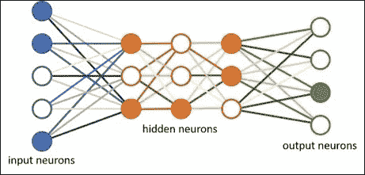
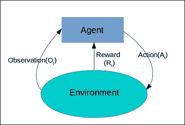
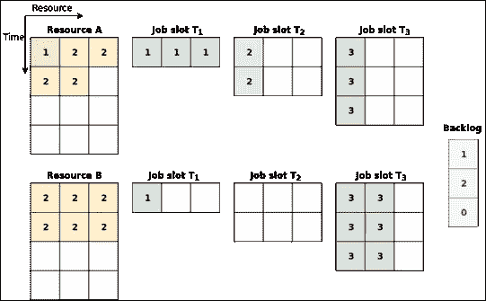

# 作业调度中的强化学习

> 原文：<https://towardsdatascience.com/reinforcement-learning-in-job-scheduling-8b23ef6a596b?source=collection_archive---------12----------------------->

In October 2015, AlphaGo, an AI-powered system, beat Mr Fan Hui, the reigning 3-times European Champion of the complex board game *Go*, by 5 points to 0\. It was the first time an AI conquered a human in such a sophisticated game.

> 写我的第一篇媒体文章的想法引起了我的兴趣，因为我相信这可以给我一个平台来分享和贡献我想从社区成员那里读到的东西。一个外行人很难理解科学出版物和研究论文，以至于他/她要花几天甚至几周的时间才能彻底理解术语和院士工作的新颖性细节。因此，我以此为媒介(*这是一个巧合的双关语*)开始撰写和解释一个特定的科学贡献，尽我所知，鼓励其他作家以类似的方式做出贡献。

我想以基于出版物的第一篇文章开始我的系列文章，标题为“使用深度强化学习的**多资源管理和突发时间预测**”。

从技术细节开始，有必要向读者介绍我们生活中各种科技方面普遍存在的资源分配问题。我们可以谈论任何领域的资源，比如无线电网络、无线通信网络、云计算、软件网络等等。无论系统出现在哪里，只要它将一组任务/作业作为输入，就总是涉及到为这些任务/作业组分配资源的概念。

谈到资源需求，我们会想到资源集群和集群调度的概念。考虑一个在线多资源分配问题，它包括 CPU、I/O 单元、内存等资源。(*参见下图*)。

这样一组聚集在一起的不同资源可以被称为资源集群，并且到达的每个任务/作业将需要属于该集群的每个资源的一定数量的单元。我们的目标必须是最大限度地减少任何资源的浪费，也就是说，这些资源不应该长时间闲置，特别是如果未来的工作需要它们来完成。因此，集群利用率和效率被视为适当的资源管理和调度决策的重要指标。

为了解决手头的问题，作者提出了 SchedQRM，这是一个在线多资源调度器，它接受一组作业及其作业签名作为输入(*这里，作业签名指的是 BSS、ROdata 等值。对于一组编程应用程序/代码来说，使用一些基本的 Linux 命令就可以很容易地实现这一点。调度程序使用两层方法来执行上述任务:*

1.  根据签名对作业的突发时间进行分类

SchedQRM takes job signature as an input and predicts the burst time for the job using a Deep Neural Network (DNN).

2.采用强化学习算法来寻找最优调度策略

The second section consists of the reinforcement learning model, which outputs a scheduling policy for a given job set.

目标:优化平均工作减速或工作完成时间。

我想我在这里介绍了一些非常不同的术语。从突发时间开始，它被定义为过程完成所需的时间。作业减速被定义为作业完成时间与其突发时间之比。(*注意——作业完成时间包括突发时间以及自调度程序收到作业后的其他等待时间。*)

面临的最困难的挑战之一是最终确定特定的状态表示，其中给定的状态将包含关于要调度的作业的所有期望信息、正在使用的资源单元的数量以及在特定时间步长可用于即将到来的作业的资源单元的数量。下图显示了所使用的状态表示。(*请参考* [*原创研究论文文章*](https://www.seekdl.org/conferences/paper/details/10091.html) *以便更好地理解同一。*)

Pictorial representation of a sample state.

这项工作背后的一个基本假设是，不允许工作被抢占，也不允许任何工作被优先分配。这展示了一个看似合理的未来机会，可以深入研究这个问题陈述，并处理一个更真实的场景，在这个场景中，这些假设是不存在的。

谈到本文和研究出版物的核心概念，简单地说，强化学习指的是一种学习，其中代理存在于给定的环境中，并能够根据它在做出特定决策时获得的奖励类型(*正面或负面*)自行做出合适的决策。这个问题陈述的形成和自动化端到端调度过程的想法仅仅基于这个概念，因此，我们相信，尽管强化学习已经成为许多研究人员关注的中心，但它确实可以成为解决各种问题陈述的有前途的方法。

我希望我已经能够以简单易懂的方式总结了上面讨论的研究文章。最后，我会进一步鼓励感兴趣的读者阅读[研究论文](https://www.seekdl.org/conferences/paper/details/10091.html)以及研究机构对这一问题陈述做出的其他相关贡献，以获得更深入的见解。

关于这篇文章以及研究出版物的任何反馈都是最受欢迎的。如果有人愿意伸出手来分享他们对这一特定问题陈述的看法，我将不胜感激。