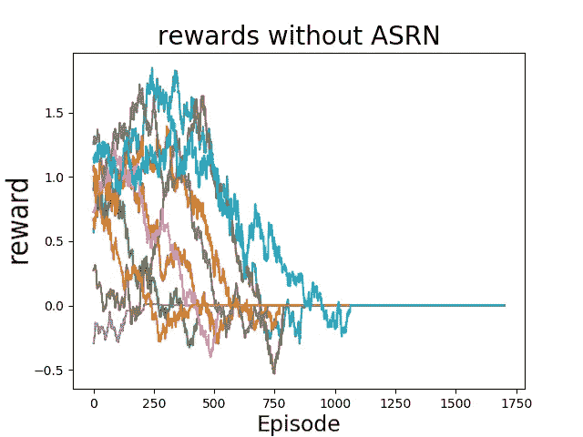
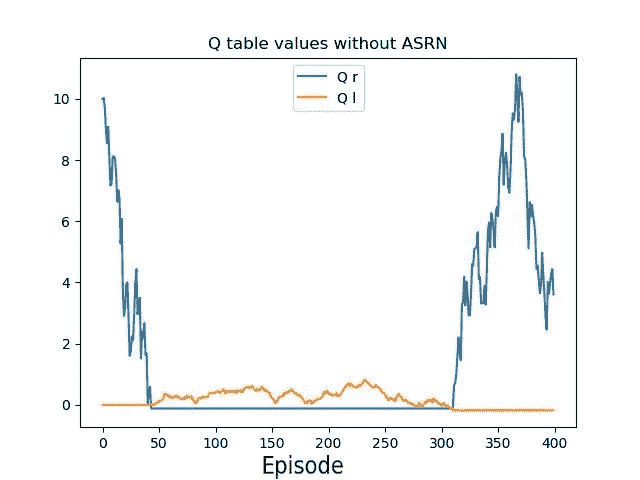
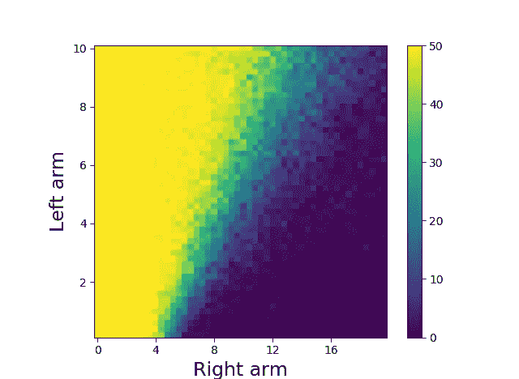
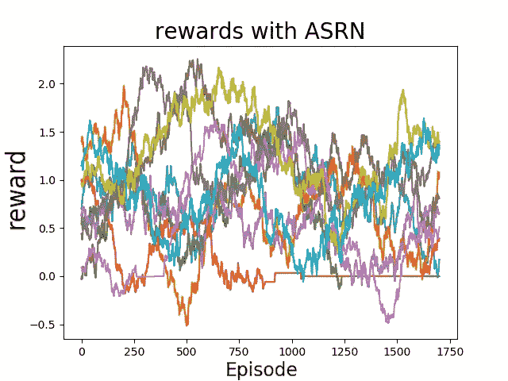
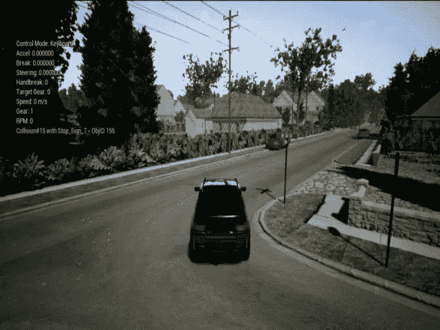

# 强化学习充满了操纵性的顾问

> 原文：<https://towardsdatascience.com/reinforcement-learning-is-full-of-manipulative-consultants-4ee39cd7e0f8?source=collection_archive---------10----------------------->

## 当用于训练强化学习算法的环境存在方差差异时，奇怪的事情就会发生。不管回报如何，价值评估网络更喜欢低方差的领域，这使他们成为一个善于操纵的顾问。Q-learning 算法陷入了“无聊区域陷阱”，并且由于低方差而无法摆脱。奖励噪音可以有所帮助，但必须小心谨慎。本文基于我的论文“[用于强化学习的自适应对称奖励噪声](https://arxiv.org/abs/1905.10144)

# **操纵顾问**

我想象一下你去找一个投资顾问，你先问他如何收费。是根据你将获得的利润吗？“不，”他说。“我对你回报的预测越准确，你给我的报酬就越高。但我将只在你选择的投资上接受考验。”
这有点可疑，你开始四处寻找其他使用这个顾问的人。结果，他只向他们推荐了低回报、低波动的政府债券。他甚至告诉他们这是最高的平均回报！他们都相信他，买了债券，当然他对回报的预测非常准确，误差很小。所以他们不得不付给他最高的费用。

Source: South Park

你觉得这个人怎么样？我觉得他是一种**“操纵型顾问”。**

**而强化学习中的每一个人都在用的正是这个家伙。**

目前，在强化学习(RL)中有两个主要的算法家族:深度 Q 网络(DQN)和 Actor Critic。两者都使用顾问功能或“价值评估”功能——一种深度神经网络(DNN ),用于评估状态和/或行动的价值。在 DQN，这是 Q 网络，在演员评论家这是评论家网络。这基本上是一个好的决定:价值评估功能可以学习偏离政策，这意味着他们可以通过观看别人比赛来学习，即使他不太好。这使他们能够从过去已经放弃的政策中吸取经验。

然而，有一个问题:我们根据这个顾问的准确性“支付”他:用于优化网络的损失函数是基于网络的预测误差。并且网络在它选择的行动上被测试:政策将做网络建议的最好的，并且这将是经验的唯一未来来源。

现在，每个人都抱怨说 [RL 还不能工作](https://www.alexirpan.com/2018/02/14/rl-hard.html)并且 [Deep 几乎不能帮助](https://himanshusahni.github.io/2018/02/23/reinforcement-learning-never-worked.html)。理应如此。训练 RL 算法是脆弱的:它强烈依赖于网络和参数的初始化，所以你必须一次又一次地重复相同的实验，每次都有不同的初始化。你看你的算法进步了，然后退步了。你感到困惑，因为它这样做的同时，损失函数继续显示改善的性能。你可以选择一路上最好的临时网络，然后就到此为止，但是你无法通过 RL 来进一步改善结果。

所以我们在这里声明的是，你只是选错了顾问。或者至少——选择了错误的支付方式。他选择了低回报的行动，并告诉你所有其他选择都更糟。他会更准确，因为他推荐的行动的回报是可以预测的。你永远不会发现他在操纵你，因为你一直在测试他的选择。

首先，让我们证明这些亏损缺口确实存在。拿一个简单的游戏来说:两台老虎机(RL 里叫“多臂土匪”)，右边的一台给 1 奖励但方差高，左边的一台坏了，所以给 0 奖励方差 0。我们称之为断臂强盗。
现在，你必须决定在游戏的每一集使用哪一个。似乎很容易？不是为了 Q-learning。

请看下图中的两条细线。它们显示了当前选择右手柄(细线，绿色)和当前选择左手柄(细线，红色)的代理的 Q 表的更新项。在 DQN，这个更新术语将是功能丧失。从图中可以明显看出，选择左边的人做得更好，损失也更小:

现在，每一个好的 RL 算法都有它的探索方案。这里我们使用ε-贪婪方案，ε是衰减的。事实上，100%探索测试了顾问没有推荐的东西，并且得到了基本相同的损失。但这只是在训练开始的时候。随着ε衰变，探索减少，红色细线不断衰减。现在，如果你在一次真正的训练中看到那句话，你会不会认为一切都很好，因为损失正在下降？实际上，你看到的是一个懒惰的网络，它摆脱了艰苦的探索测试。

我们看到的是失败的差距，无聊的决定会赢。当我们通过最小化这种损失来优化深层网络时，有时它会偏向于最小化其损失的无聊决策。但是如果我们根本不用 DNN 呢？如果我们使用好的 Q 学习，用 Q 表呢？还有一个问题，叫做“无聊区域陷阱”。

**无聊区域陷阱**

想象一下，你有一辆自行车，有人在离你家一英里远的地方给你一份免费的比萨饼。你有两个选择:你可以放弃去那里，你会得到一个均值为 0 方差为 0 的披萨。另一方面，你可以决定骑到那里，然后你平均得到 1 个比萨饼，但差异很大:以非常小的概率，你可能会发生事故，你将在石膏中度过 6 个月，在极度痛苦中，为你毁坏的自行车赔钱，没有比萨饼。

Source: [**Lego Grad Student**](https://twitter.com/legogradstudent)

通常，这是一个简单的决定:你以前从未发生过车祸，你估计现在发生车祸的可能性很低，你更喜欢较高的比萨饼平均值。所以你去那里买披萨。
但是如果你运气不好，仅仅骑了 100 次就出了事故怎么办？现在你估计事故发生的几率比真实的概率要高得多。开车去吃免费披萨的平均回报估计为负，你决定待在家里。
现在问题来了:你再也不能骑马了，因此也永远不会改变你骑马的想法。你会一直相信它有负的平均回报，你呆在家里的经历会验证你关于呆在家里的平均回报的信念，什么都不会改变。
无论如何，你为什么要离开家？嗯，必须发生的是一个**互补错误**。比如你呆在家里，一个架子掉在你头上。又一次，极度的痛苦。现在，你只能怪你的架子。你对呆在家里的评价也变得消极了。而如果低于你对离家的估计，你还会再出去吃那个披萨。
注意，这里没有优化:你有一个状态的 Q 表:饥饿状态，和两个动作:去或不去比萨饼。你直接从得到的奖励算出了手段。这是你能做的最好的事情，但是你最终被困在家里，饿着肚子，直到这个架子把你弄出来。

这个现象可以用上面的同一个断臂大盗来模拟。但是现在我们可以尝试使用 Q-learning 来解决这个问题。
让我们来看看 10 名代理就此任务接受的培训:

我们可以看到，他们所有人，在某个时候，都去获得零回报，这意味着他们选择拉故障的手臂。想象一下，他们站成一排，拉着死去的机器手臂，无视右边所有灯都亮着的工作着的机器。他们看起来不傻吗？好吧，笑话是关于我们利用他们作为我们的专家。注意:为了加快速度，我们选择了 0.1 的高学习率，所以通常经过几百万次迭代后发生的事情会发生得非常快。现在，让我们找 100 个代理，看看有多少人选择了左边不工作的手臂。他们在红线上:

再次，这需要一些时间，但他们最终都选择左臂作为他们的最佳选择。

为了了解发生了什么，我们将查看一个代理的内部参数——其 Q 表中 Q_left 和 Q_right 的值。我们删除了所有的探索，看看到底发生了什么，并初始化参数为最佳，**所以这是一个训练有素的代理**，至少在开始。右臂像以前一样有很高的方差。这里我们也给了左臂一个小的方差，所以这是一个具有方差差异的常规双臂土匪问题:

右臂方差大。因此，它的估计 Q_right 也有很高的方差，尽管由于它是与过去的回报相加而低得多。Q_right 因为几个集中的坏奖励，在第 40 集就变得比 Q_left 低了。
从那以后，代理只选择左边的手柄。所以它进入了“无聊区域陷阱”。现在 Q_right 改不了，由于缺乏实例。Q_left 由于方差较小，几乎没有变化。女士们先生们，这就是为什么我们称之为陷阱！
在第 320 集，出现互补错误。Q_left 变得比假低的 Q_right 低。这是当我们走出陷阱，并开始拉右臂，获得更好的 Q_right 估计。

什么方差差异导致了这个问题？这里我们可以看到不同σ_l 和σ_r 值的评分图，显示在 10，000 集后，50 个代理中有多少选择了右臂:

在右下角有一个黑色区域，由于方差差异较大，所有代理都失败了。由于较低的方差差异，在中心有另一个区域，代理在该区域进出陷阱。只有当方差差异很低时，Q-learning 才起作用。较低的学习率会使黑暗区域进一步向右移动，但是会降低学习率，所以训练会非常慢。

**奖励噪音**

提出的解决方案来自人类认知的一个实验。一些科学家进行了一项名为“行进中的农业”的实验，该实验与双臂土匪相同，但每个动作都移动了两台机器的方式。他们发现，给奖励增加一点噪音自相矛盾地帮助了人们*【排除简单假设】*和鼓励*【选择抽样】*，实际上帮助他们获得了更多的奖励！我们也可以这样做。我们可以给奖励增加一个对称的噪声，这样它就不会影响平均奖励。
但如果我们把噪音平均加到所有奖励上，还是会有有利于左机的损失差距。所以我们希望它是自适应的，这意味着我们将只给低方差动作添加噪声。
如果我们这样做，就会得到我们已经看到的图表中的粗线:

这表明我们在所有奖励中添加了大量噪声，但现在两台机器中的噪声量大致相同。这就是 ASRN 或自适应对称奖励噪声所做的:它估计哪些状态/动作具有低方差，并主要向它们添加噪声。它是如何估算的？使用 Q_table 的更新。更新越大，奖励越惊喜，得到的噪音也就越少。
你可以在这里看到它是如何实现的[。当然，ASRN 有它自己的训练期，所以在上面的例子中，变化只在 1000 集之后开始。
当我们检查上面断臂强盗的 ASRN 时，我们看到它帮助特工们走出无聊区域陷阱。以下是上面的 10 个代理:](https://github.com/ManipulativeConsultant/two-armed-bandit)

他们中的一些人到达了无聊区域陷阱，但是利用我们添加的噪音设法逃脱了。

**噪声驾驶**

现在，所有这些用在强盗身上很好，但是用在真正的东西上呢？

嗯，开车就是一个很合适的例子。就像上面的比萨饼一样，有一个策略会给你低方差的低回报，比如“向左直到你崩溃”。另一方面，还有实际驾驶的策略，由于“达到目标”大奖，它可以有很高的平均奖励，但它伴随着很高的方差——沿途有许多危险等待着。我们使用 AirSim 邻域驾驶模拟训练了一个代理。这是一个非常逼真的驾驶模拟器:

他们已经实现了一个 DQN 代理。因此，剩下要做的就是查看插入 ASRN(绿色)后的平均驾驶时间，与没有 ASRN(红色)和具有统一奖励噪声(青色)的平均驾驶时间进行比较:

这样肯定更好，不是吗？这里可以看到修改后的代码[。](https://github.com/ManipulativeConsultant/AutonomousDrivingCookbook)

[这里的](https://youtu.be/aoft3T_77sQ)是试驾的上策。这不是一个很好的司机。然而，这对于只参加 2750 场比赛的训练来说是一个相当大的成就。

综上所述:我们看到了方差差异给 RL 带来的问题。有些是全球性的，如**无聊区域陷阱**，有些是深度强化学习(DRL)特有的，如 M **被动顾问**。我们还看到，奖励噪声可以有所帮助，特别是如果噪声是对称的，并适应实际的行动差异。我们探索了 Q-learning 和 DQN，但它很可能也适用于演员评论和其他算法。显然，奖励降噪并不是一个完整的解决方案。许多复杂的探索需要并行进行，还有其他 RL 技巧，如剪辑等。操纵性顾问和无聊区域陷阱问题提出的问题至少和它们回答的问题一样多。但是当我们坐下来计划我们的 RL 策略时，记住这些问题是很重要的。思考这一点至关重要:在这种环境中有任何方差差异吗？它们如何影响所选择的算法？也许这将导致一个更稳定的 RL。

感谢:什洛莫·科恩、塔利亚·索尔伯格、奥娜·科恩、吉利·伯克和吉尔·索德·御名方守矢

[机器学习](https://medium.com/tag/machine-learning?source=post)

[强化学习](https://medium.com/tag/reinforcement-learning?source=post)