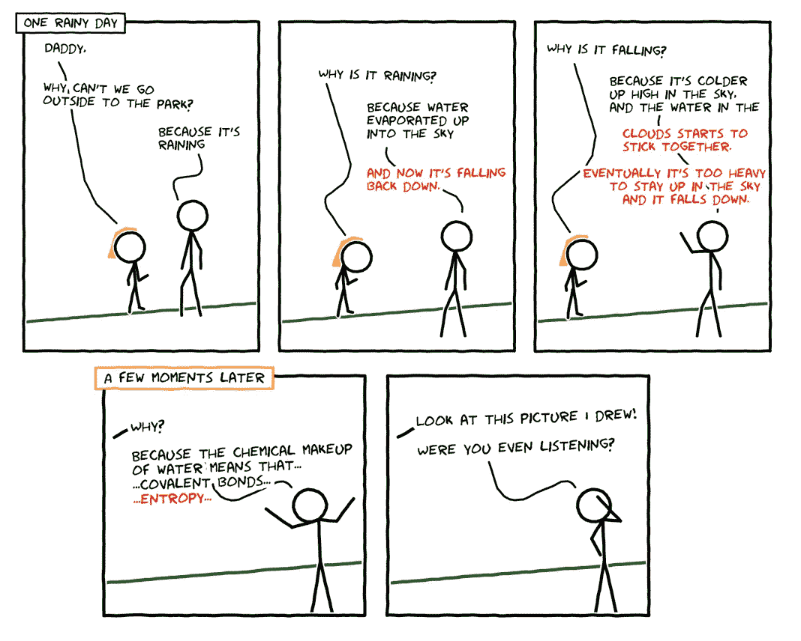
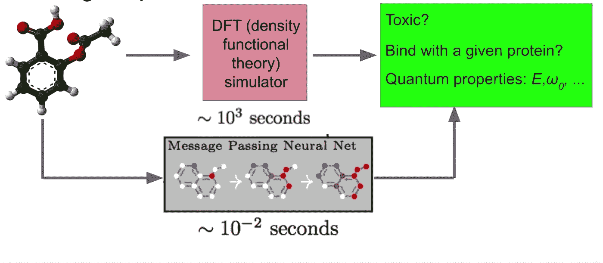
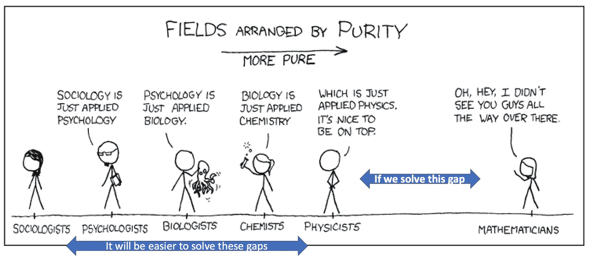
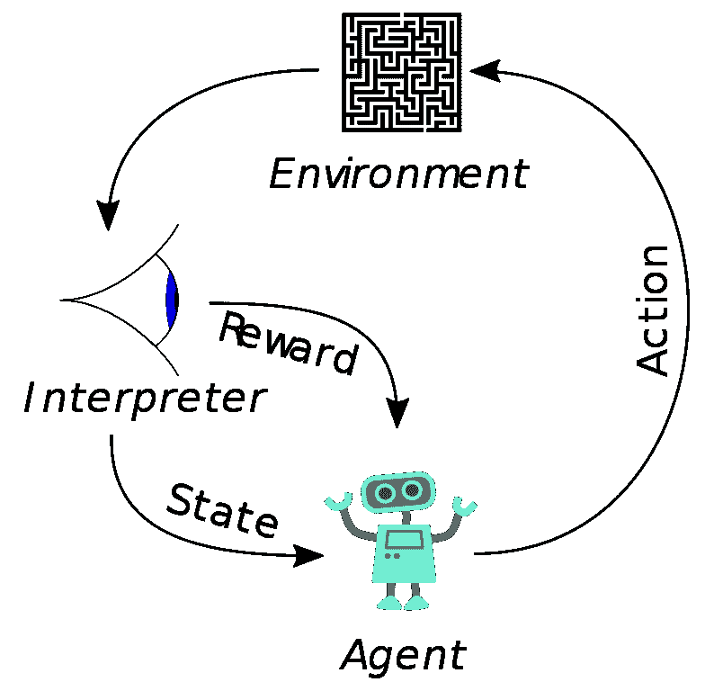
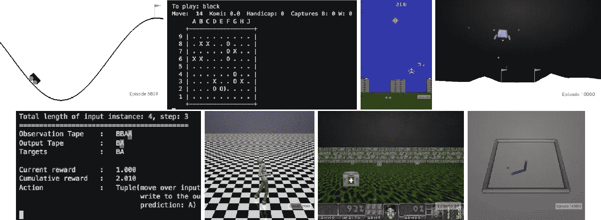

# 强化学习正在成为主流。这是可以期待的。

> 原文：<https://towardsdatascience.com/reinforcement-learning-is-going-mainstream-heres-what-to-expect-d0fa4c8c30cf?source=collection_archive---------15----------------------->

## 在游戏中击败世界冠军的相同技术将很快彻底改变任何可以模拟的东西(因为一切的核心都是物理——随着时间的推移，这就是一切)

我把这篇文章变成了一个 20 分钟的演讲，所以如果你喜欢看，你可以看:

我上周在拉斯维加斯参加了 AWS re:MARS 会议，本周的主题是机器学习、自动化和机器人(有时在太空中)的结合将如何塑造未来。许多人可能认为这个节目的明星是小罗伯特·唐尼，但在我看来是模拟和强化学习，它出现在会议的几乎每个主题演讲中:

**第 1 天**:通过强化学习，波士顿动力公司的机器人学会了后空翻、跳上壁架和举起数据。迪士尼幻想工程将这一点推向了一个新的高度，人形机器人表演了挑战死亡的特技。

**第二天**:亚马逊在他们的 [Go 商店](https://youtu.be/Lu4szyPjIGY)使用模拟来训练模型应对困难场景。亚马逊履行中心的机器人被训练使用强化学习来分拣包裹。Alexa 使用模拟交互来自动学习对话的流程。[亚马逊无人机送货](https://twitter.com/i/status/1136669965921034241)利用模拟数据训练模型，用于探测无人机下方的人。像 [Insitro](https://medium.com/@daphne_38275/insitro-rethinking-drug-discovery-using-machine-learning-dcb0371870ee) 这样的公司已经开始使用 RL 通过[生成生物交互数据](https://twitter.com/IPGLAB/status/1136330412341383168)来解决生物医学问题。

**第三天**:吴恩达称元学习为人工智能的“下一件大事”，在元学习中，数百个不同的模拟器被用来构建更通用的强化学习代理。自动驾驶汽车公司 Zoox 和 [Aurora](https://youtu.be/BBw7b4SUlto) 使用 RL & meta-leraning 来解决在城市环境中驾驶的复杂性。DexNet 正试图[建立一个大规模的 3D 模型数据集](https://berkeleyautomation.github.io/dex-net/)来帮助利用模拟解决问题。杰夫·贝索斯同意达芙妮·柯勒的观点，RL 生物工程将在 10 年内发展壮大。

## 综上所述:

> 如果一个领域中的任务可以被精确模拟，强化学习将在未来几年内极大地提高该领域的技术水平。

## 物理学有什么用处？

如果你读了我之前的帖子，你会知道我的第一个女儿已经四岁了。这使她坚定地进入了人生的“为什么”阶段，在这个阶段，她的大脑从简单的学习任务转变为想要了解世界的一切。作为一个超级书呆子，我总是开玩笑说，每当她问“为什么”时，我会很乐意带她一路下兔子洞去学物理。事实证明，我的父母错了，甚至一个四岁的孩子也会厌烦地问“为什么？”然后去做一些更有趣的事情，比如涂颜色或者假装在看书。下面是一个典型的交换:

Created using [http://cmx.io](http://cmx.io)

## 这些和数据科学有什么关系？

我最近看了杰夫·迪恩在今年谷歌 I/O 大会上关于[深度学习状态](https://www.youtube.com/watch?v=rP8CGyDbxBY)的演讲。他提到，神经网络已经被训练为[逼近物理模拟器](https://arxiv.org/abs/1811.08928)的结果，并以 30 万倍的速度得出结果，研究人员有可能在午餐时测试 1 亿个分子。

[Image Source](https://youtu.be/rP8CGyDbxBY?t=1065): Jeff Dean presentation at Google I/O 2019

这是一个巨大的进步，因为它应该允许我们使用与 re:MARS 中的明星相同的强化学习技术来解决一系列新的问题。在这些进步之前，为每个潜在的奖励运行一个完整的物理模拟器的周期时间对于 RL 来说太长了，以至于不能达到奖励状态。现在，RL 应该能够了解分子的物理性质，这将优化化学工程师的预期属性。

[Image Source](https://xkcd.com/435/)

鉴于一切都可以归结为物理，我开始想象一个世界，在这个世界里，有可能从第一原理构建更多的解决方案。在参加会议时，我曾以为生物学多年来都无法用于模拟，但我刚刚得知，今天已经有像 Insitro 这样的公司开始解决这个问题。

其他最近的发展只会加速我们进入未来状态，在这种状态下，RL 可以用于“更高水平”的科学，如心理学:

1.  **原始计算能力**:谷歌还发布了 T3 TPU 吊舱的私人测试版，其处理能力[超过 100 Petaflops](https://cloud.google.com/tpu/) ，为运行神经网络训练架构而定制。有了这种能力，像材料分析这样的任务可以很快学会。此外，谷歌已经开始使用 RL 来设计芯片本身，随着时间的推移，这应该会导致额外的改进。
2.  **更好的可重用性** : DeepMind 正在研究[多层网络架构](https://papers.nips.cc/paper/7591-data-efficient-hierarchical-reinforcement-learning.pdf)，其中初始 RL 代理为给定任务选择合适的下游网络。这种类型的 RL 代理可以被训练成将高级任务分解成组件，并使用迁移学习[解决多个任务。](/everything-you-need-to-know-about-googles-new-planet-reinforcement-learning-network-144c2ca3f284)
3.  **更好的推广**:前面提到的[元学习技术](https://blog.floydhub.com/meta-rl/)正在提高 RL 代理适应他们以前没有见过的场景的能力。
4.  **更好的优化**:麻省理工学院的彩票假说论文表明，通过找到“中奖彩票”路径，然后仅使用这些路径进行重新训练，可以进一步压缩神经网络。
5.  **更好的训练数据生成**:像 [AutoCad 的创成式设计](https://www.google.com/search?q=autodesk+generative+design&oq=autocad+generat&aqs=chrome.1.69i57j0l5.3716j0j1&sourceid=chrome&ie=UTF-8)这样的接口可以帮助设计师/工程师发现需要提供的规范，以便 RL 代理向正确的方向移动。每当有人必须接管时，自动驾驶汽车公司都会产生新的培训场景。

## 你该怎么办？

[Image Source](https://en.wikipedia.org/wiki/Reinforcement_learning#/media/File:Reinforcement_learning_diagram.svg)

首先，你应该去了解强化学习:有许多 [伟大的](https://blog.valohai.com/reinforcement-learning-tutorial-part-1-q-learning) [教程](/reinforcement-learning-tutorial-part-3-basic-deep-q-learning-186164c3bf4)和[课程](https://sites.google.com/view/deep-rl-bootcamp/lectures)可以教你 RL 的直觉和内部工作方式，所以我们在这里将保持简短:RL 代理获得他们环境的解释状态，选择影响环境的行动，观察新的环境状态，并重复这个过程。如果行动产生了积极的结果，代理人会得到奖励，并且在未来类似的状态下更有可能选择同样的行动。

这种情况会重复很多集，最终，代理变得非常擅长获得奖励(因此也非常擅长我们训练它的任务)。用一些实际操作来补充这种体验的最佳方式之一是使用 [AWS Deep Racer](https://github.com/aws-samples/aws-deepracer-workshops/tree/master/Workshops/2019-AWSSummits-AWSDeepRacerService/Lab1) ，这是一辆按比例缩小的赛车，它提供了一个模拟环境、一个 RL 训练设置和一个与模拟相对应的物理硬件。你只需玩奖励功能来训练你的赛车代理。从那里你可以

[Image Source](https://www.google.com/url?sa=i&source=images&cd=&ved=2ahUKEwizyOi7rNbiAhVSip4KHUyVAJ8QjRx6BAgBEAU&url=https%3A%2F%2Fwww.semanticscholar.org%2Fpaper%2FOpenAI-Gym-Brockman-Cheung%2F2b10281297ee001a9f3f4ea1aa9bea6b638c27df%2Ffigure%2F0&psig=AOvVaw2LTIHEwv129NZUbT0F-4kN&ust=1559961735397341)

其次，你应该开始积极地寻找方法来模拟你的企业中可以优化的系统。任何现有的模拟器都是一个很好的起点，但新的模拟器可能会产生巨大的影响。同样，AWS 在这一领域有一个名为 [RoboMaker](https://aws.amazon.com/robomaker/) 的服务，但有许多替代方案，其中大部分基于[开放 API Gym](https://gym.openai.com) 。如果你想得到一个环境设置，你可以使用英特尔的[蔻驰。它将代理、网络和内存结合在一起，让你在几十个不同的预配置代理中进行选择，这些代理针对各种任务进行了优化，然后轻松地将它们连接到 OpenAI 健身房环境。](https://github.com/NervanaSystems/coach)

最后，你应该留意那些乘着这股技术浪潮的新公司。我预计，最终将会有一系列开源模拟器开发出来，以彼此为基础，用深度神经网络来压缩每一层可以学习的关键信息。在此之前，很可能会有专利解决方案，在许多领域超越最先进的技术。随着时间的推移，这将在制药、材料科学、医药、下游石油和天然气等许多科学领域带来巨大收益。

如果你对快速入门感兴趣，我的同事 Ryan Keiper 做了一个演讲，详细讲述了他如何快速入门强化学习来构建一个下棋代理。