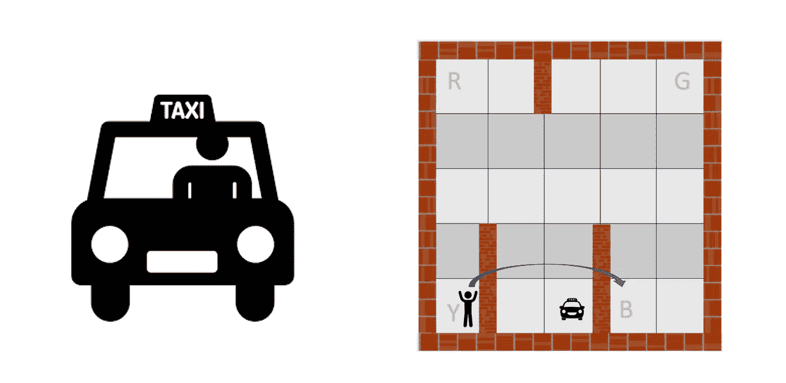
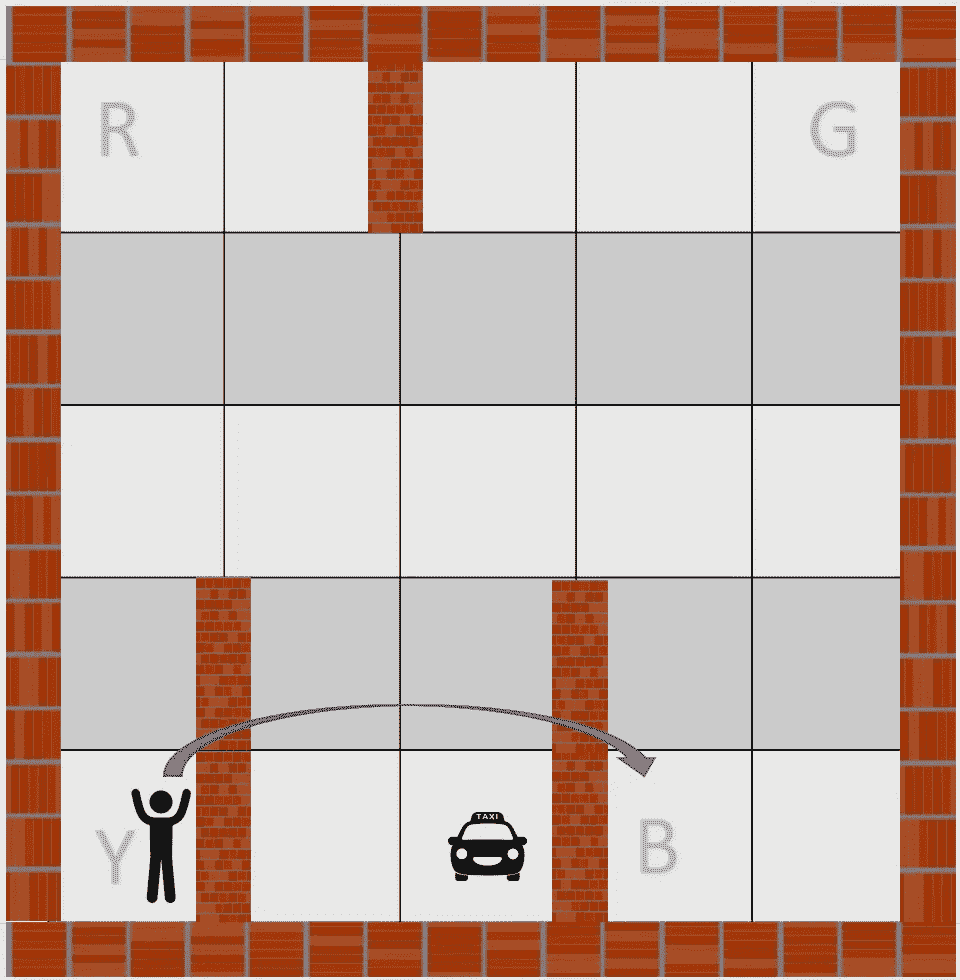
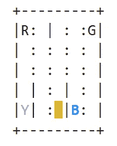
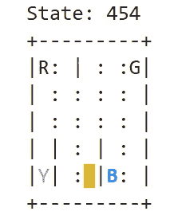
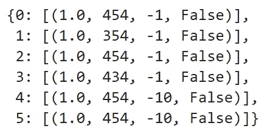

# 强化学习:让我们教出租车司机如何驾驶

> 原文：<https://towardsdatascience.com/reinforcement-learning-lets-teach-a-taxi-cab-how-to-drive-4fd1a0d00529?source=collection_archive---------13----------------------->



强化学习是机器学习的一个子领域，其任务不同于“标准”的学习方式。事实上，你希望你的强化算法从周围环境中从头开始学习，而不是获得历史数据并根据这些数据做出预测或推断。基本上，你希望它像你在类似情况下所做的那样(如果你想了解更多关于 RL 的结构，点击[这里](/reinforcement-learning-beyond-the-supervised-and-unsupervised-ways-b3cae32eef65?source=post_page---------------------------)阅读我以前的文章)。

在本文中，我将向您展示如何使用 Python 及其库 gym-OpenAI 实现 RL 解决方案，您可以通过在 Jupyter 控制台*上运行 pip install gym* 来轻松安装它。我要向你提出的问题如下:



您的环境由一个 5x5 矩阵组成，其中每个单元都是您的出租车可以停留的位置。然后，你有 4 个坐标，分别代表上下车地点，分别是(0，0)，(0，4)，(4，0)，(4，3)(为了和 Python 语言的连贯性，第一个索引是 0 而不是 1)。我们将它们称为 R，G，Y，B，并分别用 0，1，2，3 来表示它们的位置。最后，有一名乘客既可以上车，也可以下车，还可以被运送(因此要花时间在出租车上)。具体来说，这个乘客想要到达 b 点。

现在，如果我们导入我们的*健身房*模块并初始化出租车环境，我们可以看到它复制了我们到目前为止所说的内容:

```
import gym
env = gym.make("Taxi-v2").env
env.render()
```



如您所见，我们的 5x5 空间有 4 个位置，其中蓝色字母代表当前乘客的位置，紫色字母代表下车位置。我们在那个空间中也有我们的出租车/代理，它是黄色的矩形，还有一些墙，用符号“|”表示。

现在有两个因素需要我们注意:国家和行动。

让我们首先检查我们的行动。根据导入的模块，代理可以采取 6 种方式:

*   0:向下(南)
*   1:向上(北)
*   2:向右(东)走
*   3:向左(西)走
*   4:拿起
*   5:下车

第二，我们有多少个州？嗯，至少 25 个:事实上，有一个 5x5 的空间，我们知道驾驶室可以简单地占用这些单元。此外，出租车也可以处于搭载或放下乘客的状态(不管它实际上是否在那里:记住出租车将通过尝试前进)，因此我们还有 4 种状态。最后，我们必须计算乘客实际上车、下车的状态(+ 4 个状态，因为乘客可能在的位置是 4 个)或只是被运送的状态(+ 1 个状态)。因此，总共有 5x5x4x5=500 个状态。

我们的代理的每个状态由一个向量值*【出租车的行，出租车的列，乘客索引，目的地索引】*表示，因此用 0 到 499 之间的值进行编码。也就是说，我们可以像这样复制上一张图片的位置:

```
state = env.encode(4, 2, 3, 2) 
print("State:", state)env.s = state
env.render()
```



如您所见，已知我们的出租车位于位置(4，2)，乘客索引=3，下车位置=2，我们可以推导出编码状态为 454。在接下来的实验中，我们将使用这个起点，但在深入之前，我们需要介绍最后一个要素:奖励系统。

奖励系统是强化学习背后的主要思想:代理人在任何表现良好的时候都会得到奖励，否则就会受到负面奖励的“惩罚”。在这个特定的例子中，一旦创建了 env，就会创建一个嵌入式奖励表 *P* 。逻辑如下:

*   如果出租车正确接送乘客，奖励+20 分
*   如果出租车非法上落客，将被扣-10 分
*   不包括上述情况的每一步，减 1 分

让我们看看我们的状态 454 是什么样子的:

```
env.P[454]
```



首先要注意的是，我们的 *P* 表的每个条目都是一个字典，其结构为`{action: [(probability, nextstate, reward, done)]}`

*   动作:范围从 0 到 5
*   概率:在这种情况下，总是为 1
*   Nextstate:这是动作完成时出现的状态
*   奖励:与该行为相关的奖励/惩罚
*   done:如果为真，说明这一集结束了，否则不是。

让我们试着读一下我们的结果:第一行告诉我们，如果我们往下走(动作 0 =南)，我们将保持在相同的位置，因为我们有一个边界，因此奖励是-1，情节没有结束；第二行，对应于 action=north，会把我们的滑行带向位置 354，但是奖励永远是-1，剧集没有结束。所有动作的推理都是一样的。注意，如果动作是上车或下车，由于出租车不在正确的位置(R，Y，G，B ),如在最后两行(对应于动作 4 和 5 ),它收到-10 的惩罚。

现在是时候训练我们的算法了。我们要用的算法叫做 Q-learning。我已经在这篇文章中解释了[背后的思想，因此在这里我不再深入探讨。](https://medium.com/dataseries/understanding-the-idea-behind-q-learning-63c666c8a8a2)

以下代码解释了该过程:

```
import random# setting yperparameters
lr = 0.1  #learning rate
gamma = 0.6 #discount factor
epsilon = 0.1 #trade-off between exploration and exploitationfor i in range(1, 1000):  #we will see 1000 episodes
    state = env.reset()  #let's reset our envepochs, penalties, reward, = 0, 0, 0
    done = False

    while not done:
        if random.uniform(0, 1) < epsilon:
            action = env.action_space.sample() # explore action space
        else:
            action = np.argmax(q_table[state]) # exploit learned valuesnext_state, reward, done, info = env.step(action) 

        old_value = q_table[state, action]
        next_max = np.max(q_table[next_state])

        new_value = (1 - alpha) * old_value + lr * (reward + gamma * next_max)
        q_table[state, action] = new_valueif reward == -10:
            penalties += 1state = next_state
        epochs += 1 
```

现在，想象一下，你必须决定哪一个动作能最大化你的效用(翻译过来，这导致对位置 3 的乘客的最佳可能方式)。你的答案可能是北，因此行动 1:事实上，这将是到达你的乘客所在位置(4，3)的最快方式。我们的算法会怎么说？

```
np.argmax(q_table[454]) #argmax function return the position of the 
#maximum value among those in the vector examined
```

1

如您所见， *argmax* 函数返回位置 1，这对应于动作“北”。因此，对于每一个位置，我们的 q 表会告诉我们哪一个动作可以最大化当前和未来的回报。