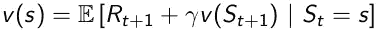

# 强化学习:贝尔曼方程和最优性(下)

> 原文：<https://towardsdatascience.com/reinforcement-learning-markov-decision-process-part-2-96837c936ec3?source=collection_archive---------1----------------------->

## #优化 RL

> 这个故事是上一个故事的延续， [*强化学习:马尔可夫决策过程(第一部分)*](/introduction-to-reinforcement-learning-markov-decision-process-44c533ebf8da?source=friends_link&sk=9ecb7b106959a3ae34396f7924bec50d) 故事中，我们谈到了如何为给定的环境定义 MDP。我们还谈到了贝尔曼方程，以及如何找到一个国家的价值函数和政策函数。**在这个故事**中，我们将更深入**一步**并了解**贝尔曼期望方程**，我们如何找到给定状态的**最优值**和**最优策略函数**，然后我们将定义**贝尔曼最优方程**。

Google’s Parkour using Reinforcement Learning

让我们快速浏览一下这个故事:

*   贝尔曼期望方程
*   最优策略
*   状态值函数的贝尔曼最优性方程
*   状态-行为价值函数的贝尔曼最优性方程

所以，一如既往地拿起你的咖啡，直到你感到自豪才停下来。🤓

先说，**什么是贝尔曼期望方程？**

## 贝尔曼期望方程

快速回顾一下我们在前面的故事中谈到的贝尔曼方程:

Bellman Equation for Value Function (State-Value Function)

从上面的**等式**可以看出，一个状态的值可以**分解**为即时奖励(**r【t+1】**)**加上**后继状态的值(**v【s(t+1)】**)加上一个贴现因子( **𝛾** )。这仍然代表贝尔曼期望方程。但是现在我们正在做的是找到一个特定状态**服从**某种策略( **π** )的值。这就是贝尔曼方程和贝尔曼期望方程的区别。

数学上，我们可以将贝尔曼期望方程定义为:

Bellman Expectation Equation for Value Function (State-Value Function)

让我们称之为等式 1。上面的等式告诉我们，当我们在遵循某个政策( **π** ) **时，特定状态的值是由眼前的回报加上后继状态的值决定的。**

类似地，我们可以将我们的状态-动作值函数(Q-函数)表达如下:

Bellman Expectation Equation for State-Action Value Function (Q-Function)

让我们称这个为等式 2。从上面的等式中，我们可以看到，一个状态的状态-动作值可以分解为我们在状态( **s** 执行某个动作并移动到另一个状态(**s’**)时获得的**即时奖励**，加上状态(**s’**)**的状态-动作值相对于**的贴现值，我们的代理人将从该状态向前采取某个动作( **a** )。

***深入贝尔曼期望方程:***

首先，让我们借助备用图来理解状态-值函数的贝尔曼期望方程:

Backup Diagram for State-Value Function

这个备份图描述了处于特定状态的价值。从状态 s 来看，我们有可能采取这两种行动。每个动作都有一个 Q 值(状态-动作值函数)。我们平均 Q 值，它告诉我们在一个特定的状态下有多好。基本上它定义了 V **π(s)。【看等式 1】**

数学上，我们可以定义如下:

Value of Being in a state

这个等式也告诉我们状态-值函数和状态-动作值函数之间的联系。

现在，让我们看看状态-动作值函数的备份图:

Backup Diagram for State-action Value Function

这张备份图表明，假设我们从采取一些行动(a)开始。因此，由于动作(a ),代理可能被环境吹到这些状态中的任何一个。因此，我们在问这个问题， ***采取行动有多好(a)？***

我们再次对两种状态的状态值进行平均，加上即时奖励，这告诉我们采取特定的行动(a)有多好。这就定义了我们的 q **π(s，a)。**

数学上，我们可以这样定义:

Equation defining how good it is to take a particular action a in state s

其中 P 是转移概率。

现在，让我们将这些备份图拼接在一起，以定义状态值函数 V **π(s)** :

Backup Diagram for State-Value Function

根据上图，如果我们的代理处于某个**状态**，并且从该状态假设我们的代理可以采取两个动作，由于哪个环境可能将我们的代理带到任何**状态**。请注意，我们的代理可能从状态 **s** 采取行动的概率由我们的策略加权，并且在采取该行动后，我们到达任何状态(**s’**)的概率由环境加权。

现在我们的问题是，在采取一些行动并降落在另一个州(s ')之后，在另一个州(s)并遵循我们的政策( **π** )有多好？

这与我们之前所做的类似，我们将对后续状态的值(**s’**)进行平均，并使用我们的策略对一些转移概率(P)进行加权。

数学上，我们可以定义如下:

State-Value function for being in state S in Backup Diagram

现在，让我们对状态-动作值函数 q **π(s，a)** 做同样的处理:

Backup Diagram for State-Action Value Function

这与我们在**状态值函数**中所做的非常相似，只是它是相反的，所以这个图基本上说我们的代理采取一些行动( **a** )，因为环境可能会将我们带到任何状态( **s** )，然后从那个状态我们可以选择采取任何行动(**a’**)，用我们策略的概率( **π** )加权。同样，我们将它们平均在一起，这让我们知道始终遵循特定策略( **π** )采取特定行动有多好。

数学上，这可以表示为:

State-Action Value Function from the Backup Diagram

所以，这就是我们如何为一个给定的 MDP 制定贝尔曼期望方程，找到它的状态-价值函数和状态-行为价值函数。 ***但是，它并没有告诉我们 MDP 的最佳行为方式*** 。为此，让我们来谈谈什么是最优值和最优政策函数 T21。

## 最优值函数

> **定义最佳状态值函数**

在 MDP 环境中，根据不同的政策，有许多不同的价值函数。 ***最佳价值函数是与所有其他价值函数*** 相比产生最大值的函数。当我们说我们正在求解一个 MDP 时，实际上意味着我们正在寻找最优值函数。

因此，数学上最优的状态值函数可以表示为:

Optimal State-Value Function

上式中，v∫(s)告诉我们，我们能从系统中得到的最大回报是什么。

> **定义最佳状态-动作值函数(Q-Function)**

类似地，**最优状态-行动价值函数**告诉我们，如果我们处于状态 s 并从那里开始采取行动 a，我们将获得的最大回报。

数学上，它可以定义为:

Optimal State-Action Value Function

> **最优状态值函数**:所有策略的最大值函数。
> 
> **最优状态-动作值函数**:是所有策略的最大动作值函数。

现在，让我们看看，什么是最优政策？

## 最优策略

在我们定义最优策略之前，让我们先了解一下， ***一种策略比另一种策略更好是什么意思？***

我们知道，对于任何一个 MDP 来说，都有一个政策(**【π】)**比其他任何政策(**【π】)都要好。但是怎么做呢？**

如果针对所有状态的策略 **π** 的价值函数大于针对所有状态的策略**π’**的价值函数，则我们说一个策略( **π)** 优于其他策略(**π’**)。直观上，它可以表示为:

现在，让我们定义 ***最优策略:***

> **最优策略**是产生最优价值函数的策略。

请注意，在一个 MDP 中可以有多个最优策略。但是， ***所有的最优政策都实现相同的最优价值函数和最优状态-行动价值函数(Q-function)*** 。

现在，问题来了，我们如何找到最佳政策。

> **寻找最佳策略:**

我们通过最大化超过 ***q* *** (s，a)即我们的最优状态-行为价值函数来找到最优策略。我们求解 q*(s，a)，然后选择给出最佳状态-动作值函数(q*(s，a))的动作。

上面的陈述可以表达为:

Finding Optimal Policy

这里说的是，对于状态 s，我们选择概率为 1 的动作 a，如果它给我们最大的 q*(s，a)。所以，如果我们知道 q*(s，a)，我们可以从中得到一个最优策略。

我们用一个例子来理解一下:

Example for Optimal Policy

在这个例子中，红色弧线是最优策略，这意味着如果我们的代理遵循这条路径，它将从这个 MDP 中获得最大的回报。同样，通过查看每个状态的 q* 值，我们可以说我们的代理将采取的行动产生了最大的回报。因此，最优策略总是采取 q*值较高的行动(状态-行动值函数)。例如，在值为 8 的状态中，有值为 0 和 8 的 q*。我们的代理选择具有更大的 **q*** 值的那个，即 8。

现在问题来了， ***我们怎么求这些 q*(s，a)值？***

这就是贝尔曼最优方程发挥作用的地方。

## 贝尔曼最优方程

> 最优值函数与贝尔曼最优方程递归相关。

贝尔曼最优方程和贝尔曼期望方程是一样的，但是唯一的区别是，我们不是取我们的代理可以采取的行动的平均值，而是取最大值的行动。

让我们借助备份图来理解这一点:

Backup diagram for State-Value Function

假设我们的代理处于状态 S，从该状态它可以采取两个动作(a)。因此，我们查看每个动作的动作值，并且**不同于**、贝尔曼期望方程、**而不是**取**平均值**，我们的代理采取具有**更大 q*值**的动作。这给了我们处于状态 s 的价值。

数学上，这可以表示为:

Bellman Optimality Equation for State-value Function

同样，我们来定义**状态-作用值函数(Q-Function)** 的贝尔曼最优性方程。

让我们看看状态-动作值函数(Q 函数)的备份图:

Backup Diagram for State-Action Value Function

假设，我们的代理人在一些州 s 采取了行动 a。现在，它取决于环境，它可能会把我们吹到这些州中的任何一个(**s’**)。我们仍然取两个状态的平均值，但是唯一的**差异**是在贝尔曼最优方程中，我们知道每个状态的最优值**。不像在贝尔曼期望方程中，我们只知道状态的值。**

**数学上，这可以表示为:**

****

**Bellman Optimality Equation for State-Action Value Function**

**让我们再次缝合这些状态值函数的备份图:**

****

**Backup Diagram for State-Value Function**

**假设我们的代理处于状态 s，并从该状态采取了一些行动(a ),其中采取该行动的概率由策略**加权**。并且由于动作(a)，代理可能被吹到概率由环境加权的任何状态(**s’**)。**为了找到状态 S 的值，我们简单地对状态(S’)的最优值进行平均**。这给了我们处于状态 s 的价值。**

**数学上，这可以表示为:**

****

**Bellman Optimality Equation for State-Value Function from the Backup Diagram**

**等式中的最大值是因为我们最大化了代理在上弧中可以采取的行动。这个方程也显示了我们如何把 V*函数和它本身联系起来。**

**现在，让我们看看状态-动作值函数 q*(s，a)的贝尔曼最优方程:**

****

**Backup Diagram for State-Action Value Function**

**假设，我们的代理处于状态 **s** ，它采取了一些动作( **a** )。由于该动作，环境可能会将我们的代理带到任何状态(**s’**)，并且从这些状态我们可以**最大化**我们的代理将采取的动作，即选择具有**最大 q*值**的动作。我们回到顶点，这告诉我们动作 a 的值。**

**数学上，这可以表示为:**

****

**Bellman Optimality Equation for State-Action Value Function from the Backup Diagram**

**让我们看一个例子来更好地理解它:**

****

**Example for Bellman Optimality Equation**

**请看红色箭头，假设我们希望找到值为 6 的 state 的**值**(红色的**)，我们可以看到，如果我们的代理选择脸书，我们将获得-1 的奖励，如果我们的代理选择学习，我们将获得-2 的奖励。为了找到红色状态的值，我们将使用状态值函数的**贝尔曼最优方程，即*，考虑到其他两个状态具有最优值，我们将对两个动作取平均值并最大化(选择给出最大值的一个)*。因此，从图中我们可以看到，对于我们的红色州来说，去脸书得到的值是 5，去学习得到的值是 6，然后我们将这两个值最大化，得到的答案是 6。******

****现在，我们如何求解大型 MDP 的贝尔曼最优方程。为了做到这一点，我们使用**动态编程算法**，如**策略迭代**和值迭代，我们将在下一个故事中介绍，以及其他方法，如 **Q-Learning** 和 **SARSA** ，它们用于时间差异学习，我们将在未来的故事中介绍。****

****太棒了！****

****恭喜你走到这一步！👍****

****希望这个故事能增加你对 MDP 的了解。很乐意在 insta gram[上与您联系。](https://www.instagram.com/ayushsingh.__/)****

****谢谢你与我分享你的时间！****

****如果你喜欢这个，请点击让我知道👏。它帮助我写更多！****

## ****关于马尔可夫决策过程的第 1 部分、第 2 部分和第 3 部分:****

*   ****[强化学习:马尔可夫决策过程(第一部分)](/introduction-to-reinforcement-learning-markov-decision-process-44c533ebf8da)****
*   ****强化学习:贝尔曼方程和最优性(下)****
*   ****[强化学习:使用动态规划解决马尔可夫决策过程](/reinforcement-learning-solving-mdps-using-dynamic-programming-part-3-b53d32341540)(第三部分)****
*   ****[强化学习:蒙特卡罗学习](https://pub.towardsai.net/reinforcement-learning-monte-carlo-learning-dc9b49aa16bd)****

****参考资料:****

*   ****[https://web . Stanford . edu/class/psych 209/Readings/suttonbartoiprlbook 2 nded . pdf](https://web.stanford.edu/class/psych209/Readings/SuttonBartoIPRLBook2ndEd.pdf)****
*   ****[使用 Python 进行强化学习](https://www.oreilly.com/library/view/hands-on-reinforcement-learning/9781788836524/)****
*   ****大卫·西尔弗的 DeepMind 强化学习课程****

*******待得深*******