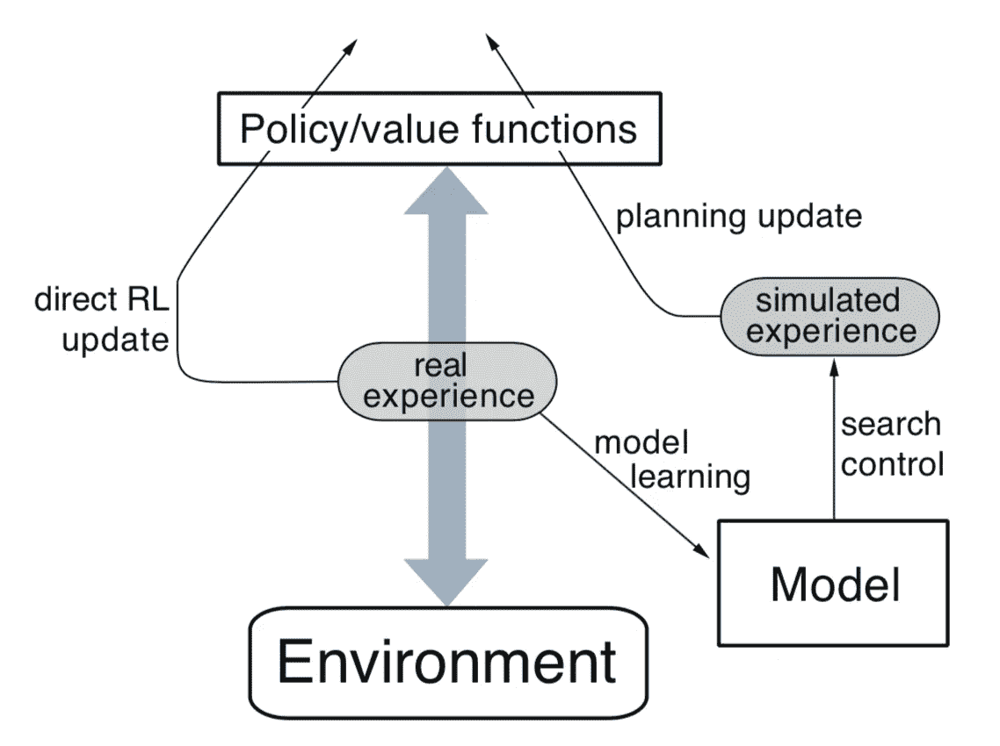

# 强化学习——基于模型的规划方法

> 原文：<https://towardsdatascience.com/reinforcement-learning-model-based-planning-methods-5e99cae0abb8?source=collection_archive---------6----------------------->

## 学习环境模型的例子

在以前的文章中，我们已经谈到了基于无模型方法的强化学习方法，这也是 RL 学习的关键优势之一，因为在大多数情况下，学习环境的模型可能是棘手和艰难的。但是，如果我们想学习一个环境模型，或者如果我们已经有了一个环境模型，我们如何利用它来帮助学习过程呢？在这篇文章中，我们将一起探讨以环境为模型的 RL 方法。以下内容的结构如下:

1.  从如何建模环境的基本概念开始
2.  用我们刚刚学到的理论用 Python 实现一个例子
3.  将理论扩展到更一般情况的进一步想法

# 模拟环境

一个代理从一个状态开始，通过在那个状态采取一个可用的动作，环境给它反馈，相应地代理进入下一个状态并接收奖励(如果有的话)。在这个一般的设定中，环境给了一个代理两个信号，一个是它在设定中的下一个状态，另一个是奖励。因此，当我们说对环境建模时，我们是在对从`(state, action)`到`(nextState, reward)`的函数映射建模。例如，考虑一个网格世界设定中的情况，一个代理用头撞墙，作为回应，代理呆在原地，获得奖励 0，那么最简单的格式，模型函数会是`(state, action)-->(state, 0)`，表示这个特定状态和动作的代理，代理会呆在原地，获得奖励 0。

## 算法

现在让我们来看看一个环境模型是如何帮助改善 Q-learning 过程的。我们首先介绍一种最简单的算法，叫做 **Dyna-Q** :

Q-learning 利用模型来备份策略的方式简单而直接。首先，`a, b, c, d`步骤与一般 Q-learning 步骤完全相同(如果你不熟悉 Q-learning，请查看我这里的例子)。唯一的区别在于步骤`e`和`f`，在步骤`e`中，基于确定性环境的假设记录环境的模型(对于非确定性和更复杂的环境，可以根据具体情况制定更一般的模型)。**步骤** `**f**` **可以简单概括为应用正在学习的模型并更新 Q 函数** `n` **乘以**，其中`n`是预定义的参数。步骤`f`中的备份与步骤`d`中的备份完全相同，并且**您可能认为这是重复代理已经经历过几次的事情，以便强化学习过程**。

> 典型地，如在 **Dyna-Q** 中，相同的强化学习方法既用于从真实经验中学习，也用于从模拟经验中规划。因此，强化学习方法是学习和规划的“最终共同路径”。

The general Dyna Architecture

上图更直接地显示了 Dyna 方法的一般结构。请注意`Policy/value functons`中的两个向上的箭头，在大多数情况下是我们之前讨论过的 Q 函数，其中一个箭头来自`direct RL update`到`real experience`，在这种情况下，它相当于代理在环境中探索，另一个来自`planning update`到`simulated experience`，在这种情况下，它重复代理从`real experience`学习的模型。**因此，在每次采取行动时，通过更新来自实际行动和模型模拟的 Q 函数来加强学习过程**。

# 实施 Dyna Maze

我认为理解算法的最好方法是实现一个实际的例子。我将从*强化学习 an introduction* 中取例子，用 Python 实现并与一般的没有规划步骤的 Q 学习(模型模拟)进行比较。

## 游戏设置

Dyna Maze Board

考虑图中插图所示的简单迷宫。在 47 个状态中的每一个状态中都有四个动作，`up`、`down`、`right`和`left`，它们将代理确定性地带到相应的邻近状态，除非当移动被障碍物或迷宫的边缘阻挡时，在这种情况下代理保持在它原来的位置。在所有转换中，奖励为零，除了那些进入目标状态的转换，它是`+1`。在到达目标状态`(G)`后，代理返回到开始状态`(S)`以开始新的一集。

该实现的整个结构有两个类，第一个类代表电路板，也是环境，它能够

1.  接受一个动作并输出代理的下一个状态(或位置)
2.  给予相应的奖励

第二类代表代理，它能够

1.  在棋盘上探索
2.  跟踪环境的模型
3.  一路更新 Q 函数。

## 董事会实施

第一类的棋盘设置与我们之前谈过的许多棋盘游戏相似，你可以在这里查看完整的实现。我将在这里删除我的解释(您可以查看我以前的文章以查看更多示例)，因此，我们将有一个类似于以下内容的板:

Board Implementation

棋盘用一个 numpy 数组表示，其中`z`表示块，`*`表示代理的当前位置，`0`表示空的和可用的位置。

## 代理实现

## 初始化

首先，在`init`函数中，我们将初始化算法所需的所有参数。

除了那些通用的 Q-learning 设置(learning rate，state_actions，…)之外，`(state, action) -> (reward, state)`的一个模型也被初始化为 python 字典，该模型只会随着 agent 在环境中的探索而更新。`self.steps`是模型在每一个动作采取中用于更新 Q 函数的次数，`self.steps_per_episode`用于记录每一集的步数(在下面的算法比较中我们会把它作为一个关键的度量)。

## 选择操作

在`chooseAction`函数中，代理仍将采取ϵ-greedy 行动，其中它有`self.exp_rate`概率采取随机行动，有`1 — self.exp_rate`概率采取贪婪行动。

## 模型学习和策略更新

现在，让我们使用随着代理的探索而学习的模型来了解策略更新的关键点。

这个实现完全遵循我们上面列出的算法。在每一集(玩游戏)中，第一轮 Q 函数更新后，模型也会用`self.model[self.state][action]=(reward, nxtState)`更新，之后 Q 函数会重复更新`self.steps`的次数。注意，在循环中，`state`和`action`都是从之前的观察中随机选择的。

## 尝试不同的步骤

当步数设置为 0 时，Dyna-Q 方法本质上是 Q 学习。我们来对比一下 0、5、50 步的学习过程。

Dyna-Q with different steps

x 轴是集数，y 轴是达到目标的步数。任务是尽可能快地达到目标。从学习曲线中，我们观察到规划代理人(具有模拟模型)的学习曲线比非规划代理人稳定得更快。提到萨顿书中的话:

> 在没有计划的情况下(n = 0)，每一集只向策略添加一个额外的步骤，因此到目前为止只学习了一个步骤(最后一个)。有了计划，在第一集期间也只学习了一个步骤，但是在第二集期间已经开发了一个广泛的策略，在该集结束时将几乎回到开始状态

额外的模型模拟和备份进一步增强了代理的体验，从而导致更快和更稳定的学习过程。(结帐[完全实现](https://github.com/MJeremy2017/Reinforcement-Learning-Implementation/blob/master/DynaMaze/DynaMaze.py))

# 如何概括这个想法？

我们在这里探索的例子肯定有有限的用途，因为状态是离散的，而动作是确定的。但是模拟环境以加速学习过程的想法有着无限的用途。

## 对于具有非确定性动作的离散状态

可以学习概率模型，而不是我们上面介绍的直接的一对一映射。概率模型应该在学习过程中不断更新，并且在备份阶段，可以用概率分布非确定性地选择`(reward, nextState)`。

## 对于连续状态

Q 函数的更新将略有不同(我将在以后的文章中介绍)，关键是学习一个更复杂和通用的环境参数模型。这个过程可以包括一般的监督学习算法，其中当前状态、动作作为输入，下一个状态和奖励作为输出。

在接下来的[帖子](/reinforcement-learning-model-based-planning-methods-extension-572dfee4cceb)中，我们将进一步学习改进 Dyna 方法的想法，并讨论模型错误时的情况！

最后，请在这里查看完整的代码。欢迎您投稿，如果您有任何问题或建议，请在下面发表评论！

**参考**:

*   [http://incompleteideas.net/book/the-book-2nd.html](http://incompleteideas.net/book/the-book-2nd.html)
*   [https://github . com/JaeDukSeo/reinforcement-learning-an-introduction](https://github.com/JaeDukSeo/reinforcement-learning-an-introduction)