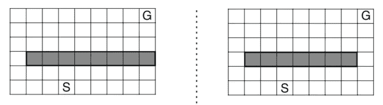
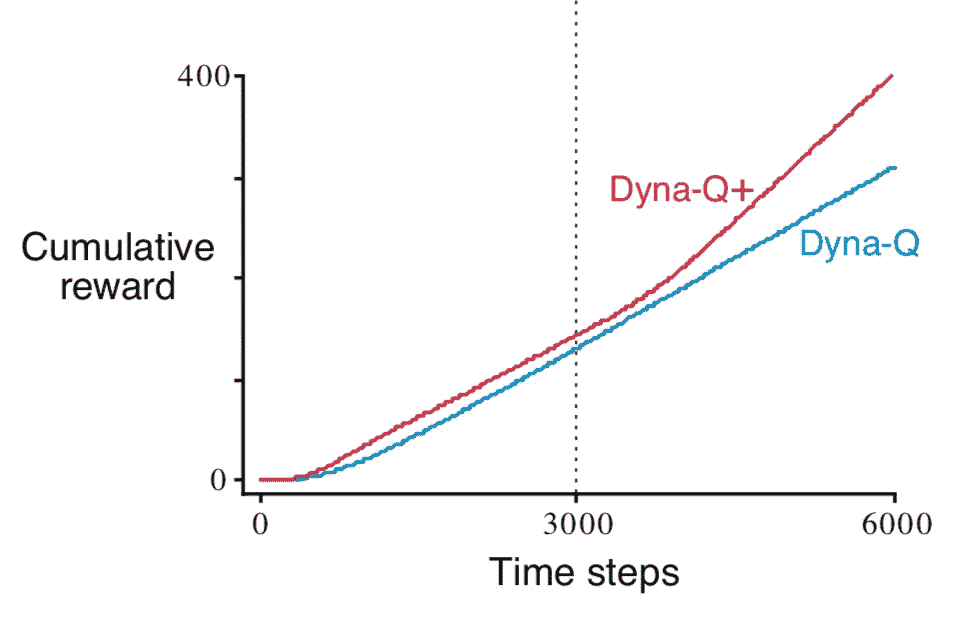
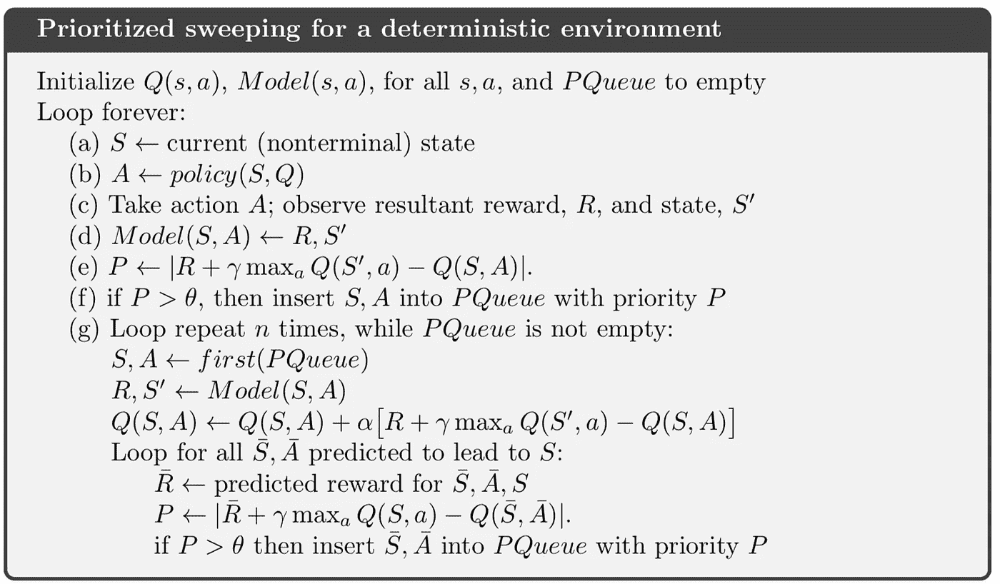
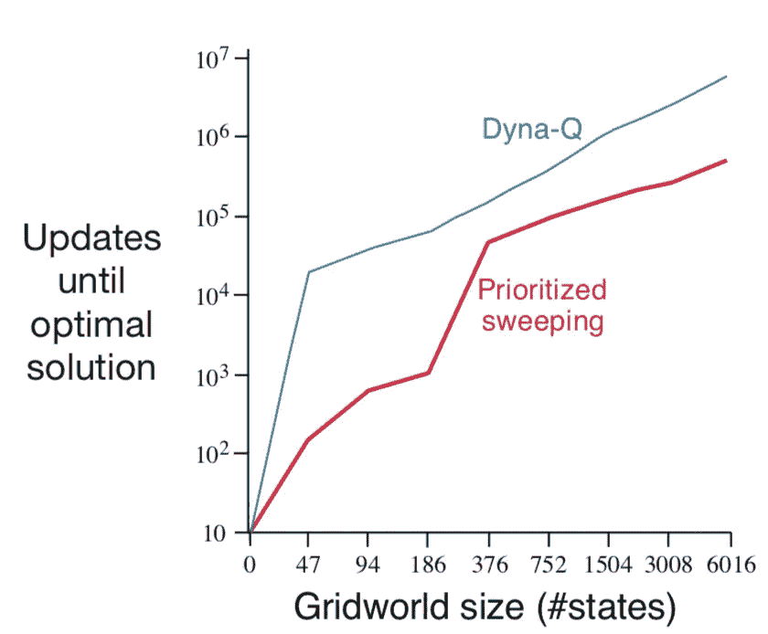

# 强化学习——基于模型的规划方法扩展

> 原文：<https://towardsdatascience.com/reinforcement-learning-model-based-planning-methods-extension-572dfee4cceb?source=collection_archive---------6----------------------->

## Dyna-Q+和优先级扫描的实现

在上一篇[文章](/reinforcement-learning-model-based-planning-methods-5e99cae0abb8)中，我们介绍了如何在强化学习环境中建模，以及如何利用该模型加速学习过程。在本文中，我想进一步阐述这个主题，并介绍另外两个算法， **Dyna-Q+** 和**优先级扫描**，这两个算法都基于我们在上一篇文章中学习的 Dyna-Q 方法。(如果你觉得有些游戏设定混乱，请查看我上一篇[文章](/reinforcement-learning-model-based-planning-methods-5e99cae0abb8))


在下面的段落中，我们将利用这两种算法来解决两个问题:

1.  模型错了怎么办？
2.  如何更高效的更新 Q 函数？

# 模型错了怎么办？

在上一篇文章中，我介绍了一个 Dyna-Maze 的例子，其中的动作是确定性的，代理通过记录它所经历的步骤来学习模型，这是从`(currentState, action) -> (nextState, reward)`开始的映射，然后在规划阶段，正在学习的模型被应用`n`次以加强学习过程。简而言之，这个过程可以概括为

1.  通过经验学习模型
2.  充分信任该模型，并应用它来强化价值函数

但是事情并不总是这样，因为环境可能是复杂和动态的。

> 模型可能是不正确的，因为环境是随机的，并且只有有限数量的样本被观察到，或者因为模型是使用函数近似法学习的，而函数近似法并不完全概括，或者仅仅因为环境已经改变并且其新的行为还没有被观察到。当模型不正确时，规划过程可能会计算出一个次优的策略。

## 捷径迷宫

考虑一个叫做捷径迷宫的案例，环境是动态变化的。



一个代理从`S`出发，目的是尽快到达`G`，黑灰色的区域是代理不能通过的区域。左边的图片代表原始设置，我们的代理能够使用 Dyna-Q 方法找到最短的路径，通过棋盘的左侧一直到`G`。但是，环境会在某个时间戳发生变化，棋盘最右边的一个快捷方式会打开。在这种设置下，Dyna-Q 代理还能找到最优解吗？

答案是否定的。即使使用ϵ-greedy 方法，代理人总是以一定的概率探索，也不太可能找到从最左边到最右边的最优路径，因为已经学习的 q 函数将总是引导代理人选择左边的路径，并且没有足够强的动机或奖励推动代理人探索其他路径。

## Dyna-Q+和实现

如何解决这个问题？其本质是保持代理人能够探索新的状态以适应不断变化的环境，而驱动代理人探索的诀窍是给予奖励。因此，这里我们介绍一下 Dyna-Q+的理论:

> **代理跟踪每个状态-动作对，记录自从该对在与环境的真实交互中最后一次尝试**以来已经过去了多少时间步。经过的时间越长，这一对的动态变化和模型不正确的可能性就越大(我们可以假设)。为了鼓励测试长期未尝试行为的行为，对涉及这些行为的模拟体验给予特殊的“额外奖励”。特别是，如果转换的模型奖励是`r`，并且在`τ`时间步中没有尝试转换，那么计划更新被完成，就好像对于一些小的`κ`，转换产生了`r + κ*sqrt(τ)`的奖励。这鼓励代理继续测试所有可访问的状态转换，甚至找到长的动作序列来执行这样的测试。

总而言之，该算法与 Dyna-Q 完全相同，除了**它跟踪一个状态被访问的次数，并奖励长期未被访问的状态**(因为这些状态可能会随着时间的推移而改变)。

现在让我们对 Dyna-Q 进行一些修改，并实现 Dyna-Q+(由于基本设置基本相同，下面的代码我将主要关注不同之处)。你也可以在这里查看完整的实现。

## 初始化

在 init 函数中，添加了两个组件来奖励未访问的状态。`self.time`记录每集内的总时间步数**(游戏结束后会重置)，而`self.timeWeight`本质上是奖励函数中的`κ`，表示我们希望代理探索的程度。除了这些通用设置之外，环境模型再次被初始化，但这次是`(currentState, action) -> (reward, nxtState, timestep)`的映射。**

## 模型更新

为了使代码更有条理，定义了一个更新模型函数:

该函数在每个时间步更新模型。需要注意的是**我们希望在计划阶段考虑从未尝试过的行动，我们将这些行动定义为将代理带回到原始状态，奖励为 0** ，因此您可以看到，对于从未发生的行动，模型为:

```
self.model[state][a] = (0, state, 1)
```

奖励设置为 0，状态设置为相同，时间步长设置为 1(因此未访问该状态的次数可能很高)。此外，对于在该状态下发生动作，将用当前时间步长进行标记。

## 播放功能

播放函数遵循与 Dyna-Q 方法相同的结构:

在每一步之后，我们通过调用`self.updateModel()`函数来更新模型，存储在模型中的时间步长在下面的循环中使用，以添加到奖励中:

```
_reward += self.timeWeight * np.sqrt(self.time - _time)
```

除了在一个州采取特定行动的原始奖励之外，还分配了额外的奖励。`self.time - _time`本质上是未被访问的次数。

## Dyna-Q 和 Dyna-Q+比较

通过对非探索状态给予额外奖励，Dyna-Q+更容易察觉到环境的变化，而 Dyna-Q 几乎做不到。



From Reinforcement Learning an Introduction

参考 Sutton 书中的结果，当环境在时间步长 3000 发生变化时，Dyna-Q+方法能够逐渐感知这些变化，并最终找到最优解，而 Dyna-Q 总是遵循它之前发现的相同路径。事实上，由于规划步骤加强了 Dyna-Q 中的经验，规划步骤越多，Dyna-Q 代理找到最佳路径的可能性就越小，相反，Dyna-Q+中的规划步骤增加了未充分探索的状态和动作的值，从而使代理更有可能探索和找到最佳路径。

# 优先级扫描(更新更高效)

我们现在已经了解了动态环境下形成强化学习的基础知识。你可能注意到了**在计划阶段，实际上有很多无效更新**，尤其是在所有状态和动作的 Q 函数都为 0，沿途奖励也为 0 的开始阶段。在这些场景中，暂时的差异，

```
R + Q(S', A') - Q(S, A)
```

等于 0，因而 Q 函数更新了许多状态，动作仍为 0。那么问题来了:我们能够更高效地更新吗？

这里我将介绍一种叫做优先级扫描的方法，重点是在规划阶段更新非零值。直觉是，由于许多更新是 0，我们是否能够只更新高于某个阈值的值，从而使学习更快？

> 根据更新的紧急程度确定更新的优先级，并按照优先级顺序执行更新是很自然的。这就是优先清扫背后的想法。维护每个状态-动作对的队列，这些状态-动作对的估计值如果被更新将会发生非平凡的变化，并根据变化的大小区分优先级。



Priority Sweeping

有几点你需要注意:

1.  模型是`(currentState, action) -> (reward, nxtState)`的映射
2.  只有大于`θ`的时间差值将被包括在队列中
3.  在计划阶段，所有导致所选状态的状态也将被更新

**在非平凡更新状态之后，所有在先状态需要被更新的原因是因为当前状态更新值是非平凡的，向后更新将绝对导致非零更新。** *(考虑我们在值迭代中谈到的例子，当目标达到时，我们进行向后更新，在此过程中更新的所有状态值都是非零和有用的)*

## 算法实现

是时候着手实现了，您可以在这里查看完整的实现。

## 初始化

在`init`函数中，我们初始化了一个阈值`θ`，一个根据优先级存储状态和动作对的优先级队列，以及一个前趋字典，以便更新所有导致当前更新状态的状态。

**播放功能**

主要区别在于播放功能:

在每一步，不是直接更新当前状态动作对的 Q 值，而是记录一个`tmp_diff`，如果该值足够大，则将其插入优先级队列。然后，模型和前任都被更新，注意前任字典是一个`nxtState -> List((currentState, action), ...)`的映射，因为许多状态和动作可能导致相同的状态。

在计划阶段(在`for`循环中)，最高优先级状态，动作对被检索(`self.queue.get(1)`，并且导致该状态的所有状态(在`pre_state_action_list`内)被更新。

## Dyna-Q 和优先级扫描比较

如上所述，优先级扫描会在整个过程中更新重要的值，因此效率更高，速度更快。



From Reinforcement Learning an Introduction

参考 Sutton 书中的情节，priority 比 Dyna-Q 更快地找到最优解。

上面介绍的算法是针对确定性环境，针对非确定性环境，正如萨顿所说:

> 将优先扫描扩展到随机环境是简单的。通过记录每个状态-动作对已经经历的次数以及下一个状态是什么来维护该模型。然后，很自然地，不是像我们到目前为止一直使用的那样用样本更新来更新每一对，而是用预期更新来更新，考虑所有可能的下一状态及其发生的概率。

# 结论

在这篇文章中，我们学习了两个算法，要点是:

1.  Dyna-Q+是为不断变化的环境而设计的，它对未充分利用的状态、动作对给予奖励，以驱动代理进行探索
2.  优先级扫描能够通过用非平凡更新来更新和传播值来加速学习过程

最后，请查看我的 Github。欢迎您投稿，如果您有任何问题或建议，请在下面发表评论！

**参考**:

*   [http://incompleteideas.net/book/the-book-2nd.html](http://incompleteideas.net/book/the-book-2nd.html)
*   [https://github . com/JaeDukSeo/reinforcement-learning-an-introduction](https://github.com/JaeDukSeo/reinforcement-learning-an-introduction)