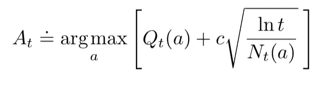
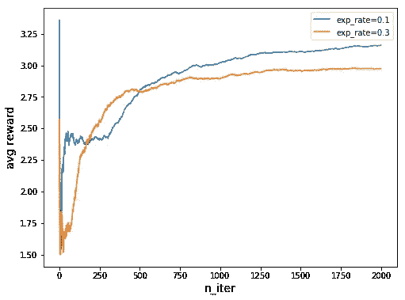
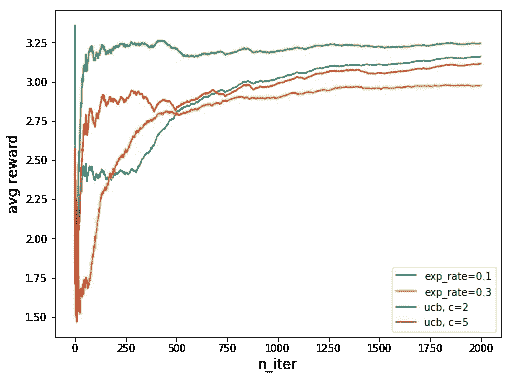

# 强化学习——多臂土匪实现

> 原文：<https://towardsdatascience.com/reinforcement-learning-multi-arm-bandit-implementation-5399ef67b24b?source=collection_archive---------7----------------------->

## ϵ-greedy 与加州大学的比较

多臂强盗是一个经典的强化学习问题，其中一个玩家面对`k`吃角子老虎机或强盗，每一个都有不同的奖励分配，并且玩家试图在试验的基础上最大化他的累积奖励。

[k-armed bandit](https://blog.lightningai.com/multi-armed-bandits-are-the-new-a-b-tests-27dd7b48765b)

# 制定

让我们直接切入这个问题。强化学习问题有 3 个关键组成部分——**状态、动作**和**奖励**。让我们回忆一下这个问题——k 台机器放在你面前，在每一集里，你选择一台机器并拉动手柄，通过这个动作，你会得到相应的奖励。因此，状态是所有机器的当前估计值，开始时为零，动作是您决定在每集选择的机器，奖励是您拉下手柄后的结果或支出。有了这三项，我们就可以编写`Bandit`的`init`功能了(这里查看[代码](https://github.com/MJeremy2017/RL/blob/master/Multi-ArmBandit/bandit.py)):

`k`是我们希望初始化的盗匪数量，`actions`用数字表示，每个数字代表我们要搭载的机器，我们和往常一样有`exp_rate`(探索率)和`lr`(学习率)来控制探索和价值更新。`total_reward`和`avg_reward`用于衡量我们的结果。每台机器的赔付额是由正态分布生成的随机值，最终的初始估值被设置为 0。

# 行动

## 选择行动

要找出报酬最高的机器，最直接的方法是尝试，尽可能多地尝试，直到对每台机器都有一定的信心，并从现在开始坚持使用最好的机器。问题是，我们可能可以用更明智的方式进行测试。由于我们的目标是沿途获得最大的回报，我们当然不应该浪费太多时间在一台总是给予低回报的机器上，另一方面，即使我们偶然发现了某台机器的诱人回报，我们仍然应该能够探索其他机器，希望一些没有被探索过的机器能够给我们更高的回报。

因此，在选择行动时，我们将探索方法:

1.  ϵ-greedy
2.  UCB(置信上限)

我们已经多次谈到ϵ-greedy，在那里我们以ϵ概率采取随机行动，以 1 - ϵ概率采取最大行动。这在探索和开发之间取得了良好的平衡。让我们谈一谈基于以下公式的 UCB:

UCB

*其中* `*lnt*` *表示* `*t*` *的自然对数(为了等于* `*t*` *而不得不将* `*e = 2.71828*` *的数字)，而* `*Nt(a)*` *表示动作 a 在时间* `*t*` *之前被选择的次数(公式中的分母，数字* `*c > 0*` *控制探索的程度)。如果* `*Nt(a)=0*` *，那么* `*a*` *被认为是一个最大化动作。(摘自* [**强化学习:入门**](http://incompleteideas.net/book/the-book-2nd.html) *)*

所以随着试验次数的增加，如果一个强盗还没有被探索，它的`Nt(a)`将会变小，因此公式的右边将会变大。这样，该公式有助于平衡当前估计值`Q`和勘探速度。

为了实现 UCB，我们需要在`init`函数中添加一些变量:

`self.times`计算试验的总次数，而`self.action_times`计算每个土匪的行动次数。

现在我们可以将ϵ-greedy 和 UCB 放入我们的方法`chooseAction`函数中:

当`self.ucb`打开时，我们将根据公式选择动作。如果值除以 0，则`self.action_times`增加 0.1。如果`exp_rate` if 设置为 0 并且`self.ucb`为真，动作将完全由 UCB 选择，但是如果`exp_rate > 0`，那么我们将有一个混合ϵ-greedy 和 UCB 的混合方法。

## 采取行动和更新估计

`takeAction`函数接收一个动作，并在收到奖励后更新该动作的估计值。

正如问题所描述的，每个强盗的支付符合一定的分布，因此我们给每个真实的奖励增加了一些随机性。在收到奖励后，**将通过添加当前观察和先前估计之间的差乘以学习速率**来更新估计。

## 玩

最后，我们需要一个函数来开始播放。

# 结果

我们初始化了一个 5 臂 bandit，并比较了不同方法的平均增益。(点击查看[代码)](https://github.com/MJeremy2017/RL/blob/master/Multi-ArmBandit/bandit.py)

这是使用不同探索率的ϵ-greedy 方法超过 2000 次迭代的平均回报。当勘探率收敛时，0.1 的勘探率超过 0.3 的勘探率。

我们加入不同`c`值的 UCB 方法进行比较。两种 UCB 方法的勘探率都是 0.1。从结果中，我们看到，一般来说，UCB 优于ϵ-greedy，但除了 bandit 之外，在许多其他问题上也很难应用 UCB。

请在这里查看完整的[代码](https://github.com/MJeremy2017/RL/blob/master/Multi-ArmBandit/bandit.py)，欢迎您贡献和提出问题！

**参考:**

*   [http://incompleteideas.net/book/the-book-2nd.html](http://incompleteideas.net/book/the-book-2nd.html)
*   [https://github . com/JaeDukSeo/reinforcement-learning-an-introduction](https://github.com/JaeDukSeo/reinforcement-learning-an-introduction)