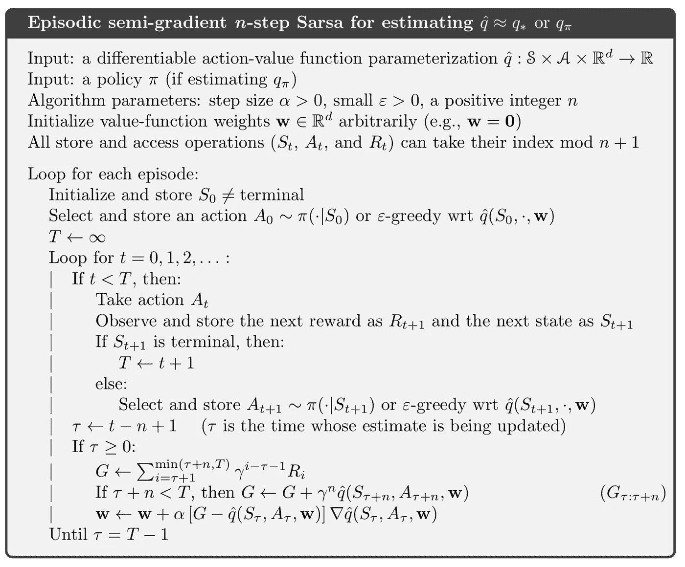
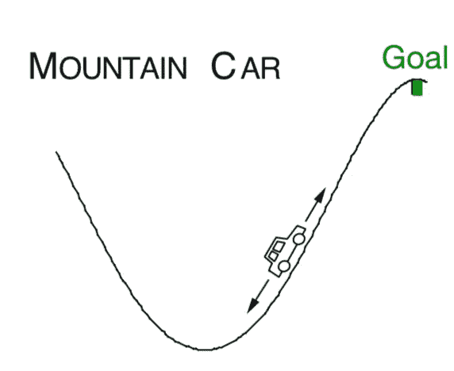
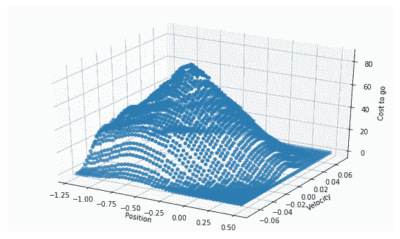
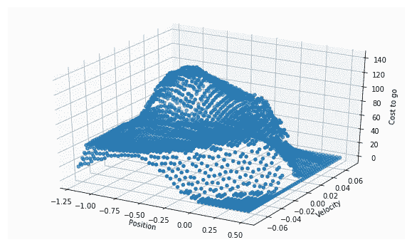

# 强化学习——策略函数逼近的推广

> 原文：<https://towardsdatascience.com/reinforcement-learning-on-policy-function-approximation-2f47576f772d?source=collection_archive---------11----------------------->

## 将 Q 函数应用于连续状态空间

在以前的帖子中，我们已经将强化学习的思想从离散状态空间扩展到连续状态空间，并且实现了 1000 个状态的随机行走示例，在这种情况下，给定了一个策略，因为在所有状态下向左或向右的动作总是具有相等的概率，并且唯一的问题是基于给定的策略来测量每个状态的值函数(我们将这类问题称为预测问题)。

在本文中，让我们将这个想法扩展到更一般的情况，称为控制问题，其中没有给定策略，我们的目标是使用 Q 函数来学习每个状态下的最佳行动。在这篇文章中，我将:

1.  介绍连续状态空间设置的策略算法
2.  实现并应用该算法解决经典的山地汽车问题

(注:我们将应用 tile 编码作为近似函数，如果您不熟悉，请参考我上一篇[帖子](/reinforcement-learning-tile-coding-implementation-7974b600762b))


# 控制问题

与行为分布已知的预测问题不同，在控制问题中，代理的任务是探索环境并学习每个状态下的最佳行为，因此，当公式化问题时，考虑的是`Q(s, a)`函数而不是价值函数`V(s)`。

## 半梯度 Sarsa

另一方面，像预测问题一样，参数值函数的算法可以自然地扩展到参数 Q 函数，只需用 Q 函数替换值函数。让我们直接进入我们要应用的算法:



如果你一直关注我以前的帖子，你会再次看到这个算法非常熟悉。类似于离散状态空间中的 n 步 Sarsa，这种半梯度 n 步 Sarsa 与完全相同，只是在每个时间步，参数`w`被更新，而不是直接更新 Q 函数。**其思想是在每次更新时间** `τ` **时，使用到** `τ+n` **的累积值来校正当前估计，并根据梯度下降的思想，将参数权重** `w` **与其导数和增量成比例地稍微向实际值更新。**

# 山地车问题

如果你仍然有一些困惑，那完全没问题。我相信理解一个算法的每个细节的最好方法是实现它，并把它应用到一个实际问题上。我们来做一个经典的强化学习问题，山地车。

## 山地汽车场景



Mountain Car

*考虑驾驶一辆动力不足的汽车在陡峭的山路上行驶的任务，如图所示。困难在于重力比汽车的发动机更强，即使在全油门的情况下，汽车也无法加速上陡坡。唯一的解决办法是先离开目标，然后爬上左边的反坡。*

*这个问题中的奖励在所有时间步长上都是-1，直到汽车在山顶移动经过它的目标位置，这就结束了这一集。有三种可能的操作:全油门向前(+1)、全油门向后(-1)和零油门(0)。汽车根据简化的物理学原理行驶。其位置、* `*x_t*` *和速度、* `*x_ ̇t*` *由*更新


Update Rule

*此处绑定操作强制执行* `*-1.2 <= x_t+1 <= 0.5*` *和* `*-0.07 <= x_ ̇t+1 <= 0.07*` *。另外，当* `*x_t+1*` *到达左界时，* `*x_ ̇t+1*` *被复位为零。到了右边界，目标达到，插曲终止。每集从* `*[-0.6, -0.4)*` *中的任意位置* `*x_t*` *和零速度开始。*(抱歉无格式的语法编辑，我不知道如何在媒体上编辑数学语法)

简单来说，汽车以 0 速度从-0.6 到 0.4 之间的位置出发，有 3 个离散动作，停留(0)，前进(1)，后退(-1)，目标是到达最右边的山顶。所以**这个问题中的状态包括** `(position, velocity)` **，动作集合为** `(-1, 0, 1)` **，奖励为** `-1` **除了目标状态(注意状态是连续的，动作是离散的)。**

## 价值函数

了解了问题设置，我们现在需要一个 Q 值函数来跟踪所有状态的值，并在探索过程中更新值估计。记得在上一篇文章中，我们已经讲述了使用 tile 编码对连续状态空间进行编码并将其应用于更新过程的基础知识。在本帖中，我们将继续在我们的值函数中使用平铺编码，但代码略有不同:

这里使用的图块编码功能是指这里的[和](https://github.com/MJeremy2017/reinforcement-learning-an-introduction/blob/master/chapter10/TileCoding.py)。我没有使用上一篇文章中介绍的 tile 编码的原因是，我介绍的那个有点基本，具有均匀分布的偏移，我亲自测试的结果不如这个，而且这似乎是 Sutton 在他的书中介绍的 tile 编码函数。

不管怎样，让我们回到正题。这里的想法是完全相同的，每个连续的状态都被编码到一些图块的索引中，在每集的每一步，其对应图块的权重都被更新。

让我们仔细看看这个函数。`numberOfTilings = 8`和`maxSize = 2048`，意味着我们设置了 8 个 tilings，每个 tilings 有`16*16`个网格数，所以`16*16*8 = 2048`。更具体地说，`(position, velocity)`的状态由一个维度为`16*16*8`的 3D 立方体表示，而`tiles`函数，从我提到的文件中，能够获得给定状态和动作的活动瓦片。您可能已经注意到，在`init`函数中，状态被重新调整为:

```
# position and velocity needs scaling to satisfy the tile software
self.positionScale = self.numOfTilings / (POSITION_BOUND[1] - POSITION_BOUND[0])self.velocityScale = self.numOfTilings / (VELOCITY_BOUND[1] - VELOCITY_BOUND[0])
```

老实说，我不知道它为什么以这种方式缩放，但看起来像是使用这种平铺编码功能，状态的连续值总是要被重新缩放。

像所有 Q 值函数一样，它至少有两个函数:

1.  `value`功能:返回当前状态的值，以及动作。当代理达到目标状态时，返回 0。
2.  `update`功能:根据新的估计值更新权重(记住在 tile 编码中，权重参数的导数总是 1，因此更新是直接加上`delta`值)。

`costToGo`函数用于后面步骤的可视化，它简单地返回该状态和动作的最大负值(因为奖励总是-1，所以结果被赋予一个`-`符号)。

# 山地汽车实施

到目前为止，我们实际上已经完成了最棘手的部分，剩下的是我们一直在重复做的事情。([全面实施](https://github.com/MJeremy2017/Reinforcement-Learning-Implementation/blob/master/MountainCar/MountainCar.py))

## 初始化

像往常一样，在`init`函数中，我们指定了动作和状态范围，以及所有强化学习问题中的一些通用元素。

## 动作功能

`takeAction`采取行动并决定汽车的下一个状态。更新规则遵循我在上面介绍的公式。`chooseAction`函数仍然使用ϵ-greedy 方法，在贪婪部分，它选择由我们上面描述的`valueFunc`给出的最大估计值的动作结果。

## 报酬

除了目标状态获得奖励`0`，其他所有状态都获得奖励`-1`。

## 发动汽车！

这是所有函数中最长的一个，但不用担心，事实上，一切都和它在离散设置中一样(我实际上是从我以前的代码中复制粘贴的)，除了值函数被改为我们刚才介绍的函数。目标`G`是累积的 n 步值，包括第`tau+n`步的值，在更新过程中`state, action and G`一起发送给`valueFunction.update()`函数。

# (英)可视化(= visualization)

在本节中，我们将使用在`ValueFunction`中定义的`costToGo`函数来衡量在给定状态和行动的情况下达到目标的成本。图的代码如下所示:

让我们看看步骤 100 和步骤 9000 的结果:



Step 100



Step 9000

成本越低，越接近目标状态。事实上，较低的成本要么出现在最左边的位置，要么出现在最右边的位置，这验证了只有到达目标的相反方向，智能体才能到达最终的目标状态。

**参考**:

*   [http://incompleteideas.net/book/the-book-2nd.html](http://incompleteideas.net/book/the-book-2nd.html?source=post_page---------------------------)
*   [https://github . com/Shang tong Zhang/reinforcement-learning-an-introduction](https://github.com/ShangtongZhang/reinforcement-learning-an-introduction)