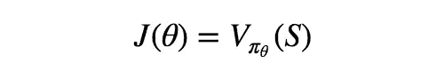
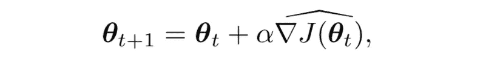
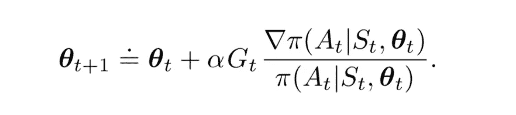
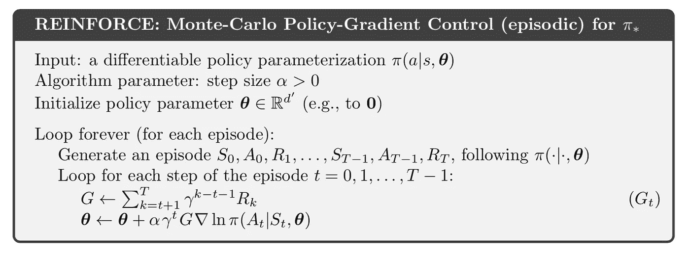
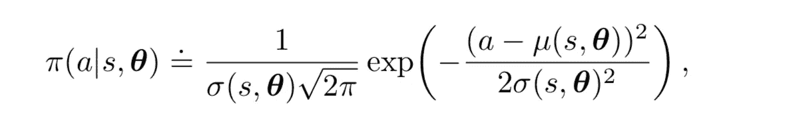
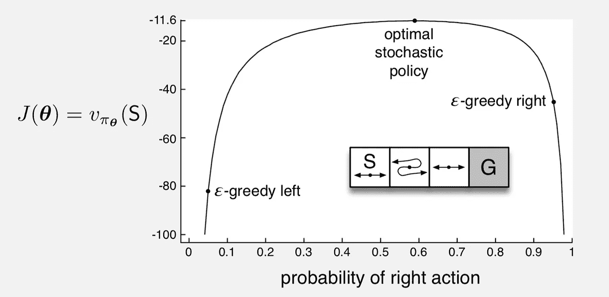
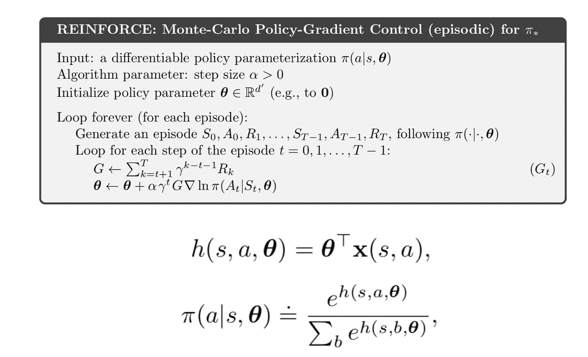
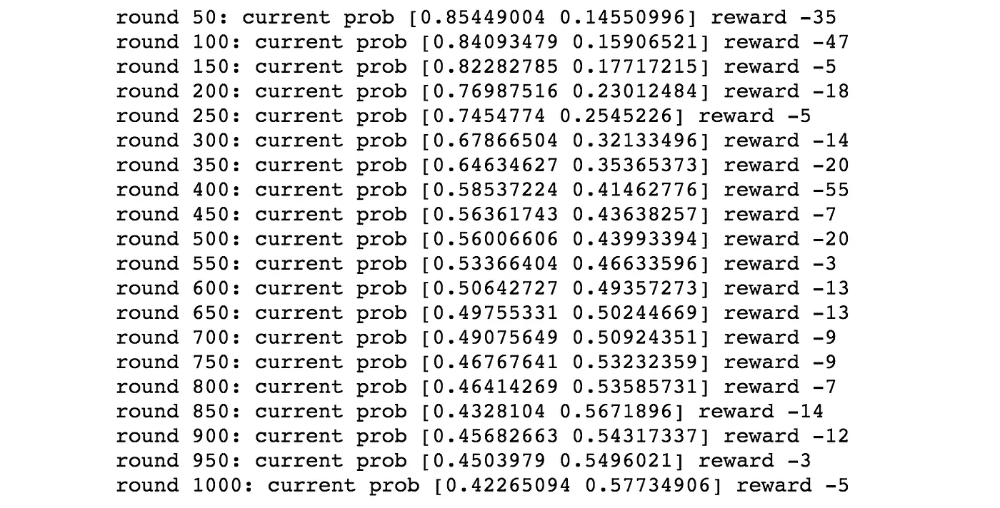

# 强化学习——策略近似

> 原文：<https://towardsdatascience.com/reinforcement-learning-policy-approximation-f5606ad3d909?source=collection_archive---------14----------------------->

## 政策梯度法的理论与应用

到目前为止，所有引入的算法都是基于值函数或 Q 函数的梯度算法，也就是说，我们假设对于不同的状态`S(or [S, A])`存在真实值`V(or Q)`，并且为了接近真实值，我们使用公式中带有`∇V or ∇Q`的梯度方法，并且在学习过程的最后，通过基于`V or Q`函数估计在每个状态选择最有回报的动作来生成策略`π(A | S)`。然而，策略梯度方法对强化学习问题提出了完全不同的观点，人们可以直接学习或更新策略，而不是学习一个值函数。所以在本帖中，我们将:

1.  学习政策梯度法的理论
2.  将其应用于短走廊示例

# 政策梯度理论

记得在以前的帖子中，学习过程中使用的策略总是ϵ-greedy，这意味着代理将在某个概率下采取随机行动，在其余概率下采取贪婪行动。然而，在梯度策略方法中，问题被公式化为，`P(A|S, θ) = π(A|S, θ)`，也就是说，对于每个状态，策略给出了从该状态可能采取的每个动作的概率，并且为了优化策略，它被参数化为`θ`(类似于我们之前介绍的价值函数中的权重参数`w`)。

另一件值得一提的事情是，在这种情况下，性能变量被定义为:

`*J(θ)*` 是当前参数化策略`*π*`、**下`*V*`的真值，目标是最大化性能** `*J*`，因此我们得到一个梯度更新过程:

并且由于`*J*`是策略`π`的一个表示，我们知道`θ`的更新会包含当前的策略，经过一系列的推导(详情请参考 Sutton 的书，第 13 章)，我们得到更新过程:

我们的第一个政策梯度方法是:

`G`仍为累计折扣奖励，参数`θ`将更新为当前保单的衍生产品。

## 策略近似的优势

首先，策略梯度方法的明显优点是，与值函数近似法相比，该方法简化了过程，在值函数近似法中，我们首先学习一个值函数`V(S, A)`，并从中推断出策略`π(A|S)`，在策略近似法中，在每次迭代中，通过更新`π(A|S, θ)`中的参数`θ`来直接更新策略。

其次，在价值函数更新过程中，我们通常使用ϵ-greedy 方法，这样代理人总是有一个ϵ采取随机行动的概率。然而，策略梯度方法能够通过将某些动作的概率更新为零来逼近确定性策略。

第三，如果你还记得，在以前的文章中，我们总是要求动作空间是离散的，因为一般的价值函数逼近方法在处理具有严格连续空间的动作时有点棘手。但是在策略近似定义中，动作实际上可以相对于状态是连续的，例如，可以将策略定义为:

在这种情况下，动作`a`将具有正态分布的概率，μ和σ由状态`s`定义。

最后但同样重要的是，在最优策略是非确定性的情况下，它允许选择具有任意概率的动作，并且总是选择具有最优概率的动作。

# 短走廊示例

现在让我们举一个例子来应用我们的知识。

## 问题描述

考虑下图中插图所示的小走廊网格世界。奖励是-1 每一步，像往常一样。在三种非终结状态的每一种状态下，都只有两个动作，右和左。这些动作在第一和第三种状态下有它们通常的结果(在第一种状态下左不动)，但是在第二种状态下它们是相反的，所以右向左移动，左向右移动。这个问题很难，因为在函数近似下，所有的状态都是相同的。特别是，我们为所有的`s`定义了`x(s, right) = [1, 0])`和`x(s, left) = [0, 1])`。

在这种情况下，状态、动作表示使用最简单的格式，并将所有状态视为相同(二进制表示与[图块编码](/reinforcement-learning-tile-coding-implementation-7974b600762b)中的表示相同)。

下面列出了算法和组件:

因此，在这里，使用 softmax 函数(也可以应用其他函数)定义策略`π(a|s, θ)`，该函数生成 0 到 1 之间的概率，并且组件`h`被定义为具有参数`θ`的简单线性函数。

现在让我们开始实现。

## 初始化

在`init`函数中，我们有上面讲过的`self.x`和`self.theta`的定义，其初始权重为`self.x`，起始状态为 0。

## 行动

函数`softmax`接受一个向量，并返回向量中每个分量的概率。动作由`softmax`生成的概率选择，`takeAction`函数接受一个动作并返回下一个状态(注意第二个状态是相反的)。

## 报酬

如问题所述，除了最终状态，所有状态的奖励都是-1。

## 运行游戏！

在每一集里，代理都要经历一个过程`current_state -> take_action -> next_state -> get_reward`。当它到达状态(3)的终点时，我们计算累计奖励`G`。梯度`grad`是为该步骤中采取的特定动作计算的(`j`是该动作的索引)。`reward_sum`只记录每集的奖励，用于显示目的。

让我们用`alpha = 2e-4`和`gamma = 1`运行游戏 1000 集，得到结果:

从增加回合中的概率来看，我们看到 agent 在逐渐更新策略，实际上在这个博弈设定中，最优策略是概率`[0.4, 0.6]`，我们的学习结果正在接近最优值([完全实现](https://github.com/MJeremy2017/Reinforcement-Learning-Implementation/blob/master/ShortCorridor/ShortCorridor.py))。

**参考**:

*   [http://incompleteideas.net/book/the-book-2nd.html](http://incompleteideas.net/book/the-book-2nd.html?source=post_page---------------------------)
*   [https://github . com/Shang tong Zhang/reinforcement-learning-an-introduction](https://github.com/ShangtongZhang/reinforcement-learning-an-introduction)