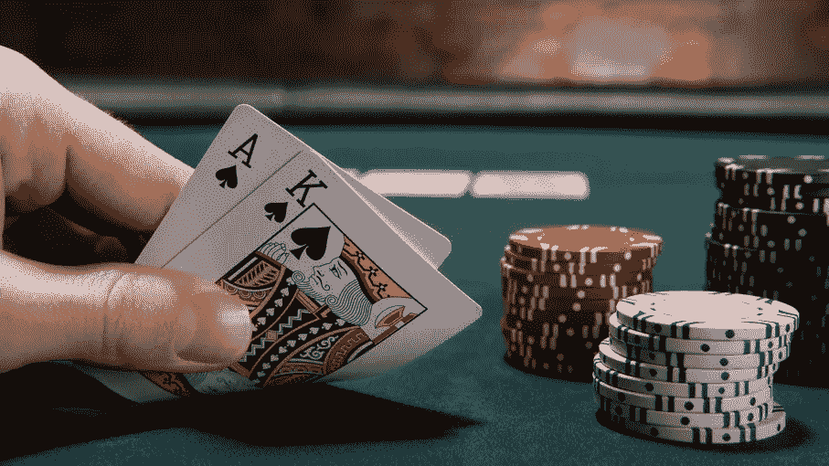

# 强化学习—解决 21 点

> 原文：<https://towardsdatascience.com/reinforcement-learning-solving-blackjack-5e31a7fb371f?source=collection_archive---------6----------------------->

## 用 Q-learning 实现 21 点

我们已经讨论了如何使用蒙特卡罗方法来评估强化学习中的策略[在这里](/monte-carlo-methods-estimate-blackjack-policy-fcc89df7f029)，我们以 21 点为例，设定了一个固定的策略，通过重复采样，我们能够获得策略和状态的无偏估计，以及沿途的值对。下一个直接的想法是，我们能否通过使用价值迭代来解决 21 点问题，我们在前面的文章中已经介绍过了。

答案听起来是肯定的，因为我们可以清楚地定义 21 点的三个主要组成部分`(state, action, reward`，并且我们也知道对手的策略，这也将被视为环境的一部分，所以这个过程将类似于我们在[井字游戏实现](/reinforcement-learning-implement-tictactoe-189582bea542)中讨论过的，我们站在 1 个玩家的立场上，对手的相应动作将被视为环境的反馈(这样我们就不需要对手的任何模型，这是强化学习的优势之一)。

# 二十一点规则

简单回顾一下[21 点](https://en.wikipedia.org/wiki/Blackjack)规则和庄家采取的一般策略:

*游戏从发给庄家和玩家的两张牌开始。庄家的一张牌面朝上，另一张面朝下。如果玩家立即有 21(一张 a 和一张 10 的牌)，这叫自然牌。然后他赢了，除非庄家也有一个自然牌，在这种情况下，游戏是平局。如果玩家没有自然牌，那么他可以一张接一张地要求额外的牌(命中)，直到他停止(坚持)或超过 21(破产)。如果他破产了，他就输了；如果他坚持，那么就轮到庄家了。庄家根据固定的策略不加选择地打或坚持:他坚持任何 17 或更大的和，否则就打。* *如果庄家破产，那么玩家获胜；否则，结果——赢、输或平——取决于谁的最终总和更接近 21。如果玩家拿着一张可以算作 11 而不会破产的王牌，那么这张王牌就可以用了。*

# 履行

先明确一下**状态，动作，奖励**。**游戏的状态是决定和影响胜算的因素**。首先，最重要的是卡的金额，目前手头的价值。其次，还有两个因素有助于赢得游戏，这是我们在上面的规则介绍中描述的，是可用的 ace 和庄家的扑克牌。因此**状态将有 3 个组成部分:玩家当前的牌总数、可用的 ace 和庄家的出牌**。**动作**清晰，因为在 21 点中一个人只能有 2 个动作，要么**击中，要么**站立。奖励将基于游戏的结果，赢了给 1，平了给 0，输了给-1。

由于我已经谈到了 21 点上的 MC 方法，在下面的部分中，我将介绍两者实现的主要差异，并尝试使代码更加简洁。([全码](https://github.com/MJeremy2017/RL/blob/master/BlackJack/blackjack_solution.py))

## 初始化

在 init 函数中，我们定义了将在下面的函数中频繁使用或更新的全局值。与我们的玩家遵循固定策略的 MC 实现相反，这里我们控制的玩家不使用固定策略，因此我们需要更多组件来更新其 Q 值估计。

在这个`init`函数中定义的组件通常用于强化学习问题的大多数情况。与 MC 方法中的`init`函数相比，增加的部分包括`self.player_Q_Values`，它是`(state, action)`的初始化估计，每集之后会更新，`self.lr`，它用于控制更新速度，以及`self.exp`，它用于采取行动。

## 交易卡和经销商政策

`giveCard`和`dealerPolicy`功能完全相同。因为我们的对手，庄家，在这场游戏中仍然持有相同的策略，我们正在探索一种可以与庄家的策略一样有竞争力甚至更好的策略。

## 行动选择

这一次我们的玩家不再遵循固定的政策，所以它需要考虑在平衡探索和开发方面采取什么行动。

我们的玩家有两个动作要做，其中 0 代表站立，1 代表击中。当当前牌的和等于或小于 11 时，一个人将总是击中，因为击中另一张牌没有害处。当牌的总数超过 11 时，我们的玩家将采取ϵ-greedy 策略，其中`exp_rate`百分比的时间，它采取随机行动，否则采取贪婪行动，这是基于 q 值的当前估计获得最多奖励的行动。

## 判断下一个状态

通过采取一个动作，我们的玩家从当前状态移动到下一个状态，因此`playerNxtState`函数将**采取一个动作并输出下一个状态，并判断是否游戏结束**。

为了进入下一个状态，函数需要知道当前的状态。它在开始时通过将当前状态分配给固定变量来实现这一点。*下面的逻辑是如果我们的动作是 1，代表 HIT，我们的玩家再抽一张牌，根据抽的牌是不是 ace，相应的加上当前的牌和。另一方面，如果动作是 STAND，游戏马上结束，返回当前状态。值得注意的是，在函数的最后我们增加了另一个部分，根据玩家手上是否有可用的 ace 来判断游戏是否结束。*

## 给予奖励并更新 Q 值

像所有的强化学习更新一样，在游戏结束时(这被认为是一集),我们的玩家会收到基于自己和庄家的牌值的奖励，并将该值向后传播以更新对`(state, action)`的估计。

Q-value update

这两个功能可以合并成一个，我把它们分开是为了在结构上更清晰。`winner`函数判断游戏的获胜者并相应返回奖励，`_giveCredit`函数根据上面的公式更新奖励，这与我们在[网格世界 Q-learning](/implement-grid-world-with-q-learning-51151747b455) 中介绍的完全相同，**Q 值以相反的方式更新，而最后更新的值将用于更新当前的 Q 值**。

## 培养

在培训阶段，我们将模拟许多游戏，让我们的玩家与庄家对打，以更新 Q 值。

与 21 点的 MC 方法不同，在开始时我增加了一个功能`deal2cards`,它只是简单地向玩家连续发 2 张牌。原因是遵循规则**如果任一玩家用前 2 张牌得到 21 分，游戏直接结束，而不是继续等待下一个玩家到达其终点**。这避免了这样的情况，一个玩家用前 2 张牌得到 21 分，而另一个玩家也用 2 张以上的牌得到 21 分，但是游戏以平局结束。

# 玩庄家和结果

有了我们配备了智能的代理，我们就可以让它与庄家对弈了(*保存和加载策略功能与 MC 21 点中的相同，* `*playWithDealer*` *功能与训练过程的结构类似，只是将* `*exp_rate*` *调至 0* )。

用`exp_rate=0.2`和`lr=0.1`训练了一万回合后，我保存了策略，让它和庄家打一万回合，得到的结果是:

*   wining: 4122
*   图纸:1639 年
*   失败:4239

这是一项无法超越经销商的政策。肯定存在比 HIT17 执行得更好的策略(事实上，这是一个公开的秘密)，我相信，我们的代理没有学习到最优策略并且执行得同样好的原因是，

1.  没有足够的训练
2.  探索率和学习率的调整(修正它们可能对这种情况不好)
3.  一步 Q 值更新有其自身的局限性

## 你能做什么？

我强烈建议你在当前实现的基础上进行更多的尝试，这既有趣又有利于加深你对强化学习的理解。你可以试试:

*   **n 步更新而不是 1 步**(我也会在以后的文章中介绍)
*   **根据当前保存的策略** *(这是一个有趣的想法，值得一试，因为我们知道 AlphaGo 通过与大师对弈而变得强大，但 AlphaGo Zero 通过学习与自己对弈以 100:0 击败了它。你也可以利用这个想法，试着训练一个代理和自己一起玩)*

请点击查看[的完整代码。欢迎您投稿，如果您有任何问题或建议，请在下面发表评论！](https://github.com/MJeremy2017/RL/blob/master/BlackJack/blackjack_solution.py)

**参考**

[1][http://incompleteideas.net/book/the-book-2nd.html](http://incompleteideas.net/book/the-book-2nd.html)