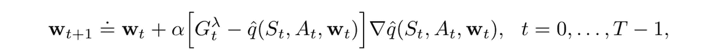
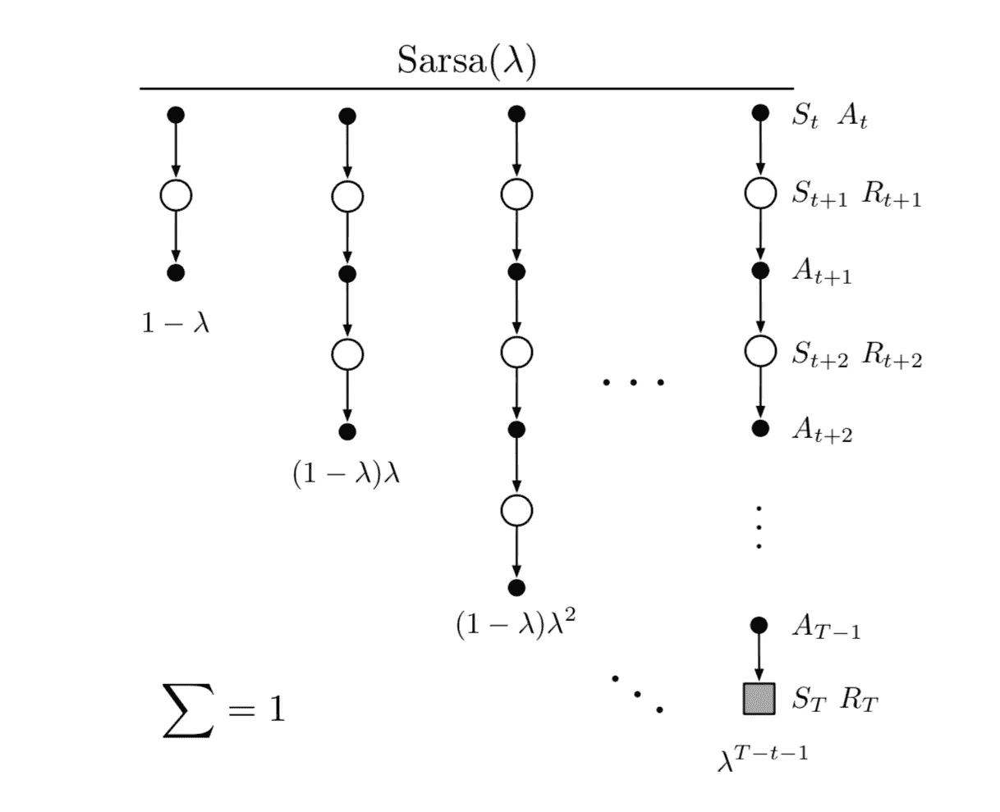
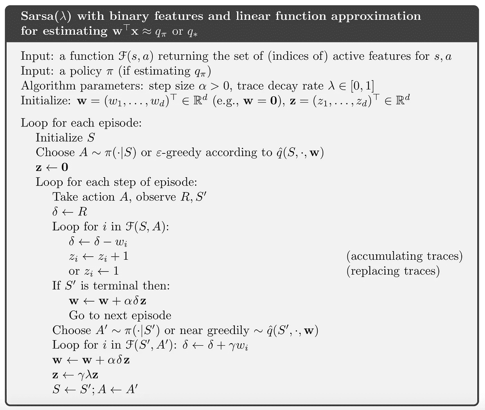
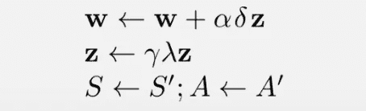
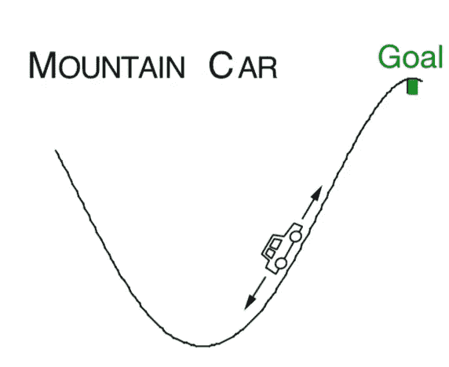
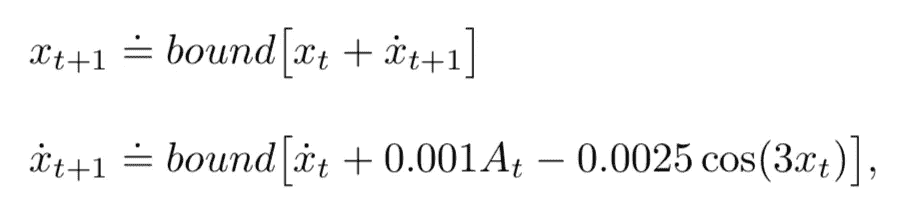
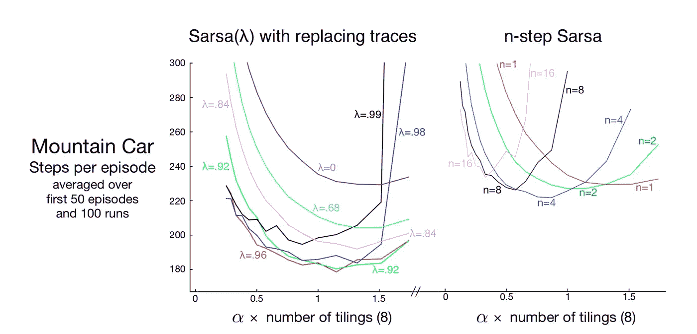

# 强化学习— TD(λ)简介(3)

> 原文：<https://towardsdatascience.com/reinforcement-learning-td-%CE%BB-introduction-3-f329bdbf872a?source=collection_archive---------18----------------------->

## 用 Sarsa(λ)扩展 Q 函数上的 TD(λ)

在上一篇[文章](https://medium.com/@zhangyue9306/reinforcement-learning-td-%CE%BB-introduction-2-f0ea427cd395)中，我们学习了 TD(λ)与合格迹的思想，这是 n 步 TD 方法的组合，并将其应用于随机游走的例子。在这篇文章中，让我们将 lambda 的思想扩展到更一般的用例——不是学习状态值函数，而是学习状态的 Q 函数，动作值。在本文中，我们将:

1.  了解 Sarsa(λ)的概念
2.  将其应用于山地车实例

# 萨尔萨(λ)

与我们已经阐述的许多扩展一样，将价值函数`V(S)`扩展到 Q 函数`Q(S, A)`是非常自然的，因为所有的公式和逻辑都是相同的，当公式化问题时，将只考虑动作。回想一下 TD(λ)这里介绍的，更新过程类似:

唯一不同的是`∇V`被`∇q`取代，并且[合格跟踪](https://medium.com/@zhangyue9306/reinforcement-learning-td-%CE%BB-introduction-2-f0ea427cd395)将扩展为:

仍在这里的`∇V`换成了`∇q`。

因此，我们得到 Sarsa(λ)的备份图:

其中每列是 n 步 Sarsa，`1-λ`，`(1-λ)λ` …是权重。

扩展的算法将是:

注意，这里的算法是专门为二进制特征表示而设计的，即每个状态、动作对将被表示为二进制特征，例如`(3.2, 1)`可以被表示为`[1, 0, 0, 1]`(更具体地，我们已经广泛地讨论了如何在[瓦片编码](/reinforcement-learning-tile-coding-implementation-7974b600762b)中将连续状态表示为二进制特征)

乍一看，你可能觉得算法有点复杂，但实际上和`TD(λ)`是一样的，我们试着这样理解一下:

首先，我们来关注一下底部。你应该对此很熟悉，因为它看起来几乎与`TD(λ)` — `δ`相同，这是时间上的差异，权重`w`基于`δ`和资格跟踪`z`进行更新，其中`z`跟踪先前的状态。`z`提供了两个更新:

1.  **积累痕迹**:`z = z + 1`；那么`1`从何而来？这其实是`q(S, A)`的衍生！请记住，这里我们使用状态、动作的二进制表示，活动特征的导数是 1。其实也可以写成`z = z + ∇q`，代入`w` updates 时，跟踪之前的导数。
2.  **替换轨迹:** `z = 1`，仅使用当前导数更新`w`。

`F(s, a)`在这里你可以把它想成是 tile 编码函数或者任何其他给出状态、动作二进制表示的函数。

这个算法就这么多了。忽略其他部分，将其与我们在之前的讲座中所学的内容联系起来，现在让我们开始实施一个示例。

# 山地车上的 Sarsa(λ)

我们已经在 n 步 Sarsa 示例[中讨论了山地车，这里是](/reinforcement-learning-on-policy-function-approximation-2f47576f772d)，设置是(如果你对下面的实现有任何困惑，我强烈建议你阅读以前的帖子以更好地理解这个过程):

如图所示，考虑驾驶一辆动力不足的汽车爬上陡峭的山路。困难在于重力比汽车的发动机更强，即使在全油门的情况下，汽车也无法加速上陡坡。唯一的解决办法是先离开目标，然后爬上左边的反坡。

*这个问题中的奖励在所有时间步长上都是-1，直到汽车在山顶移动经过它的目标位置，这就结束了这一集。有三种可能的操作:全油门向前(+1)、全油门向后(-1)和零油门(0)。汽车根据简化的物理学原理行驶。其位置、*、`*x_t*`、*和速度、*、`*x_ ̇t*`、*，均由*更新

*其中绑定操作强制执行* `*-1.2 <= x_t+1 <= 0.5*` *和* `*-0.07 <= x_ ̇t+1 <= 0.07*` *。另外，当* `*x_t+1*` *到达左界时，* `*x_ ̇t+1*` *被复位为零。到了右边界，目标达到，插曲终止。每集从* `*[-0.6, -0.4)*` *中的任意位置* `*x_t*` *和零速度开始。*

下面的过程将与我们在 n 步 Sarsa 中陈述的大部分相同，所以我将主要集中于解释不同之处。

## 价值函数

在`init`函数中，区别在于`self.z`的初始化，T7 是合格跟踪向量，在开始时设置为 0。

`value`函数返回值给定状态，动作配对。主要的区别是在`update`函数中，在更新权重之前，我们首先更新`self.z`。

1.  在`accumulating`方法中，使用`z = γλz + 1`更新活动图块
2.  在`replacing`方法中，活动图块更新为:`z = 1`

`costToGo`功能相同。

## 一般功能

上面的功能与之前的实现相同，所以我将简单介绍一下。`reset`函数在代理到达目标或最左侧状态时将代理复位到初始状态；`takeAction`函数接收一个动作，并根据预定义的公式返回代理的下一个状态；`chooseAction`函数根据ϵ-greedy 策略的当前估计选择操作；并且`giveReward`根据代理的状态给予奖励。

## 玩游戏

最后是`play`功能，启动游戏。逻辑简单明了——一个代理从`current state` → `takes an action` → `reaches next state` → `receives reward` → `takes next action` …，和`target = reward + Q(nextState, nextAction)`开始，它被传递给我们上面定义的值函数来更新资格跟踪`z`和权重`w`。

## 结果

整个游戏设置与我们在 n 步 Sarsa 上介绍的完全相同，因此我们比较 Sarsa(λ)和 n 步 Sarsa 之间的学习结果:

Image from Reinforcement Learning an Introduction

我们使用相同数量的镶嵌和其他参数。参考 Sutton 的书，Sarsa(λ)比 n 步 Sarsa 更有竞争力，因为它学习更快以达到目标(更多说明，请参考这里的完整实现)。

**参考**:

*   [http://incompleteideas.net/book/the-book-2nd.html](http://incompleteideas.net/book/the-book-2nd.html?source=post_page---------------------------)
*   [https://github . com/Shang tong Zhang/reinforcement-learning-an-introduction](https://github.com/ShangtongZhang/reinforcement-learning-an-introduction)