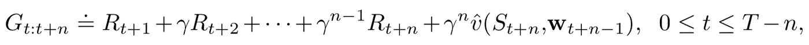
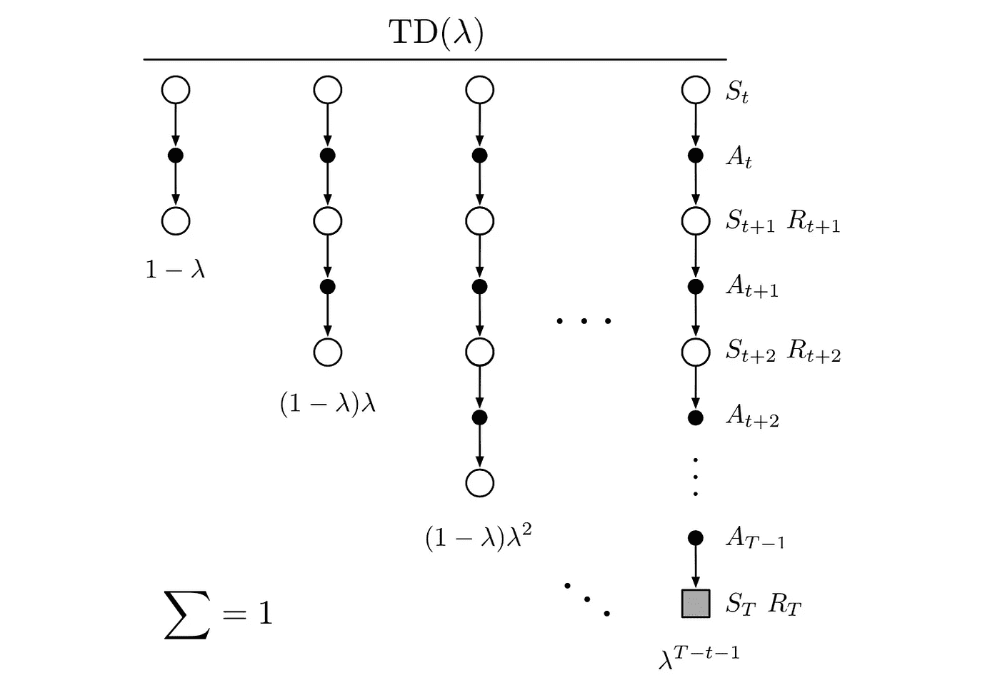
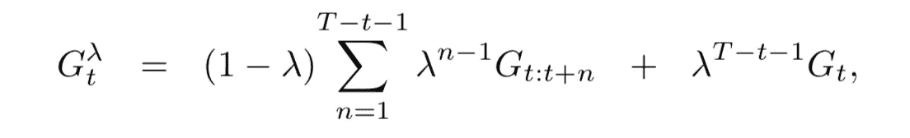
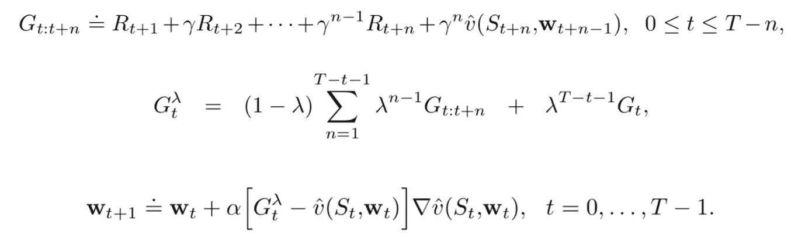
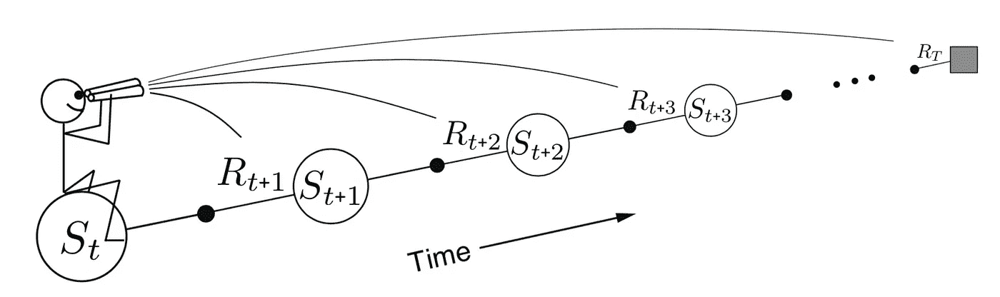
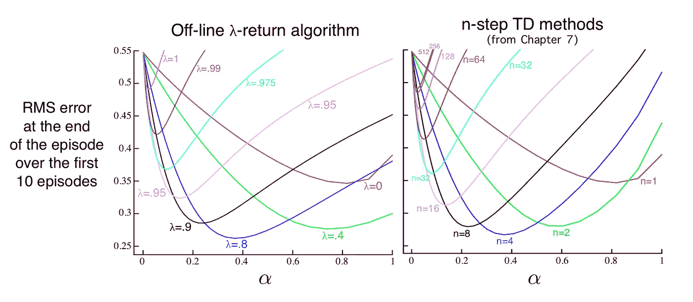

# 强化学习— TD(λ)简介(1)

> 原文：<https://towardsdatascience.com/reinforcement-learning-td-%CE%BB-introduction-686a5e4f4e60?source=collection_archive---------6----------------------->

## 对随机漫步应用 offline-λ

在本文中，我们将讨论 TD(λ)，这是一种通用的强化学习方法，它结合了蒙特卡罗模拟和一步 TD 方法。我们一直在详尽地讨论 TD 方法，如果您还记得，在 [TD(n)](https://medium.com/zero-equals-false/n-step-td-method-157d3875b9cb) 方法中，我说过它也是 MC 仿真和 1 步 TD 的统一，但在 TD(n)中，我们必须跟踪沿途的所有轨迹，并根据 n 步前的值更新当前估计，在 TD(λ)中，我们将看到更优雅的统一。

在本文中，我们将:

1.  学习 TD(λ)的思想
2.  介绍前向视图更新方法—离线—λ返回
3.  将该方法应用于随机游走实例


# TD(λ)的概念

TD(λ)实际上是 TD(n)方法的扩展，记住在 TD(n)中，我们有如下形式的累积报酬:



直到步骤`t+n`的该值估计用于更新步骤`t`的值，TD(λ)所做的是平均该值，例如，使用

```
0.5*Gt:t+2 + 0.5*Gt:t+4
```

作为目标值。但是它没有使用直接权重，而是使用λ作为参数来控制权重，使其总和为 1:



TD(λ)

我打赌这个图像看起来很熟悉，一个代理从一个状态开始，通过采取一个动作，它到达下一个状态，然后它选择另一个动作，SARSA 过程继续下去。所以第一列实际上是 TD(1)方法，它被赋予了`1-λ`的权重，第二列是 TD(2)，它的权重是`(1-λ)λ`，…，直到最后一个 TD(n)被赋予了`λ^(T-t-1)`的权重(T 是一集的长度)。注意，权重随着 n 的增加而衰减，总和为 1。TD(λ)更一般的形式是:



从公式中可以看出，当`λ = 1`时，只保留最后一项，这本质上是蒙特卡罗方法，作为状态，动作过程一直进行到最后，当`λ = 0`时，该项减少到`G_t:t+1`，这是一步 TD 方法，对于`0 < λ < 1`，该方法变成了加权 TD(n)混合方法。

# 离线λ-返回(前视图)

随着目标`G_t`的定义，我们现在开始我们的第一个算法定义。概括的更新公式可以定义为:



offline λ-return

更新规则与一般的[半梯度法](/reinforcement-learning-generalisation-in-continuous-state-space-df943b04ebfa)相同，唯一的区别在于上述目标值 I。



参考 Sutton 书中的一幅图像，这种方法也被称为*前视*学习算法，因为在每个状态下，更新过程都会前视`G_t:t+1`、`G_t:t+2`、……的值，并基于该值的加权值来更新当前状态。

# 随机漫步的正向更新

现在让我们来看看随机漫步例子中算法的实现。我们已经在这里学习了随机漫步示例[，但是仅供参考，在随机漫步中，一个代理从中间位置开始，在每一步，它都有相等的概率向左或向右移动一步(行动策略是固定的)，并且通过仅在左侧或最左侧结束，它可以停止一集。](/reinforcement-learning-generalisation-in-continuous-state-space-df943b04ebfa)

我们将[实现](https://github.com/MJeremy2017/Reinforcement-Learning-Implementation/blob/master/RandomWalk(Lambda)/TD_Lambda.py)一个 19 态随机游走，尽管状态空间实际上是离散的，我们仍然可以对其应用一般化算法。

## 价值函数

价值函数简单明了。我们有 19 个状态和 2 个结束状态，所以总共有 21 个状态，每个状态都有一个权重，本质上就是它的值估计。`value`函数返回特定状态的值，而`learn`函数基于差值`delta`更新电流估计，在本例中差值为`Gt — v(St, wt)` ( `alpha`为学习速率)。

## 一些常规功能

由于这不是我们第一次实现随机漫步，我将列出一些常见的共享函数:

在每个状态下，一个代理人`chooseAction` → `takeAction` → `giveReward`并重复直到游戏结束。

## 播放和更新

同样，主要区别在于播放过程和计算每个状态的增量。

在每一集，我们将需要首先跟踪所有的状态，直到游戏结束，以便在更新每个状态的值时获得一个前瞻性的视图。`self.states`记录沿途所有状态，`self.reward`只保存最新的奖励，因为沿途所有奖励都是 0，除了最终状态。

第二部分是在游戏结束后更新状态值估计。回想一下公式:


对于在时间`t`和步骤`n`的每个状态，我们需要计算`G_t:t+n`的值，并将它们与衰减的权重相结合，以便得到`St`的目标值。因此函数`gt2tn`计算给定`t`和`n`的值，定义为:

而前面代码片段中的`gtlambda`就是目标值。此外，我们还设置了一个截尾值，当`lambda_power`太小时，我们干脆忽略该值。利用目标值`gtlambda`和来自`valueFunc`的当前值，我们能够计算差值`delta`并使用我们上面定义的函数`learn`更新估计值。

# 离线λ-返回和 TD(n)

记得在 TD(n)会议中，我们用完全相同的设置对随机漫步应用了 n 步 TD 方法。现在随着`off-line λ-Return`的介绍，让我们比较一下两者的学习结果:



Image from Reinforcement Learning an Introduction

我们可以看到，两条均方根误差曲线相似，结果具有可比性。一般来说，最好的学习结果通常出现在中等学习速率和λ值的情况下(我从 Sutton 的书中复制了图像，因为这张比我绘制的要清晰得多)。

这就是前视更新，请在这里查看完整的实现。在下一篇文章中，我们将学习向后更新，这是一种通过使用*资格跟踪*的更优雅的 TD(λ)方法。

**参考**:

*   [http://incompleteideas.net/book/the-book-2nd.html](http://incompleteideas.net/book/the-book-2nd.html?source=post_page---------------------------)
*   [https://github . com/Shang tong Zhang/reinforcement-learning-an-introduction](https://github.com/ShangtongZhang/reinforcement-learning-an-introduction)