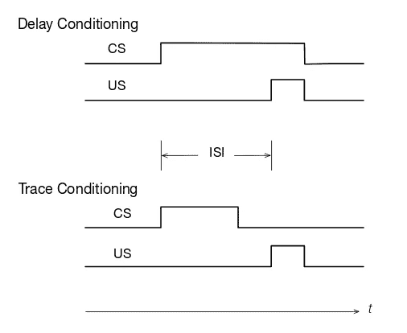
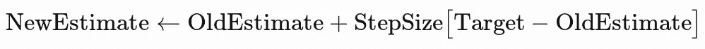
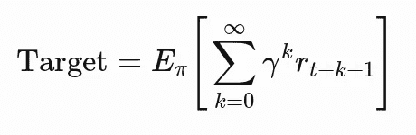
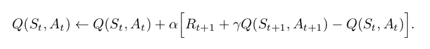
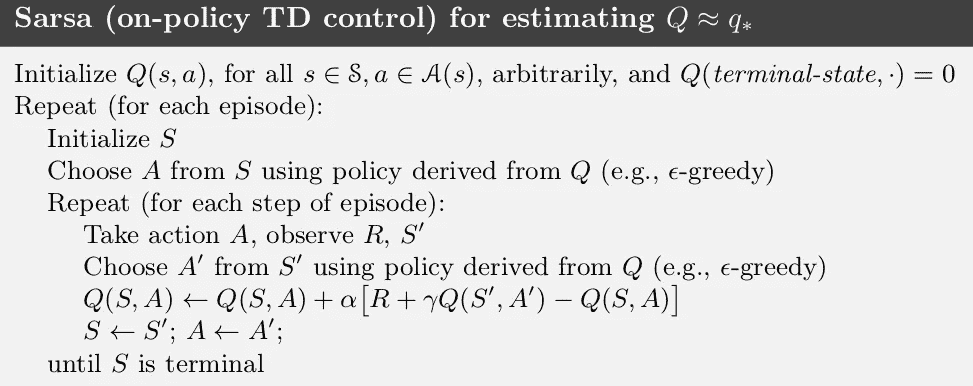
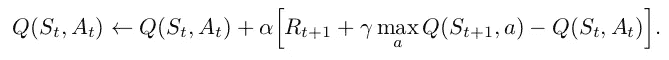
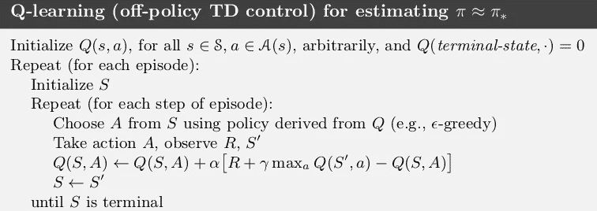
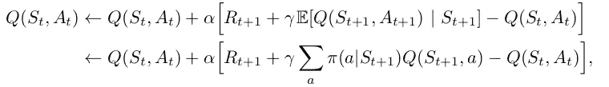
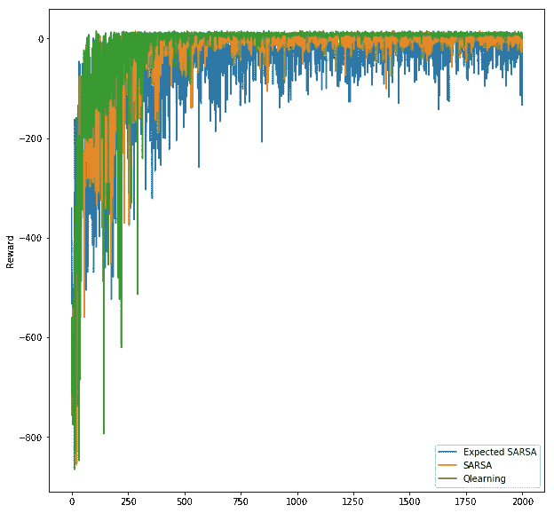
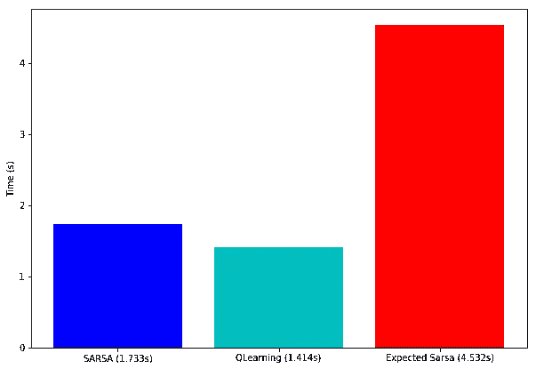

# 强化学习:python 中的时差、SARSA、Q 学习和期望 SARSA

> 原文：<https://towardsdatascience.com/reinforcement-learning-temporal-difference-sarsa-q-learning-expected-sarsa-on-python-9fecfda7467e?source=collection_archive---------5----------------------->

TD、SARSA、Q-Learning &预期的 SARSA 及其 python 实现和比较

> 如果一个人必须确定一个核心的和新颖的强化学习的想法，它无疑将是时间差异(TD)学习。——安德鲁·巴尔托和理查德·萨顿

# 先决条件

*   强化学习的基础
*   马尔可夫链，马尔可夫决策过程(MDPs)
*   贝尔曼方程
*   价值、策略功能和迭代

# 一些心理学

你可以跳过这一部分，这是可选的，不是这篇文章的先决条件。

我喜欢研究人工智能概念，同时将它们与心理学——人类行为和大脑——联系起来。强化学习也不例外。我们感兴趣的话题——时差是由[理查德·萨顿](http://www.incompleteideas.net/)创造的一个术语。这篇文章来源于他和安德鲁·巴尔托的书——《T4 强化学习导论》，可以在这里找到。为了理解时间差异的心理学方面，我们需要理解著名的实验——巴甫洛夫实验或经典条件反射。

伊凡·巴甫洛夫用狗做了一系列实验。一组狗接受了外科手术改造，这样它们的唾液可以被测量。这些狗被给予食物(非条件刺激——US ),在食物的反应中观察到唾液的排泄(非条件反应——UR)。这种刺激-反应对是自然的，因此是有条件的。现在，又增加了一个刺激因素。就在端上食物之前，铃响了。铃声是一种条件刺激(CS)。因为这个 CS 是在美国之前送给狗的，过了一会儿，人们发现狗听到铃声就开始流口水。这种反应被称为条件反应(CR)。实际上，帕沃洛夫成功地让狗在听到铃声时分泌唾液。情景喜剧《办公室》中展示了一个有趣的实验。

CS 和 US 发作之间的时间间隔称为刺激间隔(ISI ),是巴甫洛夫条件反射的一个非常重要的特征。基于 ISI，整个实验可分为以下类型:

Source: Introduction to Reinforcement learning by Sutton and Barto — Chapter 14

如上面容易理解的图表所示，在延迟条件作用中，CS 出现在我们之前，并且一直沿着我们。这就像铃响之前，一直呈现食物。而在痕迹条件作用中，CS 在 US 出现之前出现并终止。

在一系列实验中，观察到较低的 ISI 值显示更快和更明显的反应(狗流涎)，而较长的 ISI 显示较弱的反应。由此，我们可以得出结论，为了加强刺激-反应对，条件刺激和非条件刺激之间的间隔应该更小。这形成了时间差异学习算法的基础。

# 依赖模型和无模型的强化学习

依赖于模型的 RL 算法(即值和策略迭代)在转换表的帮助下工作。一个转换表可以被认为是一本生活帮的书，它包含了代理在它所存在的世界中成功所需的所有知识。自然，写这样一本书是非常乏味的，并且在大多数情况下是不可能的，这就是为什么模型依赖的学习算法几乎没有实际用途。

时间差分是一种无模型的强化学习算法。这意味着代理通过实际经验学习，而不是通过现成的无所不知的手册(转换表)。这使我们能够引入随机元素和大量的状态-行为对序列。代理对奖励和转换系统一无所知。它不知道在任意状态下采取任意动作会发生什么。代理人必须与“世界”或“环境”互动，并自己找出答案。

# 时间差异学习

时间差分算法使代理能够通过它采取的每一个动作进行学习。TD 在每个时间步(动作)而不是在每个情节(达到目标或结束状态)更新代理的知识。

目标值*称为目标误差。步长通常用**表示，α** 也称为学习速率。它的值介于 0 和 1 之间。*

*上面的等式通过在每个时间步长进行更新，帮助我们实现 ***目标*** 。目标是一种状态的效用。更高的效用意味着代理转换到更好的状态。为了这篇文章的简洁，我假设读者知道[贝尔曼方程](https://en.wikipedia.org/wiki/Bellman_equation)。根据它，一个国家的效用是贴现回报的期望值，如下所示:*

**

*通俗地说，我们让一个代理人自由地进入一个世界。代理不知道状态、奖励和转换。它与环境相互作用(做出随机或明智的行动)，并通过在采取每一个行动后不断更新其现有知识来学习新的估计(状态-行动对的值)。*

*到目前为止的讨论将产生几个问题，例如——什么是环境？代理将如何与环境交互？代理将如何选择动作，即在特定状态(策略)下代理将采取什么动作？*

*这就是 SARSA 和 Q-Learning 的用武之地。这是两个控制策略，它们将在一个环境中指导我们的代理，并使它能够学习有趣的东西。但在此之前，我们将讨论什么是环境。*

# *环境*

*一个环境可以被认为是一个微型世界，在这个世界中，一个主体可以观察离散的状态，采取行动，并通过采取这些行动来观察回报。把电子游戏想象成一个环境，把你自己想象成代理。在游戏《毁灭战士》中，你作为代理人将观察状态(画面)并采取行动(按下前进、后退、跳跃、射击等键)并观察奖励。杀死一个敌人会给你带来快乐(效用)和积极的回报，而向前移动不会给你带来太多的回报，但你仍然想这样做来获得未来的回报(找到并杀死敌人)。创建这样的环境可能是乏味而艰难的[(一个 7 人团队工作了一年多才开发出《毁灭战士》】T1。](https://en.wikipedia.org/wiki/Development_of_Doom)*

*OpenAI 健身房前来救援！gym 是一个 python 库，它有几个内置环境，您可以在这些环境中测试各种强化学习算法。它已经成为分享、分析和比较结果的学术标准。健身房是非常好的[记录](https://gym.openai.com/docs/)和超级容易使用。在继续下一步之前，您必须阅读文档并熟悉它。*

*对于强化学习的新应用，你必须创造你自己的环境。建议总是参考和编写健身房兼容环境，并公开发布，以便每个人都可以使用它们。阅读健身房的源代码将帮助你做到这一点。这是乏味的，但很有趣！*

# *萨尔萨*

> ***SARSA 是**S**State-Action-Reward-State-Action 的首字母缩写***

*SARSA 是一种政策性 TD 控制方法。策略是状态-动作对元组。在 python 中，你可以把它想象成一个字典，以键作为状态，以值作为动作。策略映射了每个状态下要采取的操作。基于策略的控制方法通过遵循特定的策略(通常是它自己评估的策略，就像在策略迭代中一样)在学习期间为每个状态选择动作。我们的目的是估计出 ***Qπ(s，a)*** 对于当前策略***【π***和所有状态-动作***【s-a】***对。我们通过让代理从一个状态-动作对转换到另一个状态-动作对，使用在每个时间步长应用的 TD 更新规则来实现这一点(不像依赖于模型的 RL 技术，其中代理从一个状态转换到另一个状态)。*

***Q 值-** 你一定已经熟悉了一个状态的效用值，Q 值是一样的，唯一的区别是定义在状态-动作对上，而不仅仅是状态。它是状态-动作对和表示其效用的实数之间的映射。Q-learning 和 SARSA 都是策略控制方法，用于评估所有动作-状态对的最优 Q 值。*

*SARSA 的更新规则是:*

**

*Source: Introduction to Reinforcement learning by Sutton and Barto — 6.7*

*如果一个状态 s 是终端(目标状态或结束状态)那么， ***Q(S，a)= 0***ɐ***a∈a***其中 ***A*** 是所有可能动作的集合*

**

*Source: Introduction to Reinforcement learning by Sutton and Barto —Chapter 6*

*上述算法中的动作***A’***是通过遵循相同的策略(ε-对 Q 值贪婪)给出的，因为 SARSA 是基于策略的方法。*

***ε-贪婪政策***

*ε-贪婪政策是这样的:*

1.  *生成一个随机数***r∈【0，1】****
2.  *If ***r < ε*** 选择一个从 Q 值导出的动作(产生最大效用)*
3.  *否则选择一个随机动作*

*在阅读 python 代码后，这一点会变得更加清楚。*

> ***请注意**:在《萨顿与巴尔托的 RL》这本书里，如果 r > ***ε，则采取随机动作。*** *T* 他们取了 ***ε*** =0.1 而对我来说 ***ε*** =0.9。这两个基本上是一回事。*

****ε的值决定了代理的探索-开采。****

*如果 ***ε*** 很大，则随机数 ***r*** 几乎不会大于ε，并且几乎不会采取随机行动(更少的勘探，更多的开采)*

*如果 ***ε*** 较小，则随机数 ***r*** 往往会大于ε，这将导致代理选择更多的随机动作。这种随机特性将允许智能体更多地探索环境。*

*根据经验， ***ε*** 通常选择为 0.9，但可以根据环境类型而变化。在某些情况下， ***ε*** 会随着时间的推移而退火，以允许更高的勘探程度和更高的开发程度。*

*下面是在 Taxi-v2 健身房环境中应用的 SARSA 的一个快速简单的 python 实现*

# *q 学习*

*Q-Learning 是一种非策略 TD 控制策略。它与 SARSA 完全一样，唯一的区别是，它不遵循策略来寻找下一个动作*，而是以贪婪的方式选择动作。类似于 SARSA，其目的是评估 Q 值，其更新规则是:**

****

**Source: Introduction to Reinforcement learning by Sutton and Barto — 6.8**

**注意:与 SARSA 通过遵循某个策略来选择动作 ***、A’***不同，这里的动作***A’***(在这种情况下为***A***)*是通过简单地取 ***Q*** 的最大值来贪婪地选择的。***

**这是 Q 学习算法:**

****

**Source: Introduction to Reinforcement learning by Sutton and Barto — Chapter 6**

**下面是 Q-learning 的 python 实现:**

# **预期 SARSA**

**预期 SARSA，顾名思义，取当前状态下每一个可能动作的 Q 值的期望值(均值)。目标更新规则应使事情更加清楚:**

****

**Source: Introduction to Reinforcement learning by Sutton and Barto —6.9**

**这是 python 的实现:**

# **比较**

**我已经使用以下参数在 Taxi-v2 健身房环境中测试了三种算法**

*   **阿尔法= 0.4**
*   **伽玛= 0.999**
*   **ε= 0.9**
*   **剧集= 2000**
*   **max_steps = 2500(单集可能的最大时间步数)**

**以下图表展示了上述三种政策控制方法之间的比较:**

****收敛:****

**显然，通过下面的图，Q 学习(绿色)在 SARSA(橙色)和预期的 SARSA(蓝色)之前收敛**

****

**SARSA, Q-learning & Expected SARSA — Convergence comparison**

****性能:****

**对于我的三个算法的实现，Q-learning 似乎表现最好，而 Expected SARSA 表现最差。**

****

**SARSA, Q-learning & Expected SARSA — performance comparison**

# **结论**

**时间差异学习是最重要的强化学习概念。它的进一步衍生，如 DQN 和双 DQN(我可能会在另一篇文章中讨论它们)已经取得了突破性的成果，在人工智能领域享有盛名。谷歌的 alpha go 使用 DQN 算法和 CNN 打败了围棋世界冠军。你现在已经具备了基本 TD 的理论和实践知识，出去探索吧！**

> **如果我犯了一些错误，请在回复中提及。感谢阅读。**