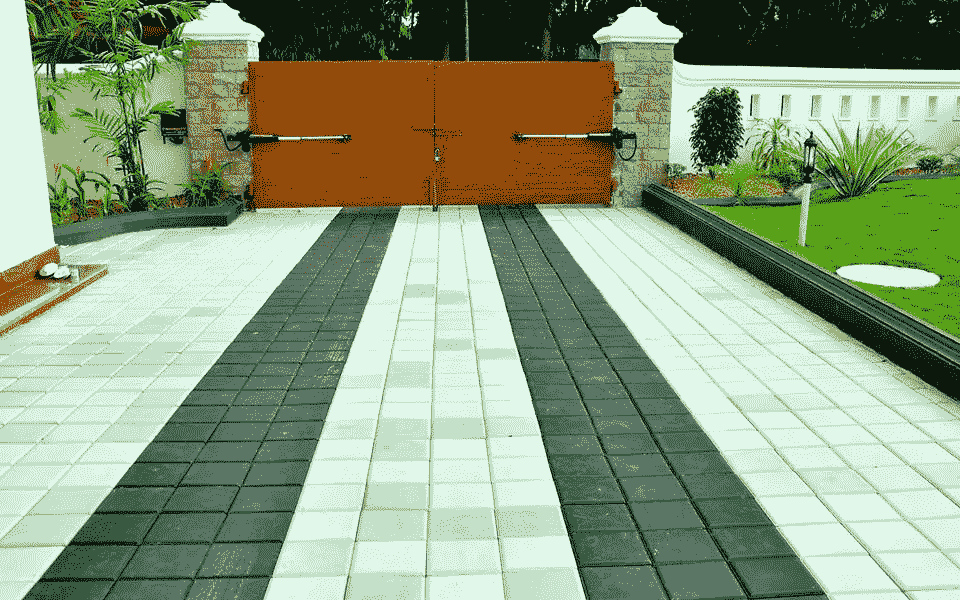
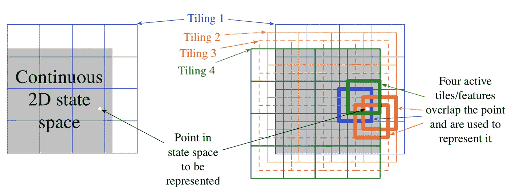
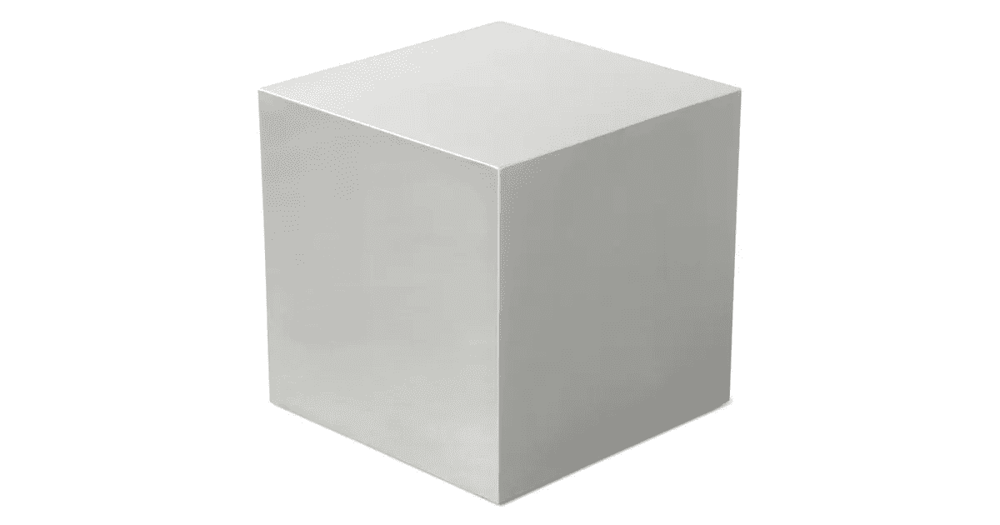

# 强化学习——瓦片编码实现

> 原文：<https://towardsdatascience.com/reinforcement-learning-tile-coding-implementation-7974b600762b?source=collection_archive---------6----------------------->

## 分块编码的逐步解释

我们已经走了这么远，并将我们的强化学习理论扩展到连续空间中([连续空间中的一般化](/reinforcement-learning-generalisation-in-continuous-state-space-df943b04ebfa))。如果你想更进一步，你需要知道瓦片编码，这可能是在连续空间，强化学习问题中使用的最实用和计算效率最高的工具。本质上，**瓦片编码是连续状态空间**中的特征表示，在本帖中，你将:

1.  学习瓦片编码的思想
2.  逐步实现图块编码
3.  用 Q 函数整合并应用它

# 什么是瓷砖编码？

最简单的例子是我们在上一篇文章中学到的状态聚合。回想一下，在 1000 个状态的随机行走示例中，我们将 1000 个状态分成 10 组，每组 100 个状态，这样我们可以用二进制格式表示每个状态，也就是说，对于特定组内的状态，它是 1，否则是 0。其实这就是最简单形式的瓦片编码，只有 1 个状态分量和 1 个平铺(你可以把它想成一个表现层)。

毫无疑问，仅用 1 个分块来表示要素是有缺陷的(您可以将它想象成网格)，因此这里出现了多个分块和多维要素:

Tile Coding

图中示出了在 2D 连续状态空间中使用瓦片编码的例子。在图的左边，状态空间由 1 个平铺显示表示，它本质上只是一个 2D 网格。*注意灰色区域是特征空间，蓝色线条的 2D 网格是我们的平铺*，它覆盖了整个状态空间区域(不一定要紧密贴合在特征空间中)。在这个表示中，白点，也就是我们的状态值，对于它所属的网格可以表示为 1，对于其余的网格可以表示为 0。

在右侧，该表示扩展到多个镶嵌，每个镶嵌具有不同的偏移。在此设置下，白点由 4 个不同的镶嵌表示，这 4 个不同的网格包括每个镶嵌中的白点。

从图中我们可以看到，只有一个切片的切片编码本质上是状态聚合，其中一个要素将只由它所属的切片来表示，而多个切片通过用属于每个切片的多个切片来表示一个要素来扩展这一思想。这种扩展更加强大，因为每个状态值可以共享一些瓦片，同时也属于不同的瓦片，这是一般化的本质。

# 逐步实施

如果你仍然对这个想法感到困惑，不要担心，在这个环节中，我们将一步一步地实现一个平铺编码。([全面实施](https://github.com/MJeremy2017/Reinforcement-Learning-Implementation/blob/master/TileCoding/tile_coding.py))

让我们首先为 1 个要素创建 1 个切片:

我认为这个单行函数解决了您的大部分困惑。例如，给定一个范围为`[0, 1]`的特征，该函数将它平均分成`10`个箱，最后的格网加上一个`0.2`的偏移量。测试结果显示在底部，范围从`0.3`到`1.1`，一个值的编码将是它所属的 bin 的顺序，例如给定一个特征值`0.35`，它在`0.3`到`0.4`的范围内，它的编码将是`1`，同样，小于`0.3`的值编码为`0`，大于`1.1`的值编码为`9`。

由于该函数能够为一个要素创建一个切片，让我们将其扩展到多个要素的多个切片:

现在输入`feature_ranges`将是多个特征的特征范围列表。`bins`是每个图块上设置的面元列表，`offset`也是如此。例如，假设我们有 2 个要素，每个要素的范围分别为`[-1, 1]`和`[2, 5]`，我们想要创建`3 tilings`，每个要素都有一个大小为`10x10`的 2D 格网和不同的偏移，那么结果切片形状将为`(3, 2, 9)`，代表`n_tilings x n_features x (n_bins - 1)`(注意，箱数减 1，以确保大于范围的值得到 n _ 箱的编码)。

最好把它想象成一个立方体，正面是特征值的网格，第三维是镶嵌的数量。

现在我们已经准备好了镶嵌，让我们为每个输入特征值进行编码:

对于每个镶嵌和每个特征，这个函数得到它在那个维度上的编码，并最终连接结果。以我们上面设置的镶嵌为例，给出一个特征`[0.1, 2.5]`，它的编码在第一个镶嵌(层)上是`[5, 1]`，在第二个镶嵌上是`[4, 0]`，在最后一个镶嵌上是`[3, 0]`(注意这里偏移是如何起作用来区分不同镶嵌上的特征的)。

# 与 Q 函数集成

准备好平铺编码后，是时候将它用于 Q 值函数了。(点击查看完整实现[)](https://github.com/MJeremy2017/Reinforcement-Learning-Implementation/blob/master/TileCoding/tile_coding.py)

这是将瓦片编码与 Q 函数结合的一般形式。在`init`函数中，我们定义了一个`self.q_tables`，其中每个`q_table`都有一个大小为`n_bins x n_bins x n_actions`的`n_tilings` q 个表。**想法是给定一个状态、动作和目标值，该动作将有助于对每个 q 表中的特定切片进行切片，并且该切片值将相应地更新**。

`value`函数获取状态、动作并返回其值。瓦片编码的主要优点之一是其计算效率。回想一下随机漫步中的状态聚集示例，给定状态的值就是该状态所属的 bin 的值，类似地，**给定状态的值，这里的 action 等于每个平铺中平铺值的总和** ( *返回值被 num_tilings 除的原因是在更新过程中每个平铺都被未除的学习率更新。如果我们设置* `self.lr = lr/num_tilings` *，那么返回值就不需要除以)*。

在`update`函数中，由于这里的导数实际上是 1，所以用时间差乘以一个固定的学习率来更新每个图块，并且因为`init`函数中的学习率没有除以图块的数量，所以加在一起的更新值近似于`n_tilings*lr`，因此需要在`value`函数中进一步除。

# 结论

在这篇文章中，我们一起实现了一个平铺编码，并学习了如何使用它的 Q 函数。与参数函数逼近相比，瓦片编码将连续空间离散化，通过获取活动瓦片的索引并进行一些简单的运算，使得学习过程在计算上更加高效。瓷砖编码是一个强大的工具，我们将在未来的帖子中使用它来解决一些更有趣的例子。

最后，感谢您的跟进，如果您有任何问题，请在下面留下您的评论。

**参考**:

*   http://incompleteideas.net/book/the-book-2nd.html
*   [https://github . com/uda city/deep-enforcement-learning/tree/master/tile-coding](https://github.com/udacity/deep-reinforcement-learning/tree/master/tile-coding)