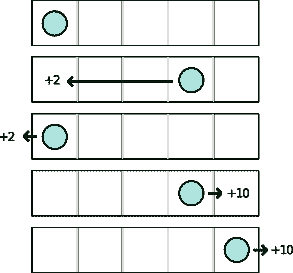
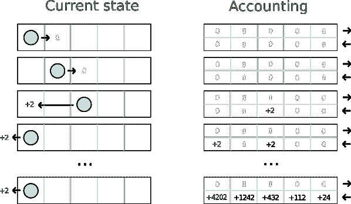
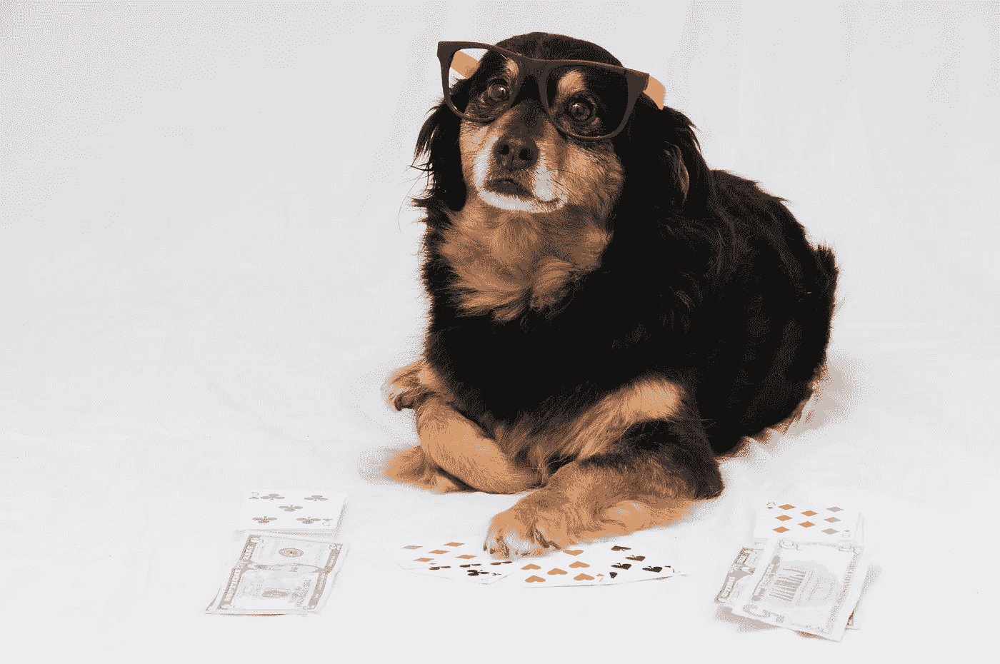
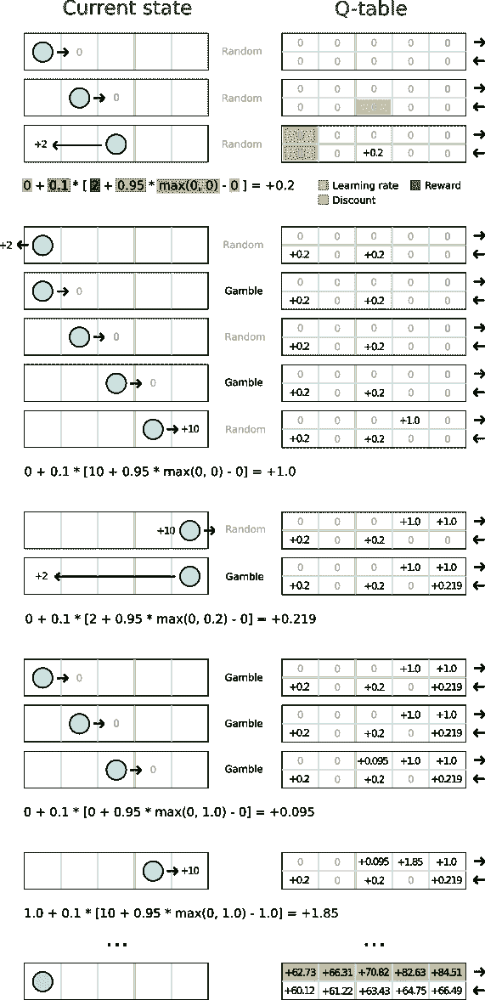
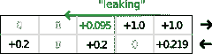

# 强化学习教程第 1 部分:Q-学习

> 原文：<https://towardsdatascience.com/reinforcement-learning-tutorial-part-1-q-learning-cadb36998b28?source=collection_archive---------9----------------------->

这是关于强化学习的系列教程的第一部分。我们将从一些理论开始，然后在下一部分的[中继续讨论更实际的东西。在这个系列中，您不仅将学习如何训练您的模型，还将学习使用](/reinforcement-learning-tutorial-part-2-cloud-q-learning-fc101e1cdcf5) [Valohai](https://valohai.com/) 深度学习管理平台在具有完全版本控制的云中训练它的最佳工作流程。

# 什么时候使用强化学习？

当你没有关于问题的训练数据或足够具体的专业知识时，强化学习是有用的。

在高层次上，你知道自己想要什么，但不知道如何去实现。毕竟，就连[李·塞多尔](https://en.wikipedia.org/wiki/Lee_Sedol)也不知道如何在围棋中击败自己。

幸运的是，你所需要的只是一个奖励机制，如果你让它“玩”足够长的时间，强化学习模型会找出如何最大化奖励。这类似于教狗用零食坐下。起初，这只狗毫无头绪，在你的命令下尝试随机的事情。在某个时候，它意外地用屁股着地，得到了突然的奖励。随着时间的推移，并给予足够的迭代，它会找出专家的策略，坐在提示。

# 地牢中的会计师示例

这是强化学习的官僚版本。一个会计发现自己在一个黑暗的地牢里，他所能想到的就是走来走去填写电子表格。

会计知道的:

*   地牢有 5 块瓷砖长
*   可能的操作有向前和向后
*   向前总是一步，除了最后一个瓷砖碰到墙
*   后退总是带你回到起点
*   有时会有风把你的动作吹向相反的方向
*   您将在一些瓷砖上获得奖励

会计**不知道的是:**

*   进入最后一张牌会给你+10 奖励
*   进入第一个方块给你+2 奖励
*   其他瓷砖没有奖励

会计师，作为一名会计师，将遵循一个安全(但幼稚)的策略:

*   总是根据你的会计选择最有利可图的行动
*   如果会计显示所有选项都为零，请选择一个随机操作

让我们看看会发生什么:

会计师似乎总是喜欢向后走，即使我们知道最优策略可能总是向前走。最好的奖励(+10)毕竟在地下城的尽头。因为有一个随机因素有时会使我们的行动转向相反的方向，会计师实际上有时会不情愿地到达另一端，但根据电子表格仍然犹豫选择向前。这是为什么呢？

很简单，因为他选择了一个非常贪婪的策略。在非常短暂的初始随机性中，会计师可能愿意选择向前一次或两次，但一旦他选择向后一次，他就注定永远选择向后。玩这个地下城需要长期的计划，拒绝较小的直接奖励，以获得更大的奖励。

# 什么是 Q-learning？

q 学习是所有强化学习的核心。AlphaGO 战胜 Lee Sedol 或 [DeepMind 击败老款 Atari 游戏](https://medium.freecodecamp.org/explained-simply-how-deepmind-taught-ai-to-play-video-games-9eb5f38c89ee)从根本上来说都是在糖的基础上进行的 Q 学习。

Q-learning 的核心是像[马尔可夫决策过程(MDP)](https://www.geeksforgeeks.org/markov-decision-process/) 和[贝尔曼方程](https://en.wikipedia.org/wiki/Bellman_equation)这样的东西。虽然详细理解它们可能会有好处，但现在让我们将其简化为一种更简单的形式:

**行动的价值=即时价值+所有最佳未来行动的总和**

这就像估算一个大学学位相对于退学的经济价值。你需要考虑的不仅仅是你第一份薪水的直接价值，而是你一生中所有未来薪水的总和。一个行动总是导致更多的行动，你选择的道路总是由你的第一个行动决定。

也就是说，仅仅关注行动是不够的。执行的时候需要考虑自己所处的状态。当你 17 岁和 72 岁时进入大学是完全不同的。第一个可能是一个财务上积极的赌注，而后者可能不是。

那么你如何知道哪些未来行动是最优的呢？嗯——你不知道。你要做的是根据你当时掌握的信息做出最佳选择。

想象一下，你可以不止一次，而是一万次地重演你的人生。起初，你会很随意地去做，但是在几千次尝试之后，你会有越来越多的关于产生最佳回报的选择的信息。在 Q-learning 中,“你所拥有的信息”是从你以前的游戏中收集的信息，并编码到一个表格中。

所以从某种意义上说，你就像上一个例子中的会计，总是随身携带一个电子表格。不过，你将会以一种更微妙的方式更新和阅读你的电子表格。你也会把它叫做 Q 表而不是电子表格，因为它听起来更酷，对吗？

# Q 学习算法

Q-learning 算法的形式如下:

它看起来有点吓人，但是它做的很简单。我们可以将其概括为:

**根据我们得到的奖励和我们下一步期望的奖励，更新行动的价值评估。**

这是我们正在做的根本事情。T2 学习率 T3 和 T4 折扣 T5 虽然是必需的，但只是用来调整行为。折扣将决定我们对未来预期行动价值与我们刚刚经历的行动价值的权衡程度。学习率是一个总的油门踏板。开得太快，你会错过最佳时机，开得太慢，你永远也到不了。

但是这个算法是不够的——它只是告诉我们如何更新我们的电子表格，但没有告诉我们如何使用电子表格在地牢中的行为！

# 地牢里的赌徒的例子

让我们看看我们将如何在一个地牢里用我们的花式 Q 表和一点赌博来行动。我们将选择一些更加细致入微的东西，而不是我们的会计师使用的照章办事的策略

我们的战略:

*   默认情况下，从我们的电子表格中选择最有利可图的行动
*   有时赌博并选择随机行动
*   如果会计显示所有选项都为零，请选择一个随机操作
*   从 100%赌博(探索)开始，慢慢向 0%移动
*   使用折扣= 0.95
*   使用 learning_rate = 0.1

为什么我们需要赌博和随机行动？原因和会计被困住了一样。因为我们的默认策略仍然是贪婪的，也就是说，我们默认选择最有利可图的选项，我们需要引入一些随机性来确保所有可能的<state action="">对都被探索。</state>

为什么我们需要停止赌博，降低我们的探索率？是因为达成最优策略的最佳方式是先积极探索，然后慢慢走向越来越保守。这个机制是所有机器学习的核心。

说够了。我们的赌徒正在进入地牢！

唷！那是一大堆东西。

注意，为了举例，我们做了很多赌博来证明一个观点。不仅仅是赌博，我们把硬币抛向右边，所以这通常是非常不寻常的前十几步！

与会计师的策略相比，我们可以看到明显的不同。这种策略收敛较慢，但我们可以看到顶行(向前)比底行(向后)得到的估值更高。

还要注意在最初的+10 奖励后，估价开始从右到左“泄漏”到顶行。这是允许 Q 表“预见未来”的基本机制。关于发生在最后一块瓷砖上的奖励丰厚的事情的消息慢慢流向左侧，最终到达我们电子表格的最左侧，这种方式允许我们的代理提前许多步预测好事情。

如果你被上面一步一步运行的信息过载搞糊涂了，就冥想这张图片，因为它是本文中最重要的一张。如果你理解了为什么信息会“泄露”以及为什么它是有益的，那么你就会理解整个算法是如何工作的以及为什么会工作。

就是这样！在[的下一部分](/reinforcement-learning-tutorial-part-2-cloud-q-learning-fc101e1cdcf5)中，我们将提供一个教程，介绍如何使用 [Valohai](https://valohai.com/) 深度学习管理平台在云中用代码实现这一点并运行它！

[第一部分:Q-Learning](https://blog.valohai.com/reinforcement-learning-tutorial-part-1-q-learning)

[第二部分:云 Q 学习](https://blog.valohai.com/reinforcement-learning-tutorial-cloud-q-learning)

[第三部分:基础深度 Q 学习](https://blog.valohai.com/reinforcement-learning-tutorial-basic-deep-q-learning)

*原载于*[*blog.valohai.com*](https://blog.valohai.com/reinforcement-learning-tutorial-part-1-q-learning)*。*