# 强化学习教程第 2 部分:云 Q 学习

> 原文：<https://towardsdatascience.com/reinforcement-learning-tutorial-part-2-cloud-q-learning-fc101e1cdcf5?source=collection_archive---------8----------------------->

在第一部分中，我们用一个非常简单的地牢游戏研究了 Q-learning 背后的理论，这个游戏有两个策略:会计和赌徒。第二部分使用 Valohai 深度学习管理平台，将这些例子转化为 Python 代码，并在云中训练它们。

由于我们示例的简单性，我们不会故意使用任何像 TensorFlow 这样的库或像 OpenAI Gym 这样的模拟器。相反，我们将从头开始自己编写代码，以提供完整的画面。

所有的示例代码都可以在 https://github.com/valohai/qlearning-simple 的[找到](https://github.com/valohai/qlearning-simple)

# 代码布局

典型的强化学习代码库有三个部分:

*   模拟
*   代理人
*   管弦乐编曲

**模拟**是代理人操作的环境。它根据其内部规则和代理执行的动作更新状态并分发奖励。

**Agent** 是在模拟中操作、学习和执行策略的实体。它执行动作，接收带奖励的状态更新，并学习一种策略来最大化它们。

**编排**是所有剩余的样板代码。解析参数，初始化环境，在模拟和代理之间传递数据，最后关闭商店。

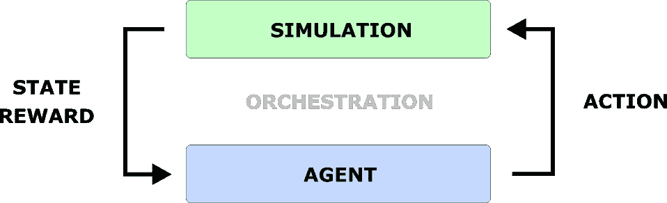

# 模拟

我们将使用第 1 部分中介绍的地牢游戏。这些是规则:

*   地牢有 5 块瓷砖长
*   可能的操作有向前和向后
*   向前总是一步，除了在最后一个瓷砖碰到墙
*   后退总是带你回到起点
*   有时会有风把你的动作吹向相反的方向

代理未知:

*   进入最后一张牌会给你+10 奖励
*   进入第一个方块给你+2 奖励
*   其他瓷砖没有奖励

# 代理人

在教程的[第一部分，我们介绍了两种策略:会计和赌徒。会计只关心过去的业绩和保证的结果。赌徒更渴望探索风险更高的选项，以在未来获得更大的回报。也就是说，为了保持第一个版本的简单，引入了第三个策略:酒鬼。](https://blog.valohai.com/reinforcement-learning-tutorial-part-1-q-learning)

酒鬼是我们的基本策略，有一个非常简单的启发:无论如何都要随机行动。

# 管弦乐编曲

现在我们已经有了模拟和代理，我们需要一些样板代码将它们粘在一起。

地牢模拟是回合制的，所以流程很简单:

*   向代理查询下一个动作，并将其传递给模拟
*   获取新的状态和奖励，并将其传递给代理
*   重复

# 基础设施

虽然有可能在本地运行这样的简单代码，但目标是提供一个如何正确编排更复杂项目的示例。

机器学习不等于软件开发。仅仅将代码推送到 Git 存储库是不够的。为了完全的再现性，您需要对数据、超参数、执行环境、输出日志和输出数据进行版本控制。

在本地运行也会让你慢下来。虽然玩具示例通常会给人一种快速迭代的错觉，但为真实问题训练真实模型并不适合您的笔记本电脑。毕竟，它一次只能运行一个训练执行，而基于云的环境让你可以同时启动几十个训练执行，同时拥有快速的 GPU、轻松的比较、版本控制和对同事更大的透明度。

# 瓦罗海设置

前往[valohai.com](https://valohai.com/)并创建一个账户。默认情况下，您的帐户上有价值 10 美元的信用，足以在云实例上运行以下培训。

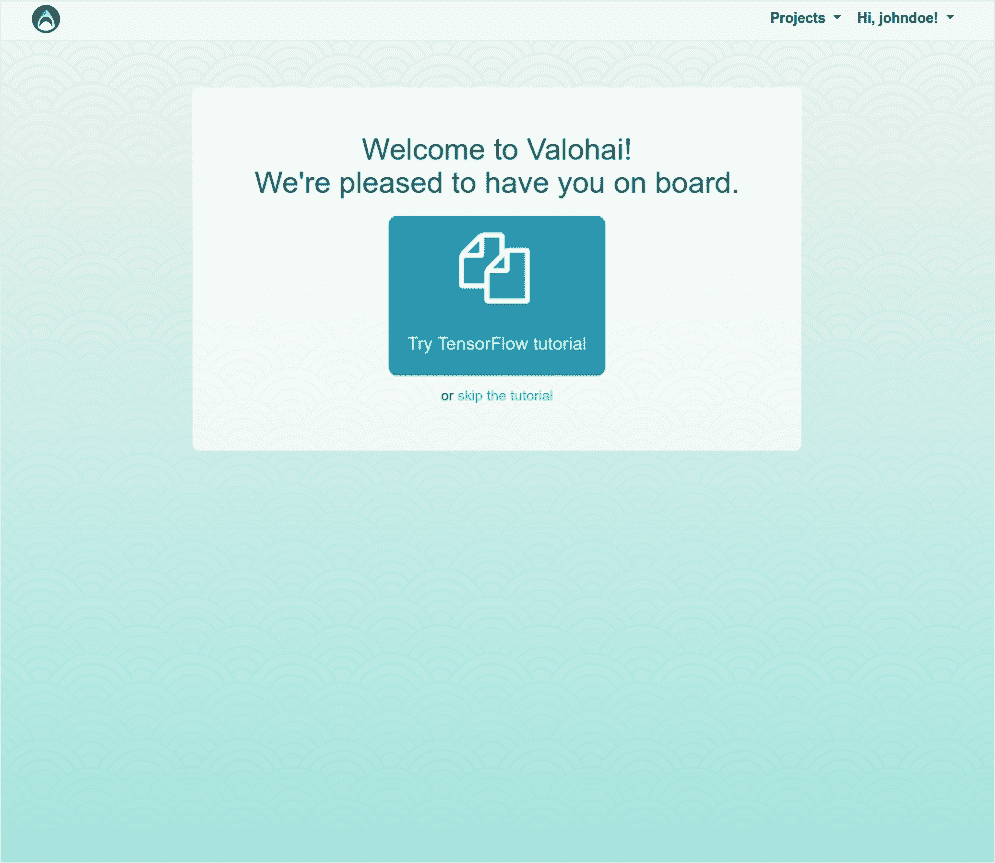

注册后，点击*跳过教程*或者打开右上角的*项目*下拉菜单，选择*创建项目*。

给你的项目起一个有意义的名字，然后点击下面的蓝色*创建项目*按钮。

在 https://github.com/valohai/qlearning-simple[的示例 git 存储库中，我们已经有了我们的代码和 valohai.yaml。](https://github.com/valohai/qlearning-simple)

我们只需要告诉瓦罗海他们在哪里。点击上面截图中的*项目库设置*链接或导航到*设置>库*选项卡。

将存储库 URL 粘贴到 *URL* 字段，确保获取引用为“主”，然后点击*保存*。

# 执行！

一切就绪，现在是我们第一次执行的时候了。

点击 Valohai 项目*执行*选项卡中的蓝色*创建执行*按钮。

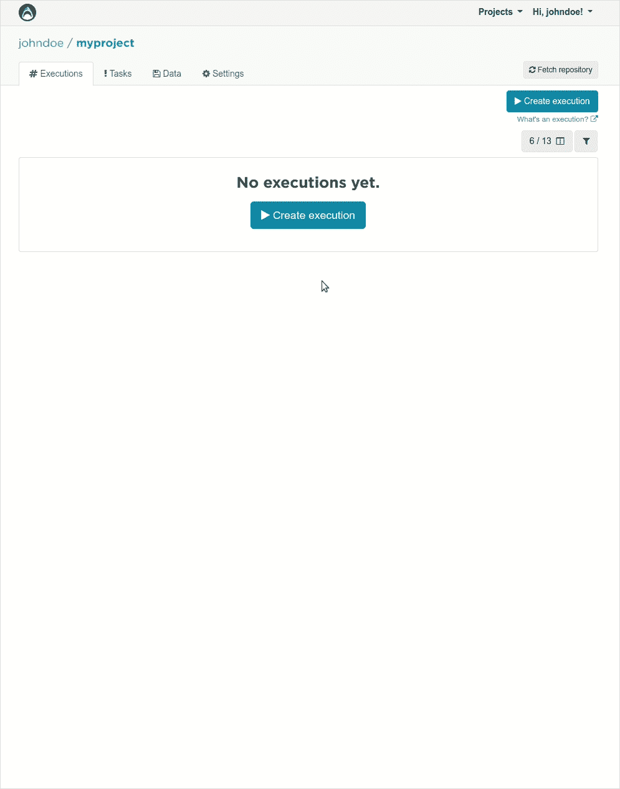

Git 存储库中的 valohai.yaml 文件为我们提供了所有正确的默认值。如果你想了解更多关于 *valohai.yaml* 的信息，请查阅[文档](https://docs.valohai.com/valohai-yaml.html)。

点击底部的蓝色*创建执行*按钮。

在 Valohai 中运行一个执行意味着大致会发生以下序列:

*   启动一个新的服务器实例
*   您的代码和配置(valohai.yaml)是从 git 存储库中获取的
*   下载训练数据
*   下载并实例化 Docker 映像
*   基于 *valohai.yaml* +您的参数执行脚本
*   所有标准输出都存储为 log + JSON 格式的元数据，并针对图表进行解析
*   为了以后的可再现性，整个环境是受版本控制的
*   脚本完成后，服务器实例会自动关闭

只需点击一下鼠标，你就能得到如此多的东西，这难道不令人惊奇吗？

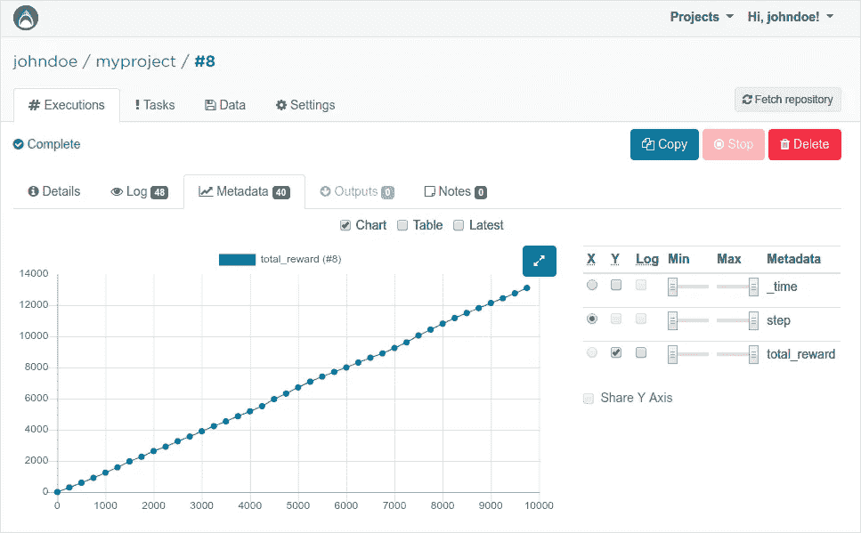

如果您前往执行的*元数据*标签，您可以看到我们的酒鬼策略代理如何收集奖励。毫不奇怪，采取随机行动的策略会产生一条几乎有轻微抖动的直线，这告诉我们没有学习发生。

# 会计

在运行了基线随机策略之后，是时候带回在教程的[第一部分中介绍的两个原始策略了:会计和赌徒。](https://blog.valohai.com/reinforcement-learning-tutorial-part-1-q-learning)

会计师有以下策略:

*   总是选择基于会计的最有利可图的行动
*   如果所有选项都为零，则选择一个随机操作

要执行会计，记得更改执行的代理参数，然后再次单击蓝色的*创建执行*。

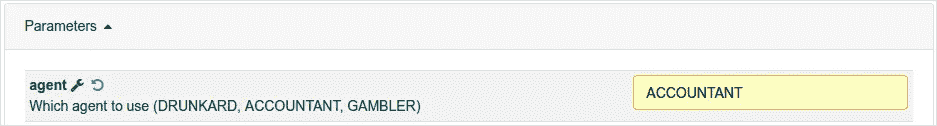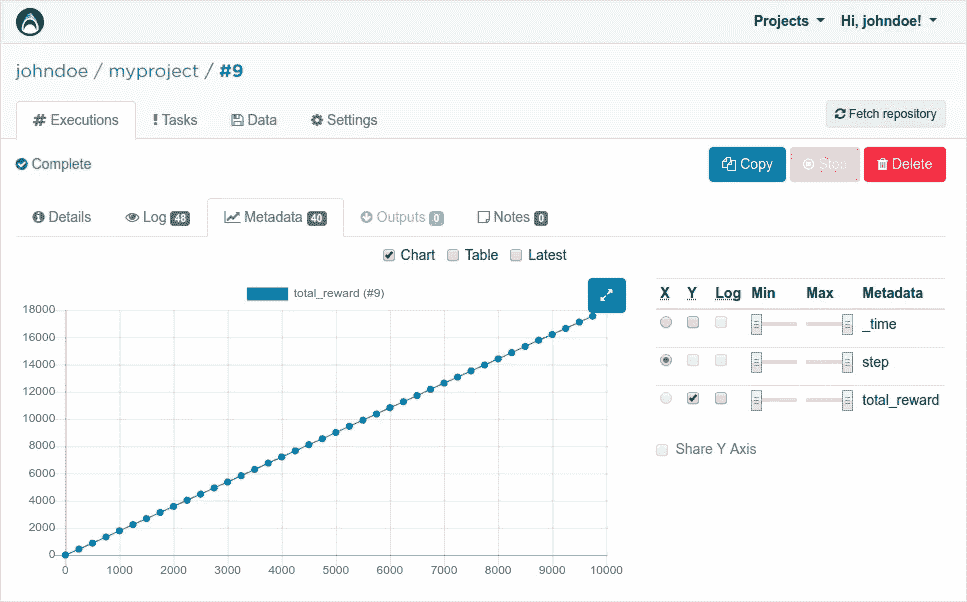

查看*元数据*选项卡，会计在学习方面也好不到哪里去。曲率甚至更直，因为在最初的几次迭代后，它将学会总是选择向后，以获得一致的+2 奖励，而不是像随机的醉汉一样摇摆。

不过，总奖励大约是+4000。至少有所改善！

# 赌徒

从我们的三个代理人，赌徒是唯一一个做真正的 Q 学习。还记得我们在[第一部分](https://blog.valohai.com/reinforcement-learning-tutorial-part-1-q-learning)中的算法吗:

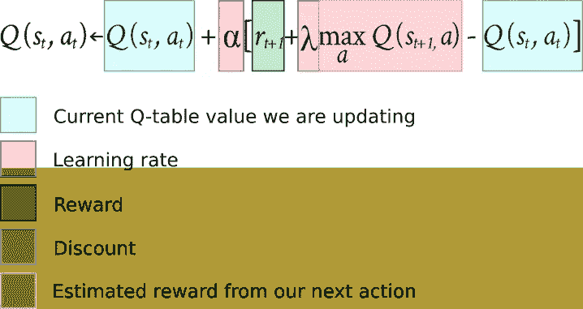

该战略如下:

*   默认情况下，从我们的 Q 表中选择最有利可图的行动
*   有时赌博并选择随机行动
*   如果 Q 表显示两个选项都为零，选择一个随机动作
*   从 100%赌博(探索)开始，慢慢向 0%(剥削)移动

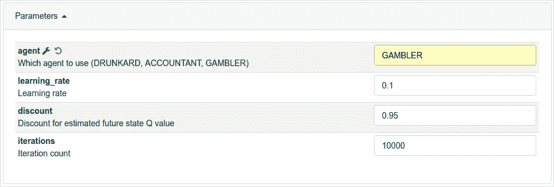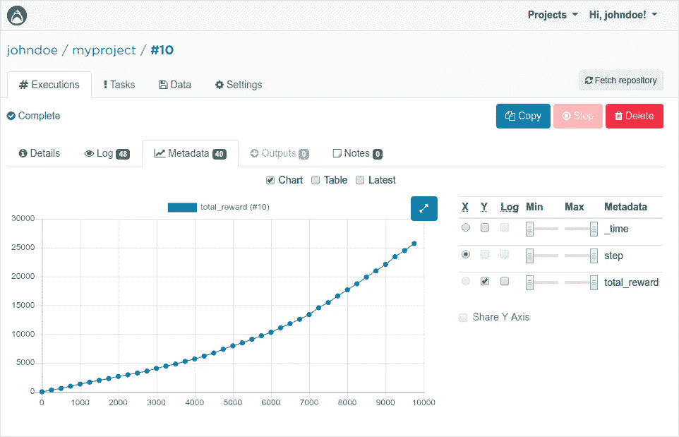

最后，我们可以看到一些真正的 Q 学习正在发生！

在以高探索率缓慢开始后，我们的 Q 表充满了正确的数据，与我们的其他代理相比，我们达到了几乎两倍的总回报。

# 并行执行

到目前为止，我们一次只运行一个执行，如果您想快速迭代您的模型探索，这并不能很好地扩展。在我们最后的努力中，我们将尝试运行 Valohai 任务，而不是一次性执行。在 Valohai 中，一个任务仅仅意味着执行一组具有不同超参数的执行。

切换到 Valohai 中的*任务*选项卡，然后点击蓝色*创建任务*按钮。

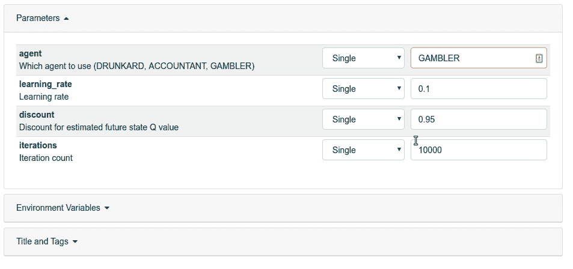

让我们看看 *learning_rate* 参数如何影响我们的性能。选择*倍数*，然后在不同行输入三个不同的选项(0.01，0.1，0.25)。最后，点击底部蓝色的*创建任务*开始执行。

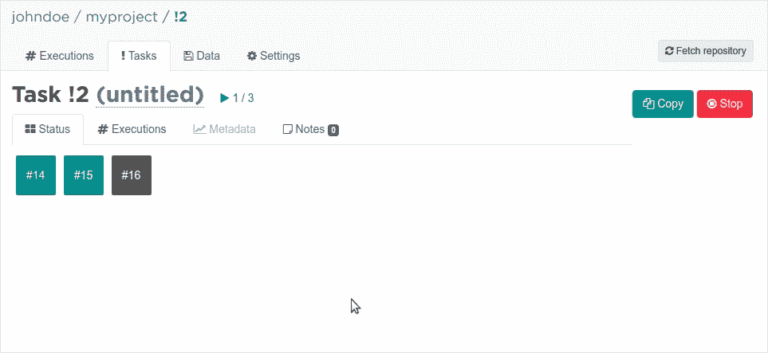

Valohai 现在将并行启动不是一个而是三个服务器实例。每个带有数字的方框代表一个具有不同 learning_rate 的运行实例。一旦颜色变成绿色，就意味着执行已经完成。您还可以在执行过程中实时查看元数据图表！

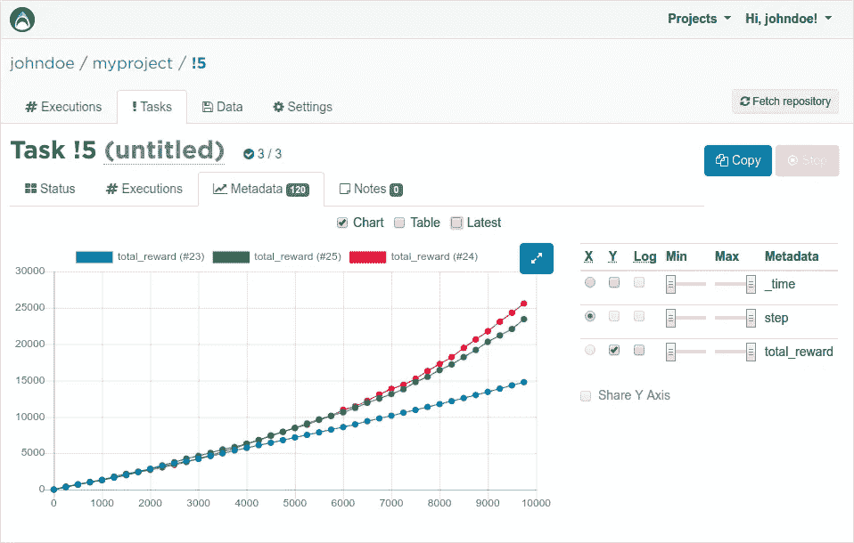

下面是 *learning_rate* 三个不同值的奖励。看起来我们最初的 0.1 比 0.25 表现得好一点。使用 0.01 显然更糟，并且对于 10000 次迭代似乎根本学不到任何东西。

在我们的下一部分中，我们将更深入地研究并行执行，以加速我们的迭代，并看看如何有效地使用 Valohai 来搜索那些最优的超参数。敬请期待！

[第一部分:Q-Learning](https://blog.valohai.com/reinforcement-learning-tutorial-part-1-q-learning)

[第二部分:云 Q 学习](https://blog.valohai.com/reinforcement-learning-tutorial-cloud-q-learning)

[第三部分:基础深度 Q 学习](https://blog.valohai.com/reinforcement-learning-tutorial-basic-deep-q-learning)

*原载于*[*blog.valohai.com*](https://blog.valohai.com/reinforcement-learning-tutorial-cloud-q-learning)*。*