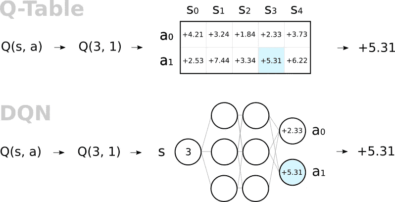
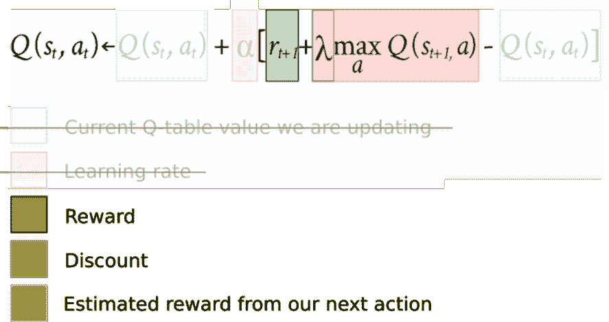
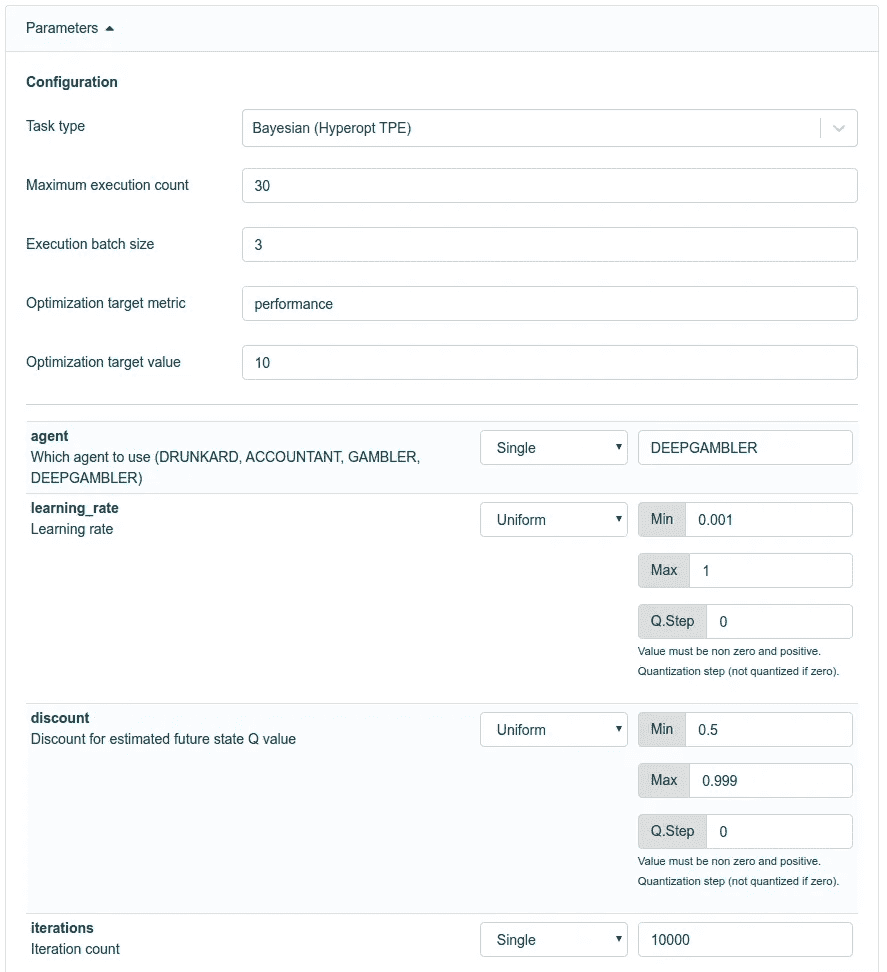
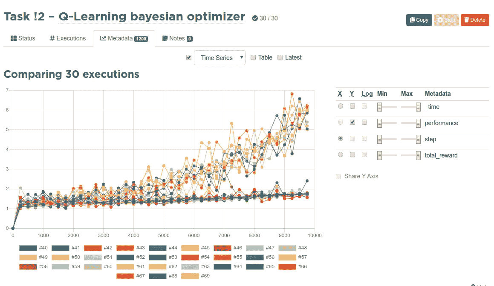
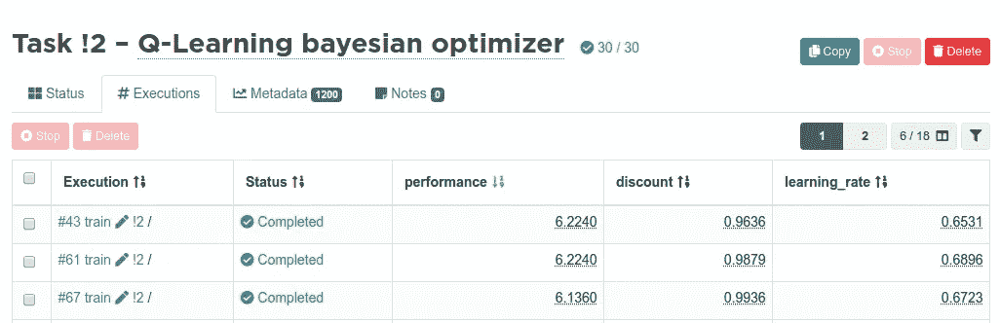

# 强化学习教程第 3 部分:基本深度 Q 学习

> 原文：<https://towardsdatascience.com/reinforcement-learning-tutorial-part-3-basic-deep-q-learning-186164c3bf4?source=collection_archive---------5----------------------->

在[第 1 部分](https://blog.valohai.com/reinforcement-learning-tutorial-part-1-q-learning)中，我们通过纸笔示例介绍了 Q-learning 的概念。

在[第 2 部分](https://blog.valohai.com/reinforcement-learning-tutorial-cloud-q-learning)中，我们用代码实现了这个例子，并演示了如何在云中执行它。

在第三部分中，我们将把我们的 Q 学习方法从 Q 表转移到深度神经网络。

使用 Q-table，你的内存需求是一个由*状态* x *动作*组成的数组。对于状态空间 5 和动作空间 2，总的内存消耗是 2 x 5=10。但是国际象棋的状态空间大约是 10 ⁰，这意味着这种严格的电子表格方法不能扩展到现实世界。幸运的是，你可以从媒体压缩的世界里偷到一个窍门:用一些准确性换取内存。

在无损压缩的情况下，以每秒 60 帧的速度存储 1080p 视频每秒大约需要 1gb。使用有损压缩的相同视频可以很容易地成为 1/10000 大小，而不会损失太多保真度。幸运的是，就像视频文件一样，用强化学习训练模型从来都不是 100%真实的，一些“足够好”或“比人类水平更好”的东西已经让数据科学家微笑了。因此，我们很乐意用准确性换取记忆。

我们不是从 Q 表中取一个“完美的”值，而是训练一个神经网络来估计这个表。毕竟，神经网络只不过是一个美化了的权重和偏好表而已！

我们的示例游戏是如此简单，以至于我们很可能用神经网络比用 Q 表使用更多的内存！任何真实世界的场景都比这复杂得多，所以这只是我们试图保持示例简单的一个假象，而不是一个普遍趋势。

# 培养

我们之前做 Q-learning 的时候，用的是上面的算法。用神经网络代替 Q 表，我们可以简化它。

不再需要*学习率*，因为我们的反向传播优化器已经有了。学习率只是一个全球油门踏板，你不需要两个。一旦去除了学习率，你意识到你也可以去除两个 Q(s，a)项，因为它们在去除学习率后相互抵消。

强化学习通常被描述为独立于监督学习和非监督学习的一个类别，然而这里我们将从我们的监督表亲那里借用一些东西。据说强化学习不需要训练数据，但这只是部分正确。事先不需要训练数据，但是在探索模拟时收集训练数据，并且使用非常类似。

当代理探索模拟时，它将记录体验。

**单次体验=(旧状态，动作，奖励，新状态)**

用单一体验训练我们的模型:

1.  让模型估计旧状态的 Q 值
2.  让模型估计新状态的 Q 值
3.  使用已知的奖励，计算行动的新目标 Q 值
4.  用输入=(旧状态)，输出=(目标 Q 值)训练模型

注意:我们的网络不像 Q 学习函数 Q(s，a)那样得到(状态，动作)作为输入。这是因为我们没有复制 Q 学习作为一个整体，只是 Q 表。输入只是状态，输出是该状态下所有可能动作(向前、向后)的 Q 值。

# 代码

在上一部分中，我们足够聪明地将代理、模拟和编排作为单独的类分开。这意味着我们可以只引入一个新的代理，其余的代码基本保持不变。如果你想看剩下的代码，请看[第二部分](https://blog.valohai.com/reinforcement-learning-tutorial-cloud-q-learning)或者 [GitHub](https://github.com/valohai/qlearning-simple) repo。

# 定量

在我们的例子中，我们在模拟的每一步之后重新训练模型，一次只有一次体验。这是为了保持代码简单。这种方法通常被称为*在线培训。*

更常见的方法是将所有(或许多)经历收集到记忆日志中。然后，根据从日志中批量提取的多个随机经验来训练该模型。这被称为*批量训练*或*小批量训练*。它比强化学习更有效，并且通常提供更稳定的整体训练结果。将这个例子转化为批量训练是非常容易的，因为模型的输入和输出已经成形为支持批量训练。

# 结果

这里是一些使用 Valohai 贝叶斯优化器的不同学习率和折扣的训练运行。请注意，这里我们衡量的是绩效，而不是像前几部分那样衡量总薪酬。上升趋势是两件事的结果:学习和剥削。学习意味着模型像往常一样学习最小化损失和最大化回报。开发意味着，既然我们从赌博和探索开始，并越来越线性地转向开发，我们会在最后得到更好的结果，假设学习的策略已经开始在这个过程中有任何意义。

用深度神经网络训练这样的玩具模拟无论如何都不是最优的。模拟不是非常细致，奖励机制非常粗糙，深度网络通常在更复杂的场景中茁壮成长。通常在机器学习中，最简单的解决方案最终会成为最好的解决方案，所以在现实生活中不建议像我们这样用大锤砸坚果。

既然我们已经学会了如何用神经网络来取代 Q-table，我们就可以处理更复杂的模拟，并在下一部分中充分利用 [Valohai](https://valohai.com/) 深度学习平台。回头见！

# 在 [GitHub](https://github.com/valohai/qlearning-simple) 开始这个 Q-learning 教程项目。

[第一部分:Q-Learning](https://blog.valohai.com/reinforcement-learning-tutorial-part-1-q-learning)

[第二部分:云 Q 学习](https://blog.valohai.com/reinforcement-learning-tutorial-cloud-q-learning)

[第三部分:基础深度 Q 学习](https://blog.valohai.com/reinforcement-learning-tutorial-basic-deep-q-learning)

*原载于*[*blog.valohai.com*](https://blog.valohai.com/reinforcement-learning-tutorial-basic-deep-q-learning)*。*