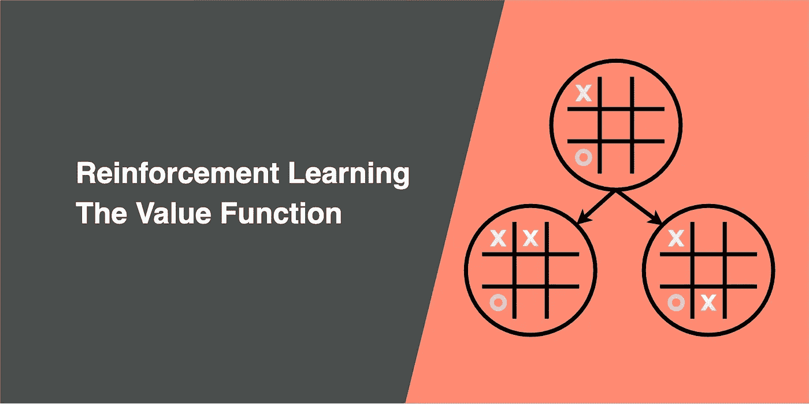
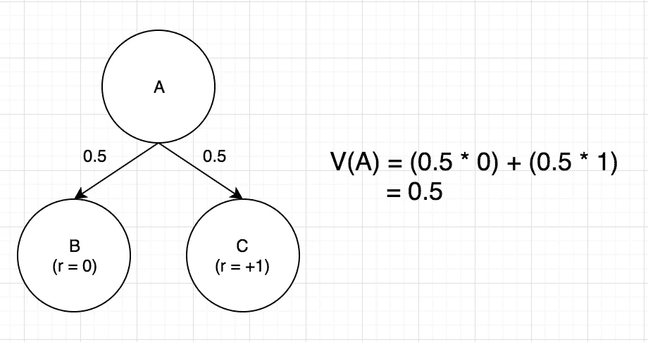
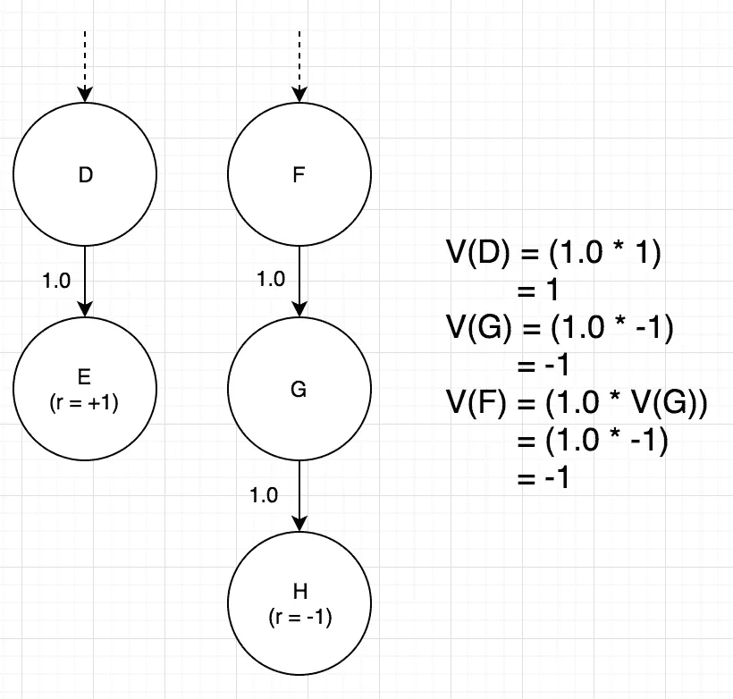
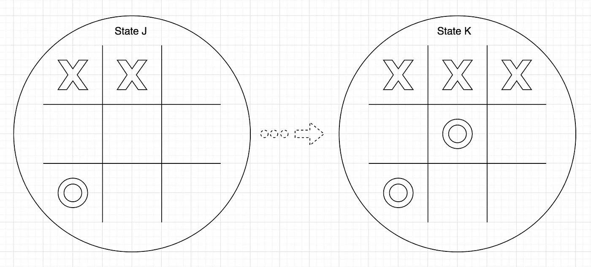
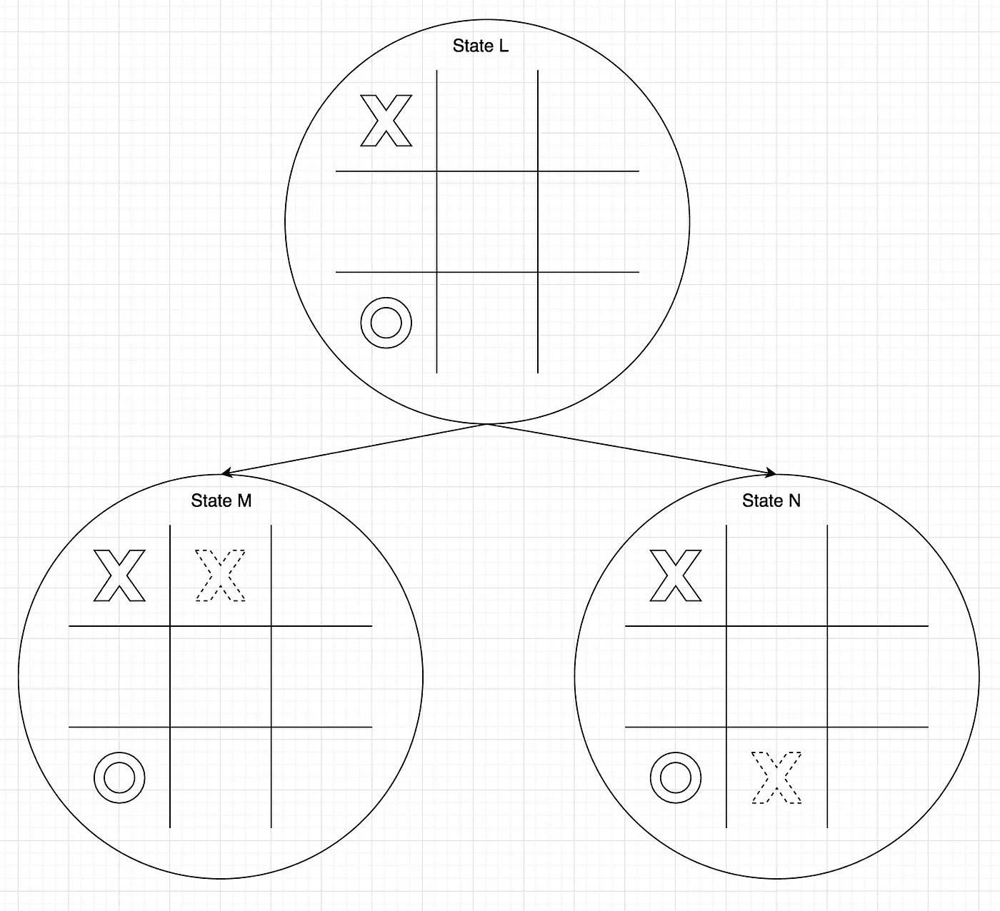
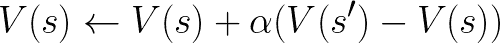
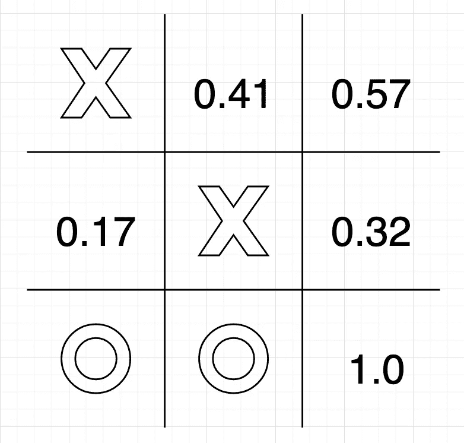

# 强化学习——价值函数

> 原文：<https://towardsdatascience.com/reinforcement-learning-value-function-57b04e911152?source=collection_archive---------7----------------------->

## 利用价值函数的代理学习井字游戏的强化学习算法

## 直觉

在漫长的一天工作之后，你在两个选择之间做决定:回家写一篇中型文章或者和朋友去酒吧。如果你选择和朋友出去玩，你的朋友会让你感到快乐；然而，当你回家写文章时，在工作了一整天后，你会感到疲惫。在这个例子中，享受自己是一种奖励，感觉疲劳被视为一种消极的奖励，那么为什么要写文章呢？

因为在生活中，我们不会只考虑眼前的回报；我们计划了一系列的行动来决定未来可能的回报。也许写一篇文章会让你对某个特定的话题有更好的理解，得到认可，最终让你得到你梦寐以求的工作。在这个场景中，*得到你梦想中的工作*是从你采取的一系列行动中得到的延迟回报，然后我们想为处于这些状态的人分配一些*值*(例如“回家写一篇文章”)。为了确定一个状态的*值*，我们称之为“价值函数”。

那么我们如何从过去吸取教训呢？假设你做了一些伟大的决定，并且处于人生中最好的状态。现在回顾一下你为达到这个阶段所做的各种决定:你把你的成功归功于什么？之前让你走向这种成功的状态是什么？你过去做过的哪些行为让你达到这种收到这个奖励的状态？你现在正在做的事情和你将来可能得到的回报有什么关系？

## 奖励与价值函数

一个*奖励*立竿见影。它可以是在收集硬币的游戏中得分，赢得井字游戏或获得你梦想的工作。这个*奖励*就是你(或者代理)想要获取的。

为了获得*奖励*，价值函数是确定处于状态的*价值*的有效方法。用 *V(s)* 表示，这个价值函数衡量我们在这种状态 *s* 下可能获得的潜在未来*回报*。

## 定义价值函数

Fig 1: State A leads to state B or C

在图 1 中，我们如何确定状态 A 的*值*？有 50–50%的机会在下两个可能的状态中结束，状态 B 或 c。状态 A 的值就是所有下一个状态的*概率*乘以达到该状态的*奖励*。状态 A 的*值*为 0.5。

Fig 2: One-way future states

在图 2 中，您发现自己处于状态 D，只有一条可能的路径通往状态 E。由于状态 E 给出的*奖励*为 1，状态 D 的*值*也为 1，因为唯一的结果是获得*奖励*。

如果你处于状态 F(在图 2 中)，这只能导致状态 G，接着是状态 H。由于状态 H 的负*奖励*为-1，状态 G 的*值*也将为-1，对于状态 F 也是如此

Fig 3: Being in state J brings you closer to state K

[在这个井字游戏](https://jinglescode.github.io/reinforcement-learning-tic-tac-toe/)中，连续得到 2 个 *X* s(图 3 中的状态 J)并不能赢得游戏，因此没有*奖励*。但是处于状态 J 会使你离状态 K 更近一步，完成一行 *X* 就能赢得游戏，因此处于状态 J 会产生一个好的*值*。

Fig 4: State M has a higher value than state N

在图 4 中，您会发现自己处于状态 L，正在考虑将下一个 *X* 放在哪里。您可以将它放在顶部，这样就可以将您带到状态 M，在同一行中有 2 个 *X* s。另一种选择是将其放在最下面一行。与状态 N 相比，状态 M 应该具有更高的重要性和*值*,因为它导致更高的获胜可能性。

因此，在任何给定的状态下，我们可以执行*动作*，通过选择产生最高*值*的状态，使我们(或代理人)更接近获得*奖励*。

## 井字游戏—初始化值函数

井字游戏的价值函数 *V(s)* 是达到状态 *s* 的获胜概率。完成该初始化以定义获胜和失败状态。我们将状态初始化如下:

*   *V(s)* = 1 —如果代理在状态 *s* 中赢得游戏，则为终止状态
*   *V(s)* = 0 —如果代理在状态 *s* 中输掉或打平游戏，则为终止状态
*   *V(s)*= 0.5——否则为非终止状态的 0.5，这将在训练期间进行微调

## 井字游戏—更新值函数

更新值函数是代理如何从过去的经验中学习，通过更新在训练过程中经历的那些状态的*值*。

Fig 5: Update the value of state s

状态*s’*是当前状态 *s* 的下一个状态。我们可以通过添加状态 *s* 和*s’*之间的*值*的差值来更新当前状态 *s* 的*值*。α是*学习率*。

由于在任何给定的状态下可以采取多种行动，所以在一个状态下经常只选择一种行动可能会导致错过其他更好的状态。在强化学习中，这就是[探索-利用困境](/striking-a-balance-between-exploring-and-exploiting-5475d9c1e66e)。

通过探索策略，代理采取随机行动来尝试未探索的状态，这可能会找到其他方法来赢得游戏。通过利用策略，代理能够增加那些在过去有效的行动的信心，以获得*奖励*。在探索和利用之间取得良好的平衡，并通过玩无限多的游戏，每个状态的*值*将接近其真实概率。探索和利用之间的良好平衡由[ε贪婪参数](/exploration-exploitation-dilemma-c9eee9a460ac)决定。

当游戏结束时，在知道代理人是赢了(奖励= 1)还是输了/平了(奖励= 0)之后，我们只能更新代理人在该特定游戏中已经玩过的每个状态的*值*。终端状态只能是 0 或 1，我们确切地知道哪些是在初始化期间定义的终端状态。

代理的目标是在游戏结束后更新价值函数，以了解已执行的动作列表。当每个状态的*值*使用下一个状态的*值*更新时，在每个游戏结束时，更新过程向后读取该特定游戏的状态历史，并微调每个状态的*值*。

## 井字游戏—利用价值函数

Fig 6: Values of various next states

给定足够的训练，代理将会学习任何给定状态的*值*(或获胜概率)。因此，当我们与我们训练有素的代理人进行游戏时，代理人会使用利用策略来最大化胜率。[看能不能打赢代理](https://jinglescode.github.io/reinforcement-learning-tic-tac-toe/)。

在游戏的每一个状态，代理循环通过每一种可能性，挑选具有最高*值*的下一个状态，从而选择最佳的行动过程。在图 6 中，代理将选择右下角来赢得游戏。

## 结论

在除了结束阶段(记录了赢、输或平)之外的任何进展状态，代理采取了导致下一个状态的行动，这可能不会产生任何*奖励*，但会导致代理向接收*奖励*靠近一步。

价值函数是确定处于一种状态的*值*的算法，即获得未来奖励的概率。

每个状态的*值*通过游戏的状态历史按时间顺序反向更新，通过使用[探索和利用策略](/exploration-exploitation-dilemma-c9eee9a460ac)进行足够的训练，代理将能够确定游戏中每个状态的真实*值*。

有许多方法可以定义一个值函数，这只是一个适合井字游戏的方法。

[探索 Github 上的演示](https://jinglescode.github.io/reinforcement-learning-tic-tac-toe/)

[在 Github 上查看源代码](https://github.com/jinglescode/reinforcement-learning-tic-tac-toe)

 [## 数据科学家:21 世纪最肮脏的工作

### 40%的吸尘器，40%的看门人，20%的算命师。

towardsdatascience.com](/data-scientist-the-dirtiest-job-of-the-21st-century-7f0c8215e845) 

嗨！，我是叮当。我喜欢构建机器学习项目/产品，我在[迈向数据科学](https://towardsdatascience.com/@jinglesnote)上写了它们。在 [Medium](https://medium.com/@jinglesnote) 上关注我或者在 [LinkedIn](https://www.linkedin.com/in/jingles/) 上联系我。

