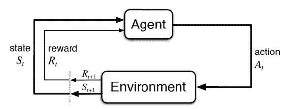
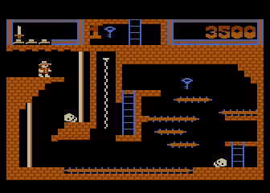
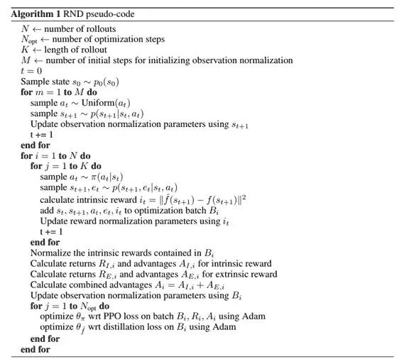

# 基于随机网络提取的探索式强化学习

> 原文：<https://towardsdatascience.com/reinforcement-learning-with-exploration-by-random-network-distillation-a3e412004402?source=collection_archive---------14----------------------->

自从 2013 年 DeepMind 的开创性 DQN 工作(其中一个代理人成功地学会了以高于人类平均水平的水平玩 Atari 游戏)以来，强化学习(RL)就经常成为头条新闻。从雅达利游戏到机器人技术，以及 AlphaGo 击败世界围棋冠军李世石，RL 似乎即将席卷世界。

事实上，虽然大多数 Atari 游戏现在都可以很好地学习，但有些游戏直到最近才取得相对较小的进展。这些游戏包括臭名昭著的蒙特祖马的复仇，陷阱！和冒险，其共同点是回报极其稀少。

为了理解为什么这是一个主要问题，让我们看看大多数强化学习算法的基本结构。

强化学习代理在与环境交互的同时通过试错来学习，并为自己的行为获得奖励。使用这些奖励信号，代理更新它的行为，并希望学会在未来做出更好的决定。在许多情况下，为了帮助代理探索环境并偶然发现导致更高回报的状态动作，我们通过从代理的当前策略中取样动作，或者通过随机选择具有某种概率的动作(ε-贪婪)来将随机性引入代理的行为。这些简单策略的基本假设是，随机行为最终会导致代理人获得某种回报。

在奖励很少的环境中，情况非常不同，因为代理可能大部分时间都没有收到任何奖励，因此可能很难学习。在极端的情况下，为了获得**任何**奖励，代理可能需要表现得非常聪明，并采用长而复杂的动作序列来获得第一次反馈。在一些艰难的探索游戏中就是这种情况，例如蒙特祖马的复仇，在这种游戏中，代理人必须避开敌人和致命的障碍，并在看到积极的奖励之前聪明地行动数百步。使用普通探索策略的标准 RL 算法在这些游戏中经常不能实现任何回报，并且这种情况一直持续到最近。

那么，你如何着手解决这样的问题呢？一个看起来很吸引人的方法是以某种方式鼓励代理去探索那些它到目前为止还没有看到的状态。如果我们能让它变得“好奇”，甚至在没有任何回报的情况下寻找新奇的状态，也许它最终会探索得足够多，找到一些。在某种程度上，这让我们想起了儿童学习的方式，好奇心是一种**内在奖励**。

我们想要做的是，计算代理访问每个州的次数，并向稀疏的外部奖励(来自环境)添加另一个元素，以到达访问次数较低的州的内在奖励的形式。如果我们能做到这一点，那么代理人将不断发现它以前没有见过的新状态，并最终达到一个具有积极外部奖励的状态。显然，为了得到想要的行为，必须在外在和内在奖励之间保持谨慎的平衡。

然而，在所有这些游戏中，状态的数量太大，无法一一列举，因此我们必须找到一种方法来近似计算访问次数。解决这个问题的早期建议是这样的:在训练代理人玩游戏的同时，训练另一个神经网络来预测代理人在玩游戏时遇到的状态转换和奖励。其思想是，最初，神经网络对这些转变和奖励的预测很差，但最终对于网络被训练的那些状态以及与它们相似的状态(由于 NNs 的泛化能力),预测和实际情况之间的**距离**减小。这意味着我们可以将这个神经网络的预测误差视为访问计数的近似值；如果给定状态的误差很高，则这表明该状态是新的，如果预测误差很低，则我们可以假设与此类似的状态已经被足够频繁地访问过。

这似乎是一个非常优雅的解决方案，但不幸的是，它有一个严重的缺点；在某些州，模型预测误差可能会更高，这是由于不经常访问之外的另一个原因。如果环境具有随机转变，我们的解决方案可能会导致代理被具有高随机性的转变所吸引，因为这些将不可避免地导致更高的预测误差。在实践中已经观察到这种现象，并且这种现象是这种方法通用性的主要缺点。

另一个缺点与模型容量有关；我们正试图使神经网络适应环境的动态，但在某些情况下，这对我们的模型来说可能是一项太难的任务，损害了它充分减少许多状态的预测误差的能力。具有渐近高误差的状态导致代理的探索行为中的偏差，并且可能使它“停留”在状态空间的这些区域中。

2018 年底，OpenAI 的研究人员前来救援，并发表了一篇题为“通过随机网络蒸馏进行探索”的论文，我从现在开始将他们的方法称为 **RND** 。作者回顾了这种近似访问计数的几种现有方法，并从识别预测误差的来源开始:

1) ***训练数据量*** :预测误差在未被充分访问过的州较高(这是我们所希望的)。

2) ***随机性*** :动态变化大的状态下预测误差大。

3) ***模型设定错误*** :如果我们的模型缺乏近似环境动态的能力，则预测误差较高。

4) ***学习动态*** :如果学习环境动态的过程不稳定且不能收敛，预测误差可能很高。

来源 2-4 是不可取的，因为我们希望预测误差仅反映大致的访问次数。作者随后提出了一个简单而优雅的解决方案:**不预测环境动态，而是尝试预测随机神经网络的输出**，因此得名“随机网络蒸馏”。

那么到底是什么意思呢？我们随机初始化一个**目标网络**，它将在整个学习过程中保持固定，并初始化另一个神经网络，它将试图预测目标网络的输出，我将把它称为**预测网络**。这些网络都以状态作为输入，并输出一个向量。目标网络的输出与转移无关，只是游戏状态的随机函数。最初，目标网络和预测网络是不相关的，并且预测误差将会很高。然而，在学习过程中，对于代理经常访问的状态，该误差将减少，就像我们之前讨论的动态预测方法一样。

通过尝试预测固定目标网络的输出，我们避免了误差源 2–4 中的问题:

1) ***训练数据量*** :我们还是保留这个想要的误差源。

2) ***随机性*** :目标网络是确定性的，所以这个误差源就消失了。

3) ***模型误设定*** :目标网络和预测网络属于同一个模型类，因此具有相同的能力，所以这个误差源消失。

4) **这与环境动态学习任务相反，环境动态学习任务是不稳定的(当代理发现新的状态时，它也可能遇到新的转换现象)。**

现在，我们准备看看算法的伪代码，如论文中所示:

作者将 RND 方法与一种叫做近似策略优化(PPO)的普通 RL 算法结合使用。从这个伪代码中要得到的重要的东西是，内在的回报是预测网络的损失，并且它在由代理收集的用于更新策略的相同样本上被优化。

其余的细节在很大程度上是针对本文中使用的 RL 算法的，但事实上，RND 是一种完全通用的方法，原则上可以应用于任何 RL 算法，无论是 on 还是 off 策略，因为 RND 只通过奖励与 RL 算法进行交互。

在其出版时，RND 提供了蒙特祖马对纯 RL 算法的报复的最先进的结果(使用各种形式的人类演示获得了一些不错的结果)，考虑到这种方法的通用目的，这是令人印象深刻的。

我为登山车问题实现了一个 RND 的极简版本，以演示如何在没有通常的奖励工程的情况下解决它。请随意查看:[https://github.com/orrivlin/MountainCar_DQN_RND](https://github.com/orrivlin/MountainCar_DQN_RND)