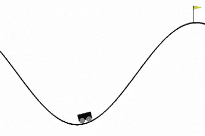
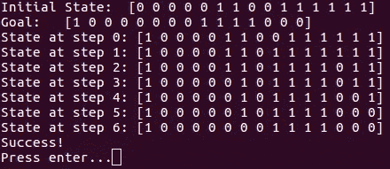
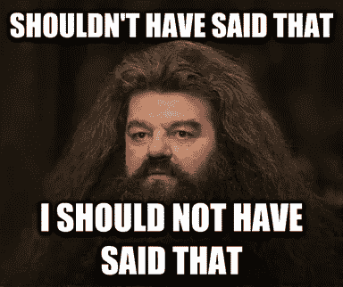
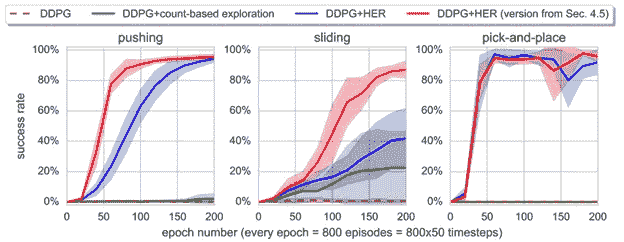
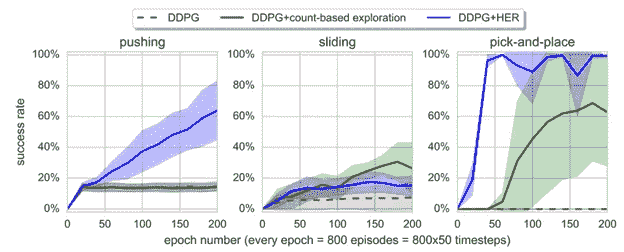

# 后知后觉的强化学习经验回放

> 原文：<https://towardsdatascience.com/reinforcement-learning-with-hindsight-experience-replay-1fee5704f2f8?source=collection_archive---------4----------------------->

# **稀疏和二进制奖励**

近年来，由于一些引人注目的成功，如击败围棋世界冠军和(最近)在流行的实时战略游戏《星际争霸 2》中击败顶级职业选手，强化学习获得了很大的人气。AlphaZero(最新的围棋代理)等成就令人印象深刻的一个方面是，它从稀疏的二进制奖励中学习，要么赢得比赛，要么输掉比赛。在大多数情况下，没有中间奖励会使学习变得非常困难，因为代理人可能永远不会真正获胜，因此没有关于如何改进其表现的反馈。显然，像围棋和星际争霸 2 这样的游戏(至少在比赛中是这样玩的)有一些独特的品质，使得用这些二进制奖励学习成为可能:它们是**对称零和游戏**。我现在不打算深入探讨这个问题，但我可能会在未来的一篇文章中专门讨论 AlphaZero 背后的算法。

问题是，大多数问题都不是对称的零和游戏，让我们再次没有反馈，没有学习。作为一个例子，我们可以看看一个经典的 RL 问题称为山地汽车。在这个问题中，一辆汽车试图到达山顶的旗帜，但由于它缺乏足够的加速度直接开车上山，它必须来回摆动以获得速度并最终到达目标。

只要汽车没有到达旗帜，它每走一步就获得-1 的奖励，直到该集在固定的步数后终止。一个经常使用的实用方法是使用领域知识来增加奖励，这被称为**奖励工程**或**奖励形成**。在我们的山地车示例中，因为我们知道汽车必须加快速度才能爬山，所以一个合理的方法是将汽车的速度添加到奖励中，鼓励它加快速度。如果我们足够仔细地设计奖励，我们的代理人将会加快速度，最终偶然发现这面旗帜，并避免一些本来会得到的负面奖励。

这种方法的问题是它并不总是容易做到。在某些情况下，我们可能不知道如何塑造奖励来帮助学习；换句话说，**我们必须知道一些如何解决问题的知识，以便恰当地塑造奖励**。这方面的知识并不总是有的，尤其是对于难题。另一个危险是，一旦我们设计了奖励，我们就不再直接优化我们真正感兴趣的指标，而是优化一个代理，我们希望它能使学习过程更容易。这可能会导致相对于真正目标的绩效妥协，有时甚至会导致意想不到和不想要的行为，这可能需要频繁微调设计的奖励，以使其正确。

# **多目标 RL**

许多著名 RL 成就的另一个明显方面是，这些游戏与一个非常具体的目标有关，例如“在突围中尽可能多地得分”。在这些问题中，代理观察到一个**状态**，选择一个**动作**，并获得一个**奖励**。在这种情况下，我们的政策可以表述为:

其中“a”是候选动作，“s”是当前状态。

但许多现实世界的问题并不像这样，我们必须执行一个单一的全球任务。在许多情况下，我们希望我们的代理能够实现许多不同的目标，如“获取红色的球”，但也“获取绿色的立方体”。我的意思不是说代理需要以某种方式立即执行这些目标，而是我们希望它能够根据请求执行这些任务中的任何一个。在这种情况下，我们可以将我们的政策表述为:

其中“g”是期望的目标。在本文中，我们将把目标视为我们希望代理达到的状态。这是一个多目标学习问题。如果我们将多目标问题与稀疏二元奖励的额外困难结合起来，我们就会陷入一些真正的困难。

OpenAI 的研究人员在他们的论文“后见之明体验回放”中给出了这样一个问题的简单例子。假设我们有一个由二进制数(0–1)的向量组成的状态，我们希望训练一个代理到达给定的二进制目标向量的任何一个。可能的行动是每次切换一位，未达到目标的每个时间步长奖励-1。显然，如果我们将状态和目标向量的大小设置得足够大，我们就没有希望用传统的方法解决这个问题。随机交换比特和偶然发现想要的目标向量的机会是极不可能的，即使使用专门的探索方法(就像我在[以前的文章](https://medium.com/@or.rivlin.mail/reinforcement-learning-with-exploration-by-random-network-distillation-a3e412004402)中写的方法)我们也很可能失败，因为每个目标向量对这些方法来说就像是一个完全不同的问题。状态-目标空间太大了。作者证明了 DQN 的最大可解向量大小是 13，之后成功率急剧下降到零。

[Source](https://becominghuman.ai/learning-from-mistakes-with-hindsight-experience-replay-547fce2b3305)

# **后知后觉的经历回放——从失败中学习**

## **政策外学习**

但是人类如何处理这样的问题呢？有时当我们未能完成某项任务时，我们会意识到我们所做的在另一种情况下或另一项任务中是有用的。这篇论文(这是我最喜欢的 RL 论文之一)的作者正是利用这种直觉来开发他们的方法。

[Source](http://thepurposeisprofit.com/2016/03/29/avoid-this-startup-blunder-when-pitching-investors/)

即使我们最终失败了，为了转化检查过去行为并从中推断有用信息的能力，我们将转向一种称为**非策略学习**的学习范式。

在 RL 中，我们试图学习一种策略，在给定初始状态分布的情况下，使期望的累积回报最大化。我们通过反复试验与环境互动来学习政策，并使用在此过程中收集的数据来改进我们的政策。但是一些 RL 算法可以从由另一个策略收集的数据中学习一个策略。这另一个策略记录了它与环境的相互作用，我们的学习算法可以使用它来推断一个潜在的更好的策略。从现在起，我将把我们试图学习的政策简称为政策，而把另一个政策称为**探索政策**。探索策略的目的是探索足够多的状态-动作空间，以便我们的学习算法可以从中推断出在不同状态下应该采取什么动作。非策略学习算法的经典例子是 DQN(深度 Q 网络)和 DDPG(深度确定性策略梯度)，这些算法可以在给定由探索策略收集的数据的情况下学习状态-动作对的值。

相比之下， **On-Policy** 学习算法必须只依赖于被学习的同一个策略收集的数据，这意味着它们不能使用另一个策略收集的历史数据，包括它们自己的旧版本(例如，在 SGD 更新到神经网络之前)。基于策略的学习算法的典型例子是各种策略梯度方法，例如加强和 A3C(异步优势行动者-批评家)。

## **后知后觉的经历回放**

在著名的 DQN 算法中，通过对用于更新神经网络的每一批中的训练样本去相关，使用过去经验的缓冲区来稳定训练。这个缓冲区记录了过去的状态、在这些状态下采取的行动、收到的奖励以及观察到的下一个状态。如果我们希望将此扩展到我们的多目标设置中，除了状态之外，我们还必须保存目标，并了解状态-目标-行动三元组的价值。

正如我们已经看到的，体验重放缓冲区中的数据可以源自探索策略，这提出了一种有趣的可能性；**如果我们可以通过想象如果情况不同会发生什么来添加虚拟数据，会怎么样？这正是后见之明经验回放(她)事实上做的。**

在她的文章中，作者提出了以下策略:假设我们的智能体执行了一集，试图从初始状态 S 到达目标状态 G，但未能成功，并在该集结束时到达某个状态 S’。我们将轨迹缓存到重放缓冲区中:

其中带下标 **k** 的 **r** 是该集第 k 步收到的奖励，带下标 **k** 的 **a** 是该集第 k 步采取的动作。她的想法是**想象我们的目标实际上一直都是‘S’**，在这个替代现实中我们的代理人已经成功地达到了目标，并因此获得了积极的回报。因此，除了缓存之前看到的真实轨迹，我们还缓存以下轨迹:

这个轨迹是想象出来的，是由人类从失败的尝试中学到有用的东西的能力所驱动的。还需要注意的是，在想象的轨迹中，在这一集的最后一步得到的奖励现在是达到想象的目标所获得的积极奖励。

通过将想象的轨迹引入我们的重放缓冲区，我们确保了**无论我们的策略有多糟糕，它总会从**中获得一些积极的回报。在这个阶段，我们可能会问自己，学习去实现我们不感兴趣的目标有什么用？很明显，在训练的开始，那些想象的目标将只是我们糟糕的随机初始化策略可以达到的状态，没有实际用途。然而，神经网络函数逼近的魔力将确保我们的政策也能达到类似于它以前看到的那些状态；这是泛化属性，是成功深度学习的标志。起初，代理将能够到达初始状态周围相对小的区域中的状态，但是它逐渐地扩展状态空间的这个可到达区域，直到最后它学会到达我们实际上感兴趣的那些目标状态。

这个过程与深度学习中的另一种常见做法有很多相似之处；课程学习。在课程学习中，我们希望我们的神经网络学习一些困难的东西，但如果我们让它在真正的任务上训练，它很可能会失败。我们能做的是让它开始在更小的问题实例上进行训练，这要容易得多，并逐渐增加实例的难度，直到我们的模型学会在我们着手解决的任务上表现良好。课程学习通常在实践中运行良好，但需要设计者手动设计课程，并产生更简单的任务实例。这并不总是容易做到的，因为有时我们可能无法产生一个更简单的问题，并且成功地设计课程可能是困难和耗时的。

与此相反，她给了我们一个非常相似的结果，而不需要我们修改问题或设计课程。我们可以把她看作是一个隐性的课程学习过程，在这个过程中，我们总是向我们的代理提供它确实能够解决的问题，并逐渐增加这些问题的范围。

作者在几个机器人操纵任务上测试了她，在这些任务中，代理人必须从初始状态实现不同的目标，例如捡起物体或将其滑动到某个目标位置。在这些任务中，如果代理人按时完成了任务，就会得到奖励，如果没有按时完成，就没有奖励。作者使用 DDPG 作为基本算法对她进行了测试，并表明她在学习完成这些任务方面取得了成功，而其他算法无法学习。

作者还证明了，只要我们能为训练提供其他目标，即使在我们真正关心某个特定目标的任务中，她也能提高表现。

这是一个非常优雅和简单的方法来解决许多 RL 应用中的一个困难和重要的问题。检查[纸](https://arxiv.org/pdf/1707.01495.pdf)。我已经用[用她的](https://github.com/orrivlin/Hindsight-Experience-Replay---Bit-Flipping)实现了比特翻转实验，另外还用她训练了一个智能体[在 2D 网格世界环境](https://github.com/orrivlin/Navigation-HER)中导航，请随意看看。